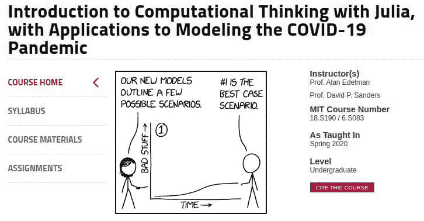
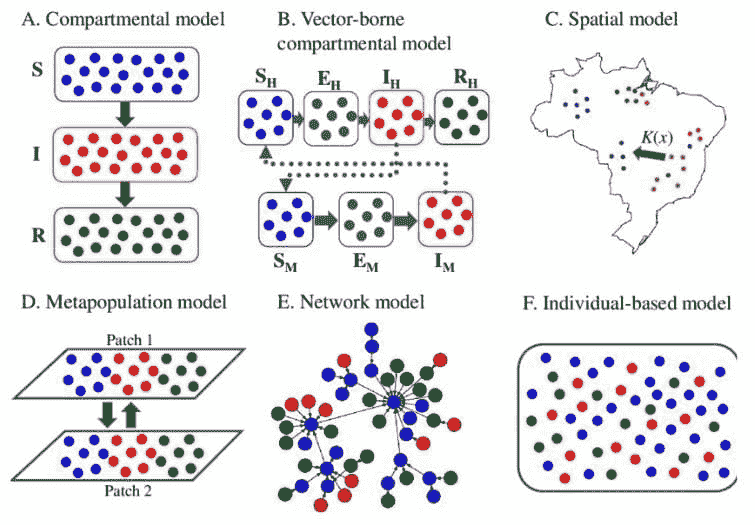

# MIT 免费课程：使用 Julia 的计算思维入门

> 原文：[`www.kdnuggets.com/2020/11/free-mit-intro-computational-thinking-julia.html`](https://www.kdnuggets.com/2020/11/free-mit-intro-computational-thinking-julia.html)

评论

所以你已经尝试过其他在线数据科学课程，也许你喜欢其中的一些。也许它们帮助你从计算的角度思考问题。然后你能够过渡到自己的数据科学项目，尝试实现一些相关的概念和技能。

但让我问你：这些课程中使用了哪些编程语言？我敢打赌，大多数是使用 Python 进行教学的，一些少数课程使用了 R。我更敢打赌，没有一门课程使用 Julia。如你从这篇文章的标题和它所聚焦的课程中可能已经看出，Julia 是 MIT 这一免费课程的使用语言。

* * *

## 我们的前三个课程推荐

 1\. [Google 网络安全证书](https://www.kdnuggets.com/google-cybersecurity) - 快速进入网络安全职业轨道。

 2\. [Google 数据分析职业证书](https://www.kdnuggets.com/google-data-analytics) - 提升你的数据分析技能

 3\. [Google IT 支持职业证书](https://www.kdnuggets.com/google-itsupport) - 支持你的组织 IT

* * *

无论你是刚开始学习编程，还是刚开始数据科学之旅，或者你是一个拥有高级编程技能的数据科学家，但使用的是其他语言而非 Julia，这门课程都能对你有用。加上课程集中在一个如此相关的话题——COVID-19，这绝对不是你遇到过的其他数据科学和编程入门课程的简单重复。

**[使用 Julia 的计算思维入门及 COVID-19 疫情建模应用](https://ocw.mit.edu/courses/mathematics/18-s190-introduction-to-computational-thinking-with-julia-with-applications-to-modeling-the-covid-19-pandemic-spring-2020/)** 是 MIT 开放课程项目的另一门免费课程，由 Alan Edelman 教授和 David P. Sanders 教授讲授。鉴于课程标题中包含 COVID-19，你也许不会感到惊讶，这也是一门非常新的课程，已于 2020 年春季开设。

课程网站上有这样的描述：

> 这门半学期课程通过使用 Julia 编程语言的数据科学、人工智能和数学模型应用来介绍计算思维。这一 2020 年春季版本是一个加速的课程改编，重点关注 COVID-19 应对措施的应用。

课程中具体教授了什么？以下是[课程大纲](https://ocw.mit.edu/courses/mathematics/18-s190-introduction-to-computational-thinking-with-julia-with-applications-to-modeling-the-covid-19-pandemic-spring-2020/syllabus/)中的课程内容：

1.  COVID-19 数据分析

1.  模拟指数增长

1.  概率

1.  随机游走模型

1.  表征变异性

1.  用户自定义类型

1.  马尔可夫链和连续随机变量

1.  连续时间

1.  指数分布

1.  微分方程

1.  优化与数据拟合

1.  流行病建模中的网络

正如你所看到的，课程内容每周在编程基础、数据科学概念和 COVID 特定主题之间转换，这无疑有助于保持材料的新鲜感和高兴趣。课程材料包括讲义幻灯片、讲座视频、作业、外部资源和 Jupyter 笔记本。课程的[Github 仓库](https://github.com/mitmath/6S083)包含了 Jupyter 笔记本和其他相关资源。

记住这门课程的标题是“计算思维”，因此课程中并没有直接涉及机器学习。然而，它专注于如何使用计算方法解决问题，这是一项非常有用的技能，无论你的具体编程角色是什么；它对于计算解决数据科学问题是必不可少的。有鉴于此，将这门课程与高质量的免费电子书《Statistics with Julia: The Free eBook》配合使用，对于那些希望将 Julia 用于数据科学的人来说似乎是一个不错的选择。

我仍然非常希望将 Julia 编程纳入我的技能组合……当我找到时间的时候。当我*找到*那段时间时，我会深入研究麻省理工学院的[使用 Julia 进行计算思维入门](https://ocw.mit.edu/courses/mathematics/18-s190-introduction-to-computational-thinking-with-julia-with-applications-to-modeling-the-covid-19-pandemic-spring-2020/)，以及上面提到的免费电子书《Statistics with Julia》。我看不出你会做得有什么不同。

**相关内容**：

+   《Statistics with Julia: The Free eBook》

+   麻省理工学院免费提供：Python 计算机科学与编程入门

+   麻省理工学院免费提供：计算思维与数据科学入门

### 更多相关内容

+   [5 本免费的 Julia 数据科学书籍](https://www.kdnuggets.com/2023/06/5-free-julia-books-data-science.html)

+   [我应该学习 Julia 吗？](https://www.kdnuggets.com/2022/11/learn-julia.html)

+   [如何在 Jupyter Notebook 上设置 Julia](https://www.kdnuggets.com/2022/11/setup-julia-jupyter-notebook.html)

+   [3 个用于数据可视化的 Julia 包](https://www.kdnuggets.com/2023/02/3-julia-packages-data-visualization.html)

+   [使用 Julia 学习数据分析](https://www.kdnuggets.com/learn-data-analysis-with-julia)

+   [免费 MIT 微积分课程：理解深度学习的关键](https://www.kdnuggets.com/2020/07/free-mit-courses-calculus-key-deep-learning.html)
