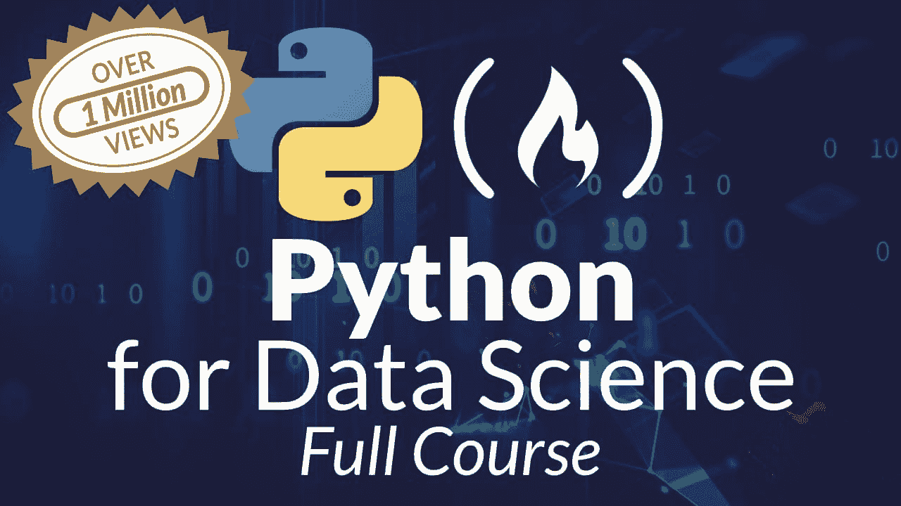

# 免费 Python 数据科学课程

> 原文：[`www.kdnuggets.com/2022/09/free-python-data-science-course.html`](https://www.kdnuggets.com/2022/09/free-python-data-science-course.html)

对于读者来说，Python 作为与数据科学实践关联最紧密的语言之一，应该不会感到意外。

* * *

## 我们的三大课程推荐

 1\. [Google 网络安全证书](https://www.kdnuggets.com/google-cybersecurity) - 快速开启网络安全职业生涯。

 2\. [Google 数据分析专业证书](https://www.kdnuggets.com/google-data-analytics) - 提升你的数据分析技能

 3\. [Google IT 支持专业证书](https://www.kdnuggets.com/google-itsupport) - 支持你的组织 IT

* * *

尽管可以合理地争辩说 Python 是绝对顶尖的数据科学编程语言，但与 R 和 SQL 一起，Python 无疑是前三名之一。

无论语言的具体排名如何，Python 作为一个有效的工具来实现数据科学实践是不容否认的。它的生态系统提供了丰富的库，覆盖了数据科学管道的整个范围以及相关的数据处理和分析任务。了解数据科学、Python 及其交集是确保你作为数据科学家有用的绝佳方式。

[freeCodeCamp](https://www.freecodecamp.org/)和[Maxwell Armi](https://www.youtube.com/c/AISciencesLearn)负责整理并提供这 12 小时（没错，12 小时！）的[Python 及其生态系统数据科学课程](https://www.youtube.com/watch?v=LHBE6Q9XlzI)。

> 本 Python 数据科学课程将带你从对 Python 一无所知，到使用 Pandas、NumPy 和 Matplotlib 等工具进行数据编码和分析。

该课程设计为实践性强，逐步学习，并在学习过程中提供了坚实的 Python 语言概念基础。数据科学概念在课程中得到覆盖，并在课程的最后部分得到更专注的讲解。课程的最终项目是使用你学到的 Python 工具进行 COVID 趋势分析。

课程内容如下：

+   课程介绍及大纲

+   编程基础

+   为什么选择 Python

+   如何安装 Anaconda 和 Python

+   如何启动 Jupyter Notebook

+   如何在 iPython Shell 中编码

+   Python 中的变量与运算符

+   Python 中的布尔值与比较

+   其他有用的 Python 函数

+   Python 中的控制流

+   Python 中的函数

+   Python 中的模块

+   Python 中的字符串

+   其他重要的 Python 数据结构：列表、元组、集合和字典

+   NumPy Python 数据科学库

+   Pandas Python 数据科学库

+   Matplotlib Python 数据科学库

+   示例项目：一个使用 Python 库构建的 COVID19 趋势分析数据分析工具

请查看下面的课程视频，或前往 [freeCodeCamp 的 YouTube 频道](https://www.youtube.com/watch?v=LHBE6Q9XlzI) 观看。

freeCodeCamp 提供的 12 小时课程在其副标题中指出该课程适合初学者，并且将帮助你学习 Python、Pandas、NumPy 和 Matplotlib。根据我了解到的信息，它似乎兑现了承诺。如果你希望学习 Python 和数据科学，深入了解一下这个课程是值得的。

**[Matthew Mayo](https://www.linkedin.com/in/mattmayo13/)** （[**@mattmayo13**](https://twitter.com/mattmayo13)）是一位数据科学家，兼任 KDnuggets 的主编，这是一个开创性的在线数据科学和机器学习资源。他的兴趣领域包括自然语言处理、算法设计与优化、无监督学习、神经网络以及自动化机器学习方法。Matthew 拥有计算机科学硕士学位和数据挖掘研究生文凭。你可以通过 editor1 at kdnuggets[dot]com 与他联系。

### 更多相关内容

+   [KDnuggets 新闻，9 月 14 日：免费的数据科学 Python 课程 •…](https://www.kdnuggets.com/2022/n36.html)

+   [KDnuggets 新闻，9 月 28 日：免费的 Python 算法课程 •…](https://www.kdnuggets.com/2022/n38.html)

+   [免费的 Python 入门课程](https://www.kdnuggets.com/2022/07/free-python-crash-course.html)

+   [免费的 Python 自动化课程](https://www.kdnuggets.com/2022/07/free-automate-python-course.html)

+   [免费的 Python 项目编码课程](https://www.kdnuggets.com/2022/08/free-python-project-coding-course.html)

+   [免费的 Python 算法课程](https://www.kdnuggets.com/2022/09/free-algorithms-python-course.html)
