# 支持向量机的友好介绍

> 原文：[`www.kdnuggets.com/2019/09/friendly-introduction-support-vector-machines.html`](https://www.kdnuggets.com/2019/09/friendly-introduction-support-vector-machines.html)

评论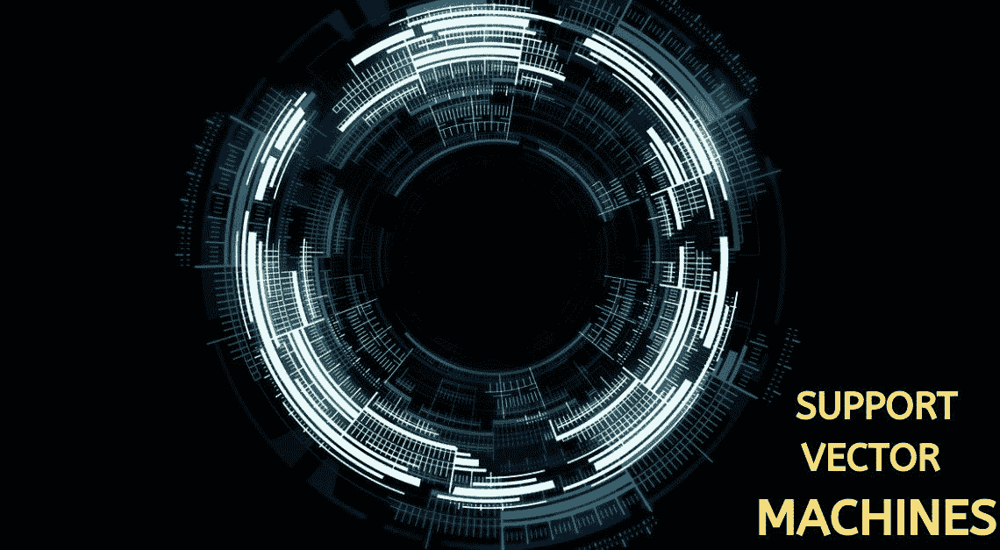

图片来源：[analyticsprofile](https://analyticsprofile.com/machine-learning/introduction-to-svm-machine-learning-algorithm-learn-to-code-support-vector-machine-using-sklearn-in-python/)

机器学习被认为是人工智能的一个子领域，涉及开发使计算机能够学习的技术和方法。简而言之，就是开发使机器能够学习并执行任务和活动的算法。机器学习在许多方面与统计学重叠。随着时间的推移，许多技术和方法被开发用于机器学习任务。

在本文中，我们将学习几乎所有关于一种监督学习算法的信息，这种算法可以用于分类和回归（SVR），即**支持向量机或简称 SVM**。我们将在本文中重点关注分类。

### 介绍

支持向量机（SVM）是最受欢迎和讨论最多的机器学习算法之一。

它们在 1990 年代开发时极为流行，并且至今仍然是一个高性能算法的首选方法，只需少量调整即可。

**SVM 的目标是在 N 维空间（N-特征数）中找到一个超平面，该超平面可以明确地对数据点进行分类。**

支持向量机是最大边界分类器的推广。这个分类器很简单，但由于类别必须由线性边界分隔，它无法应用于大多数数据集。不过，它确实解释了 SVM 的工作原理。

> 在[support-vector machines](https://en.wikipedia.org/wiki/Support-vector_machine)的背景下，*最优分隔超平面*或*最大边界超平面*是一个[超平面](https://en.wikipedia.org/wiki/Hyperplane)，它将两个[凸包](https://en.wikipedia.org/wiki/Convex_hull)的点分开，并且与两个凸包之间的距离是[equidistant](https://en.wikipedia.org/wiki/Equidistant)的。

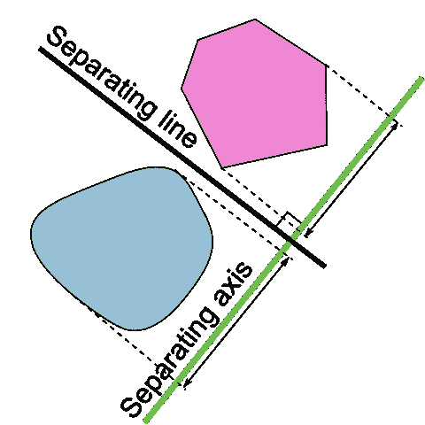

[最大边界分类器](https://en.wikipedia.org/wiki/Hyperplane_separation_theorem#/media/File:Separating_axis_theorem2008.png)

好的，**什么是超平面？**

在 N 维空间中，超平面是一个维度为 N-1 的平面仿射子空间。形象地说，在二维空间中，超平面将是一个线条，而在三维空间中，它将是一个平面。

> 简单来说，超平面是帮助分类数据点的决策边界。

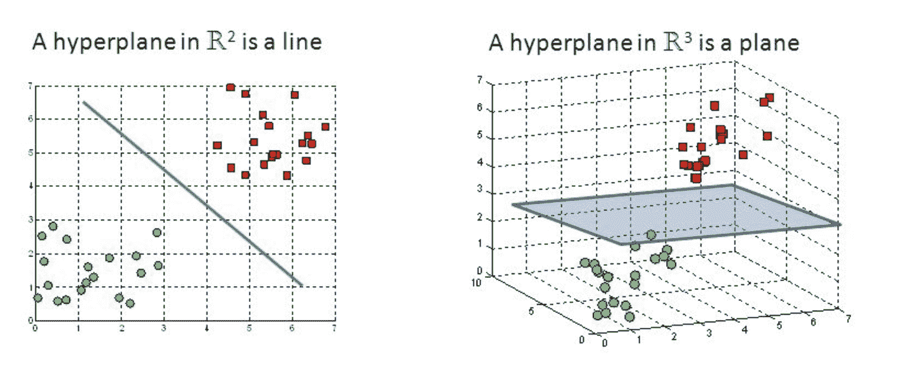

[二维和三维空间中的超平面](https://deepai.org/machine-learning-glossary-and-terms/hyperplane)

现在，为了分离两类数据点，有许多可能的超平面可以选择。我们的目标是找到一个具有最大边际的平面，即两类数据点之间的最大距离，下面的图形清楚地解释了这一点。

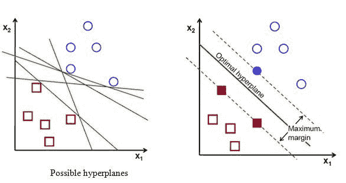

[可能的超平面与最大边际超平面](https://www.ques10.com/p/41200/support-vector-machine-1/)

最大边际的超平面在 3D 空间中看起来像这样：

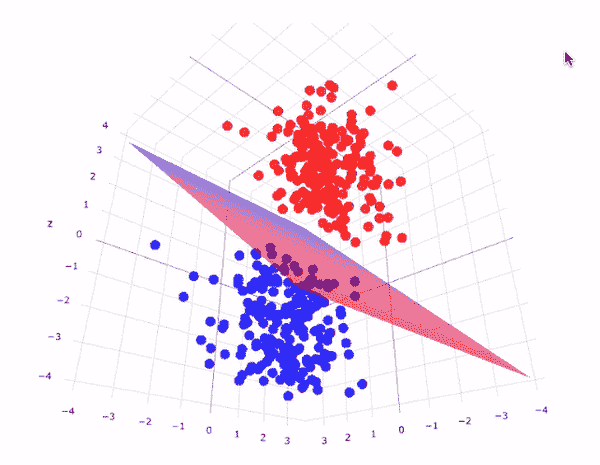

[3D 空间中的超平面的可视化表示](http://www.eurospottv.com/support-vector-machines/)

**注意：- 超平面的维度取决于特征的数量。**

**支持向量**

支持向量是位于或最接近超平面的数据点，它们影响超平面的定位和方向。利用这些支持向量，我们最大化分类器的边际，删除这些支持向量会改变超平面的位置。这些实际上是帮助我们构建 SVM 的点。

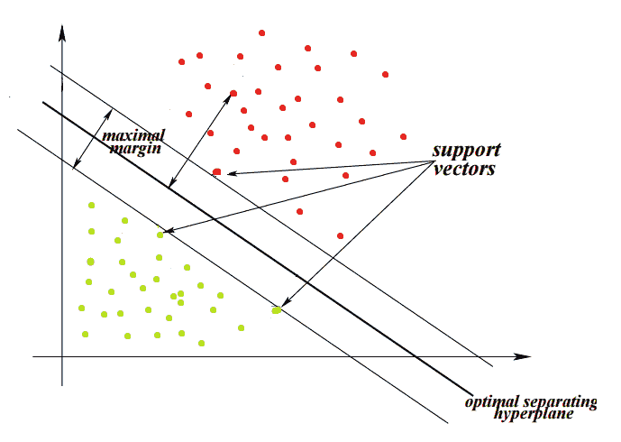

[支持向量](https://www.hackerearth.com/blog/developers/simple-tutorial-svm-parameter-tuning-python-r/)

支持向量与超平面等距。它们被称为支持向量，因为如果它们的位置发生变化，超平面也会发生变化。这意味着**超平面仅依赖于支持向量**，而不依赖于其他观察值。

直到现在我们讨论的 SVM 只能分类线性可分的数据。

**如果数据是非线性可分的，怎么办？**

例如：请看下面的图像，其中数据是非线性可分的，当然，我们不能用一条直线来分类数据点。

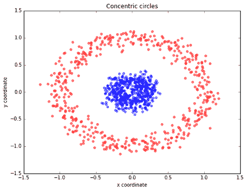

[非线性可分数据](https://towardsdatascience.com/applied-deep-learning-part-1-artificial-neural-networks-d7834f67a4f6)

在支持向量机（SVM）中引入了**核函数**的概念，用于对非线性可分数据进行分类。**核函数是一种将低维数据映射到高维数据的函数。**

核函数 SVM 有两种方法来分类非线性数据。

1.  软边际

1.  核技巧

**软边际**

这允许 SVM 犯一定数量的错误，并保持尽可能宽的边际，以便其他点仍然可以被正确分类。

> “换句话说，SVM 容忍少量点被误分类，并尝试在最大化边际和最小化误分类之间平衡权衡。”

可能发生两种类型的错误分类：

1.  数据点在决策边界的错误一侧，但在正确的一侧

1.  数据点在决策边界的错误一侧，并且在边际的错误一侧

***容忍度***

在寻找决策边界时，我们希望设置多少容忍度是 SVM（线性和非线性解决方案）的一个重要超参数。在 Sklearn 中，它被表示为惩罚项——‘C’。

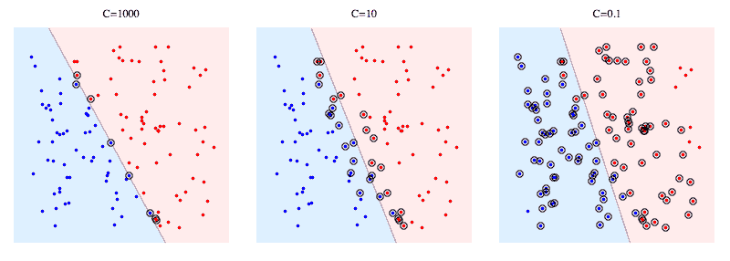

C 值越大，SVM 在误分类时受到的惩罚就越大。因此，边界的间隔越窄，决策边界依赖的支持向量就越少。

**核技巧**

这个思想是将非线性可分的数据从低维空间映射到高维空间，在高维空间中，我们可以找到一个超平面来分隔数据点。

所以一切都在于找到将 2D 输入空间映射到 3D 输出空间的映射函数，而为了减少寻找映射函数的复杂性，SVM 使用了核函数。

**核函数** 是一种广义函数，它接受两个（任意维度的）向量作为输入，并输出一个分数（点积），表示输入向量的相似程度。如果点积较小，向量之间差异较大；如果点积较大，向量之间则较为相似。

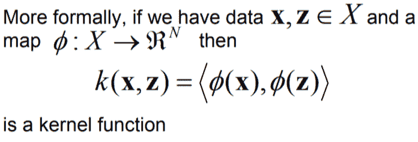

核函数的数学表示

核技巧的图示表示：

核技巧的视觉表示：

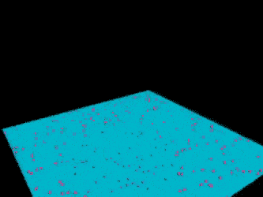

[核技巧实际应用，作者 udiprod 在 YouTube](https://www.youtube.com/watch?v=3liCbRZPrZA)

核函数的类型：

1.  线性

1.  多项式

1.  径向基函数（rbf）

1.  Sigmoid

让我们来谈谈最常用的核函数，即 **径向基函数（rbf）**。

可以将 rbf 看作是一个转换器/处理器，通过测量所有其他数据点到特定点的距离，生成更高维的新特征。

最常用的 rbf 核是高斯径向基函数。从数学角度来看：

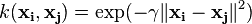

其中 gamma(????) 控制新特征对决策边界的影响。gamma 值越高，特征对决策边界的影响越大。

类似于软间隔中的正则化参数/惩罚项（C），Gamma(????) 是一个在使用核技巧时可以调节的超参数。

### 结论

SVM 有许多用途，包括面部检测、图像分类、生物信息学、蛋白质折叠、远程同源性检测、手写识别、广义预测控制（GPC）等。

这篇关于支持向量机的文章就到此为止，支持向量机是最强大的回归和分类算法之一。在下一篇文章中，我们将看到如何使用 SVM 解决实际问题。

希望大家喜欢阅读这篇文章，欢迎在评论区分享你的意见/想法/反馈。

如有任何问题，请通过 [LinkedIn](https://www.linkedin.com/in/nagesh-singh-chauhan-6936bb13b/) 与我联系。

感谢阅读!!!

**简介：[纳盖什·辛格·乔汉](https://www.linkedin.com/in/nagesh-singh-chauhan-6936bb13b/)** 是一名数据科学爱好者。对大数据、Python 和机器学习感兴趣。

[原文](https://towardsdatascience.com/a-friendly-introduction-to-support-vector-machines-svm-925b68c5a079)。已获授权转载。

**相关内容：**

+   K 均值聚类图像分割介绍

+   使用 K-最近邻分类心脏病

+   使用卷积神经网络和 OpenCV 预测年龄和性别

* * *

## 我们的前三个课程推荐

 1\. [谷歌网络安全证书](https://www.kdnuggets.com/google-cybersecurity) - 快速进入网络安全职业的快车道。

 2\. [谷歌数据分析专业证书](https://www.kdnuggets.com/google-data-analytics) - 提升你的数据分析技能

 3\. [谷歌 IT 支持专业证书](https://www.kdnuggets.com/google-itsupport) - 支持你的组织的 IT 需求

* * *

### 更多相关主题

+   [支持向量机的温和介绍](https://www.kdnuggets.com/2023/07/gentle-introduction-support-vector-machines.html)

+   [支持向量机：直观的方法](https://www.kdnuggets.com/2022/08/support-vector-machines-intuitive-approach.html)

+   [语义向量搜索如何变革客户支持互动](https://www.kdnuggets.com/how-semantic-vector-search-transforms-customer-support-interactions)

+   [Python 向量数据库与向量索引：构建 LLM 应用](https://www.kdnuggets.com/2023/08/python-vector-databases-vector-indexes-architecting-llm-apps.html)

+   [初学者友好的有趣 Python 项目！](https://www.kdnuggets.com/2022/10/beginner-friendly-python-projects-fun.html)

+   [7 个适合初学者的 ChatGPT 项目](https://www.kdnuggets.com/2023/08/7-beginnerfriendly-projects-get-started-chatgpt.html)
