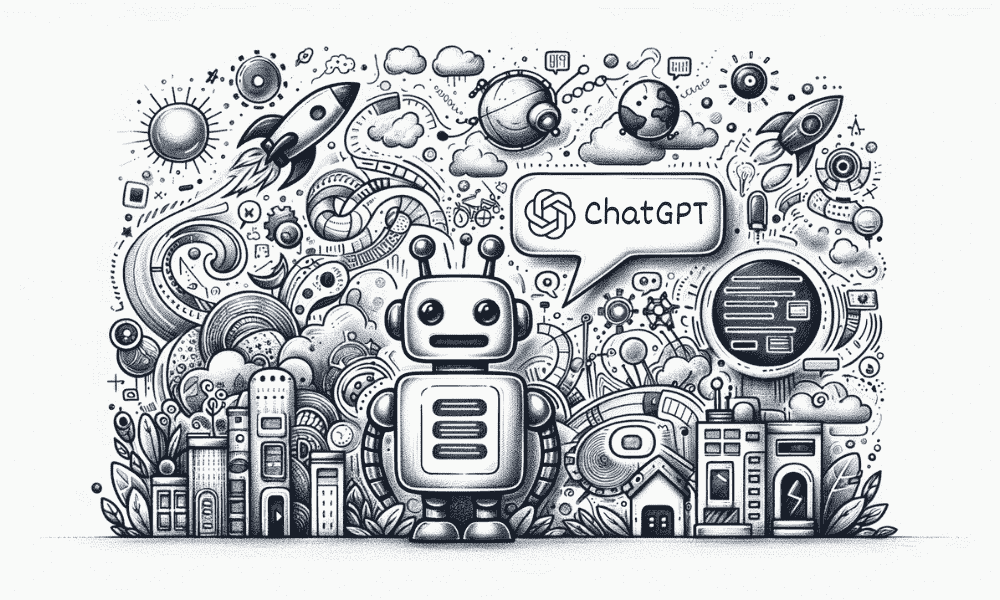
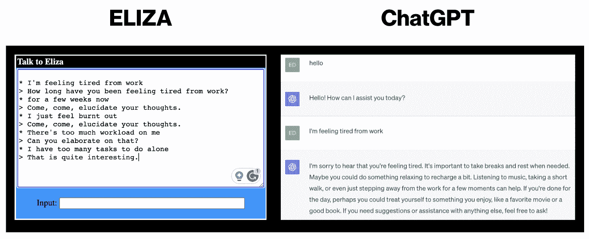

# 从虚构到现实：ChatGPT 与科幻梦中的真正 AI 对话

> 原文：[`www.kdnuggets.com/from-fiction-to-reality-chatgpt-and-the-sci-fi-dream-of-true-ai-conversation`](https://www.kdnuggets.com/from-fiction-to-reality-chatgpt-and-the-sci-fi-dream-of-true-ai-conversation)

图像由 DALLE-3 生成并由编辑编辑

> “对不起，戴夫。我恐怕不能这样做。”
> 
> >>> HAL 9000

我们可以说，人工智能（AI）到达能够与机器对话的程度，激发了人类的想象力。我们中的许多人从小就看过关于高度智能机器/机器人科幻叙事的电影。

科幻在我成长过程中非常流行，我不确定这是否因为我们潜意识中知道我们正在接近这一现实的时刻。谁知道呢！但我们已经到了这里，所以让我们谈谈它。

科幻故事描绘了一个 AI 系统和人类携手合作的未来，有时这些设想完全走偏，例如《我，机器人》。但我们不能否认的是，我们被这些故事吸引了。它不仅为我们提供了娱乐，还推动了人脑深入思考人工智能的表现。

你还记得《2001 太空漫游》中的 HAL 9000 吗？或者《她》中的 Samantha 呢？这些科幻叙事不仅让我们探索了 AI 的能力，也让我们面临了 AI 在现实世界中的伦理挑战。

现在我们从屏幕过渡到诸如 ChatGPT 这样的对话模型，这些模型将这些虚构故事变成了现实。

# 对话 AI 的演变

我们可以肯定地说，实现对话 AI 的过程确实令人瞩目。让我们回到[ELIZA](https://psych.fullerton.edu/mbirnbaum/psych101/Eliza.htm)，一个早期的自然语言处理计算机程序，由[Joseph Weizenbaum](https://en.wikipedia.org/wiki/Joseph_Weizenbaum)于 1964 年至 1967 年间在麻省理工学院创建。ELIZA 是你的计算机治疗师，模拟了一个 Rogerian 心理治疗师。如果你还没试过，我建议你[试试看](https://psych.fullerton.edu/mbirnbaum/psych101/Eliza.htm)，问 ChatGPT 相同的问题，会非常有趣。

以下是我与 ELIZA 的简短对话，我也用 ChatGPT 进行了类似的尝试。

多年后，我们开始遇到 Siri 和 Alexa，这些有时听不懂我们说话的助手。虽然我们已经取得了长足的进步，但这并不意味着我们已经走出了隧道的尽头。

机器学习和自然语言处理（NLP）领域已经取得了许多突破，得益于各种数据集的使用、硬件的增加和发展等。我们现在生活在大语言模型（LLM）时代，像 ChatGPT 和 Google Bard 这样的模型展示了令人印象深刻的人类对话能力。

## ChatGPT：对话革命

如前所述，虽然有各种 LLM 存在并在开发中，但目前 ChatGPT 处于前沿。它提供快速响应，并可以根据你的喜好进行微调。它不仅是一个 AI 工具，也是一位合作伙伴。它可以处理各种任务，如创意标志设计、文本改进和生成以及教育材料。

我们中的许多人对它如何感知情感和幽默，并根据这些调整响应感到惊讶。但所有伟大的事物都有其局限性。

# 科幻梦境背后的现实

虽然我们看到 AI 在某种程度上反映了我们的科幻梦想，但它仍需克服一些挑战才能像人类一样进行对话。正如我之前提到的，我们还未到达隧道的尽头，研究人员和组织正在致力于克服这些挑战。LLM 面临许多伦理挑战，如就业替代、隐私、数据安全等。

AI 系统的可预测脚本与 AI 系统能够生成原创内容的自然流畅性之间仍存在差距。

在接下来的几年里，我们应该预期管理模糊的语言，避免偏见，并理解人类语言的细微差别。

所以我想我们可以继续梦想科幻的无限可能，对吧？我们是否迟早会达到我们心爱的科幻叙事中描绘的 AI 水平？

# 总结一下

当我们站在这场对话 AI 技术革命的风口浪尖时，重要的是回顾一下 AI 是如何发展到今天的。从科幻叙事，到 ELIZA 给我们的冷漠建议，再到 Siri 让我们重复自己。

使用像 ChatGPT 这样的对话 AI 工具，让我们在某种程度上将科幻梦境变为现实。

****[Nisha Arya](https://www.linkedin.com/in/nisha-arya-ahmed/)****是一名数据科学家、自由技术写作人，以及 KDnuggets 的编辑和社区经理。她特别感兴趣于提供数据科学职业建议或教程以及基于理论的数据科学知识。Nisha 涉猎广泛，希望探索人工智能如何有益于人类寿命的延续。作为一个热心的学习者，Nisha 希望拓宽她的技术知识和写作技能，同时帮助指导他人。

### 相关主题

+   [从数据到诗歌：KDnuggets 与 ChatGPT 的对话](https://www.kdnuggets.com/2022/12/kdnuggets-chatgpt-conversation.html)

+   [6 个人工智能神话破解：分辨事实与虚构](https://www.kdnuggets.com/6-artificial-intelligence-myths-debunked-separating-fact-from-fiction)

+   [学术界是否过分执着于方法论而忽视了真正的洞察？](https://www.kdnuggets.com/is-academia-obsessing-over-methodology-at-the-cost-of-true-insights)

+   [梦想与现实之间：生成文本与幻觉](https://www.kdnuggets.com/between-dreams-and-reality-generative-text-and-hallucinations)

+   [数据科学职业：7 种期望与现实](https://www.kdnuggets.com/2022/06/data-science-career-7-expectations-reality.html)

+   [数据科学：现实与期望](https://www.kdnuggets.com/2022/03/data-science-reality-expectations.html)
