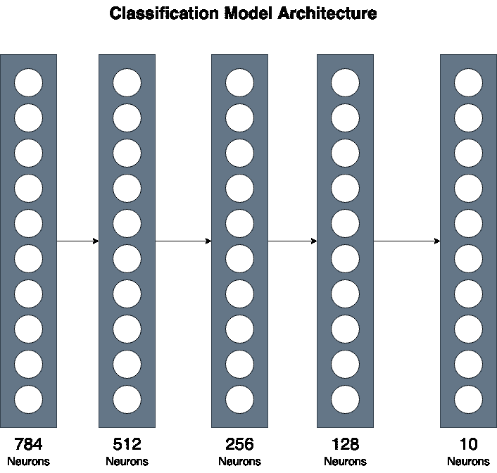
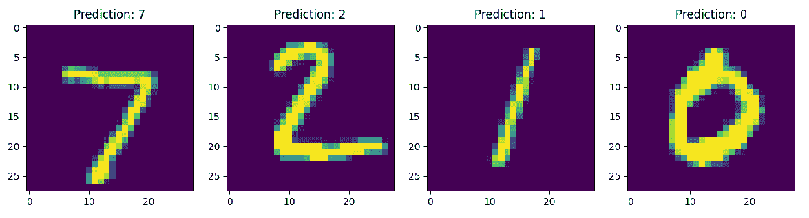

# 从零到英雄：使用 PyTorch 创建你的第一个 ML 模型

> 原文：[`www.kdnuggets.com/from-zero-to-hero-create-your-first-ml-model-with-pytorch`](https://www.kdnuggets.com/from-zero-to-hero-create-your-first-ml-model-with-pytorch)


作者提供的图片

# 动机

* * *

## 我们的前三大课程推荐

 1\. [Google 网络安全证书](https://www.kdnuggets.com/google-cybersecurity) - 快速进入网络安全职业生涯。

 2\. [Google 数据分析专业证书](https://www.kdnuggets.com/google-data-analytics) - 提升你的数据分析能力

 3\. [Google IT 支持专业证书](https://www.kdnuggets.com/google-itsupport) - 支持你组织中的 IT

* * *

PyTorch 是最广泛使用的基于 Python 的深度学习框架。它对所有机器学习架构和数据管道提供了极大的支持。在本文中，我们将讲解框架的基础知识，以帮助你开始实现自己的算法。

所有机器学习实现都有 4 个主要步骤：

+   **数据处理**

+   **模型架构**

+   **训练循环**

+   **评估**

在实现我们自己的 MNIST 图像分类模型时，我们会经历所有这些步骤。这将帮助你熟悉机器学习项目的一般流程。

# 导入

```py
import torch
import torch.nn as nn
import torch.optim as  optim

from torch.utils.data import DataLoader

# Using MNIST dataset provided by PyTorch
from torchvision.datasets.mnist import MNIST
import torchvision.transforms as transforms

# Import Model implemented in a different file
from model import Classifier

import matplotlib.pyplot as plt
```

torch.nn 模块提供了对神经网络架构的支持，并且内置了对常用层如密集层、卷积神经网络等的实现。

torch.optim 提供了优化器的实现，如随机梯度下降和 Adam。

其他实用模块可用于数据处理支持和转换。稍后我们将详细介绍每个模块。

# 声明超参数

每个超参数将在适当的地方进一步解释。然而，最好在文件顶部声明它们，以便于更改和理解。

```py
INPUT_SIZE = 784	# Flattened 28x28 images
NUM_CLASSES = 10	# 0-9 hand-written digits.
BATCH_SIZE = 128	# Using Mini-Batches for Training
LEARNING_RATE = 0.01	# Opitimizer Step
NUM_EPOCHS = 5  	# Total Training Epochs
```

# 数据加载和转换

```py
data_transforms = transforms.Compose([
    	transforms.ToTensor(),
    	transforms.Lambda(lambda x: torch.flatten(x))
])

train_dataset = MNIST(root=".data/", train=True, download=True, transform=data_transforms)

test_dataset = MNIST(root=".data/", train=False, download=True, transform=data_transforms)
```

MNIST 是一个流行的图像分类数据集，在 PyTorch 中默认提供。它包含 10 个从 0 到 9 的手写数字的灰度图像。每张图像的尺寸为 28 像素 x 28 像素，数据集包含 60000 张训练图像和 10000 张测试图像。

我们分别加载训练和测试数据集，通过 MNIST 初始化函数中的 train 参数来表示。root 参数声明了数据集下载的目录。

然而，我们还传递了一个额外的转换参数。对于 PyTorch，所有输入和输出应该是 Torch.Tensor 格式。这相当于 numpy 中的 numpy.ndarray。这个张量格式提供了额外的数据操作支持。然而，我们加载的 MNIST 数据是 PIL.Image 格式。我们需要将图像转换为 PyTorch 兼容的张量。因此，我们传递了以下转换：

```py
data_transforms = transforms.Compose([
    	transforms.ToTensor(),
    	transforms.Lambda(lambda x: torch.flatten(x))
])
```

ToTensor() 转换将图像转换为张量格式。接下来，我们传递一个额外的 Lambda 转换。Lambda 函数允许我们实现自定义转换。在这里，我们声明一个函数来展平输入。图像的大小为 28x28，但我们将其展平，即转换为大小为 28x28 或 784 的一维数组。稍后在实现模型时，这一点将很重要。

Compose 函数按顺序组合所有转换。首先，数据被转换为张量格式，然后展平为一维数组。

# 将数据划分为批次

出于计算和训练目的，我们不能一次将整个数据集传递到模型中。我们需要将数据集划分为小批量，按顺序喂给模型。这可以加快训练速度，并为我们的数据集添加随机性，这有助于稳定训练。

PyTorch 提供了对数据批处理的内置支持。来自 torch.utils 模块的 DataLoader 类可以创建数据批次，给定一个 torch 数据集模块。如上所述，我们已经加载了数据集。

```py
train_dataloader = DataLoader(train_dataset, batch_size=BATCH_SIZE, shuffle=True)
test_dataloader = DataLoader(test_dataset, batch_size=BATCH_SIZE, shuffle=False)
```

我们将数据集传递给我们的数据加载器，并将 batch_size 超参数作为初始化参数。这创建了一个可迭代的数据加载器，因此我们可以使用简单的 for 循环轻松遍历每个批次。

我们的初始图像的大小为 (784, )，带有一个相关标签。批处理将不同的图像和标签组合在一起。例如，如果我们有一个批量大小为 64，那么批次中的输入大小将变为 (64, 784)，并且我们将为每个批次有 64 个相关标签。

我们还会打乱训练批次，这会在每个 epoch 更改批次中的图像。这有助于稳定训练并加快模型参数的收敛。

# 定义我们的分类模型

我们使用一个由 3 个隐藏层组成的简单实现。虽然简单，但这可以让你对将不同层组合在一起以实现更复杂的实现有一个大致了解。

如上所述，我们有一个大小为 (784, ) 的输入张量和 10 个不同的输出类，每个类对应一个从 0 到 9 的数字。

**** 对于模型实现，我们可以忽略批次维度。**

```py
import torch
import torch.nn as nn

class Classifier(nn.Module):
	def __init__(
        	self,
        	input_size:int,
        	num_classes:int
    	) -> None:
    	super().__init__()
    	  self.input_layer = nn.Linear(input_size, 512)
    	  self.hidden_1 = nn.Linear(512, 256)
    	  self.hidden_2 = nn.Linear(256, 128)
    	  self.output_layer = nn.Linear(128, num_classes)

    	self.activation = nn.ReLU()

	def forward(self, x):
    	  # Pass Input Sequentially through each dense layer and activation
    	  x = self.activation(self.input_layer(x))
    	  x = self.activation(self.hidden_1(x))
    	  x = self.activation(self.hidden_2(x))
    	  return self.output_layer(x)
```

首先，模型必须继承自 torch.nn.Module 类。这为神经网络架构提供了基本功能。然后，我们必须实现两个方法，__init__ 和 forward。

在 __init__ 方法中，我们声明了模型将使用的所有层。我们使用 PyTorch 提供的线性（也称为 Dense）层。第一层将输入映射到 512 个神经元。我们可以将 input_size 作为模型参数传递，这样我们以后也可以用于不同大小的输入。第二层将 512 个神经元映射到 256。第三个隐藏层将前一层的 256 个神经元映射到 128。最后一层将最终减少到输出大小。我们的输出大小将是一个大小为 (10, ) 的张量，因为我们正在预测十个不同的数字。



作者提供的图片

此外，我们初始化一个 ReLU 激活层以增加模型的非线性。

前向函数接收图像，我们提供处理输入的代码。我们使用声明的层，并依次将输入通过每一层，其中包含一个中间的 ReLU 激活层。

在我们的主代码中，我们可以初始化模型，提供数据集的输入和输出大小。

```py
model = Classifier(input_size=784, num_classes=10)
model.to(DEVICE)
```

一旦初始化完成，我们将更改模型设备（可以是 CUDA GPU 或 CPU）。在初始化超参数时，我们检查了设备。现在，我们必须手动更改张量和模型层的设备。

# 训练循环

首先，我们必须声明用于优化模型参数的损失函数和优化器。

```py
criterion = nn.CrossEntropyLoss()
optimizer = optim.Adam(model.parameters(), lr=LEARNING_RATE)
```

首先，我们必须声明用于优化模型参数的损失函数和优化器。

我们使用交叉熵损失，主要用于多标签分类模型。它首先对预测值应用 softmax，并计算给定的目标标签和预测值。

Adam 优化器是最常用的优化函数，它允许稳定的梯度下降以趋向收敛。它现在是默认的优化器选择，并提供令人满意的结果。**我们将模型参数作为参数传递，这些参数表示将被优化的权重。**

对于我们的训练循环，我们逐步构建并填补缺失的部分，以加深理解。

作为起点，我们多次遍历完整的数据集（称为 epoch），并每次优化模型。然而，我们将数据分成了多个批次。因此，对于每个 epoch，我们还必须遍历每个批次。代码如下所示：

```py
for epoch in range(NUM_EPOCHS):
    	for batch in iter(train_dataloader):
          # Train the Model for each batch. 
```

现在，我们可以使用单个输入批次训练模型。我们的批次包括图像和标签。首先，我们必须将这些分开。我们的模型只需要图像作为输入来进行预测。然后，我们将预测结果与真实标签进行比较，以估计模型的性能。

```py
for epoch in range(NUM_EPOCHS):
    	for batch in iter(train_dataloader):
        	images, labels = batch # Separate inputs and labels
        	# Convert Tensor Hardware Devices to either GPU or CPU
        	images = images.to(DEVICE)
        	labels = labels.to(DEVICE)

        	# Calls the model.forward() function to generate predictions 
        	predictions = model(images)
```

我们将一批图像直接传递给模型，这些图像将通过模型内部定义的前向函数进行处理。一旦获得预测结果，我们可以优化模型的权重。

优化代码如下所示：

```py
# Calculate Cross Entropy Loss
loss = criterion(predictions, labels)
# Clears gradient values from previous batch
optimizer.zero_grad()
# Computes backprop gradient based on the loss
loss.backward()
# Optimizes the model weights
optimizer.step()
```

使用上述代码，我们可以计算所有的反向传播梯度，并使用 Adam 优化器优化模型权重。将所有上述代码结合起来，可以使我们的模型逐步收敛。

完整的训练循环如下所示：

```py
for epoch in range(NUM_EPOCHS):
    	total_epoch_loss = 0
    	steps = 0
    	for batch in iter(train_dataloader):
        	images, labels = batch # Separate inputs and labels
        	# Convert Tensor Hardware Devices to either GPU or CPU
        	images = images.to(DEVICE)
        	labels = labels.to(DEVICE)

        	# Calls the model.forward() function to generate predictions       	 
        	predictions = model(images)

        	# Calculate Cross Entropy Loss
        	loss = criterion(predictions, labels)
        	# Clears gradient values from previous batch
        	optimizer.zero_grad()
        	# Computes backprop gradient based on the loss
        	loss.backward()
        	# Optimizes the model weights
        	optimizer.step()

        	steps += 1
        	total_epoch_loss += loss.item()

    	print(f'Epoch: {epoch + 1} / {NUM_EPOCHS}: Average Loss: {total_epoch_loss / steps}')
```

损失值逐渐减少并接近 0。然后，我们可以在我们最初声明的测试数据集上评估模型。

# 评估我们的模型性能

```py
for batch in iter(test_dataloader):
    	images, labels = batch
    	images = images.to(DEVICE)
    	labels = labels.to(DEVICE)

    	predictions = model(images)

    	# Taking the predicted label with highest probability
    	predictions = torch.argmax(predictions, dim=1)

    	correct_predictions += (predictions == labels).sum().item()
    	total_predictions += labels.shape[0]

print(f"\nTEST ACCURACY: {((correct_predictions / total_predictions) * 100):.2f}")
```

与训练循环类似，我们在测试数据集上逐批进行迭代以进行评估。我们为输入生成预测。然而，对于评估，我们只需要具有最高概率的标签。`argmax`函数提供了这个功能，以获取预测数组中值最高的索引。

对于准确性评分，我们可以比较预测标签是否与真实目标标签匹配。然后，我们计算正确标签的数量除以总预测标签的准确率。

# 结果

我只训练了五个周期，并取得了超过 96%的测试准确率，相比之下，训练前准确率为 10%。下图显示了训练五个周期后的模型预测结果。



就这样，你已经从零开始实现了一个可以仅通过图像像素值区分手写数字的模型。

这绝不是 PyTorch 的全面指南，但它确实为你提供了机器学习项目中结构和数据流的一般理解。尽管如此，这些知识足以让你开始实施深度学习中的最先进架构。

# 完整代码

完整代码如下：

**model.py：**

```py
import torch
import torch.nn as nn

class Classifier(nn.Module):
	def __init__(
        	self,
        	input_size:int,
        	num_classes:int
    	) -> None:
    	super().__init__()
    	  self.input_layer = nn.Linear(input_size, 512)
    	  self.hidden_1 = nn.Linear(512, 256)
    	  self.hidden_2 = nn.Linear(256, 128)
    	  self.output_layer = nn.Linear(128, num_classes)

    	  self.activation = nn.ReLU()

	def forward(self, x):
    	  # Pass Input Sequentially through each dense layer and activation
    	  x = self.activation(self.input_layer(x))
    	  x = self.activation(self.hidden_1(x))
    	  x = self.activation(self.hidden_2(x))
    	  return self.output_layer(x)
```

**main.py**

```py
import torch
import torch.nn as nn
import torch.optim as  optim

from torch.utils.data import DataLoader

# Using MNIST dataset provided by PyTorch
from torchvision.datasets.mnist import MNIST
import torchvision.transforms as transforms

# Import Model implemented in a different file
from model import Classifier

import matplotlib.pyplot as plt

if __name__ == "__main__":

	INPUT_SIZE = 784	# Flattened 28x28 images
	NUM_CLASSES = 10	# 0-9 hand-written digits.
	BATCH_SIZE = 128	# Using Mini-Batches for Training
	LEARNING_RATE = 0.01	# Opitimizer Step
	NUM_EPOCHS = 5  	# Total Training Epochs

	DEVICE = 'cuda' if torch.cuda.is_available() else 'cpu'

	# Will be used to convert Images to PyTorch Tensors
	data_transforms = transforms.Compose([
    	transforms.ToTensor(),
    	transforms.Lambda(lambda x: torch.flatten(x))
	])

	train_dataset = MNIST(root=".data/", train=True, download=True, transform=data_transforms)
	test_dataset = MNIST(root=".data/", train=False, download=True, transform=data_transforms)    

	train_dataloader = DataLoader(train_dataset, batch_size=BATCH_SIZE, shuffle=True)
	test_dataloader = DataLoader(test_dataset, batch_size=BATCH_SIZE, shuffle=False)

	model = Classifier(input_size=784, num_classes=10)
	model.to(DEVICE)

	criterion = nn.CrossEntropyLoss()
	optimizer = optim.Adam(model.parameters(), lr=LEARNING_RATE)

	for epoch in range(NUM_EPOCHS):
    	total_epoch_loss = 0
    	steps = 0
    	for batch in iter(train_dataloader):
        	images, labels = batch # Separate inputs and labels
        	# Convert Tensor Hardware Devices to either GPU or CPU
        	images = images.to(DEVICE)
        	labels = labels.to(DEVICE)

        	# Calls the model.forward() function to generate predictions       	 
        	predictions = model(images)

        	# Calculate Cross Entropy Loss
        	loss = criterion(predictions, labels)
        	# Clears gradient values from previous batch
        	optimizer.zero_grad()
        	# Computes backprop gradient based on the loss
        	loss.backward()
        	# Optimizes the model weights
        	optimizer.step()

        	steps += 1
        	total_epoch_loss += loss.item()

    	print(f'Epoch: {epoch + 1} / {NUM_EPOCHS}: Average Loss: {total_epoch_loss / steps}')
	# Save Trained Model
	torch.save(model.state_dict(), 'trained_model.pth')

	model.eval()
	correct_predictions = 0
	total_predictions = 0
	for batch in iter(test_dataloader):
    	images, labels = batch
    	images = images.to(DEVICE)
    	labels = labels.to(DEVICE)

    	predictions = model(images)

    	# Taking the predicted label with highest probability
    	predictions = torch.argmax(predictions, dim=1)

    	correct_predictions += (predictions == labels).sum().item()
    	total_predictions += labels.shape[0]

	print(f"\nTEST ACCURACY: {((correct_predictions / total_predictions) * 100):.2f}")

	# --  Code For Plotting Results  -- #

	batch = next(iter(test_dataloader))
	images, labels = batch

	fig, ax = plt.subplots(nrows=1, ncols=4, figsize=(16,8))
	for i in range(4):
    	image = images[i]
    	prediction = torch.softmax(model(image), dim=0)
    	prediction = torch.argmax(prediction, dim=0)
    	# print(type(prediction), type(prediction.item()))
    	ax[i].imshow(image.view(28,28))
    	ax[i].set_title(f'Prediction: {prediction.item()}')
	plt.show()
```

**[穆罕默德·阿赫曼](https://www.linkedin.com/in/muhammad-arham-a5b1b1237/)** 是一名从事计算机视觉和自然语言处理的深度学习工程师。他曾在 Vyro.AI 工作，负责多个生成 AI 应用的部署和优化，这些应用在全球排行榜上名列前茅。他对构建和优化智能系统的机器学习模型感兴趣，并相信持续改进。

### 更多相关话题

+   [突破数据障碍：如何通过零样本、单样本和少样本学习…](https://www.kdnuggets.com/2023/08/breaking-data-barrier-zeroshot-oneshot-fewshot-learning-transforming-machine-learning.html)

+   [零样本学习详解](https://www.kdnuggets.com/2022/12/zeroshot-learning-explained.html)

+   [一个能让你成为数据科学英雄的 bug](https://www.kdnuggets.com/2022/03/bug-make-data-science-hero.html)

+   [部署你的第一个机器学习模型](https://www.kdnuggets.com/deploying-your-first-machine-learning-model)

+   [逐步教程：构建你的第一个机器学习模型](https://www.kdnuggets.com/step-by-step-tutorial-to-building-your-first-machine-learning-model)

+   [提升生产力的 PyTorch 技巧](https://www.kdnuggets.com/2023/08/pytorch-tips-boost-productivity.html)
