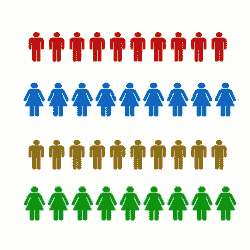
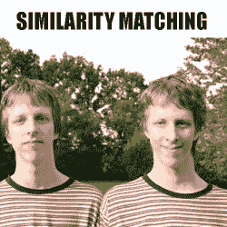

# 数据科学的基本方法：分类、回归和相似性匹配

> 原文：[`www.kdnuggets.com/2015/01/fundamental-methods-data-science-classification-regression-similarity-matching.html`](https://www.kdnuggets.com/2015/01/fundamental-methods-data-science-classification-regression-similarity-matching.html)

由 Manu Jeevan 编写，2015 年 1 月。

在这篇文章中，我将讨论数据科学中的 3 种基本方法。这些方法是从数据中提取有用知识的基础，并且也为数据科学中许多著名算法奠定了基础。我不会深入探讨这些方法的数学细节；相反，我将重点介绍这些方法如何用于解决以数据为中心的业务问题。

那么，让我们开始吧，

 **1\. 分类与类别概率估计**

分类和类别概率估计尝试预测在一个总体中，每个个体属于哪个类别。通常这些类别彼此独立。一个分类问题的例子是：

“在所有的 Dish 客户中，哪些客户可能会对新优惠做出响应？”

在这个例子中，这两个类别可以称为“会响应”和“不会响应”。你在分类任务中的目标是给定一个新个体，确定该个体属于哪个类别。一个紧密相关的概念是评分或类别概率估计。

当应用于个人时，评分模型会产生一个分数，代表该个人属于每个类别的概率。在我们的客户响应示例中，评分模型可以评估每个客户，并产生每个客户对优惠响应的可能性分数。

**2\. 回归**

回归是预测中最常用的方法。回归尝试预测某变量的实际值（数值）。一个回归问题的例子是：“给定一栋房子的费用是多少？”这里需要预测的变量是房价，模型可以通过查看其他类似房屋及其历史价格来建立。回归过程产生一个模型，该模型根据房屋估算房价。

回归与分类相关，但二者有所不同。简单来说，分类预测某件事是否会发生，而回归预测某件事会发生的程度。

牢记这一概念：“评分是一个分类问题，而非回归问题，因为底层目标（你试图预测的值）是分类的。”

 **3\. 相似性匹配**

相似性匹配尝试根据已知的信息识别相似的个体。如果两个实体（产品、服务、公司）在某些方面相似，它们也会共享其他特征。

例如，Accenture 将会关注寻找与其现有的盈利客户相似的客户，以便开展有针对性的营销活动。Accenture 使用基于定义其现有盈利客户特征（如公司营业额、行业、地点等）的相似性匹配。

相似性是进行产品推荐的基础原则（即识别在购买或喜欢的产品方面相似的人）。像亚马逊和 Flipkart 这样的在线零售商使用相似性来向你推荐类似的产品。每当你看到“喜欢 A 的人也喜欢 B”或“与你的浏览历史相符的人也浏览过……”这样的表达时，实际上是在应用相似性概念。

**结论**

在这篇文章中，我讨论了分类、回归和相似性匹配。我坚信将这些基本方法应用于商业问题比它们的算法细节要重要得多。需要记住的重要事项包括：

+   评分是一种分类技术，而不是回归技术。

+   分类和回归之间的区别。

+   如何使用相似性匹配来寻找类似的客户。

Manu Jeevan 是一位自学成才的数据科学家和 [BigDataExaminer](http://bigdataexaminer.com) 博主，他在该网站上撰写有关数据科学、统计学、Python 和机器学习的文章，以帮助他人学习数据科学。

**相关：**

+   书籍：数据分类：算法与应用

+   业务领导者的数据分析解读

+   参加 KDD Cup 或 Kaggle 竞赛，你不需要成为专家！

### 更多相关话题

+   [评估文档相似度计算方法](https://www.kdnuggets.com/evaluating-methods-for-calculating-document-similarity)

+   [Python 字符串匹配无需复杂的正则表达式语法](https://www.kdnuggets.com/2023/02/python-string-matching-without-complex-regex-syntax.html)

+   [分类指标入门：逻辑回归与……](https://www.kdnuggets.com/2022/10/classification-metrics-walkthrough-logistic-regression-accuracy-precision-recall-roc.html)

+   [使用基础和现代算法解决计算机科学问题……](https://www.kdnuggets.com/2023/11/packt-tackle-computer-science-problems-fundamental-modern-algorithms-machine-learning)

+   [用于分类的逻辑回归](https://www.kdnuggets.com/2022/04/logistic-regression-classification.html)

+   [机器学习不像你的大脑 第三部分：基本架构](https://www.kdnuggets.com/2022/06/machine-learning-like-brain-part-3-fundamental-architecture.html)
