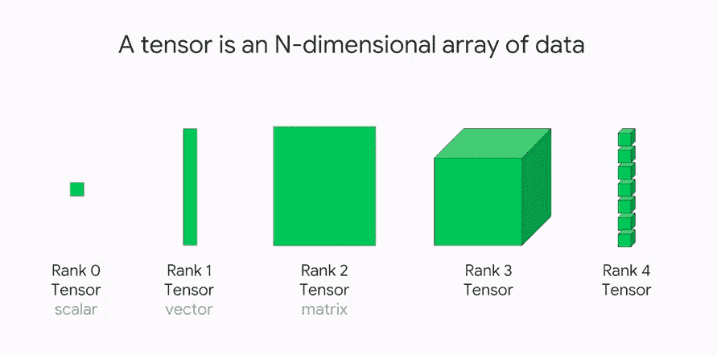
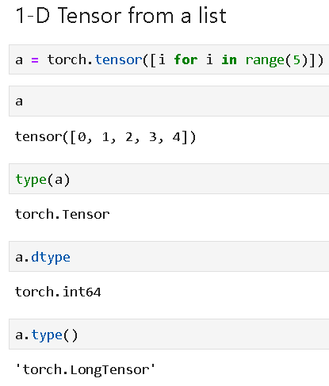
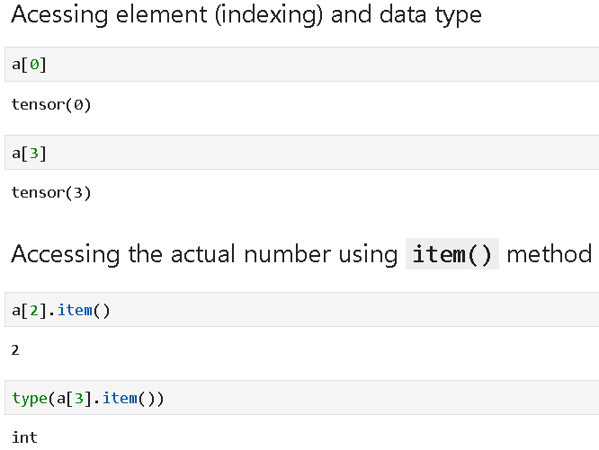
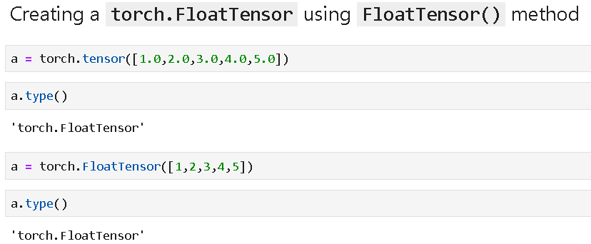
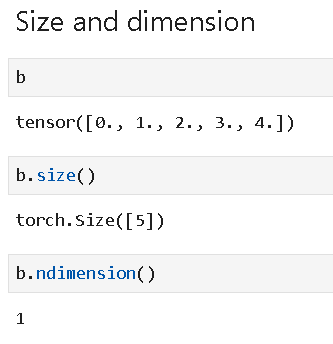
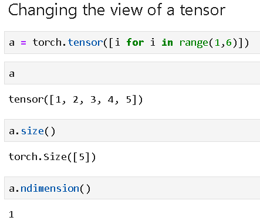
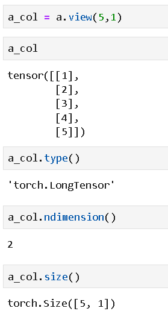

# 你应该知道的 PyTorch 最重要的基础知识

> 原文：[`www.kdnuggets.com/2020/06/fundamentals-pytorch.html`](https://www.kdnuggets.com/2020/06/fundamentals-pytorch.html)

评论

### PyTorch 基础知识 – 介绍

自从 2017 年初由 Facebook AI 研究（FAIR）团队推出以来，[PyTorch](https://www.exxactcorp.com/PyTorch) 已成为一个非常流行且广泛使用的深度学习（DL）框架。从 humble 开始，它吸引了全球各地的严肃 AI 研究人员和从业者，无论是工业界还是学术界，并且在这些年中显著成熟。

众多深度学习爱好者和专业人士从 Google TensorFlow（TF）开始了他们的旅程，但基础 TensorFlow 的学习曲线一直很陡峭。另一方面，PyTorch 自开始以来便以直观的方式进行深度学习编程，专注于基本的线性代数和数据流操作，易于理解，适合逐步学习。

由于这种模块化的方法，使用 PyTorch 构建和实验复杂的深度学习架构比遵循 TF 及其相关工具的相对僵化的框架要容易得多。此外，PyTorch 是为了与 Python 生态系统的数值计算基础设施无缝集成而构建的，而 Python 作为数据科学和机器学习的通用语言，它也顺应了这一日益增长的普及浪潮。

### PyTorch 的张量操作

[张量](https://www.kdnuggets.com/2018/05/wtf-tensor.html) 是任何深度学习框架的核心。PyTorch 为程序员提供了巨大的灵活性，关于如何创建、组合和处理张量，它们在网络（称为计算图）中流动，同时配有相对高级的面向对象 API。

**什么是张量？**

在机器学习（ML），特别是在深度神经网络（DNN）中，表示数据（例如关于物理世界或某些业务过程的数据）是通过一种称为 *张量* 的数据/数学结构完成的。张量是一个可以容纳*N*维数据的容器。张量通常与另一个更为熟悉的数学对象 *矩阵*（具体是 2 维张量）交替使用。实际上，张量是对 2 维矩阵在 *N* 维空间的推广。

简单来说，可以将标量-向量-矩阵-张量视为一个流。

+   标量是 0 维张量。

+   向量是 1 维张量。

+   矩阵是 2 维张量

+   张量是广义的 N 维 *张量*。N 可以是 3 到无限大…

这些维度通常也被称为 *秩*。

*图 1：各种维度（秩）的张量 ([图片来源](https://medium.com/mlait/tensors-representation-of-data-in-neural-networks-bbe8a711b93b)).*

**张量对 ML 和 DL 重要的原因是什么？**

设想一个监督学习问题。你获得了一张包含一些标签的数据表（可能是数值实体或二元分类，如是/否回答）。为了让 ML 算法处理这些数据，数据必须以数学对象的形式输入。表自然等同于二维矩阵，其中每一行（或实例）或每一列（或特征）可以视作一维向量。

类似地，黑白图像可以视作一个包含数字 0 或 1 的二维矩阵。这可以输入到神经网络中进行图像分类或分割任务。

时间序列或序列数据（例如，来自监测机器的 ECG 数据或股票市场价格跟踪数据流）是二维数据的另一个例子，其中一个维度（时间）是固定的。

这些是使用二维张量的经典机器学习（例如线性回归、支持向量机、决策树等）和深度学习算法的示例。

超越二维，彩色或灰度图像可以视作三维张量，其中每个像素与所谓的‘颜色通道’相关联——一个由 3 个数字组成的向量，表示红绿蓝（RGB）光谱中的强度。这是一个三维张量的例子。

同样，视频可以看作是时间上的颜色图像（或帧）序列，可以视为四维张量。

简而言之，来自物理世界、传感器和仪器、商业和金融、科学或社会实验的各种数据，都可以通过多维张量轻松表示，以便让计算机中的 ML/DL 算法进行处理。

让我们看看 PyTorch 如何定义和处理张量。

### 在 PyTorch 中创建和转换张量

张量可以从 Python 列表定义如下，

实际元素可以按如下方式访问和索引，

可以轻松创建具有特定数据类型的张量（例如，浮点数），

大小和维度可以很容易地读取，

我们可以更改张量的视图。让我们从以下一维张量开始，

然后将视图更改为二维张量，

在 PyTorch 张量和 NumPy 数组之间来回转换是简单高效的。

从 Pandas 系列对象转换也很简单，

最后，可以完成转换回 Python 列表的操作，

**PyTorch 张量的向量和矩阵数学**

PyTorch 提供了一个易于理解的 API 和程序化工具箱，用于在数学上操作张量。我们在这里展示了 1 维和 2 维张量的基本操作。

简单的向量加法，

向量与标量的乘法，

线性组合，

元素逐位乘积，

点积，

将一个标量添加到张量的每个元素中，即广播，

从列表列表中创建 2-D 张量，

矩阵元素的切片和索引，

矩阵乘法，

矩阵转置，

矩阵的逆和行列式，

### 自动求导：自动微分

神经网络训练和预测涉及对各种函数（张量值）进行反复求导。Tensor 对象支持神奇的 Autograd 特性，即自动微分，这通过跟踪和存储张量在网络中流动时执行的所有操作来实现。你可以观看这个精彩的教程视频以获得可视化的解释：

PyTorch 的自动求导 [**官方文档在这里**](https://pytorch.org/tutorials/beginner/blitz/autograd_tutorial.html)。

我们展示简单的示例来说明 PyTorch 的自动求导特性。

我们定义一个通用函数和一个张量变量 ***x***，然后定义另一个变量 ***y***，将其赋值为 ***x*** 的函数。

然后，我们在 ***y*** 上使用特殊的 **backward()** 方法来进行求导，并计算在给定 ***x*** 值下的导数值。

我们还可以处理偏导数！

我们可以将 ***u*** 和 ***v*** 定义为张量变量，定义一个结合它们的函数，应用 **backward()** 方法，并计算偏导数。见下图，

PyTorch 仅计算标量函数的导数，但如果我们传递一个向量，它实际上会逐元素计算导数并将其存储在相同维度的数组中。

以下代码将计算相对于三个组成向量的导数。

我们可以展示导数的图像。注意，二次函数的导数是一条直线，与抛物线曲线相切。

### 构建一个功能齐全的神经网络

除了张量和自动微分功能外，PyTorch 还有一些核心组件/特性，这些组件/特性共同作用于深度神经网络的定义。

构建神经分类器所需的 PyTorch 核心组件包括，

+   **张量**（PyTorch 中的核心数据结构）

+   张量的**自动求导**特性（自动微分公式内置于

+   **nn.Module** 类用于构建任何其他神经分类器类

+   **优化器**（当然，你可以选择很多）

+   **损失**函数（有很多选择供你挑选）

我们已经详细描述了张量和自动求导。接下来，我们快速讨论其他组件，

**nn.Module 类**

在 PyTorch 中，我们通过将神经网络定义为自定义类来构建神经网络。然而，这个类不是从原生 Python 的 object 继承，而是继承自 [nn.Module 类](https://pytorch.org/docs/stable/nn.html)。这使得神经网络类具有有用的属性和强大的方法。这样，在处理神经网络模型时可以保持面向对象编程（OOP）的全部力量。我们将在文章中看到这样的类定义的完整示例。

**损失函数**

在神经网络架构和操作中，损失函数定义了神经网络的最终预测与真实值（给定标签/类别或用于监督训练的数据）之间的距离。损失的定量度量有助于驱动网络更接近于最佳配置（神经元权重的最佳设置），以最佳方式分类给定数据集或以最小的总误差预测数值输出。

PyTorch 提供了所有常见的分类和回归任务的损失函数 —

+   二元和多类交叉熵，

+   均方误差和均绝对误差，

+   平滑 L1 损失，

+   负对数似然损失，甚至

+   Kullback-Leibler 散度。

[**这些的详细讨论可以在这篇文章中找到。**](https://medium.com/udacity-pytorch-challengers/a-brief-overview-of-loss-functions-in-pytorch-c0ddb78068f7)

**优化器**

优化权重以实现最低损失是训练神经网络的反向传播算法的核心。PyTorch 提供了大量的优化器来完成这个任务，通过 torch.optim 模块进行暴露 —

+   随机梯度下降（SGD），

+   Adam、Adadelta、Adagrad、SparseAdam，

+   L-BFGS，

+   RMSprop 等。

[**查看这篇文章**](https://blog.exxactcorp.com/activation-functions-and-optimizers-for-deep-learning-models/) 以了解更多关于在现代深度神经网络中使用的激活函数和优化器的信息。

### 五步过程

利用这些组件，我们将通过五个简单步骤构建分类器，

+   将我们的神经网络构建为自定义类（继承自**nn.Module**类），包含隐藏层张量和前向方法，用于通过各种层和激活函数传播输入张量

+   使用这个**forward()**方法将特征（来自数据集）张量传播通过网络 —— 假设我们得到一个输出张量作为结果

+   通过将输出与真实值进行比较并使用内置损失函数来计算损失

+   使用自动微分功能（**Autograd**）和反向传播方法传播损失的梯度

+   使用损失的梯度更新网络的权重 —— 这是通过执行所谓的优化器的一步 —— **optimizer.step()**来完成的。

就这样。这个五步过程构成了**一个完整的训练周期**。我们只需重复这个过程多次，以降低损失并获得高分类准确率。

思路如下，

### 实践示例

假设我们想构建并训练以下的 2 层神经网络。

我们从类定义开始，

我们可以定义一个属于这个类的变量并打印其摘要。

我们选择二元交叉熵损失，

让我们将输入数据集通过我们定义的神经网络模型，即**进行一次前向传播并计算输出概率**。由于权重已被初始化为随机值，我们会看到随机的输出概率（大多数接近 0.5）。**这个网络尚未经过训练**。

我们定义优化器，

接下来，我们展示如何使用一个优化器的步骤进行前向和反向传播。**这段代码可以在任何 PyTorch 神经网络模型的核心中找到**。我们按照另外一个五步过程进行，

+   将梯度重置为零（以防止梯度的累积）

+   将张量前向传播通过各层

+   计算损失张量

+   计算损失的梯度

+   通过将优化器更新一步（沿负梯度方向）来更新权重

上述五个步骤**正是你在所有关于神经网络和深度学习的理论讨论（以及教科书）中观察到和阅读到的内容**。而且，使用 PyTorch，你可以通过看似简单的代码一步步实现这个过程。

代码如下所示，

当**我们在一个循环中运行相同类型的代码（多次周期）**时，我们可以观察到熟悉的损失曲线下降，即神经网络逐渐被训练。

经过 200 轮训练后，我们可以再次直接查看概率分布，以查看神经网络输出的概率现在如何不同（试图与真实数据分布匹配）。

### PyTorch 基础总结

PyTorch 是一个很棒的工具包，可以深入了解神经网络的核心，并根据你的应用进行定制，或尝试对网络的架构、优化和机制进行大胆的新想法。

你可以轻松构建复杂的互联网络，尝试新颖的激活函数，混合和匹配自定义损失函数等。计算图的核心思想、简便的自动微分以及张量的前向和后向流动将对你的任何神经网络定义和优化大有帮助。

在本文中，我们总结了一些关键步骤，这些步骤可以快速构建用于分类或回归任务的神经网络。我们还展示了如何使用这个框架轻松尝试新颖的想法。

本文的所有代码 [**可以在这个 GitHub 仓库找到**](https://github.com/tirthajyoti/PyTorch_Machine_Learning)。

[原文](https://blog.exxactcorp.com/the-most-important-fundamentals-of-pytorch-you-should-know/)。已获得许可转载。

**相关：**

+   [使用 torchlayers 轻松构建 PyTorch 模型](https://www.kdnuggets.com/2020/04/pytorch-models-torchlayers.html)

+   [OpenAI 正在采用 PyTorch……他们并不孤单](https://www.kdnuggets.com/2020/01/openai-pytorch-adoption.html)

+   [PyTorch 1.2 简明介绍](https://www.kdnuggets.com/2019/09/gentle-introduction-pytorch-12.html)

* * *

## 我们的前三大课程推荐

 1\. [Google 网络安全证书](https://www.kdnuggets.com/google-cybersecurity) - 快速进入网络安全职业生涯。

 2\. [Google 数据分析专业证书](https://www.kdnuggets.com/google-data-analytics) - 提升你的数据分析技能

 3\. [Google IT 支持专业证书](https://www.kdnuggets.com/google-itsupport) - 支持你的组织的 IT 工作

* * *

### 更多相关主题

+   [每个数据科学家都应该知道的三个 R 库（即使你使用 Python）](https://www.kdnuggets.com/2021/12/three-r-libraries-every-data-scientist-know-even-python.html)

+   [停止学习数据科学来寻找目标，并找到目标来……](https://www.kdnuggets.com/2021/12/stop-learning-data-science-find-purpose.html)

+   [一个 90 亿美元的 AI 失败，深度剖析](https://www.kdnuggets.com/2021/12/9b-ai-failure-examined.html)

+   [学习数据科学的统计学顶级资源](https://www.kdnuggets.com/2021/12/springboard-top-resources-learn-data-science-statistics.html)

+   [成功数据科学家的 5 个特征](https://www.kdnuggets.com/2021/12/5-characteristics-successful-data-scientist.html)

+   [为什么 Python 是初创公司理想的编程语言](https://www.kdnuggets.com/2021/12/makes-python-ideal-programming-language-startups.html)
