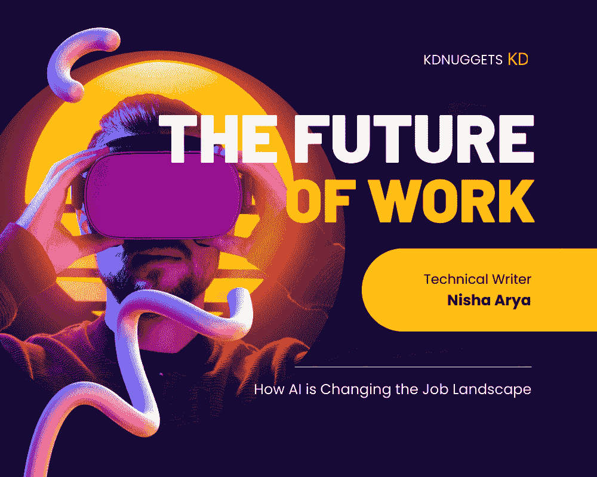

# 工作的未来：人工智能如何改变职位格局

> 原文：[`www.kdnuggets.com/2023/04/future-work-ai-changing-job-landscape.html`](https://www.kdnuggets.com/2023/04/future-work-ai-changing-job-landscape.html)

图片由编辑提供

如果你仅仅考虑过去 5 年中，你与家人和朋友的对话如何发生了变化。有些人可能完全不谈论技术，但我们可以承认很难忽视它就在我们周围。

* * *

## 我们的前三名课程推荐

 1\. [Google 网络安全证书](https://www.kdnuggets.com/google-cybersecurity) - 快速进入网络安全职业轨道

 2\. [Google 数据分析专业证书](https://www.kdnuggets.com/google-data-analytics) - 提升你的数据分析技能

 3\. [Google IT 支持专业证书](https://www.kdnuggets.com/google-itsupport) - 支持你所在的组织在 IT 方面

* * *

最近 ChatGPT 和 GoogleBard 的发布以其惊人的能力震撼了世界。你开始观察这些工具，并思考它们如何改善你的工作生活、公司的流程、个人生活等。

人工智能正在自动化曾经只能由人类完成的任务。自动化某些任务以简化人类生活的相关性将不断增加。有些人可能会称我们为懒惰，但有些人则认为这是更聪明的选择。

以下是人工智能如何改变职位格局的一些例子：

+   **自动化：** 自动化任务。这导致了大量的职位损失，但也为其他人创造了新的机会。

+   **新的就业机会：** 人工智能系统将要求人类员工与其合作，如数据科学家和机器学习工程师。

+   **技能要求的转变：** 随着人工智能应用的增加，现有和新员工需要更多地了解系统的运作方式、工程师、分析阶段等。

+   **工作与生活平衡：** 人工智能工具的兴起使更多人能够远程、兼职和/或自由职业，因为任务已被自动化。

# 人工智能自动化如何改变职位格局？

自动化目前是职位格局转变的最大原因。随着越来越多的任务由人工智能完成，而实际由人类完成的任务越来越少，你可以理解为什么公司会开始裁员。雇佣员工的成本包括工资、养老金、健康保险、产假/陪产假等。更多的公司将员工视为损失，自动化人工智能工具是他们最大的突破。

以下是一些已经实施自动化任务的领域：

## 客户服务

就在几周前，世界迎来了 ChatGPT 和 Google Bard。越来越多的行业正在采用人工智能驱动的聊天机器人来提供客户服务。随着大型语言模型的兴起，我们只能期待这些聊天机器人在处理客户查询、回答问题、解决问题，甚至进行销售方面变得越来越出色。

例如，聊天机器人也被用于金融行业，处理如新申请者的保险注册、了解你的客户（KYC）和反洗钱（AML）政策与流程等任务。自动化工具在这些敏感任务中的应用证明了人工智能的成功，并且这种趋势只会持续下去。

## 数据录入

数据录入任务曾经是手动完成的，这些任务非常繁琐和重复。由于任务的高度重复性和枯燥性，这一领域存在一些缺陷，工人更容易犯错误。

现在，人工智能能够自动化数据录入任务，通过从原始文件或文档中提取数据并将其输入数据库中来实现。

## 驾驶

我们都知道自动驾驶汽车。越来越多的汽车进入市场，如特斯拉、Waymo 和 Uber。这些汽车使用人工智能计算机视觉技术，安全地将乘客从 A 点送到 B 点，导航道路并避开障碍物。

## 金融

如我之前提到的，聊天机器人正在金融行业中用于自动化一些流程和任务，例如 KYC。人工智能也被用于帮助这些金融公司分析数据，以做出更好的当前和未来预测。

金融行业拥有大量的数据。历史数据越多，他们的分析结果就会越好。不幸的是，这将导致对与人工智能系统协作的需求发生变化，而不是人工智能系统为人类工作。

## 医疗

对于一个许多人对人工智能工具的整合感到震惊的行业，我们只能期待更多的变化。医疗行业的专业人士正在使用人工智能来诊断疾病，通过数据分析推荐治疗方案，甚至使用机器人进行手术。

# 人工智能如何创造新工作

随着人工智能的持续发展，大多数人的选择将是被解雇或与人工智能系统一起工作。这就是为什么你自然会看到数据专业人员的增加，更多的编程课程、训练营等。

你将自然会看到更多这些角色：

## 数据科学

数据科学是统计学、数据分析、机器学习和人工智能的结合。因此，数据科学家将负责整理、准备、清理和操作数据，以识别数据中的模式并进行高级数据分析。

## 机器学习工程师

机器学习 (ML) 工程师是精通研究、构建和设计自动化预测模型的软件的程序员。他们的角色是构建人工智能 (AI) 系统，这些系统消耗大量数据以生成和开发能够学习和进行未来预测的算法。

## 人工智能训练师

人工智能工具在学习所需知识后效果最佳。人工智能训练师将需要帮助教导人工智能系统如何执行任务。他们还将负责收集数据、标注数据，然后将数据输入到人工智能算法中，以便从标注数据中学习并确保生成准确的输出。

# 那么我们应该期待什么？

很难预见未来会发生什么，尤其是当人工智能参与其中时。不幸的是，我们将开始看到更多的人因人工智能而失去工作，同时也会出现与人工智能系统协作的工作岗位。

这将导致人们在学习新技能以确保工作安全方面产生变化。我们将开始看到更多人学习编程语言，理解人工智能及其在销售、市场营销等方面的应用。

随着疫情导致工作方式发生巨大变化，人工智能也对此产生了影响。未来将会有更多的人在家工作，同时利用人工智能系统的自动化功能在全球各地旅行。

有了这些信息，我认为无论当前职位如何，任何人都应该意识到人工智能将如何导致就业格局的变化，并了解如何准备以满足当前的技能需求。

**[Nisha Arya](https://www.linkedin.com/in/nisha-arya-ahmed/)** 是一名数据科学家、自由技术写作人以及 KDnuggets 的社区经理。她特别感兴趣于提供数据科学职业建议或教程，以及围绕数据科学的理论知识。她还希望探索人工智能如何对人类寿命的延续产生益处。作为一名热衷学习者，她寻求拓宽自己的技术知识和写作技能，同时帮助指导他人。

### 更多相关主题

+   [如何在没有任何工作经验的情况下获得第一份数据科学工作](https://www.kdnuggets.com/2021/02/first-job-data-science-without-work-experience.html)

+   [8 篇创新性的 BERT 知识蒸馏论文，改变了…](https://www.kdnuggets.com/2022/09/eight-innovative-bert-knowledge-distillation-papers-changed-nlp-landscape.html)

+   [如何利用 AIOps 管理复杂的 IT 环境](https://www.kdnuggets.com/2022/05/manage-complex-landscape-aiops.html)

+   [首个机器学习价值链格局](https://www.kdnuggets.com/2022/10/first-ml-value-chain-landscape-sequence.html)

+   [数据工程在 AI 驱动世界中的格局](https://www.kdnuggets.com/2023/05/data-engineering-landscape-aidriven-world.html)

+   [数据格局的演变](https://www.kdnuggets.com/2023/06/evolution-data-landscape.html)
