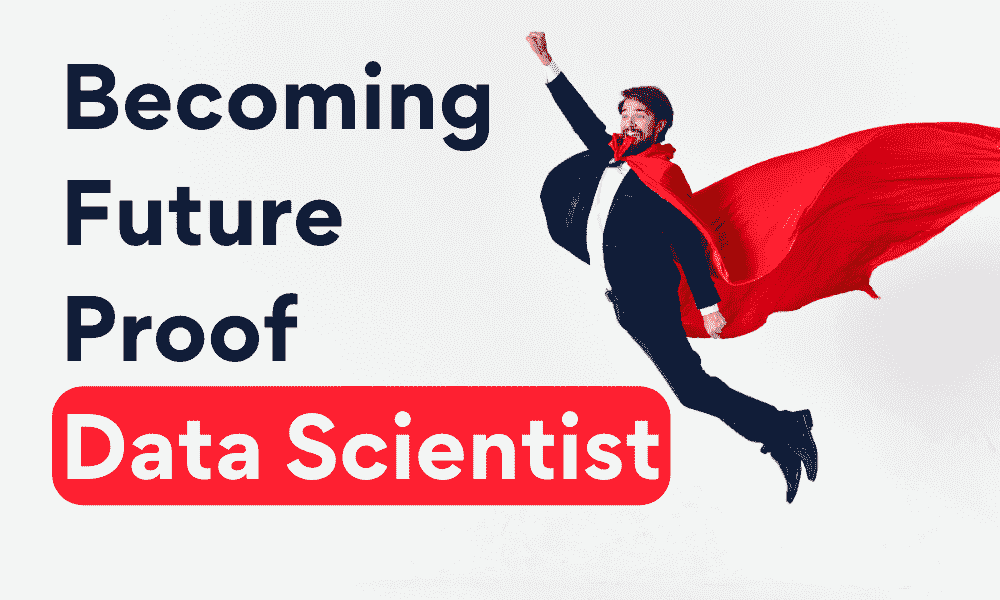

# 未来数据游戏：2023 年每位数据科学家需要的顶级技能

> 原文：[`www.kdnuggets.com/futureproof-your-data-game-top-skills-every-data-scientist-needs-in-2023`](https://www.kdnuggets.com/futureproof-your-data-game-top-skills-every-data-scientist-needs-in-2023)

编辑提供的图片

如果你还没听说，未来 3 年内，[40%](https://www.ibm.com/thought-leadership/institute-business-value/en-us/report/augmented-workforce)的员工预计将需要提升技能。这是为了跟上技术，特别是生成性 AI 的持续增长。

然而，IBM 报告指出，执行官估计，由于 AI 和自动化，40%的员工将需要重新技能培训。然而，它也指出，具备商业头脑的分析技能和一系列软技能将在未来 3 年内极具吸引力。

在这篇文章中，我将讨论 2023 年最受欢迎的技能，以及这些技能如何使你的未来职业受益。

那么让我们开始吧……

# 2023 年的数据科学技能

随着技术和生成性 AI 的崛起，很多事情正在发生变化。如果你在考虑开始或提升你的数据科学职业生涯，以下是 2023 年最受欢迎的技能。

## 编程语言

对于那些希望开始数据科学新职业的人，让我们从基础开始。

选择一种编程语言进行学习，并将其学得非常透彻。了解它的方方面面，所有的细节，尽你所能了解它。成为某一领域的高手总比成为多面手要好。

许多组织希望了解他们雇佣的员工能够带来多重好处。例如，这名员工在数据处理方面非常精通，但他们在为我们董事会会议创建数据可视化方面也非常出色。

如果你不确定选择哪种编程语言，可以阅读 2023 年数据科学需要学习的 8 种编程语言。

## 数据清理与处理

现在让我们深入了解作为数据科学家你将会被分配的任务。数据量巨大，随着大数据和其在生成性 AI 中的应用，组织将希望利用这些数据。数据清理和处理包括将原始数据转化为可以用于分析的格式。

尽管有人说数据科学家将多达 80%的时间花在数据清理上，但这并不总是正确的。尽管这是一项耗时的任务，但它并不会占据数据科学家全部的 80%时间。

尽管如此，在 2023 年，这仍然是数据科学家们所追求的技能。为什么？因为数据很少是干净整洁的。尤其是现在，组织正在筛选那些积满灰尘的旧数据，并试图找到利用这些数据的方法。拿出你的扫帚和簸箕吧，因为确实需要清理。

## 分析技能

正如我之前提到的，具有强大分析技能的员工将是未来三年高管们关注的重点。根据 IBM 报告，高管们优先关注的是提升员工在时间管理和沟通等各种软技能上的能力。之后是具有商业敏锐性的分析技能。

分析技能的领域包括：

+   统计分析

+   数据探索

+   特征选择与工程

+   机器学习

+   模型评估

+   数据可视化

以统计分析为例，它被称为数据科学的基石，允许你通过描述性统计探索数据，更好地理解数据并通过可视化进行表示。它们与数据清理和处理阶段的元素（如缺失值和处理异常）紧密配合。

分析技能是数据科学家工作的核心，因此同样的原则适用——了解细节、每一个角落，你将会在数据科学领域中脱颖而出。

## 机器学习与深度学习

由于我们生活在组织推动使用数据来提供见解和自动化任务的时代，掌握机器学习和深度学习的要素将至关重要。

机器学习和深度学习技能的领域包括：

+   数学和统计学

+   机器学习算法

+   深度学习架构

+   神经网络

+   GPU 和计算框架

+   部署

机器学习和深度学习在从数据中提取见解方面展现出了惊人的能力，使数据科学家能够构建能够自动学习的模型。

组织正在竞争性地寻求在各行业中建立具有卓越性能的先进模型。作为数据科学家，你将能够处理复杂问题，提高准确性，构建提升组织竞争力的模型，并不断推动创新。

如果你发现自己在机器学习或深度学习某一领域非常擅长并且喜欢，那就尽情发挥吧。正如我所说，与其是全能手，不如精通一门。

## 软技能

根据 IBM 报告，劳动力所需的最关键技能包括：

+   时间管理

+   优先级设定能力

+   有效地在团队环境中工作

+   有效沟通

+   灵活、敏捷并适应变化

我个人认为，管理者已经看到远程工作的变化可能对这些领域带来了限制。或者，这可能是一些能有效将想法变为现实的技能。

为了跟上生成式 AI 的步伐，高管们正在寻找能够完成生成式 AI 工具目前无法实现的任务的员工。技术可以帮助我们自动化任务，我们可以通过数据分析来了解哪些有效，哪些无效。

然而，如果员工不明智地利用他们的时间，不能在敏捷和灵活的团队环境中工作——所有这些洞察都会付诸东流。员工是创新的推动者，生成式 AI 系统是帮助我们的工具。

# 结论

这篇文章旨在让你关注未来几年即将发生的变化以及高管们所寻找的内容。如果你是数据科学领域的新手，你肯定有很多学习和工作的任务——然而，了解所有要素将使你在未来更具竞争力。

如果你目前是一名数据科学家，我希望这篇文章能让你了解到更多组织在寻找具备优秀软技能的候选人，这些软技能能够补充他们的硬技能。

我们都需要跟上世界的发展，因此，利用 AI 工具进行再培训或技能提升将非常有益。

****[Nisha Arya](https://www.linkedin.com/in/nisha-arya-ahmed/)**** 是一名数据科学家、自由职业技术作家，并且是 KDnuggets 的编辑和社区经理。她特别关注提供数据科学职业建议或教程，以及围绕数据科学的理论知识。Nisha 涵盖了广泛的主题，并希望探索人工智能如何有利于人类寿命的不同方式。作为一名热衷学习者，Nisha 寻求拓宽她的技术知识和写作技能，同时帮助指导他人。

### 更多相关话题

+   [Python f-Strings 魔法：每个编码员需要知道的 5 个颠覆性技巧](https://www.kdnuggets.com/python-fstrings-magic-5-gamechanging-tricks-every-coder-needs-to-know)

+   [每个数据科学家都需要的软技能](https://www.kdnuggets.com/soft-skills-every-data-scientist-needs)

+   [2024 年每个数据科学家必备的 5 种关键技能](https://www.kdnuggets.com/5-essential-skills-every-data-scientist-needs-in-2024)

+   [2024 年每个数据科学家工具箱中必备的 5 个工具](https://www.kdnuggets.com/5-tools-every-data-scientist-needs-in-their-toolbox-in-2024)

+   [每个机器学习工程师都应该掌握的 5 种机器学习技能](https://www.kdnuggets.com/2023/03/5-machine-learning-skills-every-machine-learning-engineer-know-2023.html)

+   [2023 年成为数据科学家所需掌握的 19 项技能](https://www.kdnuggets.com/2023/04/top-19-skills-need-know-2023-data-scientist.html)
