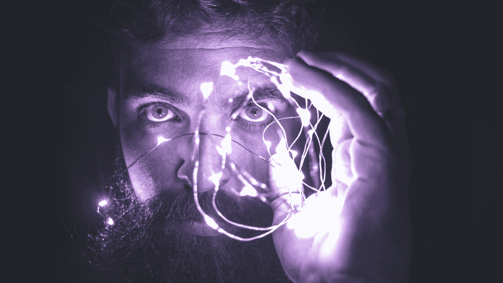

# 深度学习与人类认知能力之间的差距

> 原文：[`www.kdnuggets.com/2022/10/gap-deep-learning-human-cognitive-abilities.html`](https://www.kdnuggets.com/2022/10/gap-deep-learning-human-cognitive-abilities.html)

图片由 [David Cassolato](https://www.pexels.com/photo/person-holding-string-lights-photo-818563/) 提供

嗨！我是 [AI HOUSE](https://aihouse.org.ua/) 社区的首席执行官**博赫丹·波诺马尔**。我们是由 [Roosh](https://jobs.dou.ua/companies/roosh/) 技术公司构建的生态系统的一部分。Roosh 创建 ML/AI 项目并投资于行业中的创新想法。我们的生态系统还包括 Pawa 风投工作室、Roosh Ventures 风投基金、SET University 科技大学、Reface 和 ZibraAI 初创公司，以及 Neurons Lab 公司。

* * *

## 我们的前三大课程推荐

 1\. [谷歌网络安全证书](https://www.kdnuggets.com/google-cybersecurity) - 快速进入网络安全职业

 2\. [谷歌数据分析专业证书](https://www.kdnuggets.com/google-data-analytics) - 提升你的数据分析能力

 3\. [谷歌 IT 支持专业证书](https://www.kdnuggets.com/google-itsupport) - 支持你的组织的 IT 工作

* * *

在 2022 年 8 月，我们启动了一个新的教育项目“AI for Ukraine”——一系列由国际人工智能专家主讲的研讨会和讲座，旨在支持乌克兰科技社区的发展。

系列的第一讲由蒙特利尔大学的教授**约书亚·本吉奥**主讲，他是魁北克人工智能研究所的创始人和科学主任，CIFAR 机器与大脑学习计划的负责人，以及 AI 行业的领先专家之一。2022 年，他成为全球 h-index 最高的计算机科学家。

在讲座中，教授介绍了他的研究项目，旨在弥合基于深度学习的现代 AI 与具有创造力的人类智能之间的差距。完整录音可以在 [这里](https://aiforukraine.aihouse.club/#agenda) 通过捐款获取，本文中我们涵盖了讲座的主要内容。

# 系统性泛化

当前的机器学习在可靠性方面存在问题，因为 OOD（分布外样本）表示的表现不佳。我们习惯依赖 IID（独立同分布）假设，即测试分布和训练分布是相同的。但没有这个假设，我们需要一些替代假设来进行泛化。

这就引出了一个研究问题：分布如何具体变化？让我们考虑一下人类通常如何应对这些任务，因为这可以激发 AI 学习方法的发展。

多年来，语言学家一直在研究系统性概括，这在自然语言中很容易观察到。一个人可以将熟悉的概念重新排列，而声明的意思仍然完全明确。

我们甚至可以创建那些在训练分布中概率为零的配置。例如，一名司机将自己在本国的驾驶法律知识概括到其他国家，而这些国家的道路规则可能略有不同。然而，深度学习尚未实现类似的结果。这显示了最先进的 AI 系统与人类智能之间的差距本质。

# 组合知识表示

我们有大型语言模型，但它们需要大量数据，这使得它们的使用变得毫无意义。这是样本复杂性的问题——训练所需的样本数量。

因此，我们不应该考虑定量扩展，而是应该关注深度学习的定性发展。问题是：

+   这些系统如何能够泛化到新的分布外设置？

+   它们能多快适应这些设置（迁移学习）？

这些问题与人类建立和识别因果关系的能力直接相关。人类可以通过结合和重组之前的知识来得出新的结论。这种在自然语言中表示知识的组合能力也让我们能够考虑未来 AI 一代的发展方向。

# 有意识的信息处理

上述内容涉及到一个人类当前超越 AI 的关键能力。这就是我们大脑进行的有意识的信息处理。

比如，当一名司机开始在外国开车时会发生什么？假设司机习惯于左侧交通，但现在他必须适应右侧行驶。他不能完全依赖之前的经验，因为这样会使汽车驶入对向车道。但他可以专注于任务，不断提醒自己道路规则的不同。这就是他之前驾驶经验的帮助之处。

因此，当人们面对新的情况时，他们会在意识上注意，以便即兴结合相关的知识点，分析它们，并最终成功完成任务。这种有意识的信息处理本质上不同于我们在日常生活中依赖的处理方式（参见 D. Kahneman 的《思考，快与慢》）。

当前的深度学习系统在没有需要解决复杂问题的情况下，可以通过简单的动作序列成功模拟快速思维。但再现更复杂和算法性的慢思维对未来的行业发展来说是一项挑战。

为此，我们需要以一种方式组织知识，使其易于从训练分布中选择相关知识片段，以便在解决新问题时重新使用。类似的比喻可以是由独立模块和函数组成的程序代码。

# 因果关系

人类能够区分他们对世界的知识的两个视角：

+   这些依赖于不变的物理法则；以及

+   这些与动态变化条件相关。

这与常见的 IID 假设不同，因为那些在分布中保持不变并与物理法则相关的事物实际上是不变的。而与变量条件相关的事物则会发生变化。

因此，深度学习的目标是发现能够反映变量因素因果关系的知识表示。换句话说，结果取决于所采取的行动。

# 归纳偏差

人类可以通过语言接收和分享大量信息。最适合口头表达的是依赖于归纳偏差的知识，比如使用抽象命名对象。

例如，我手里拿着一个球。这句话包含了命名对象：我、手和球。每个对象都有自己的特征，如空间中的坐标。如果我突然掉下球，它们可以用来预测球在每一个下落时刻的坐标。这个预测是准确的，尽管它只基于几个变量。

但如果在像素级别应用这种方法，它将不起作用。无法准确预测一个像素本身的状态。但可以预测与抽象命名对象相关的像素状态，比如球。因为这种命名对象的统计结构与普通像素不同。

此外，抽象对象之间的因果关系是可重复使用的。无论是什么物体由于掉落而发生——球、电话或其他——机制保持不变。

# GFlowNets

在神经科学中，有一个随机因素：在某种情况下，人类可能会有某种思维。因此，思维中存在某种离散随机的方面，无法事先预测。从机器学习的角度来看，我们需要一个能够从选择的分布中生成思想的概率神经网络，例如贝叶斯后验概率。

GFlowNets 是一个多功能的概率建模工具。这些网络使得通过复合对象建模分布以及估计如归一化常数或条件概率等量成为可能。最容易想象这种结构的是假图。

GFlowNets 如何生成像图这样的结构化对象？我们已经知道几年来，网络接受的不是固定大小向量的集合，而是图作为输入。现在我们考虑将图作为输出。这一过程类似于大脑生成思维的方式。为了创建复合结构，我们一次添加一个元素。即，我们将一个部分构建的思维作为输入，并推导出一个分布作为输出，确定所有可能的进一步行动。这样，我们一步步获得所需的结果。

GFlowNets 可以组织为专注于不同类型知识的不同模块。通过相互竞争，它们提供标准化的估计作为输出。此外，每个模块与其他模块共享信息——这就是短期工作记忆形成的方式。最后，某个估计会被随机选择，类似于人脑中启动意识处理的过程。

# 因果关系模型

在使用这样的神经网络时，主要挑战是正确识别和建模因果结构。因为如果你仅仅拿两个有相关性的 A 和 B 变量，那么无法确定哪个变量触发了另一个。然而，我们可以假设这种连接会由于外部因素而改变。例如，如果我们改变 A 的状态，这也改变了 B，那么 A 对 B 的影响更可能，而不是反过来。

因果关系是非对称的。如果你没有完全理解它，你可能会犯很大的错误。例如，这可能导致歧义，比如病人是因为新药治愈的，还是由于其他原因？

因此，有必要构建能够涵盖所有可能因果解释的模型。在思考中，人类能够提出类似的假设。对于人工智能，这一任务通过贝叶斯后验因果模型来解决。

# 结论

到目前为止，深度学习与人类认知能力之间的差距仍然很大。毕竟，人类可以概括他们的知识，应用慢思维并用来解决非平凡问题，意识处理信息，并理解现象之间的因果关系。

然而，世界领先的人工智能专家正在努力弥合这一差距，提升人工智能能力，灵感来自于对人脑功能原理的研究。蒙特利尔的**Joshua Bengio**团队研究概率神经网络，以迈向下一代深度学习。

**[博赫丹·波诺马尔](https://www.linkedin.com/in/bogdan-ponomar-41866328/)** 是[AI HOUSE](https://aihouse.org.ua/)社区的首席执行官。他正在为学生和专家创建一个领先的人工智能生态系统，以在乌克兰建立世界一流的人工智能企业。

### 更多相关话题

+   [弥合人类理解与机器学习之间的差距：…](https://www.kdnuggets.com/2023/06/closing-gap-human-understanding-machine-learning-explainable-ai-solution.html)

+   [人工智能教育差距及其解决方案](https://www.kdnuggets.com/2022/11/ai-education-gap-close.html)

+   [是否有方法弥合 MLOps 工具差距？](https://www.kdnuggets.com/2022/08/way-bridge-mlops-tools-gap.html)

+   [数据科学家认知偏差指南：免费电子书](https://www.kdnuggets.com/2023/05/data-scientist-guide-cognitive-biases-free-ebook.html)

+   [梦想与现实之间：生成文本与幻觉](https://www.kdnuggets.com/between-dreams-and-reality-generative-text-and-hallucinations)

+   [机器学习中训练数据与测试数据的区别](https://www.kdnuggets.com/2022/08/difference-training-testing-data-machine-learning.html)
