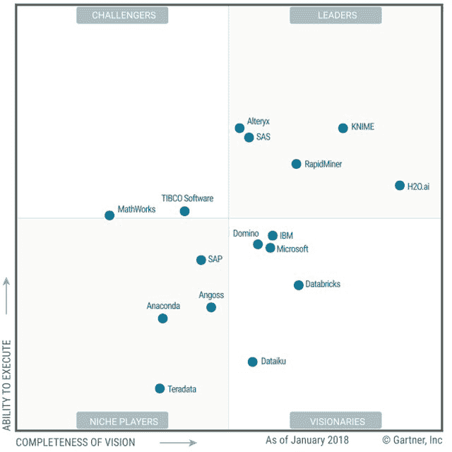
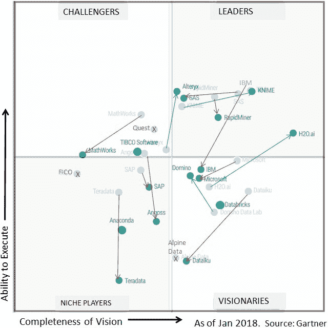

# Gartner 2018 年数据科学和机器学习平台的魔力象限中的赢家与输家

> 原文：[`www.kdnuggets.com/2018/02/gartner-2018-mq-data-science-machine-learning-changes.html`](https://www.kdnuggets.com/2018/02/gartner-2018-mq-data-science-machine-learning-changes.html)

 评论 Gartner 不断更改此报告的名称（暗示市场细分）——最新的 2018 版本，发布于 2018 年 2 月 23 日，被称为“数据科学和机器学习平台的魔力象限”（Machine 和 Learning 之间用传统的连字符）。在 2017 年，它被称为“数据科学平台的 MQ”，在 2014-2016 年，它被称为“高级分析平台的 MQ”。这种变化反映了行业在内容和能力方面的快速变化，以及反映 AI 和机器学习增长的不断演变的品牌。

Gartner 将数据科学和机器学习平台定义为：

> 一款完整的软件应用程序，提供了一系列基本构建块，既对创建多种数据科学解决方案至关重要，又对将这些解决方案纳入业务流程、周边基础设施和产品中。

2018 年的变化相当显著，如下所述。

2018 年的报告评估了 16 家分析和数据科学公司，依据多项标准将其分为 4 个象限，基于愿景的完整性和执行能力。

请注意，虽然像 Python 和 R 这样的开源平台在数据科学市场中扮演着越来越重要的角色，但 Gartner 的研究方法并未包括它们。

**图 1: 2018 年 Gartner 数据科学和机器学习平台的魔力象限**

涉及的公司：

+   **领导者（5）：** KNIME，Alteryx，SAS，RapidMiner，H2O.ai

+   **挑战者（2）：** MathWorks，TIBCO Software（新增）

+   **远见者（5）：** IBM，Microsoft，Domino Data Lab，Dataiku，Databricks（新增）

+   **小众玩家（4）：** SAP，Angoss，Anaconda（新增），Teradata

2017 年新增了三家公司：TIBCO Software，Anaconda 和 Databricks。

2017 年 MQ 中的另外三家公司被淘汰：FICO，Quest 和 Alpine Data。我们注意到 Alpine Data 公司和 Quest 的 Statistica 资产被 TIBCO 收购，TIBCO 在 2017 年的 MQ 中的位置接近 Quest。

与我们之前的帖子 Gartner 2017 MQ 数据科学平台的赢家与输家 一样，我们比较了最新的 2018 年魔力象限与其前一版本。下面我们将审视这些变化、赢家和输家。

**图 2: 2018 年与 2017 年的数据科学和机器学习平台的 Gartner 魔力象限比较**

图 2 显示了 2017 MQ（灰色背景图像）和 2018 MQ（前景图像）的对比，箭头连接相同公司的圆圈。如果公司位置显著改善（离原点更远），箭头为绿色；如果位置变弱，箭头为红色。绿色圆圈表示新公司，而红色 X 标记的是在 2018 年被淘汰的供应商。

**领导者：**

自 2014 年以来，首次出现了变化。曾经属于领导者的 IBM 由于执行能力下降，降到了愿景者象限。KNIME 在愿景完整性轴上显著前进，SAS 在同一轴上后退，而 RapidMiner 在执行能力上稍有下滑。

2018 年有两家公司首次进入领导者行列：H2O.ai，从愿景者上升，Alteryx，从挑战者上升。

下面是每个公司的简要总结。完整报告请参见下方指引。

**KNIME** 提供开源的 KNIME Analytics Platform，全球用户超过 10 万。KNIME 提供商业支持和扩展，用于企业部署中的协作、安全和性能。在 2017 年，KNIME 为 AWS 和 Microsoft Azure 增加了平台的云版本，改进了数据质量功能，并扩展了深度学习能力。

Gartner 写道：

> 该供应商展示了对市场的深刻理解、强大的产品策略以及在所有用例中的优势。综合这些特性，它巩固了其作为领导者的位置。

**Alteryx** 平台使公民数据科学家能够在一个工作流程中构建模型。2017 年，Alteryx 成功上市，并随后收购了专注于模型部署和管理的数据科学供应商 Yhat。

Gartner 写道：

> Alteryx 从挑战者象限上升到了领导者象限。这得益于强大的执行能力（无论是收入增长还是客户获取）、令人印象深刻的客户满意度以及一个致力于帮助组织培养数据和分析文化的产品愿景，而无需聘请专家数据科学家。

**SAS** 提供了许多用于分析和数据科学的软件产品。对于本次 MQ，Gartner 评估了 SAS Enterprise Miner（EM）和 SAS Visual Analytics 产品套件。

Gartner 写道：

> SAS 依然是领导者，但在愿景完整性和执行能力方面有所下滑。Visual Analytics 套件由于其 Viya 云就绪架构而显示出潜力，这种架构比以前的 SAS 架构更加开放，使分析对更广泛的用户群体更易于访问。然而，令人困惑的多产品策略加剧了 SAS 的愿景完整性问题，高许可成本的认知也削弱了其执行能力。随着市场重点转向开源软件和灵活性，SAS 缺乏一个统一开放平台的迟缓应对也带来了负面影响。

**RapidMiner** 平台包括 RapidMiner Studio 模型开发工具（提供免费版和商业版），RapidMiner Server 和 RapidMiner Radoop。

高德纳写道：

> RapidMiner 仍然是领导者，通过提供一个全面且易于使用的平台，服务于全体数据科学家和数据科学团队。RapidMiner 继续强调核心数据科学以及模型开发和执行的速度，通过引入新的生产力和性能功能来实现这一点。

**H2O.ai** 提供开源机器学习平台，包括 H2O Flow，它的核心组件；H2O Steam；H2O Sparkling Water，用于 Spark 集成；以及 H2O Deep Water，提供深度学习能力。

高德纳写道：

> H2O.ai 从之前的魔力象限中的愿景者（Visionary）进步为领导者（Leader）。它继续通过显著的商业扩展取得进展，并巩固了其作为思想领袖和创新者的地位。

**挑战者（Challengers）：**

+   **MathWorks** 仍然是挑战者（Challenger），得益于其在高级分析领域的高知名度、大量的已安装基础和强大的客户关系。然而，它从一些客户那里获得了较低的评分，并且其愿景的完整性受到其在工程和高端金融用例上的专注的限制。

+   **TIBCO Software**（新）通过于 2017 年 6 月收购 Quest Software 的知名 Statistica 平台进入了这一市场。2017 年 11 月，它还收购了 Alpine Data，后者在 2017 年魔力象限中被评为愿景者。对于执行能力，本次魔力象限仅评估了 TIBCO 在 Statistica 平台上的能力。TIBCO 的其他收购仅对其愿景完整性有所贡献。

**愿景者（Visionaries）**

+   **IBM** 提供许多分析解决方案。在这个魔力象限中，高德纳评估了 SPSS Modeler 和 SPSS Statistics，但没有评估 Data Science Experience (DSX)，因为 DSX 没有满足高德纳在执行能力轴上的评估标准。高德纳写道：

    > IBM 现在是愿景者，较其他供应商在愿景完整性和执行能力方面有所下滑。然而，IBM 的 DSX 产品有潜力激发出更全面和创新的愿景。IBM 已宣布计划在 2018 年推出一个新的 SPSS 产品接口，该接口将 SPSS Modeler 完全集成到 DSX 中。

+   **Microsoft** 提供多个数据科学和机器学习产品。对于云计算，这些产品包括 Azure 机器学习、Azure 数据工厂、Azure Stream Analytics、Azure HDInsight、Azure 数据湖和 Power BI。

    对于本地计算，微软提供了 SQL Server 及其机器学习服务（于 2017 年 9 月发布 - 在本次魔力象限的截止日期之后）。只有 Azure 机器学习工作室满足了本次魔力象限的包含标准。高德纳写道：

    > 微软依然是一个愿景型公司。其在这方面的位置归因于市场响应性和产品可行性评分较低，因为 Azure 机器学习工作室仅限于云端，这限制了它在许多需要本地选项的高级分析用例中的可用性。

+   **Domino（Domino 数据实验室）** 数据科学平台是一个面向专家数据科学团队的端到端解决方案。该平台专注于整合来自开源和专有工具生态系统的工具、协作、可重复性以及模型开发和部署的集中化。Domino 仍然位于愿景型象限，但显著提高了执行能力。Gartner 写道

    > Domino …… 执行能力，尽管有所改善，但仍因机器学习生命周期初期（数据访问、数据准备、数据探索和可视化）功能较弱而受限。然而，在过去一年中，Domino 已展示出赢得新客户并在竞争激烈的市场中取得进展的能力。

+   **Dataiku** 提供以跨学科协作和易用性为重点的数据科学工作室（DSS）。Gartner 写道

    > Dataiku 仍然是一个愿景型公司……通过使用户能够快速启动机器学习项目。其在愿景完整性方面的位置得益于其协作和开源支持，这也是其产品路线图的重点。其整体愿景完整性评分低于之前的 MQ，原因在于用例的广度相对较差以及自动化和数据流的不足。

+   **Databricks（新）** 提供基于 Apache Spark 的 Databricks 统一分析平台，该平台在云端运行。它还提供了专有的安全性、可靠性、操作性和性能功能。Gartner 写道

    > Databricks 是此魔力象限的新进者。作为一个愿景型公司，它利用开源社区及其自身的 Spark 专业知识，提供一个对许多人来说易于访问且熟悉的平台。除了数据科学和机器学习外，Databricks 还专注于数据工程。2017 年的一轮 1.4 亿美元的 D 轮融资为 Databricks 提供了充足的资源，以扩大其部署选项并实现其愿景。

**利基玩家**

+   SAP 再次将其平台从 SAP Business Objects Predictive Analytics 更名为简单的 SAP Predictive Analytics。由于客户满意度较低、缺乏关注度、工具链破碎以及在云计算、深度学习和 Python 方面存在显著技术差距，它仍然是一个利基玩家。

+   Angoss 于 2018 年 1 月被 Datawatch 收购，但由于收购时间较晚，仍在本文档中以 Angoss 命名。Angoss 拥有忠实的客户，但仍然被视为利基玩家，因为它仍被认为是桌面环境的供应商。

+   Anaconda（新）提供了 Anaconda Enterprise 5.0，这是一个基于互动笔记本概念的开源开发环境。它还提供了一个发行环境，访问广泛的开源开发环境和开源库。

+   Teradata 提供了 Teradata Unified Data Architecture，这是一个企业级分析生态系统，结合了开源和商业技术以提供分析能力。由于其在数据科学开发方面缺乏一致性和易用性，它仍然是一个小众参与者。

你可以从 Domino、H2O.ai、Alteryx、Dataiku 以及报告中可能提到的其他供应商下载 Gartner 2018 年数据科学和机器学习平台魔力象限报告。

你还可以查看相关的 [2018 年 Gartner 分析和商业智能平台魔力象限](https://www.sisense.com/blog/gartners-2018-magic-quadrant-next-generation-bi/)。

**相关：**

+   Gartner 2017 年数据科学平台魔力象限：赢家和输家

+   Gartner 2016 年高级分析平台魔力象限：赢家和输家

+   Gartner 2015 年高级分析平台魔力象限：谁赢了，谁输了。

+   Gartner 2014 年高级分析平台魔力象限。

### 更多相关内容

+   [停止学习数据科学以寻找目标，并通过寻找目标来…](https://www.kdnuggets.com/2021/12/stop-learning-data-science-find-purpose.html)

+   [学习数据科学统计学的顶级资源](https://www.kdnuggets.com/2021/12/springboard-top-resources-learn-data-science-statistics.html)

+   [建立一个坚实的数据团队](https://www.kdnuggets.com/2021/12/build-solid-data-team.html)

+   [使用管道编写干净的 Python 代码](https://www.kdnuggets.com/2021/12/write-clean-python-code-pipes.html)

+   [成功数据科学家的 5 个特征](https://www.kdnuggets.com/2021/12/5-characteristics-successful-data-scientist.html)

+   [每个数据科学家都应该知道的三个 R 库（即使你使用 Python）](https://www.kdnuggets.com/2021/12/three-r-libraries-every-data-scientist-know-even-python.html)
