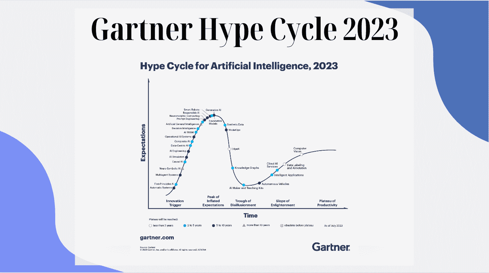
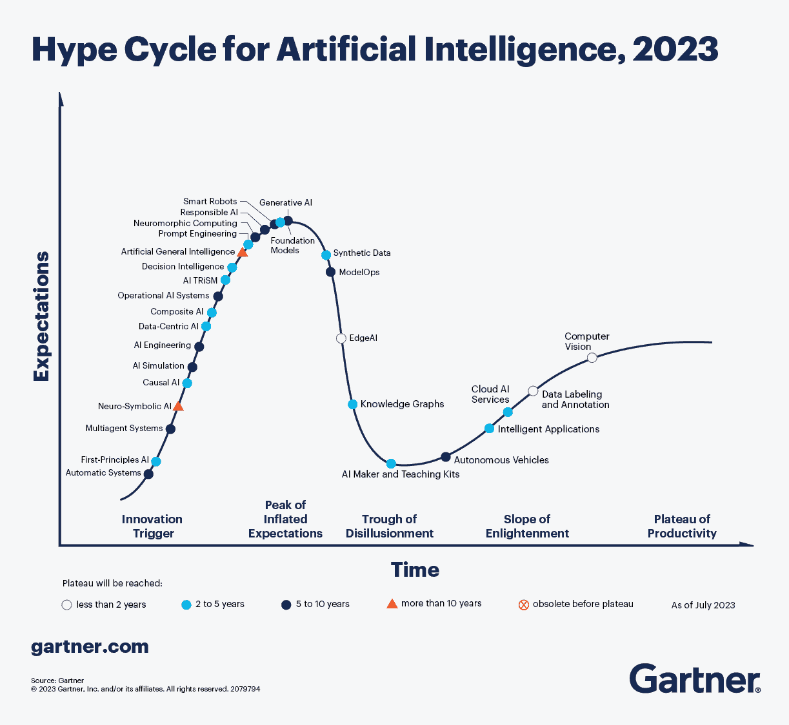

# 2023 年 Gartner Hype Cycle 对 AI 的评估

> 原文：[`www.kdnuggets.com/gartner-hype-cycle-for-ai-in-2023`](https://www.kdnuggets.com/gartner-hype-cycle-for-ai-in-2023)

作者提供的图像

我们都想知道技术的最新动态。有什么新东西，接下来会发生什么，我应该学习什么，公司们正在关注什么？

* * *

## 我们的三大推荐课程

 1\. [谷歌网络安全证书](https://www.kdnuggets.com/google-cybersecurity) - 快速进入网络安全职业生涯。

 2\. [谷歌数据分析专业证书](https://www.kdnuggets.com/google-data-analytics) - 提升你的数据分析技能

 3\. [谷歌 IT 支持专业证书](https://www.kdnuggets.com/google-itsupport) - 支持你所在的组织 IT 工作

* * *

你可以通过 2023 年 Gartner Hype Cycle 了解所有这些内容。Gartner Hype Cycle 为你提供技术和应用的图形表示，以及这些意味着实际业务问题和未来机会的内容。

2023 年 Gartner Hype Cycle™对人工智能（AI）的评估识别了当前为我们提供显著好处的创新和技术，同时考虑了相关风险。

你们中的许多人可能一直在想，现在技术会发生什么，特别是自从大型语言模型（LLMs）如 ChatGPT 兴起以来。生成式 AI 正在主导，我们都想了解更多！那么 Gartner Hype Cycle 告诉了我们什么？

首先，Gartner 建议生成式 AI 有两个方面：

+   生成式 AI 将推动的创新

+   推动生成式 AI 进步的创新

# 生成式 AI 推动的创新

生成式 AI 将改变很多事物，它将推动创新的一些领域包括：

+   人工通用智能

+   AI 工程

+   自主系统

+   云 AI 服务

+   复合 AI

+   计算机视觉

+   数据中心 AI

+   边缘 AI

+   智能应用程序

+   模型操作化

+   操作性 AI 系统

+   提示工程

+   智能机器人

+   合成数据

# 推动生成式 AI 进步的创新

那么哪些领域将推动生成式 AI 的进步？它们是：

+   AI 模拟

+   AI 信任、风险和安全管理（AI TRiSM）

+   因果 AI

+   数据标记和注释

+   原理性 AI（FPAI）

+   基础模型

+   知识图谱

+   多智能体系统（MAS）

+   神经符号 AI

+   负责任的 AI

想知道这些创新需要多长时间才能引发并达到高峰。请深入查看下面的 Gartner Hype Cycle 可视化图：

图片来源：[Gartner Hype Cycle](https://www.gartner.com/en/articles/what-s-new-in-artificial-intelligence-from-the-2023-gartner-hype-cycle)

# 总结一下

Gartner 为我们提供了一种全新的视角，了解生成型 AI 能为我们做什么以及它将如何塑造我们的未来。这些可视化图给出了对未来期望的估计时间框架。根据你在本文中学到的内容，你会提出挑战吗？在评论中告诉我们。

**[尼莎·阿里亚](https://www.linkedin.com/in/nisha-arya-ahmed/)** 是 KDnuggets 的数据科学家、自由技术写作人和社区经理。她特别关注提供数据科学职业建议或教程，以及围绕数据科学的理论知识。她还希望探索人工智能如何以及可能如何惠及人类寿命。作为一个热衷学习者，她寻求拓宽自己的技术知识和写作技能，同时帮助指导他人。

### 更多相关话题

+   [通过 DataOps.live 解锁 DataOps 成功——在 Gartner 中 featured…](https://www.kdnuggets.com/2023/07/dataopslive-unlock-dataops-success-featured-gartner-market-guide.html)

+   [通过 DataOps.live 解锁 DataOps 成功：在 Gartner 市场指南中 featured！](https://www.kdnuggets.com/2023/07/dataopslive-unlock-dataops-success-featured-gartner-market-guide-2.html)

+   [2023 年你应该了解的 10 个惊人的机器学习可视化](https://www.kdnuggets.com/2022/11/10-amazing-machine-learning-visualizations-know-2023.html)

+   [2023 年需要了解的顶级数据 Python 包](https://www.kdnuggets.com/2023/01/top-data-python-packages-know-2023.html)

+   [2023 年 Google 数据分析认证回顾](https://www.kdnuggets.com/2023/01/google-data-analytics-certification-review-2023.html)

+   [2023 年你必须阅读的 5 本免费数据科学书籍](https://www.kdnuggets.com/2023/01/5-free-data-science-books-must-read-2023.html)
