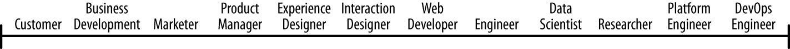
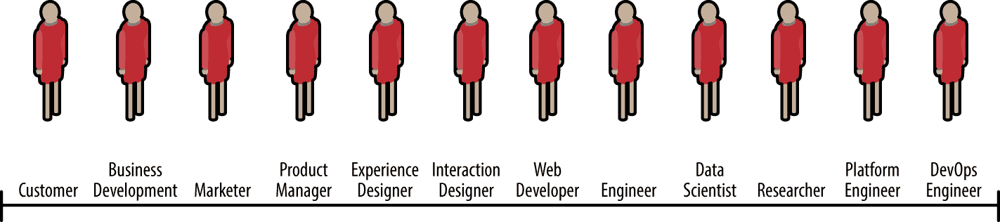
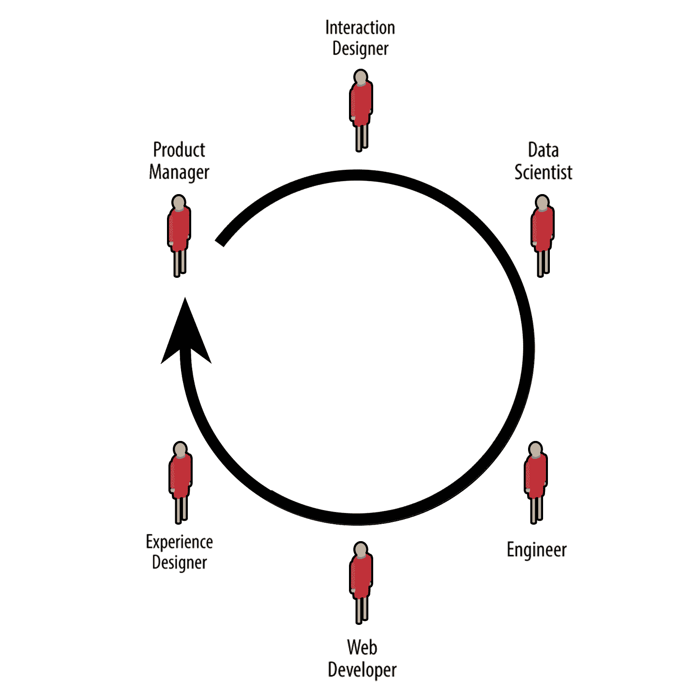
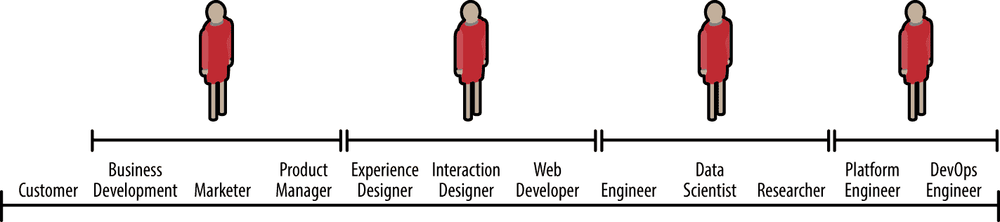

# 通才主导数据科学

> 原文：[`www.kdnuggets.com/2018/02/generalists-dominate-data-science.html`](https://www.kdnuggets.com/2018/02/generalists-dominate-data-science.html)

 评论

**作者：[拉塞尔·朱尔尼](https://www.linkedin.com/in/russelljurney/)**。

分析产品和系统最好由小型通才团队构建。大型专家团队容易受到[沟通开销](https://personalmba.com/communication-overhead/)的主导影响，且[“中文 whispers”](https://en.wikipedia.org/wiki/Chinese_whispers)的效果扭曲任务流程，阻碍创造力。数据科学家应发展通才技能，以成为数据科学团队中更高效的成员。

* * *

## 我们的前三大课程推荐

 1\. [谷歌网络安全证书](https://www.kdnuggets.com/google-cybersecurity) - 快速进入网络安全职业的捷径。

 2\. [谷歌数据分析专业证书](https://www.kdnuggets.com/google-data-analytics) - 提升你的数据分析技能

 3\. [谷歌 IT 支持专业证书](https://www.kdnuggets.com/google-itsupport) - 支持你所在组织的 IT

* * *

**数据科学：一项团队运动**

构建数据产品需要一个涵盖广泛且多样化技能的团队。从一端的客户代表，到另一端的运营工程师，产品分析团队的角色范围如下：

大公司通常会为每个角色配备一双鞋子，从而形成一个像下面这样的十二人团队。这个设置的问题在于，达成共识和执行跨角色的任务变得更加困难。而在数据科学中，大多数任务都涉及跨角色的合作。

**将图表添加到数据产品中**

以一个具体的例子来看，让我们关注将图表作为数据产品的一部分进行创建。首先，产品经理创建一个规格说明，然后交互设计师设计图表，交给数据科学家填充数据（并且希望能探索数据并找到值得制作的图表），接着由后端工程师设置一个 API 以获取这些数据，然后由前端网页开发人员使用这些数据创建一个与设计图相符的网页，最后由体验设计师确保整个过程感觉合理且有意义。

图表需要迭代，因此这种沟通循环可能会重复发生。你可以看到沟通开销如何开始占据主导地位。一个由六人组成的会议就是一个完整的正式会议。在正式会议中完成事情非常困难。

在下一个图示中，我们看到一个数据产品团队可能由四名通才组成：一名数据工程师、一名数据科学家/后端开发人员、一名可以构建前端的设计师和一名能编写营销文案及洽谈交易的产品经理。这就是一个创业团队如何覆盖技能谱的方式，你可以看到这如何使他们更高效。

回到图表示例，创建一个图表成为产品经理、一个会编码的设计师和一个数据科学家的合作。这是那种 2 到 3 人的临时会议，在这种会议中，“事情会高效完成”。这个小组将比六人小组更高效。换句话说：这个小团队将击败大型团队。

在大公司系统中，有时唯一高效完成任务的方式就是成为“游击通才”，与其他通才合作以省略中间环节。这在政治上是不利的，也正是这部分原因使得高效的人才离开大公司。

**结论**

我们已经证明，小型通才团队比大型专业团队表现更好。事实上，通才技能是每个数据科学家都应该努力发展的。这并不意味着你不能专注于某一领域，而是应将专业化与通才结合，以发展“[T 型技能](https://en.wikipedia.org/wiki/T-shaped_skills)”。T 型员工能够在多个项目中提供深度专业知识，同时在自己的角色中承担多重职责。

发展通才技能需要时间，这就是为什么成为数据科学家的道路不是六个月的训练营，而是十年的旅程。在这条道路上，记得努力成为 T 型人才！

**附录**

*需要帮助构建分析产品或平台吗？[数据综合症](http://datasyndrome.com/)团队由数据科学家和数据工程师组成，提供数据产品和系统的服务。我们还为数据科学团队的所有成员提供[敏捷数据科学培训](http://datasyndrome.com/training)。*

**简介： [拉塞尔·贾尼](https://www.linkedin.com/in/russelljurney/)** 是数据综合症的首席顾问，全栈数据产品黑客，以及数据科学团队领导。

[原文](https://blog.datasyndrome.com/generalists-dominate-data-science-f01882f25347)。经许可转载。

**相关**

+   [**5 个关键数据科学就业市场趋势**](https://www.kdnuggets.com/2018/01/5-data-science-job-market-trends.html)

+   [**如何让新聘的数据科学家轻松上手**](https://www.kdnuggets.com/2018/01/datatron-life-easy-newly-hired-data-scientist.html)

+   [**如何建立一个成功的高级分析部门**](https://www.kdnuggets.com/2018/01/build-successful-advanced-analytics-department.html)

### 更多相关话题

+   [停止学习数据科学来寻找目标，并通过寻找目标…](https://www.kdnuggets.com/2021/12/stop-learning-data-science-find-purpose.html)

+   [数据科学基础：你需要知道的 10 个必备技能](https://www.kdnuggets.com/2020/10/data-science-minimum-10-essential-skills.html)

+   [KDnuggets™ 新闻 22:n06，2 月 9 日：数据科学编程…](https://www.kdnuggets.com/2022/n06.html)

+   [数据科学定义幽默：一系列古怪的引用……](https://www.kdnuggets.com/2022/02/data-science-definition-humor.html)

+   [5 个数据科学项目，学习 5 个关键的数据科学技能](https://www.kdnuggets.com/2022/03/5-data-science-projects-learn-5-critical-data-science-skills.html)

+   [KDnuggets 新闻，11 月 30 日：什么是切比雪夫定理以及它是如何…](https://www.kdnuggets.com/2022/n46.html)
