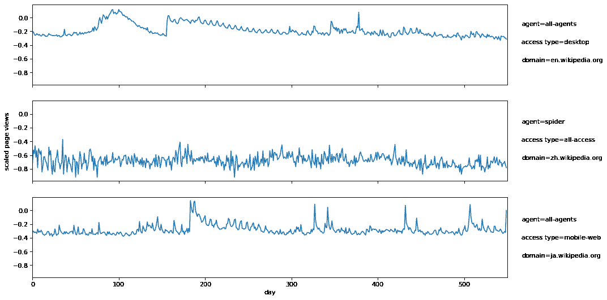
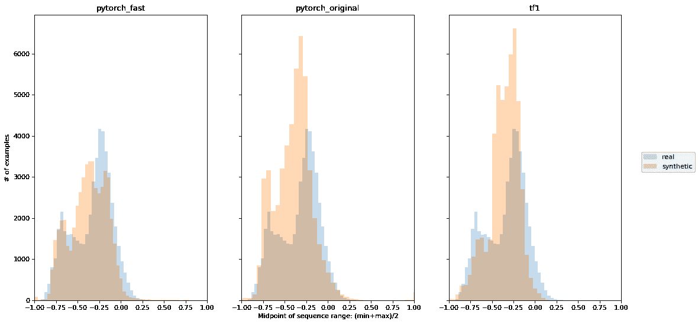
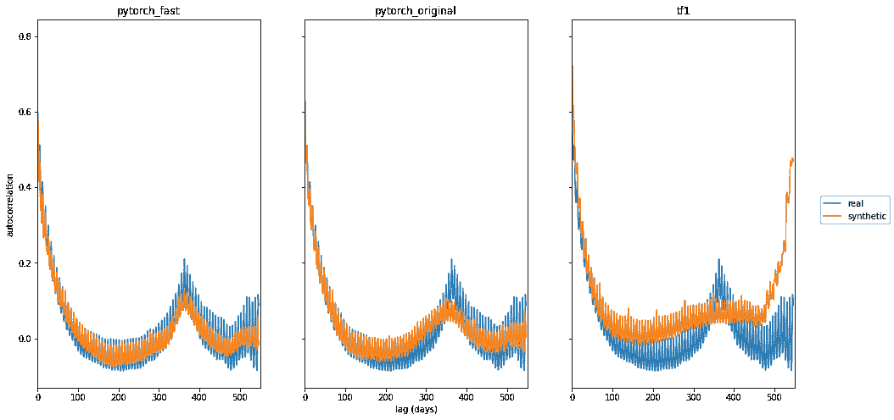

# 使用开源工具生成合成时间序列数据

> 原文：[`www.kdnuggets.com/2022/06/generate-synthetic-timeseries-data-opensource-tools.html`](https://www.kdnuggets.com/2022/06/generate-synthetic-timeseries-data-opensource-tools.html)


# 介绍

* * *

## 我们的前三个课程推荐

 1\. [谷歌网络安全证书](https://www.kdnuggets.com/google-cybersecurity) - 快速进入网络安全职业生涯。

 2\. [谷歌数据分析专业证书](https://www.kdnuggets.com/google-data-analytics) - 提升您的数据分析技能

 3\. [谷歌 IT 支持专业证书](https://www.kdnuggets.com/google-itsupport) - 支持您的组织 IT 工作

* * *

时间序列数据，即在多个时间点对相同变量的测量序列，在现代数据世界中无处不在。就像表格数据一样，我们经常希望生成合成时间序列数据以保护敏感信息或在真实数据稀缺时创建更多训练数据。一些合成时间序列数据的应用包括传感器读数、时间戳日志消息、金融市场价格和医疗记录。时间维度的额外要求，其中趋势和时间间的相关性与变量之间的相关性同样重要，为合成数据带来了额外的挑战。

在 Gretel，我们之前发布了关于合成时间序列数据的博客（[金融数据](https://gretel.ai/blog/creating-synthetic-time-series-data-for-global-financial-institutions-a-poc-deep-diveQ)、[时间序列基础](https://gretel.ai/blog/creating-synthetic-time-series-data)），但我们始终在寻找可以改进合成数据生成的新模型。我们非常喜欢 DoppelGANger 模型及其相关论文（[使用 GAN 共享网络时间序列数据：挑战、初步承诺和开放问题](https://arxiv.org/abs/1909.13403) 由 Lin 等人撰写），并正在将该模型集成到我们的[API](https://gretel.ai/products)和[控制台](https://console.gretel.cloud/)中。作为这项工作的一个部分，我们在 PyTorch 中重新实现了 DoppelGANger 模型，并非常高兴将其作为我们开源[gretel-synthetics](https://github.com/gretelai/gretel-synthetics)库的一部分发布。

在本文中，我们简要概述了 DoppelGANger 模型，提供了我们 PyTorch 实现的示例用法，并展示了在合成每日维基百科网页流量任务中的优异合成数据质量，与 TensorFlow 1 实现相比，运行速度提升了约 40 倍。

# DoppelGANger 模型

DoppelGANger 基于生成对抗网络 ([GAN](https://developers.google.com/machine-learning/gan))，并进行了些许修改以更好地适应时间序列生成任务。作为 GAN，该模型使用对抗训练方案，通过比较合成数据和真实数据，来同时优化鉴别器（或评论员）和生成器网络。一旦训练完成，可以通过将输入噪声传递给生成器网络来生成任意数量的合成时间序列数据。

在他们的[论文](https://arxiv.org/abs/1909.13403)中，Lin 等人回顾了现有的合成时间序列方法及其观察结果，以识别局限性并提出了几个特定的改进，这些改进构成了 DoppelGANger。这些改进范围从通用 GAN 改进到时间序列特定技巧。以下列出了其中的一些关键修改：

+   生成器包含一个[LSTM](https://colah.github.io/posts/2015-08-Understanding-LSTMs/)来生成序列数据，但采用批处理设置，每个 LSTM 单元输出多个时间点，以改善时间相关性。

+   支持训练和生成中的可变长度序列（计划中，但在我们的 PyTorch 版本中尚未实现）。例如，一个模型可以使用和生成 10 或 15 秒的传感器测量数据。

+   支持不随时间变化的固定变量（属性）。这些信息通常在时间序列数据中找到，例如与金融价格历史数据中每个股票相关的行业或部门。

+   支持对连续变量的每个示例进行缩放，以处理具有大动态范围的数据。例如，流行与稀有维基百科页面的页面浏览量差异可以达到几个数量级。

+   使用[带梯度惩罚的 Wasserstein 损失](https://jonathan-hui.medium.com/gan-wasserstein-gan-wgan-gp-6a1a2aa1b490)以减少模式崩溃并改善训练。

关于术语和数据设置的小说明。DoppelGANger 需要包含多个时间序列示例的训练数据。每个**示例**由 0 个或多个**属性**值、在时间上不变的固定变量和 1 个或多个在每个时间点观察到的**特征**组成。组合成训练数据集时，这些示例看起来像一个 2d 数组的属性（示例 x 固定变量）和一个 3d 数组的特征（示例 x 时间 x 时间变量）。根据任务和可用数据，此设置可能需要将几个较长的时间序列拆分成较短的块，以用作训练的示例。

总体而言，这些对基本 GAN 的修改提供了一个表达力强的时间序列模型，能够生成高保真度的合成数据。我们特别印象深刻的是 DoppelGANger 在不同尺度下学习和生成具有时间相关性的数据的能力，例如每周和每年的趋势。有关模型的详细信息，请阅读 Lin 等人撰写的出色[论文](https://arxiv.org/abs/1909.13403)。

# 示例用法

我们的 PyTorch 实现支持两种输入风格（numpy 数组或 pandas DataFrame）以及模型的多种配置选项。有关完整的参考文档，请参见[`synthetics.docs.gretel.ai/`](https://synthetics.docs.gretel.ai/en/latest/models/timeseries_dgan.html)

使用我们的模型的最简单方法是将训练数据放在 pandas DataFrame 中。对于这种设置，数据必须是“宽格式”，其中每行是一个示例，一些列可能是属性，其余列是时间序列值。以下代码片段演示了如何从 DataFrame 进行训练和生成数据。

```py
# Create some random training data

df = pd.DataFrame(np.random.random(size=(1000,30)))

df.columns = pd.date_range("2022-01-01", periods=30)

# Include an attribute column

df["attribute"] = np.random.randint(0, 3, size=1000)
# Train the model

model = DGAN(DGANConfig(

   max_sequence_len=30,

   sample_len=3,

   batch_size=1000,

   epochs=10,  # For real data sets, 100-1000 epochs is typical

))
model.train_dataframe(

   df,

   df_attribute_columns=["attribute"],

   attribute_types=[OutputType.DISCRETE],

)
# Generate synthetic data

synthetic_df = model.generate_dataframe(100)
```

如果你的数据还不是这种“宽格式”，你可以使用[pandas pivot](https://pandas.pydata.org/docs/reference/api/pandas.DataFrame.pivot.html)方法将其转换为预期的结构。目前，DataFrame 输入在某些方面有些限制，但我们计划在未来支持其他接受时间序列数据的方式。为了获得最大控制和灵活性，你也可以直接传递 numpy 数组进行训练（类似地，在生成数据时接收属性和特征数组），如下所示。

```py
# Create some random training data

attributes = np.random.randint(0, 3, size=(1000,3))

features = np.random.random(size=(1000,20,2))
# Train the model

model = DGAN(DGANConfig(

   max_sequence_len=20,

   sample_len=4,

   batch_size=1000,

   epochs=10,  # For real data sets, 100-1000 epochs is typical

))
model.train_numpy(

   attributes, features,

   attribute_types = [OutputType.DISCRETE] * 3,

   feature_types = [OutputType.CONTINUOUS] * 2

)
# Generate synthetic data

synthetic_attributes, synthetic_features = model.generate_numpy(1000)
```

这些代码片段的可运行版本可在[sample_usage.ipynb](https://github.com/gretelai/public_research/blob/main/oss_doppelganger/sample_usage.ipynb)中找到。

# 结果

作为一种从 TensorFlow 1 转到 PyTorch 的新实现（其中可能存在底层组件如优化器、参数初始化等的差异），我们希望确认我们的 PyTorch 代码按预期工作。为此，我们复制了原始论文中的一部分结果。由于我们当前的实现仅支持固定长度的序列，因此我们专注于维基百科网页流量（WWT）数据集。

WWT 数据集由 Lin 等人使用，最初来自[Kaggle](https://www.kaggle.com/competitions/web-traffic-time-series-forecasting/)，包含各种维基百科页面的每日流量测量。每个页面有 3 个离散属性（域名、访问类型和代理），以及一个持续 1.5 年（550 天）的每日页面浏览量时间序列特征。请参见图 1 了解 WWT 数据集中的一些示例时间序列。



图 1：3 个维基百科页面的缩放每日页面浏览量，页面属性列在右侧。

请注意，页面浏览量已基于整个数据集的最小/最大页面浏览量进行[-1,1]对数缩放。我们在实验中使用的 50k 页面训练数据（已缩放）可以作为[csv 文件在 S3 上](https://gretel-public-website.s3.us-west-2.amazonaws.com/datasets/wiki-web-traffic-data/wikipedia-web-traffic-training.csv)获得。

我们展示了 3 张图像，展示了合成数据的不同方面的保真度。在每张图像中，我们将真实数据与 3 个合成版本进行比较：1) 使用更大批量和更小学习率的快速 PyTorch 实现，2) 使用原始参数的 PyTorch 实现，3) TensorFlow 1 实现。在图像 2 中，我们查看了属性分布，其中合成数据与真实分布的匹配度较高（参考 [Lin et. al.](https://arxiv.org/abs/1909.13403) 的附录中的图 19）。


图像 2：实际和合成的 WWT 数据的属性分布。

WWT 数据的挑战之一是不同的时间序列具有非常不同的页面视图范围。有些维基百科页面始终接收大量流量，而其他页面则不那么受欢迎，但偶尔由于一些相关的时事，例如与页面相关的突发新闻，会出现流量激增。Lin 等人发现 DoppelGANger 在生成不同规模的时间序列方面非常有效（原始论文的图 6）。在图像 3 中，我们提供了类似的图表，显示时间序列中点的分布。每个示例中的中点是 550 天内获得的最小和最大页面视图之间的一半。我们的 PyTorch 实现显示了类似的中点保真度。



图像 3：实际和合成的 WWT 数据的时间序列中点分布。

最后，大多数维基百科页面的流量展示了每周和每年的模式。为了评估这些模式，我们使用自相关，即不同时间滞后的页面视图的皮尔逊相关性（1 天、2 天等）。3 个合成版本的自相关图显示在图像 4 中（类似于原始论文的图 1）。



图像 4：实际和合成的 WWT 数据的自相关。

两个 PyTorch 版本生成了与原始论文中观察到的每周和每年趋势一致的结果。TensorFlow 1 的结果并不完全匹配 Lin 等人的图 1，因为上述图表来自我们的实验。我们观察到使用原始参数进行训练时，模型偶尔无法捕捉到每年（甚至每周）的模式。我们快速版本中使用的较低学习率（1e-4）和较大批量（1000）使得重新训练更为一致。

生成本节图像以及训练 3 个模型的分析代码以笔记本形式共享在 [github](https://github.com/gretelai/public_research/tree/main/oss_doppelganger)。

# 运行时

最后但同样重要的是，更复杂模型的一个关键方面是运行时间。一个需要几周才能训练的惊人模型在实践中比一个只需一小时训练的模型更受限。在这里，PyTorch 实现的表现极其出色（尽管正如作者在他们的论文中提到的，他们没有对 TensorFlow 1 代码进行性能优化）。所有模型都使用 GPU 进行训练，并在 GCP n1-standard-8 实例（8 个虚拟 CPU，30 GB 内存）上运行，配备 NVIDIA Tesla T4。将训练时间从 13 小时缩短到 0.3 小时对于使这个令人印象深刻的模型在实践中更具实用性至关重要！

| **版本** | **训练时间** |
| --- | --- |
| TensorFlow 1  | 12.9 小时 |
| PyTorch, batch_size=100（原始参数） | 1.6 小时 |
| PyTorch, batch_size=1000 | 0.3 小时 |

# 结论

Gretel.ai 已经在我们的开源 gretel-synthetics 库中添加了 DoppelGANger 时间序列模型的 PyTorch 实现。我们展示了这一实现能够生成高质量的合成数据，并且速度比之前的 TensorFlow 1 实现快了大约 ~40 倍。**如果你喜欢这篇文章，请在我们的** [**gretel-synthetics GitHub**](https://github.com/gretelai/gretel-synthetics) **上留下一个 ⭐，如果你有任何问题，请在我们的** [**Slack**](https://gretel.ai/slackinvite) **上告诉我们！** 请关注更多关于时间序列的博客，我们会将 DoppelGANger 融入我们的 API 并添加更多功能，比如支持可变长度的序列。

# 致谢

感谢优秀 DoppelGANger 论文的作者：[使用 GAN 共享网络时间序列数据：挑战、初步前景和开放问题](http://arxiv.org/abs/1909.13403) 由 Zinan Lin, Alankar Jain, Chen Wang, Giulia Fanti, Vyas Sekar 合著。我们特别感谢 Zinan Lin 对论文和 TensorFlow 1 代码问题的回答。

**[Kendrick Boyd](https://www.linkedin.com/in/kendrickboyd/)** 是 [Gretel.ai](http://gretel.ai/) 的首席机器学习工程师。

### 更多相关主题

+   [如何生成合成表格数据集](https://www.kdnuggets.com/2022/03/generate-tabular-synthetic-dataset.html)

+   [结合数据管理和数据讲述以创造价值](https://www.kdnuggets.com/combining-data-management-and-data-storytelling-to-generate-value)

+   [高保真合成数据适用于数据工程师和数据科学家](https://www.kdnuggets.com/2022/tonic-high-fidelity-synthetic-data-engineers-scientists-alike.html)

+   [如何利用合成数据克服机器学习模型训练中的数据短缺](https://www.kdnuggets.com/2022/03/synthetic-data-overcome-data-shortages-machine-learning-model-training.html)

+   [如何通过 AI 生成的合成数据民主化 AI/ML 和数据科学](https://www.kdnuggets.com/2022/11/mostly-ai-democratize-aiml-data-science-aigenerated-synthetic-data.html)

+   [合成数据平台：解锁生成式 AI 的力量以处理结构化数据](https://www.kdnuggets.com/2023/07/synthetic-data-platforms-unlocking-power-generative-ai-structured-data.html)
