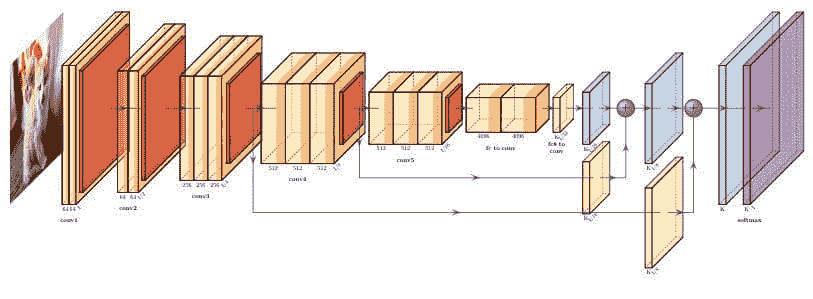

# 生成美丽的神经网络可视化

> 原文：[`www.kdnuggets.com/2020/12/generating-beautiful-neural-network-visualizations.html`](https://www.kdnuggets.com/2020/12/generating-beautiful-neural-network-visualizations.html)

评论

您是否为论文构建了神经网络，或需要通过技术报告或其他媒介与他人分享其架构？

Python 库 **[PlotNeuralNet](https://github.com/HarisIqbal88/PlotNeuralNet)** 由 [Haris Iqbal](https://github.com/HarisIqbal88) 提供，帮助通过生成 LaTeX 代码来绘制神经网络，从而解决这个问题。

* * *

## 我们的前三个课程推荐

 1\. [谷歌网络安全证书](https://www.kdnuggets.com/google-cybersecurity) - 快速进入网络安全职业的快车道。

 2\. [谷歌数据分析专业证书](https://www.kdnuggets.com/google-data-analytics) - 提升您的数据分析技能

 3\. [谷歌 IT 支持专业证书](https://www.kdnuggets.com/google-itsupport) - 支持您的组织的 IT

* * *

PlotNeuralNet 不能直接从现有的架构代码中工作。相反，您需要单独并明确地定义网络代码，以便程序能够使用它来输出其图示。这使得 PlotNeuralNet 库不依赖于特定架构，但也意味着您需要进行额外的手动工作。

这是由 Python 脚本生成的 LaTeX 渲染结果的示例图像（明白了吗？）：



PlotNeuralNet 生成的样本卷积神经网络架构（来自库的 [Github 页面](https://github.com/HarisIqbal88/PlotNeuralNet)）

架构定义是通过一个包含函数调用的 Python 列表完成的，如项目 Github 上的示例所示：

```py
# Define your neural network architecture here
arch = [
    to_head( '..' ),
    to_cor(),
    to_begin(),
    to_Conv("conv1", 512, 64, offset="(0,0,0)", to="(0,0,0)", height=64, depth=64, width=2),
    to_Pool("pool1", offset="(0,0,0)", to="(conv1-east)"),
    to_Conv("conv2", 128, 64, offset="(1,0,0)", to="(pool1-east)", height=32, depth=32, width=2),
    to_connection( "pool1", "conv2"),
    to_Pool("pool2", offset="(0,0,0)", to="(conv2-east)", height=28, depth=28, width=1),
    to_SoftMax("soft1", 10 ,"(3,0,0)", "(pool1-east)", caption="SOFT"),
    to_connection("pool2", "soft1"),
    to_end()
    ]
```

生成可视化所需的完整 Python 脚本仅略多于上述架构定义：

```py
import sys
sys.path.append('../')
from pycore.tikzeng import *

# Define your neural network architecture here
...

def main():
    namefile = str(sys.argv[0]).split('.')[0]
    to_generate(arch, namefile + '.tex' )

if __name__ == '__main__':
    main()
```

一旦您安装了 [先决条件](http://bash ../tikzmake.sh my_arch)，并保存了上述架构脚本，剩下的就是执行控制 bash 脚本：

```py
bash ../tikzmake.sh your_script_name
```

这是从 PlotNeuralNet 架构定义（如上述）生成的 LaTeX 的示例摘录：

```py
%%%%%%%%%%%%%%%%%%%%%%%%%%%%%%%%%%%%%%%%%%%%%%%%%%%%%%%%%%%%%%%%%%%%%%%%%%%%%%%%%%%%%%%%
%% Draw Layer Blocks
%%%%%%%%%%%%%%%%%%%%%%%%%%%%%%%%%%%%%%%%%%%%%%%%%%%%%%%%%%%%%%%%%%%%%%%%%%%%%%%%%%%%%%%%
\node[canvas is zy plane at x=0] (temp) at (-3,0,0) {\includegraphics[width=8cm,height=8cm]{cats.jpg}};
% conv1_1,conv1_2,%pool1
\pic[shift={(0,0,0)}] at (0,0,0) {RightBandedBox={name=cr1,caption=conv1,%
        xlabel={{"64","64"}},zlabel=I,fill=\ConvColor,bandfill=\ConvReluColor,%
        height=40,width={2,2},depth=40}};
\pic[shift={(0,0,0)}] at (cr1-east) {Box={name=p1,%
        fill=\PoolColor,opacity=0.5,height=35,width=1,depth=35}};
% conv2_1,conv2_2,pool2
\pic[shift={(2,0,0)}] at (p1-east) {RightBandedBox={name=cr2,caption=conv2,%
        xlabel={{"64","64"}},zlabel=I/2,fill=\ConvColor,bandfill=\ConvReluColor,%
        height=35,width={3,3},depth=35}};
\pic[shift={(0,0,0)}] at (cr2-east) {Box={name=p2,%
        fill=\PoolColor,opacity=0.5,height=30,width=1,depth=30}};
```

如果您不需要这些图片用于 LaTeX 文档的发布，但仍希望使用它们怎么办？很简单；只需使用像 Overleaf 这样的基于云的 LaTeX 编辑器生成图片，然后将其保存到计算机上。现在可以在您的博客帖子或其他任何需要的地方使用它。

**相关**：

+   如何在深度学习中创建自定义实时图

+   在 Tableau 中创建强大的动画可视化

+   用 Python 可视化决策树（Scikit-learn、Graphviz、Matplotlib）

### 更多相关主题

+   [使用 Pandas 轻松制作美丽的互动可视化](https://www.kdnuggets.com/2021/12/easiest-way-make-beautiful-interactive-visualizations-pandas.html)

+   [成为优秀数据科学家所需的 5 项关键技能](https://www.kdnuggets.com/2021/12/5-key-skills-needed-become-great-data-scientist.html)

+   [每个初学者数据科学家应掌握的 6 种预测模型](https://www.kdnuggets.com/2021/12/6-predictive-models-every-beginner-data-scientist-master.html)

+   [2021 年最佳 ETL 工具](https://www.kdnuggets.com/2021/12/mozart-best-etl-tools-2021.html)

+   [停止学习数据科学以寻找目标，并通过找到目标来…](https://www.kdnuggets.com/2021/12/stop-learning-data-science-find-purpose.html)

+   [一个 90 亿美元的 AI 失败案例分析](https://www.kdnuggets.com/2021/12/9b-ai-failure-examined.html)
