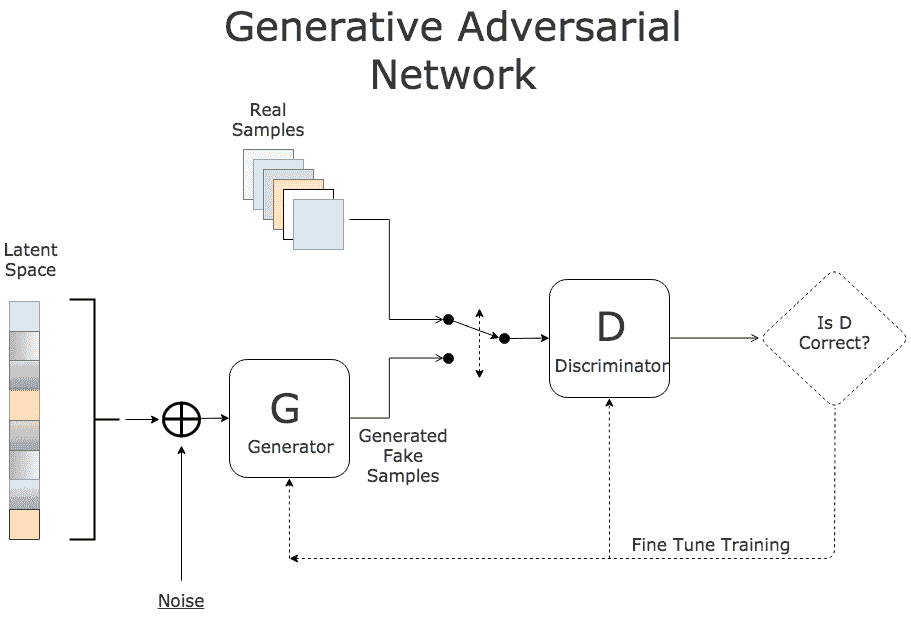

# 生成对抗网络 – 机器学习的热门话题

> 原文：[`www.kdnuggets.com/2017/01/generative-adversarial-networks-hot-topic-machine-learning.html`](https://www.kdnuggets.com/2017/01/generative-adversarial-networks-hot-topic-machine-learning.html)

**作者：Al Gharakhanian。**

NIPS2016（神经信息处理系统）是一个年度盛会，吸引了来自学术界和工业界的机器学习领域的顶尖人才。我上周第一次参加了这个活动，被演讲的数量和多样性震撼了。一个不寻常的观察是，大量展位是寻求机器学习人才的对冲基金。

有些论文高度抽象和理论化，而另一些则来自于如 Google 和 Facebook 等公司的务实研究。这些话题范围广泛，但有两个话题脱颖而出，吸引了大量关注。

第一个是“生成对抗网络”（简称 GANs），第二个是“强化学习”（简称 RL）。我的计划是这篇文章覆盖 GANs，希望未来的文章能同样介绍 RL。

GAN 是一种相对较新的神经网络机器学习架构，由 Ian Goodfellow 和他在蒙特利尔大学的同事们于 2014 年开创。为了全面理解 GANs，必须了解监督学习和无监督学习机器之间的区别。监督学习机器基于大量的“标记”样本进行训练和测试。换句话说，它们需要包含“特征”或“预测因子”以及相应标签的大型数据集。例如，一个监督图像分类引擎需要一组带有正确标签的图像（例如，汽车、花朵、桌子等）。无监督学习者没有这种奢侈条件，它们在实际操作中学习，从错误中吸取教训，力求不再犯类似的错误。

监督学习的缺点是需要大量的标记数据。标记大量样本既昂贵又耗时。无监督学习则没有这一缺点，但通常准确性较低。自然地，有强烈的动机去改进无监督机器，并减少对监督学习的依赖。你可以将 GANs 和 RLs 视为改进无监督机器（神经网络）的手段。

第二个值得记住的有用概念是“生成模型”。这些模型通过生成给定一系列输入样本的最可能结果来进行预测。例如，生成模型可以基于之前的帧生成下一个最可能的视频帧。另一个例子是搜索引擎在用户输入之前尝试预测下一个最可能的词。

牢记这两个概念，我们现在可以探讨 GAN。你可以将 GAN 视为一种新的无监督神经网络架构，相比传统网络能够实现更好的性能。更准确地说，GAN 是一种训练神经网络的新方式。GAN 包含两个独立的网络，它们各自工作并充当对手（见下图）。第一个神经网络称为**判别器**（D），它是需要接受训练的网络。D 是分类器，在训练完成后在正常操作过程中将承担繁重的任务。第二个网络称为**生成器**（G），其任务是生成随机样本，这些样本与真实样本相似，但带有一些变动，使其成为假样本。

例如，考虑一个设计用于识别各种动物图像的图像分类器 D。现在考虑一个对手（G），其任务是通过精心制作的图像来欺骗 D，这些图像看起来几乎正确但又不完全对。这是通过从训练集（潜在空间）中随机挑选一个合法样本，并通过随机改变其特征（添加随机噪声）来合成新图像。例如，G 可以获取一只猫的图像，并在图像上添加一个额外的眼睛，将其转换为假样本。结果是一个非常类似正常猫的图像，唯一的区别是眼睛的数量。

在训练过程中，D 会收到来自训练数据的真实图像与 G 生成的假图像的随机混合。其任务是识别正确和假输入。根据结果，两个网络都尝试微调它们的参数，变得更出色。如果 D 做出正确的预测，G 会更新其参数，以生成更好的假样本来欺骗 D。如果 D 的预测不正确，它会试图从错误中学习，以避免未来类似的错误。网络 D 的奖励是正确预测的数量，G 的奖励是 D 的错误数量。这个过程持续进行，直到达到平衡，D 的训练得到优化。

早期 GAN 的一个弱点是稳定性，但我们已经看到了一些非常有前景的工作可以缓解这个问题（详细信息超出了本文的范围）。从某种程度上来说，GAN 就像是一个拥有两个对立政党的国家的政治环境。每个党派不断尝试改善自己的弱点，同时试图发现和利用对方的漏洞，以推动自己的议程。随着时间的推移，两党都成为了更好的操作员。

至于 RL 和 GAN 对半导体的影响，这两种新架构需要显著更多的门、更高的 CPU 周期和更多的内存。这没什么好抱怨的。

[原文](https://www.linkedin.com/pulse/gans-one-hottest-topics-machine-learning-al-gharakhanian?trk=pulse_spock-articles)。经许可转载。

**简介：** [****Al Gharakhanian**](https://www.linkedin.com/in/algharakhanian) 是一位全面发展的高管，拥有在半导体、机器学习和数据科学领域的产品营销、销售和业务发展方面的丰富经验。

**相关：**

+   深度学习研究综述：生成对抗网络

+   深度神经网络是否具备创造力？

+   深度学习最新动态：8 月更新，第二部分

* * *

## 我们的 3 大课程推荐

 1\. [Google 网络安全证书](https://www.kdnuggets.com/google-cybersecurity) - 快速进入网络安全职业生涯。

 2\. [Google 数据分析专业证书](https://www.kdnuggets.com/google-data-analytics) - 提升你的数据分析技能

 3\. [Google IT 支持专业证书](https://www.kdnuggets.com/google-itsupport) - 支持你的组织 IT 需求

* * *

### 更多相关内容

+   [主题建模方法：Top2Vec 与 BERTopic](https://www.kdnuggets.com/2023/01/topic-modeling-approaches-top2vec-bertopic.html)

+   [Pandas：如何进行独热编码](https://www.kdnuggets.com/2023/07/pandas-onehot-encode-data.html)

+   [深入了解 Kaggle 的 AI 报告 2023 – 了解最新热点](https://www.kdnuggets.com/dive-into-the-future-with-kaggle-ai-report-2023-see-what-hot)

+   [什么是对抗性机器学习？](https://www.kdnuggets.com/2022/03/adversarial-machine-learning.html)

+   [25 门免费课程，掌握数据科学、数据工程、机器学习……](https://www.kdnuggets.com/25-free-courses-to-master-data-science-data-engineering-machine-learning-mlops-and-generative-ai)

+   [神经网络与深度学习：教科书（第二版）](https://www.kdnuggets.com/2023/07/aggarwal-neural-networks-deep-learning-textbook-2nd-edition.html)
