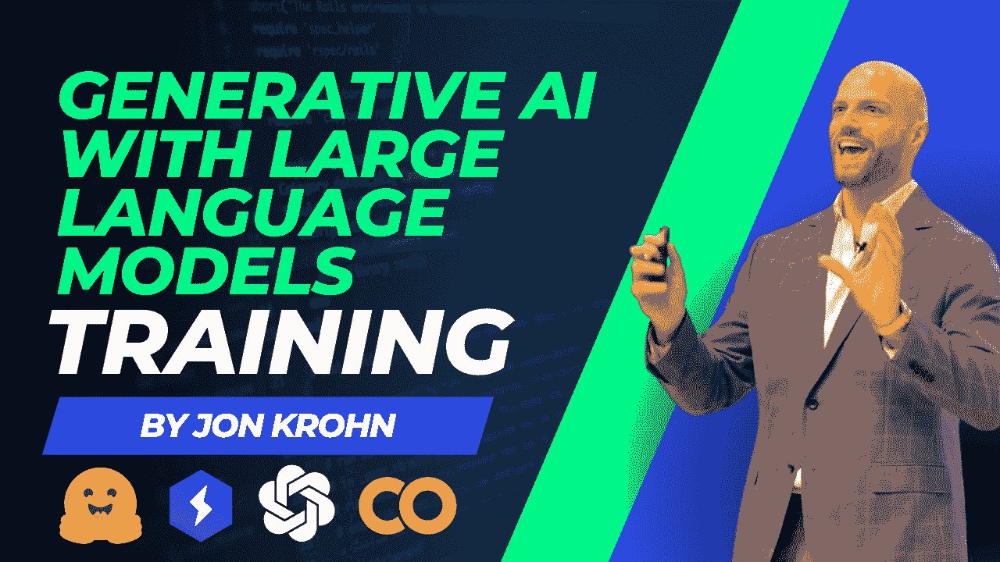
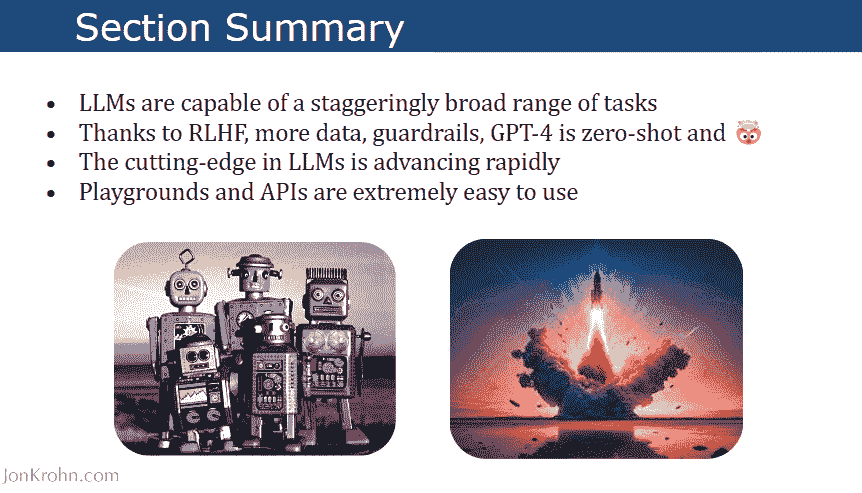
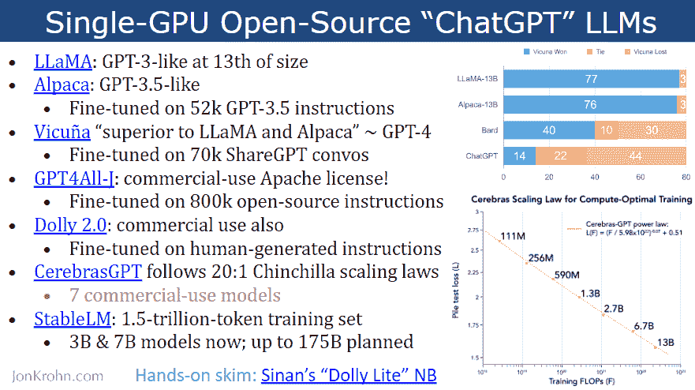

# 大语言模型的生成性 AI：实践培训

> 原文：[`www.kdnuggets.com/2023/07/generative-ai-large-language-models-handson-training.html`](https://www.kdnuggets.com/2023/07/generative-ai-large-language-models-handson-training.html)

作者提供的图片

# 介绍

大型语言模型（LLMs）如 GPT-4 正在迅速改变世界和数据科学领域。在过去几年中，一度看似科幻的能力现在通过 LLMs 变成了现实。

[大语言模型的生成性 AI：实践培训](https://www.youtube.com/watch?v=Ku9PM26Cc2c)将向你介绍推动这一革命的深度学习突破，重点关注变换器架构。更重要的是，你将直接体验最新 LLMs 如 GPT-4 所能提供的惊人能力。

你将学习 LLMs 如何从根本上改变机器学习模型的开发和商业成功的数据产品。你将亲眼看到它们如何加速数据科学家的创造能力，同时推动他们成为成熟的数据产品经理。

通过利用 Hugging Face 和 PyTorch Lightning 的实际代码演示，本培训将涵盖处理 LLMs 的完整生命周期。从高效的训练技巧到在生产中优化部署，你将学习到直接适用的技能，释放 LLMs 的潜力。

在这场充满活力的会议结束时，你将对 LLMs 有基础性的理解，并获得利用 GPT-4 的实践经验。

训练中的图片

# 训练大纲

该培训有 4 个简短模块，介绍你大型语言模型，并教你如何训练自己的大型语言模型并将其部署到服务器。除此之外，你还将了解 LLMs 带来的商业价值。

## 1\. 大型语言模型（LLMs）简介

+   自然语言处理的简要历史

+   变换器

+   子词标记化

+   自回归模型与自编码模型

+   ELMo, BERT 和 T5

+   GPT（生成预训练变换器）家族

+   LLM 应用领域

## 2\. LLM 能力的广度

+   LLM 实验室

+   GPT 家族的惊人进展

+   GPT-4 的关键更新

+   调用 OpenAI API，包括 GPT-4

## 3\. 训练和部署 LLMs

+   硬件加速（CPU、GPU、TPU、IPU、AWS 芯片）

+   Hugging Face 变换器库

+   高效 LLM 训练的最佳实践

+   低秩适应（LoRA）的参数高效微调（PEFT）

+   开源预训练 LLMs

+   使用 PyTorch Lightning 进行 LLM 训练

+   多 GPU 训练

+   LLM 部署注意事项

+   监控生产中的 LLMs

## 4\. 从 LLMs 中获取商业价值

+   用 LLMs 支持机器学习

+   可以自动化的任务

+   可增强的任务

+   成功的人工智能团队和项目的最佳实践

+   下一步是什么？人工智能

# 资源

该培训包括指向外部资源的链接，如源代码、演示文稿幻灯片和 Google Colab 笔记本。这些资源使培训具有互动性，并对将生成性 AI 应用于工作空间的工程师和数据科学家非常有用。

培训中的图片

**以下是使用 Huggingface 和 Pytorch Lighting 构建和部署自己的 LLM 模型所需的重要资源列表：**

+   [演示文稿幻灯片](https://docs.google.com/presentation/d/1DAg0CVyCSayPyjVNeSyZWMMbTlDmnscw2svib9e0QP8/edit#slide=id.g23a3c012aba_0_15)

+   [GitHub 代码源](https://github.com/jonkrohn/NLP-with-LLMs)

+   [Google Colab (T5-微调)](https://colab.research.google.com/github/jonkrohn/NLP-with-LLMs/blob/main/code/Finetune-T5-on-GPU.ipynb)

+   [Youtube 视频](https://www.youtube.com/watch?v=Ku9PM26Cc2c)

+   [Jon Krohn (官方网站)](https://www.jonkrohn.com/)

> 仅需 2 小时即可发现成功的秘诀！不要再等了！

**[Abid Ali Awan](https://www.polywork.com/kingabzpro)** ([@1abidaliawan](https://twitter.com/1abidaliawan)) 是一名认证的数据科学专业人士，喜欢构建机器学习模型。目前，他专注于内容创作，并撰写关于机器学习和数据科学技术的技术博客。Abid 拥有技术管理硕士学位和电信工程学士学位。他的愿景是使用图神经网络为面临心理问题的学生开发一个 AI 产品。

### 更多相关主题

+   [顶级开源大型语言模型](https://www.kdnuggets.com/2022/09/john-snow-top-open-source-large-language-models.html)

+   [更多关于大型语言模型的免费课程](https://www.kdnuggets.com/2023/06/free-courses-large-language-models.html)

+   [了解大型语言模型](https://www.kdnuggets.com/2023/03/learn-large-language-models.html)

+   [介绍 John Snow Labs 的医疗特定大型语言模型](https://www.kdnuggets.com/2023/04/john-snow-introducing-healthcare-specific-large-language-models-john-snow-labs.html)

+   [什么是大型语言模型及其如何工作？](https://www.kdnuggets.com/2023/05/large-language-models-work.html)

+   [AI: 大型语言和视觉模型](https://www.kdnuggets.com/2023/06/ai-large-language-visual-models.html)
