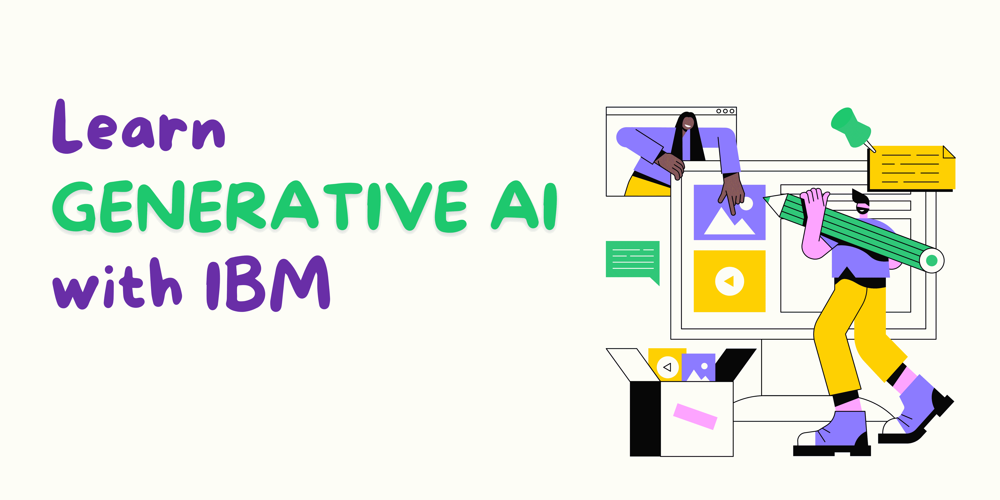

# IBM 为每个职业提供的生成式 AI 专业课程

> 原文：[`www.kdnuggets.com/generative-ai-specialisation-courses-from-ibm-for-every-profession`](https://www.kdnuggets.com/generative-ai-specialisation-courses-from-ibm-for-every-profession)

作者提供的图像 | Canva

你可能在自己的岗位上，想知道如何在新的生成式 AI 热潮中提升技能。别担心，KDnuggets 的团队已经为你准备好了。AI 领域的发展速度快得让我们来不及反应——特别是生成式 AI。

* * *

## 我们的前三大课程推荐

 1\. [Google 网络安全证书](https://www.kdnuggets.com/google-cybersecurity) - 快速进入网络安全职业。

 2\. [Google 数据分析专业证书](https://www.kdnuggets.com/google-data-analytics) - 提升你的数据分析水平

 3\. [Google IT 支持专业证书](https://www.kdnuggets.com/google-itsupport) - 支持你的组织的 IT 部门

* * *

我们很多人都在日常工作和个人生活中使用生成式 AI。然而，如果你对如何提升技能、利用生成式 AI 最重要的是感觉你的工作不会受到威胁感兴趣，最好的办法就是学习它。

在这篇博客中，我将介绍针对特定职业的生成式 AI 专业课程。

## 数据分析师的生成式 AI

链接: [数据分析师的生成式 AI](https://imp.i384100.net/EKokXP)

组织使用生成式 AI 做出决策的方式正在上升。因此，作为数据分析师，你有责任了解生成式 AI 数据分析如何改善你的组织。

在 IBM 提供的这个专业课程中，你将学习实际的生成式 AI 使用案例以及流行的生成式 AI 模型和工具，涵盖文本、代码、图像、音频和视频生成。你将深入研究生成式 AI 提示工程概念，使用提示技术如零-shot 和 few-shot，并探索各种提示工程方法，以及像 IBM Watson、Prompt Lab、Spellbook 和 Dust 这样的工具。

然后，你将通过了解生成式 AI 的构建模块和基础模型，例如 GPT、DALL-E 和 IBM Watson Studio，以及在不同行业中使用生成式 AI 时的伦理影响、考虑因素和挑战来提升你的知识。

## 网络安全的生成式 AI

链接: [网络安全的生成式 AI](https://imp.i384100.net/vNRX3d)

我认为网络安全并没有得到应有的重视。他们是确保组织能够有效运作的安全保障专家。作为网络安全专业人员，学习生成式 AI 技能对于你的日常工具包至关重要。

在 IBM 提供的这个专业课程中，你将从区分生成式人工智能和判别式人工智能的区别开始。然后你将深入探索真实世界中的生成式人工智能应用案例，并发现流行的生成式人工智能模型。你还将研究生成式人工智能的提示工程概念。最后，你将学习生成式人工智能在网络安全中的基本概念，以及如何将生成式人工智能技术应用于实际场景，包括 UBE、威胁情报、报告总结和剧本，并评估其影响和脆弱性。

## 数据工程师的生成式人工智能

链接: 生成式人工智能应用于数据工程师

作为数据工程师，你的角色和职责包括高效的数据收集、生成、转换和存储。在生成式人工智能的帮助下，你可以使用能够使每个数据工程任务在 ETL 管道上变得更加高效、有效和便捷的工具。

这门 IBM 专业课程不仅仅是为数据工程师设计的，还适用于任何对生成式人工智能在数据工程中应用感兴趣的人。该专业包括三个自学课程，你将从了解生成式人工智能与判别式人工智能的区别开始。你将深入探讨真实世界中生成式人工智能的应用案例，并探索流行的生成式人工智能模型和用于文本、代码、图像、音频和视频生成的工具。最后，你还将学习零样本和少样本等提示技术，探索各种提示工程方法，并了解包括 IBM Watsonx、Prompt Lab、Spellbook 和 Dust 在内的常用提示工程工具。

## 生成式人工智能应用于软件开发人员

链接: [生成式人工智能应用于软件开发人员](https://imp.i384100.net/q4b135)

在当今时代，作为一名软件开发人员，你可以利用生成式人工智能这一革命性技术的诸多优势，例如编写更少漏洞的高质量代码。生成式人工智能已经被证明可以提高软件开发人员的整体效果和效率——使生成式人工智能成为软件工程师必备的技能。

这门 IBM 专业课程适用于那些希望在日常工作中利用生成式人工智能力量的软件开发领域人士。然而，这不仅仅针对软件开发人员，还包括现有和有志于成为网页开发人员、移动应用开发人员、前端开发人员、后端开发人员、全栈开发人员、DevOps 专业人员和站点可靠性工程师（SRE）。

在这个专业课程中，你将从生成式人工智能的基础知识开始，包括其用途、模型和用于文本、代码、图像、音频和视频生成的工具。然后你将深入学习提示工程，探索各种提示工程方法和提示工程工具，包括 IBM Watsonx、Prompt Lab、Spellbook 和 Dust。

## 产品经理的生成式 AI

链接: 产品经理的生成式 AI

想要一些关于产品构建、推出和市场交付的帮助吗？作为产品经理，你可以利用生成式 AI 来帮助减轻一些任务，无论是任务自动化还是用户体验个性化，生成式 AI 都能在产品开发过程中提供设计和开发的支持。

这门 IBM 专业课程将帮助产品经理，无论他们是新手还是有经验的，从而熟练掌握生成式 AI，并获得如何利用这一技术的洞察。你将从区分生成式 AI 和判别式 AI 开始，然后深入了解生成式 AI 的实际应用案例，并探索流行的生成式 AI 模型。

然后，你将掌握生成式 AI 提示工程概念在实际业务中的应用。了解提示技术，如零样本和少样本，各种提示工程方法，以及包括 IBM Watsonx 和 Spellbook 在内的工具。最后但同样重要的是，你将探索产品经理可以使用的具体生成式 AI 技术和流程，以便在更短的时间内交付更好的产品。

## 总结

5 个不同的专业课程，针对 5 种不同的工作。虽然这些专业课程的内容非常相似，但主要区别在于如何针对具体的职位定制，以确保你作为学习者能从中获得最大收益，并将其应用于你的日常工作流程中。

****[尼莎·阿亚](https://www.linkedin.com/in/nisha-arya-ahmed/)****是一位数据科学家、自由技术写作者，以及 KDnuggets 的编辑和社区经理。她特别感兴趣于提供数据科学职业建议或教程以及数据科学理论知识。尼莎涵盖了广泛的话题，并希望探索人工智能如何有利于人类寿命的延续。作为一名热衷的学习者，尼莎致力于拓宽自己的技术知识和写作技能，同时帮助他人。

### 更多相关主题

+   [关于数据工程师的 11 个问题：这个职业是什么，和……](https://www.kdnuggets.com/2022/10/11-questions-data-engineers-profession-heading.html)

+   [免费数据科学学习路线图：适用于所有级别，IBM 提供](https://www.kdnuggets.com/a-free-data-science-learning-roadmap-for-all-levels-with-ibm)

+   [5 门免费课程掌握生成式 AI](https://www.kdnuggets.com/5-free-courses-to-master-generative-ai)

+   [25 门免费课程掌握数据科学、数据工程、机器学习……](https://www.kdnuggets.com/25-free-courses-to-master-data-science-data-engineering-machine-learning-mlops-and-generative-ai)

+   [谷歌提供的免费生成式 AI 课程](https://www.kdnuggets.com/2023/07/free-generative-ai-courses-google.html)

+   [通过 O'Reilly 学习生成式 AI 的书籍、课程和现场活动](https://www.kdnuggets.com/books-courses-and-live-events-to-learn-generative-ai-with-oreilly)
