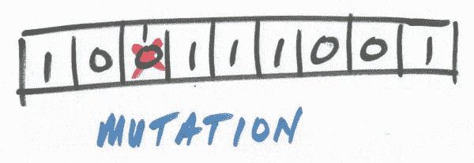

# 遗传算法关键术语，解析

> 原文：[`www.kdnuggets.com/2018/04/genetic-algorithm-key-terms-explained.html`](https://www.kdnuggets.com/2018/04/genetic-algorithm-key-terms-explained.html)

遗传算法，受到自然选择的启发，是一种常用的近似优化和搜索问题解决方案的方法。它们的必要性在于存在一些问题，它们的计算复杂性过高，以至于无法在任何可接受（或确定的）时间内解决。

以著名的[旅行商问题](https://en.wikipedia.org/wiki/Travelling_salesman_problem)为例。随着涉及的城市数量的增加，确定解决方案所需的时间迅速变得不可管理。例如，解决 5 个城市的问题是一项微不足道的任务；而解决 50 个城市的问题则需要的时间如此不合理，以至于永远无法完成。

* * *

## 我们的前三个课程推荐

 1\. [谷歌网络安全证书](https://www.kdnuggets.com/google-cybersecurity) - 快速进入网络安全职业轨道

 2\. [谷歌数据分析专业证书](https://www.kdnuggets.com/google-data-analytics) - 提升你的数据分析技能

 3\. [谷歌 IT 支持专业证书](https://www.kdnuggets.com/google-itsupport) - 支持你的组织在 IT 领域

* * *

事实证明，使用遗传算法来近似这种优化问题是一种合理的方法，可以得到合理的近似值。遗传算法在机器学习的工具库中已经存在了几十年，但最近作为优化机器学习超参数（和遍历神经网络架构搜索空间）的工具的复兴，引起了新一代机器学习研究人员和从业者的关注。

本文介绍了 12 个遗传算法关键术语的简单定义，以帮助更好地向新手介绍这些概念。

# 1\. 遗传算法

遗传算法（GA）通过二进制字符串表示来描述潜在的问题假设，并在潜在假设的搜索空间中进行迭代，以试图识别“最佳假设”，即优化预定义数值衡量标准或*适应度*的假设。遗传算法总体上是进化算法的一个子集。

# 2\. 进化算法

进化算法（EA）是任何类型的学习方法，其动机来自于它们与生物进化的明显和有意的相似性，包括但不限于遗传算法、进化策略和遗传编程。

# 3\. 遗传编程

遗传编程是一种特定类型的进化算法，利用进化学习策略来优化计算机代码的制作，结果是能在预定义的任务或任务集上表现最佳的程序。

# 4. 种群

在遗传算法中，每次迭代或*世代*产生一系列可能的假设来最佳近似一个函数，而“种群”指的是在给定迭代后生成的这些假设的完整集合或池。

# 5. 染色体

在明显向生物学致敬的情况下，一个染色体是许多组成一个种群的单一假设。

# 6. 基因

在遗传算法中，潜在的假设由染色体组成，染色体又由基因组成。实际上，在遗传算法中，染色体通常表示为二进制字符串，即一系列 1 和 0，表示字符串中位置的特定项的包含或排除。基因是这种染色体中的单个位。

例如，遗传算法的*Hello World* 通常被认为是[背包问题](https://en.wikipedia.org/wiki/Knapsack_problem)。在这个问题中，会有一组*N*项，这些项可能被或不被放入小偷的背包中，这些*N*项会表示为一个长度为*N*的二进制字符串（染色体），字符串中的每个位置表示一个特定的项，位置上的位（1 或 0；基因）表示该项是否包含在特定假设中。

+   *种群* → 当前世代（算法迭代）的背包问题所有提议解决方案

+   *染色体* → 背包问题的特定提议解决方案

+   *基因* → 在特定解决方案的背包中，特定项的定位表示（及其包含或排除）

# 7. 世代

在遗传算法中，通过选择一些完整的染色体（通常具有高适应度）前进到新世代（选择）、通过翻转现有完整染色体的一位并将其前进到新世代（突变）或最常见的，通过使用现有集合的基因作为父代来繁殖新世代的子染色体，来形成新的假设集。

世代则是遗传算法迭代结果的完整集合。

# 8. 繁殖

繁殖指的是创建新染色体的一般最常见的方法，即使用一对染色体作为父代，并利用交叉方法从中生成新的子染色体。

# 9. 选择

以自然选择为启示，选择的概念确保表现最好的（适应度最高的）染色体有更高的概率被用于繁殖下一代。通常情况下，表现最好的染色体可能会被选中并直接推进到新一代，而不被用于繁殖，以确保后续代的假设至少能够维持与当前代相同的表现水平。

# 10\. 交叉

选定的染色体如何用于繁殖下一代？交叉方法，如下所示，是一般的选择。会选择一对长度为*N*比特的选定字符串，并生成一个随机整数*c*作为交叉点（假设 0 < *c* < *N*）。然后，在这个交叉点*c*将两个字符串独立地拆分，并使用一个字符串的头部和另一个字符串的尾部重新组装，形成一对新的染色体。这些新假设的适应度将在下一代中进行评估。

# 11\. 变异

就像在生物学术语中一样，变异在遗传算法（GAs）中用于推动假设朝着最优方向发展。通常情况下，变异会简单地翻转一个随机基因的位，并将整个染色体推进到下一代，这是一种逃脱潜在局部最小值的策略。

# 12\. 适应度

我们需要一些度量标准来评估假设的最佳适应度。使用某种适应度函数来评估每个染色体，并确定最佳适应度，以便在创建新一代染色体时更为依赖。适应度函数高度依赖于任务。

**[Matthew Mayo](https://www.linkedin.com/in/mattmayo13/)** ([**@mattmayo13**](https://twitter.com/mattmayo13)) 是数据科学家以及 KDnuggets 的主编，该网站是开创性的在线数据科学和机器学习资源。他的兴趣包括自然语言处理、算法设计与优化、无监督学习、神经网络以及自动化机器学习方法。Matthew 拥有计算机科学硕士学位和数据挖掘研究生文凭。他可以通过 editor1 at kdnuggets[dot]com 联系到。

### 更多相关内容

+   [数据库关键术语解析](https://www.kdnuggets.com/2016/07/database-key-terms-explained.html)

+   [描述性统计关键术语解析](https://www.kdnuggets.com/2017/05/descriptive-statistics-key-terms-explained.html)

+   [机器学习关键术语解析](https://www.kdnuggets.com/2016/05/machine-learning-key-terms-explained.html)

+   [深度学习关键术语解析](https://www.kdnuggets.com/2016/10/deep-learning-key-terms-explained.html)

+   [自然语言处理关键术语解析](https://www.kdnuggets.com/2017/02/natural-language-processing-key-terms-explained.html)

+   [生成式人工智能关键术语解析](https://www.kdnuggets.com/generative-ai-key-terms-explained)
