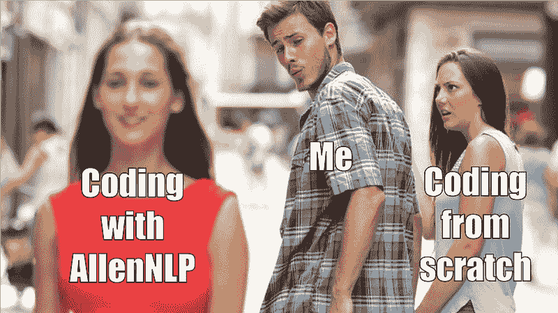
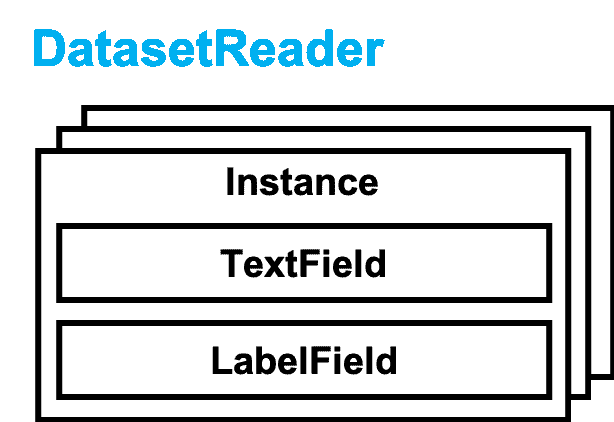
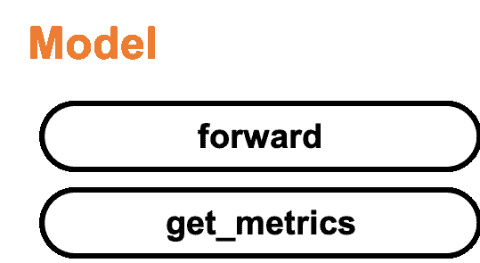
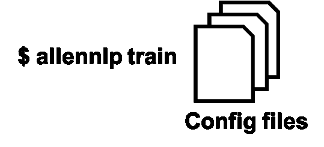

# 使用 AllenNLP 启动 NLP 项目的温和指南

> 原文：[`www.kdnuggets.com/2019/07/gentle-guide-starting-nlp-project-allennlp.html`](https://www.kdnuggets.com/2019/07/gentle-guide-starting-nlp-project-allennlp.html)

 评论

**由[谷本康文](https://medium.com/@yasufumy)，NLP 工程师**


照片由[Jamie Templeton](https://unsplash.com/@jamietempleton?utm_source=unsplash&utm_medium=referral&utm_content=creditCopyText)在[Unsplash](https://unsplash.com/search/photos/sign?utm_source=unsplash&utm_medium=referral&utm_content=creditCopyText)上拍摄

你是否知道这个库，[AllenNLP](https://allennlp.org/)? 如果你在从事自然语言处理（NLP）工作，你可能听说过这个名字。然而，我想实际使用它的人并不多。或者，有些人尝试过但不知道从哪里开始，因为功能众多。对于那些不熟悉 AllenNLP 的人，我将简要介绍这个库，并让你了解将其集成到你的项目中的优点。

AllenNLP 是一个用于 NLP 的深度学习库。[Allen Institute for Artificial Intelligence](https://allenai.org/)（人工智能领先研究机构之一）开发了这个基于[PyTorch](https://pytorch.org/)的库。使用 AllenNLP 开发模型比从头开始使用 PyTorch 构建模型要容易得多。它不仅提供了更简单的开发方式，还支持实验管理和开发后的评估。**AllenNLP 具有专注于研究开发的特性**。更具体地说，它可以**快速原型化模型**，并使**管理大量不同参数的实验变得更容易**。此外，它考虑了使用可读的变量名。

我们可能会遇到混乱的代码或丢失重要实验结果的情况，尤其是从头开始编码时。



当我了解了**AllenNLP**

在 AllenNLP 中，我们应该遵循下面的发展和实验流程。


典型流程与 AllenNLP 流程的比较

根据你自己的研究项目，你只需实现 DatasetReader 和 Model，然后使用配置文件运行各种实验。基本上，我们需要了解以下三个特性才能使用 AllenNLP 启动项目。

1.  定义你的 DatasetReader

1.  定义你的模型

1.  设置你的配置文件

换句话说，一旦你理解了它，你就能进行可扩展的开发。在这篇文章中，我将通过处理情感分析任务来解释上述三个关键特性。此外，你可以查看帖子中使用的代码，如下所示：

[**yasufumy/allennlp_imdb**](https://github.com/yasufumy/allennlp_imdb)

*最简单的 AllenNLP 配方。通过在 GitHub 上创建帐户来贡献 yasufumy/allennlp_imdb 的开发。*](https://github.com/yasufumy/allennlp_imdb)

开始吧！

### 0. 快速回顾：情感分析

在这里，我将解释情感分析任务的基础知识，以便那些不熟悉的人了解。如果你已经非常了解这一点，请跳过到下一部分：1. 定义 DatasetReader。

情感分析是一个尝试分类给定文档极性（正面或负面）的任务。在这篇文章中，我们使用[IMDB](https://www.imdb.com/)中的电影评论作为给定文档。例如，我们将查找[复仇者联盟：终局之战的用户评论](https://www.imdb.com/title/tt4154796/reviews?ref_=tt_urv)中的正面和负面评论。这次，我们将使用下面链接提供的数据集。

[**情感分析**

*这是一个用于二元情感分类的数据集，比以前的基准数据集包含了更多的数据…*](https://ai.stanford.edu/~amaas/data/sentiment/)

我们将构建一个模型，该模型以文档（评论）作为输入，并预测标签（极性）作为输出。我们应该准备文档和标签的对作为数据集。

### 1. 定义你的 DatasetReader

下图展示了 AllenNLP 中的 DatasetReader 类。这个类主要用于处理任务中的数据。



DatasetReader 以原始数据集作为输入，并应用预处理操作，如小写转换、分词等。最终，它输出包含预处理数据的 Instance 对象列表。在这篇文章中，Instance 对象将文档和标签信息作为属性。

首先，我们应该继承 DatasetReader 类来创建我们自己的类。然后，我们需要实现三个方法：`__init__`、`_read`和`text_to_instance`。让我们来看一下如何实现我们自己的 DatasetReader。我会跳过`read`方法的实现，因为它与 AllenNLP 的使用关系不大。但如果你感兴趣，可以参考[这个链接](https://github.com/yasufumy/allennlp_imdb/blob/master/allennlp_imdb/data/dataset_readers/imdb.py#L38)。

实现的`__init__`方法如下。我们可以通过配置文件来控制该方法的参数。

```py
@DatasetReader.register('imdb')
ImdbDatasetReader(DatasetReaer):
  def __init__(self, token_indexers, tokenizer):
    self._tokenizer = tokenizer
    self._token_indexers = token_indexers
```

在这篇文章中，我设置了`token_indexers`和`tokenizer`作为参数，因为我假设我们在实验中改变了索引或分词的方式。`token_indexers`执行索引操作，而`tokenizer`执行分词操作。我实现的类具有[装饰器](https://docs.python.org/3/glossary.html#term-decorator)(`DatasetReader.register('imdb')`)，这使我们可以通过配置文件来控制它。

实现`text_to_instance`将如下所示。该方法是 DatasetReader 的主要过程。`text_to_instance`接受每个原始数据作为输入，进行一些预处理，并将每个原始数据输出为`Instance`。在 IMDB 中，它接受评论字符串和极性标签作为输入。

```py
@DatasetReader.register('imdb')
ImdbDatasetReader(DatasetReaer):
    ...
  def text_to_instance(self, string: str, label: int) -> Instance:
    fields = {}
    tokens = self._tokenizer.tokenize(string)
    fields['tokens'] = TextField(tokens, self._token_indexers)
    fields['label'] = LabelField(label, skip_indexing=True)
    return Instance(fields)
```

在 AllenNLP 中，Instance 的属性对应于 Field。我们可以从 Fields 的字典中创建 Instance。Instance 的属性代表每个数据，如文档或标签。在 IMDB 中，Instance 有两个属性：评论和标签。评论和标签分别对应于 TextField 和 LabelField。

上述提到的是定义我们 DatasetReader 的方式。您可以通过[这个链接](https://github.com/yasufumy/allennlp_imdb/blob/master/allennlp_imdb/data/dataset_readers/imdb.py#L22)查看完整代码。

### 2\. 定义你的模型

下图展示了 AllenNLP 中的 Model 类。这个类主要构建解决任务的模型。



模型接受数据作为输入，并输出前向计算的结果和评估指标作为字典。

首先，我们应该继承 Model 类以创建自己的类。然后我们需要实现三个方法：`__init__`、`forward`和`get_metrics`。在这里，我们实现了一个用于 IMDB 评论的极性分类模型，采用了递归神经网络（RNN）。

实现`__init__`将如下所示。我们可以通过配置文件控制该方法的参数，与 DatasetReader 相同。

```py
@Model.register('rnn_classifier')
class RnnClassifier(Model):    
def __init__(self, vocab, text_field_embedder,
             seq2vec_encoder, label_namespace):
  super().__init__(vocab)

self._text_field_embedder = text_field_embedder
  self._seq2vec_encoder = seq2vec_encoder
  self._classifier_input_dim = self._seq2vec_encoder.get_output_dim()
  self._num_labels = vocab.get_vocab_size(namespace=label_namespace)

self._classification_layer = nn.Linear(self._classifier_input_dim, self._num_labels)
  self._accuracy = CategoricalAccuracy()
  self._loss = nn.CrossEntropyLoss()
```

在这篇文章中，我设置了`text_field_embedder`和`seq2vec_encoder`作为参数，因为我假设我们在实验中会更改嵌入方式或 RNN 类型。`text_field_embedder`将标记嵌入为向量，而`seq2vec_encoder`使用 RNN 对标记序列进行编码（技术上你可以使用除 RNN 之外的其他类型）。我实现的类具有装饰器（`Model.register('rnn_classifier')`），这使我们能够通过配置文件来控制它。

`forward`的实现将如下所示。该方法是模型的主要过程。`forward`接受数据作为输入，通过前向计算进行计算，并将预测标签和评估指标的结果输出为字典。大部分实现方式与 PyTorch 相同。然而，请注意，我们应将结果返回为字典。

```py
def forward(self, tokens, label=None):
  embedded_text = self._text_field_embedder(tokens)
  mask = get_text_field_mask(tokens).float()

encoded_text = self._dropout(self._seq2vec_encoder(embedded_text, mask=mask))

logits = self._classification_layer(encoded_text)
  probs = F.softmax(logits, dim=1)

output_dict = {'logits': logits, 'probs': probs}

if label is not None:
    loss = self._loss(logits, label.long().view(-1))
    output_dict['loss'] = loss
    self._accuracy(logits, label)

return output_dict
```

上述实现计算了极性分类的概率、交叉熵损失和准确率。我们通过 softmax 从 RNN 的输出中计算分类概率。如果给定标签，我们还计算模型的分类准确率。最后，它将每个计算结果输出为字典（`output_dict`）。

实现`get_metrics`将如下所示。

```py
def get_metrics(self, reset=False):
  return {'accuracy': self._accuracy.get_metric(reset)}
```

它返回一个字典形式的准确率值。这是因为我们在这次实验中使用了模型的准确率作为指标。我们可以在`get_metrics`方法中使用多个值。

上述内容是定义我们模型的方法。你可以从[这个链接](https://github.com/yasufumy/allennlp_imdb/blob/master/allennlp_imdb/model/rnn_classifier.py)中查看完整的代码。

### 3\. 设置你的配置文件

下图展示了如何在 AllenNLP 中运行我们的实验。我们可以通过将配置文件传递给`allennlp train`命令来运行实验。



我将解释如何制作我们的配置文件来控制实验。我们可以通过下面的命令使用 GUI 界面创建配置文件。但我将从头开始解释，以便更好地理解。

```py
allennlp configure --include-package allennlp_imdb
```

配置文件主要包括`dataset_reader`字段、`model`字段和`trainer`字段。

```py
{
  "dataset_reader": {...},
  "model": {...},
  "trainer": {...}
}
```

`dataset_reader`字段和`model`字段分别指定了我们目前实现的 DatasetReader 和模型的设置。同时，`trainer`字段指定了优化器、训练周期数和设备（CPU/GPU）的设置。你可以从[这个链接](https://github.com/yasufumy/allennlp_imdb/blob/master/training_config/base_cpu.jsonnet)中查看完整的配置文件。接下来，我将分别解释这三个字段的重要部分。

DatasetReader 的设置如下。

```py
"dataset_reader": {
  "type": "imdb",
  "token_indexers": {
    "tokens": {
      "type": "single_id"
    }
  },
  "tokenizer": {
    "type": "word"
  }
}
```

首先，我们在`type`中指定使用的 DatasetReader。我们可以使用 ImdbDatasetReader 将`type`设置为`imdb`，因为它已经通过`@DatasetReader.register('imdb')`准备好使用了。AllenNLP 已经提供了很多流行的数据集。你可以从[文档](https://allenai.github.io/allennlp-docs/api/allennlp.data.dataset_readers.html)中查看这些数据集。

然后，我们为`ImdbDatasetReader.__init__`方法指定参数。我们使用`[SingleIdTokenIndexer](https://github.com/allenai/allennlp/blob/master/allennlp/data/token_indexers/single_id_token_indexer.py#L12)`作为`token_indexers`，因为我们希望令牌对应于单个 ID。同时，我们使用`[WordTokenizer](https://github.com/allenai/allennlp/blob/master/allennlp/data/tokenizers/word_tokenizer.py#L12)`作为`tokenizer`，因为我们希望令牌是一个单词。

模型的设置如下。

```py
"model": {
  "type": "rnn_classifier",
  "text_field_embedder": {
    "token_embedders": {
      "type": "embedding",
      ...
    }
  },
  "seq2vec_encoder": {
    "type": "gru",
    ...
  }
}
```

首先，我们在`type`中指定使用的模型，与 DatasetReader 相同。我们可以使用 RnnClassifier 将`type`设置为`rnn_classifier`，因为它已经通过`@Model.register('rnn_classifier')`准备好使用了。

然后，我们为`RnnClassifier.__init__`方法指定参数。我们使用`[Embedding](https://allenai.github.io/allennlp-docs/api/allennlp.modules.token_embedders.html#embedding)`作为`text_field_embedder`，因为我们希望将单词嵌入为向量。同时，我们使用`[GRU](https://allenai.github.io/allennlp-docs/api/allennlp.modules.seq2vec_encoders.html)`作为`seq2vec_encoder`，因为我们希望通过 GRU 对嵌入的单词序列进行编码。

Trainer 的设置如下。

```py
"trainer": {
  "num_epochs": 10,
  "optimizer": {
    "type": "adam"
  }
}
```

`num_epochs` 指定训练的周期数。`optimizer` 指定更新参数的优化器，在此情况下，我们选择使用 `adam`。

上述内容是设置配置文件的方法。

我们可以通过执行以下命令来运行实验：

```py
allennlp train \
    --include-package allennlp_imdb \
    -s /path/to/storage \
    -o '{"trainer": {"cuda_device": 0}} \
    training_config/base_cpu.jsonnet
```

当我们想要更改实验设置时，需要创建新的配置文件。但如果更改较少，可以通过以下命令进行更改。以下命令将 GRU 更新为 LSTM。

```py
allennlp train \
    --include-package allennlp_imdb \
    -s /path/to/storage \
    -o '{"trainer": {"cuda_device": 0}} \
    -o '{"model": {"seq2vec_encoder": {"type": "lstm"}}}' \
    training_config/base_cpu.jsonnet
```

解释完毕。感谢阅读我的文章。希望你了解如何构建数据加载器和模型，并在 AllenNLP 中管理实验。

感谢 [BrambleXu](https://medium.com/@bramblexu?source=post_page)。

**个人简介：[谷口康文](https://medium.com/@yasufumy)** 是一家日本公司的 NLP 工程师。他的兴趣在于问答、信息检索和开源开发。

[原文](https://towardsdatascience.com/allennlp-startup-guide-24ffd773cd5b)。转载已获许可。

**相关内容：**

+   NLP 与 NLU：从理解语言到处理语言

+   Python 实践语音识别：基础知识

+   检查 Transformer 架构 – 第二部分：Transformer 如何工作简要描述

* * *

## 我们的前 3 名课程推荐

 1\. [Google 网络安全证书](https://www.kdnuggets.com/google-cybersecurity) - 快速进入网络安全职业轨道

 2\. [Google 数据分析专业证书](https://www.kdnuggets.com/google-data-analytics) - 提升你的数据分析技能

 3\. [Google IT 支持专业证书](https://www.kdnuggets.com/google-itsupport) - 支持你的组织 IT 工作

* * *

### 更多相关话题

+   [自然语言处理的温和介绍](https://www.kdnuggets.com/2022/06/gentle-introduction-natural-language-processing.html)

+   [支持向量机的温和介绍](https://www.kdnuggets.com/2023/07/gentle-introduction-support-vector-machines.html)

+   [终极指南：NLP 中不同的词嵌入技术](https://www.kdnuggets.com/2021/11/guide-word-embedding-techniques-nlp.html)

+   [NLP、NLU 和 NLG：有什么区别？综合指南](https://www.kdnuggets.com/2022/06/nlp-nlu-nlg-difference-comprehensive-guide.html)

+   [如何构建数据科学项目：一步一步的指南](https://www.kdnuggets.com/2022/05/structure-data-science-project-stepbystep-guide.html)

+   [数据科学项目管理方法指南](https://www.kdnuggets.com/2023/07/guide-data-science-project-management-methodologies.html)
