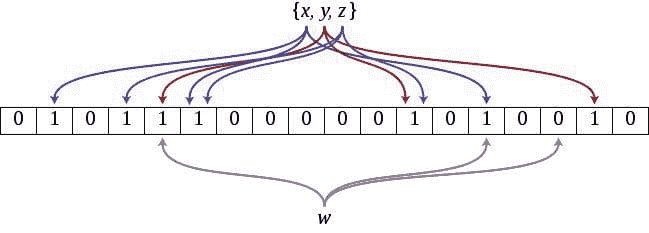

# Bloom 过滤器的温和介绍

> 原文：[`www.kdnuggets.com/2016/08/gentle-introduction-bloom-filter.html`](https://www.kdnuggets.com/2016/08/gentle-introduction-bloom-filter.html)

**Bugra Akyildiz, Hinge App.**

### Bloom 过滤器

Bloom 过滤器是概率性空间高效的数据结构。它们与哈希表非常相似；它们专门用于集合中的成员存在性检测。然而，它们具有一个非常强大的特性，即在成员存在性检测时可以在空间和假阳性率之间进行权衡。由于它可以在空间和假阳性率之间进行权衡，因此它被称为概率数据结构。

* * *

## 我们的前三大课程推荐

 1\. [Google Cybersecurity Certificate](https://www.kdnuggets.com/google-cybersecurity) - 快速进入网络安全职业生涯的捷径。

 2\. [Google Data Analytics Professional Certificate](https://www.kdnuggets.com/google-data-analytics) - 提升您的数据分析能力

 3\. [Google IT Support Professional Certificate](https://www.kdnuggets.com/google-itsupport) - 支持您的组织在 IT 领域

* * *



### 空间效率

让我们详细说明一下空间效率。如果你想在集合中存储长列表的项目，你可以采用多种方式。你可以将其存储在哈希映射中，然后检查哈希映射中的存在性，这将使你能够非常高效地插入和查询。然而，由于你将按原样存储这些项目，它将不会非常节省空间。

如果我们还想提高空间效率，可以在将项目放入集合之前对其进行`hash`。还有什么呢？我们可以使用位数组来存储项目的哈希值。还有，还有什么？让我们在位数组中也允许哈希冲突。这就是 Bloom 过滤器的工作原理，它们在底层是允许哈希冲突的位数组；这会产生假阳性。哈希冲突在 Bloom 过滤器中是设计上的一部分，否则它们不会那么紧凑。

> 每当使用列表或集合，并且空间效率重要且显著时，应考虑使用 Bloom 过滤器。

### Bloom 过滤器基础知识

Bloom 过滤器是一个`N`位的位数组，其中`N`是位数组的大小。它还有另一个参数，即哈希函数的数量，`k`。这些哈希函数用于在位数组中设置位。当将元素`x`插入过滤器时，`k`个索引`h1(x)`,`h2(x)`, ..., `hk(x)`中的位会被设置，这些位的位置由哈希函数确定。请注意，随着哈希函数数量的增加，这种概率的假阳性率趋近于零。然而，插入和查找所需的时间增加，同时 Bloom 过滤器也会更快填满。

为了在布隆过滤器中检查成员存在性，我们需要检查所有的位是否都已设置；这与我们插入项目到布隆过滤器中的方式非常相似。如果所有的位都已设置，那么这意味着该项目 `probably` 在布隆过滤器中；如果并非所有位都设置，那么这意味着该项目不在布隆过滤器中。

### 基本的 Python 实现

如果我们想实现一个基本的布隆过滤器，我们可以轻松做到这一点。

```py
# 3rd party
import mmh3

class BloomFilter(set):

    def __init__(self, size, hash_count):
        super(BloomFilter, self).__init__()
        self.bit_array = bitarray(size)
        self.bit_array.setall(0)
        self.size = size
        self.hash_count = hash_count

    def __len__(self):
        return self.size

    def __iter__(self):
        return iter(self.bit_array)

    def add(self, item):
        for ii in range(self.hash_count):
            index = mmh3.hash(item, ii) % self.size
            self.bit_array[index] = 1

        return self

    def __contains__(self, item):
        out = True
        for ii in range(self.hash_count):
            index = mmh3.hash(item, ii) % self.size
            if self.bit_array[index] == 0:
                out = False

        return out

def main():
    bloom = BloomFilter(100, 10)
    animals = ['dog', 'cat', 'giraffe', 'fly', 'mosquito', 'horse', 'eagle',
               'bird', 'bison', 'boar', 'butterfly', 'ant', 'anaconda', 'bear',
               'chicken', 'dolphin', 'donkey', 'crow', 'crocodile']
    # First insertion of animals into the bloom filter
    for animal in animals:
        bloom.add(animal)

    # Membership existence for already inserted animals
    # There should not be any false negatives
    for animal in animals:
        if animal in bloom:
            print('{} is in bloom filter as expected'.format(animal))
        else:
            print('Something is terribly went wrong for {}'.format(animal))
            print('FALSE NEGATIVE!')

    # Membership existence for not inserted animals
    # There could be false positives
    other_animals = ['badger', 'cow', 'pig', 'sheep', 'bee', 'wolf', 'fox',
                     'whale', 'shark', 'fish', 'turkey', 'duck', 'dove',
                     'deer', 'elephant', 'frog', 'falcon', 'goat', 'gorilla',
                     'hawk' ]
    for other_animal in other_animals:
        if other_animal in bloom:
            print('{} is not in the bloom, but a false positive'.format(other_animal))
        else:
            print('{} is not in the bloom filter as expected'.format(other_animal))

if __name__ == '__main__':
    main()

```

输出如下：

```py
dog is in bloom filter as expected
cat is in bloom filter as expected
giraffe is in bloom filter as expected
fly is in bloom filter as expected
mosquito is in bloom filter as expected
horse is in bloom filter as expected
eagle is in bloom filter as expected
bird is in bloom filter as expected
bison is in bloom filter as expected
boar is in bloom filter as expected
butterfly is in bloom filter as expected
ant is in bloom filter as expected
anaconda is in bloom filter as expected
bear is in bloom filter as expected
chicken is in bloom filter as expected
dolphin is in bloom filter as expected
donkey is in bloom filter as expected
crow is in bloom filter as expected
crocodile is in bloom filter as expected

badger is not in the bloom filter as expected
cow is not in the bloom filter as expected
pig is not in the bloom filter as expected
sheep is not in the bloom, but a false positive
bee is not in the bloom filter as expected
wolf is not in the bloom filter as expected
fox is not in the bloom filter as expected
whale is not in the bloom filter as expected
shark is not in the bloom, but a false positive
fish is not in the bloom, but a false positive
turkey is not in the bloom filter as expected
duck is not in the bloom filter as expected
dove is not in the bloom filter as expected
deer is not in the bloom filter as expected
elephant is not in the bloom, but a false positive
frog is not in the bloom filter as expected
falcon is not in the bloom filter as expected
goat is not in the bloom filter as expected
gorilla is not in the bloom filter as expected
hawk is not in the bloom filter as expected
```

如你所见，上述输出中存在假阳性，但没有出现假阴性，这是预期的。

与这种布隆过滤器的实现不同，大多数在各种语言中可用的实现并不提供哈希函数参数。这是因为假阳性率在应用中比哈希函数更为重要，并且根据假阳性率，你总是可以调整要使用的哈希函数数量。通常，`size` 和 `error_rate` 是布隆过滤器的假阳性率。如果你在初始化布隆过滤器时减少 `error_rate`，它们会在后台调整哈希函数的数量。

### 假阳性

虽然布隆过滤器可以有信心地说“绝对不在”，但它们也会对某些项目说 `possibly in`。根据应用的不同，这可能是一个巨大的缺点，也可能相对还可以。如果偶尔出现假阳性是可以接受的，你应该考虑使用布隆过滤器来检查集合操作中的成员存在性。

还要注意，如果你任意降低假阳性率，你会增加哈希函数的数量，这将增加插入和成员存在性的延迟。在这一部分中还有一点，如果哈希函数彼此独立且能够较为均匀地分布输入空间，那么理论上的假阳性率是可以得到满足的。否则，布隆过滤器的假阳性率会比理论上的假阳性率更差，因为哈希函数之间存在相关性，哈希冲突发生的频率会比预期更高。

> 使用布隆过滤器时，要考虑假阳性的潜在影响。

### 确定性

如果你使用相同的大小和相同数量的哈希函数以及哈希函数，布隆过滤器在给出正面响应和负面响应时是确定性的。对于一个项目 `x`，如果它对该特定项目给出 `probably in` 的响应，那么 5 分钟后、1 小时后、1 天后和 1 周后它将给出相同的响应。我对这一点感到有些惊讶。它是“概率性的”，所以布隆过滤器的响应应该是某种随机的，对吧？其实不然。它的概率性在于你不能知道它会说哪个项目是 `probably in`。

> 否则，当它说 `probably in` 时，它会一直说同样的话。

### 缺点

布隆过滤器并非完美无缺。

#### 布隆过滤器的大小

布隆过滤器的大小需要根据你要插入的项的数量事先确定。如果你不知道或无法估计项的数量，这就不是很好。你可以设置一个任意大的大小，但那将浪费空间，而我们首先尝试优化的正是这个空间，因此选择布隆过滤器。可以通过创建一个动态调整的布隆过滤器来解决这个问题，但根据应用的不同，这可能并不总是可能。有一种变体称为 [可扩展布隆过滤器](http://gsd.di.uminho.pt/members/cbm/ps/dbloom.pdf)，它根据不同的项数量动态调整大小。这可以缓解一些缺点。

#### 在布隆过滤器中的构建和成员存在

使用布隆过滤器时，你不仅接受误报率，还愿意在速度方面有一点开销。与哈希映射相比，哈希项和构建布隆过滤器时确实存在开销。

#### 不能给出你插入的项

布隆过滤器无法生成插入项的列表，你只能检查某项是否存在，但永远无法获取完整的项列表，因为哈希冲突和哈希函数。这正是布隆过滤器相较于其他数据结构的最大优势之一；它的空间效率也带来了这一劣势。

#### 删除元素

从布隆过滤器中删除元素是不可能的，你不能撤销插入操作，因为不同项的哈希结果可能会索引到相同的位置。如果你想撤销插入操作，你要么需要对布隆过滤器中的每个索引进行插入计数，要么需要从头开始构建布隆过滤器，排除一个单一项。这两种方法都涉及开销且并不简单。根据应用的不同，可能需要尝试从头开始重建布隆过滤器，而不是从布隆过滤器中删除或移除项。

#### 不同语言中的实现

在生产环境中，你不应自行推出布隆过滤器的实现。有两个原因：其一，选择和实现良好的哈希函数对分配错误率至关重要。其二，它需要经过实战考验，且在错误率和大小方面不应出现错误。每种语言都有开源实现，但根据我的经验，以下针对 node.js 和 Python 的实现非常好：

+   [Node](https://www.npmjs.com/package/bloomfilter)

+   [Python](https://github.com/jaybaird/python-bloomfilter)

还有一个非常快速的实现（在成员存在性和将项目添加到布隆过滤器的速度上比上述 Python 库快 10 倍），[pybloomfilter](https://axiak.github.io/pybloomfiltermmap/)，但它运行在 Pypy 上，并且不支持 Python 3。

**简介: [Bugra Akyildiz](https://www.linkedin.com/in/bugraa)** 是 Hinge 应用的高级机器学习工程师。你可以在 Twitter 上找到他 **[@bugraa](https://twitter.com/bugraa)**。

[原文](http://bugra.github.io/work/notes/2016-06-05/a-gentle-introduction-to-bloom-filter/)。经许可转载。

**相关:**

+   你会在泰坦尼克号中生存吗？Python 机器学习指南第一部分

+   数据科学入门 - Python

+   美国的下一个话题模型

### 更多相关内容

+   [自然语言处理的温和介绍](https://www.kdnuggets.com/2022/06/gentle-introduction-natural-language-processing.html)

+   [支持向量机的温和介绍](https://www.kdnuggets.com/2023/07/gentle-introduction-support-vector-machines.html)

+   [如何使用 Python 过滤数据](https://www.kdnuggets.com/2022/02/filter-data-python.html)

+   [你可能不知道的 4 个 Python Itertools 过滤函数](https://www.kdnuggets.com/2023/08/4-python-itertools-filter-functions-probably-didnt-know.html)

+   [使用 PyCaret 在 Python 中的聚类介绍](https://www.kdnuggets.com/2021/12/introduction-clustering-python-pycaret.html)

+   [数据科学的基础数学: 奇异值分解的视觉介绍](https://www.kdnuggets.com/2022/06/essential-math-data-science-visual-introduction-singular-value-decomposition.html)
