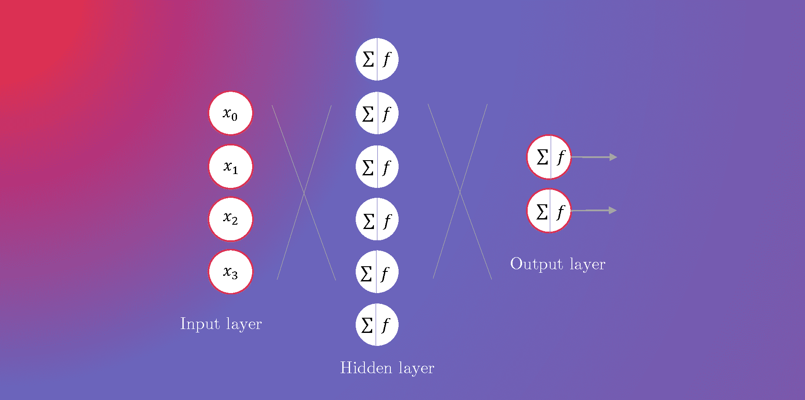
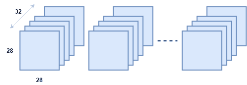
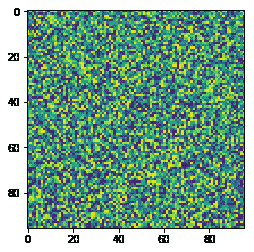
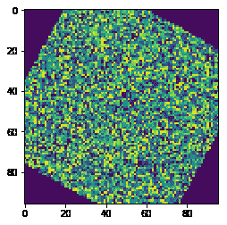
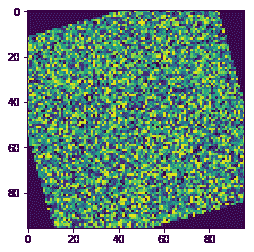
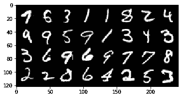
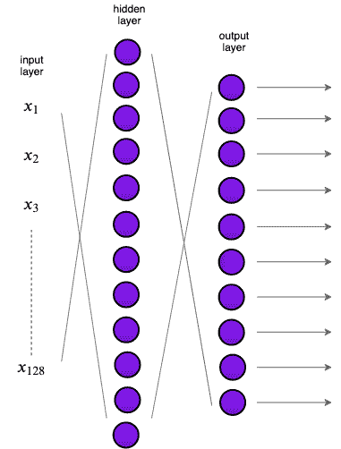

# PyTorch 1.2 简介

> 原文：[`www.kdnuggets.com/2019/09/gentle-introduction-pytorch-12.html`](https://www.kdnuggets.com/2019/09/gentle-introduction-pytorch-12.html)

评论

**由 [Elvis Saravia](https://twitter.com/omarsar0)，情感计算与 NLP 研究员**



* * *

## 我们的三大课程推荐

 1\. [Google 网络安全证书](https://www.kdnuggets.com/google-cybersecurity) - 快速开启网络安全职业生涯。

 2\. [Google 数据分析专业证书](https://www.kdnuggets.com/google-data-analytics) - 提升你的数据分析技能

 3\. [Google IT 支持专业证书](https://www.kdnuggets.com/google-itsupport) - 支持你所在的组织 IT

* * *

在我们之前的 PyTorch [笔记本](https://medium.com/dair-ai/pytorch-1-2-quickstart-with-google-colab-6690a30c38d)中，我们学习了如何快速开始使用 PyTorch 1.2 和 Google Colab。在本教程中，我们将退一步，回顾使用 PyTorch 构建神经网络模型的一些基本组件。作为示例，我们将构建一个图像分类器，使用几个堆叠层，然后评估模型。

这将是一个简短的教程，避免使用行话和过于复杂的代码。也就是说，这可能是你可以用 PyTorch 构建的最基本的神经网络模型。

事实上，这么基础的内容对于那些刚开始学习 PyTorch 和机器学习的人来说是理想的。所以如果你有朋友或同事想要入门，我强烈建议你把他们推荐到这个教程作为起点。让我们开始吧！

### 开始使用

在开始代码之前，你需要安装最新版本的 PyTorch。我们使用 Google Colab 进行教程，因此我们将使用以下命令安装 PyTorch。*你也可以在本博客文章的末尾找到一个 Colab 笔记本。*

现在我们需要导入一些模块，这些模块将帮助我们获取构建神经网络模型所需的功能。主要的是`torch`和`torchvision`。它们包含了你开始使用 PyTorch 所需的大部分功能。然而，由于这是一个机器学习教程，我们还需要`torch.nn`、`torch.nn.functional`和`torchvision.transforms`，它们都包含了构建模型的实用函数。我们可能不会使用下面列出的所有模块，但这些是你在开始机器学习项目之前需要导入的典型模块。

在下面，我们检查 PyTorch 版本，以确保你使用的是本教程所用的正确版本。到本教程时，我们使用的是 PyTorch 1.2。

```py
print(torch.__version__)
```

### 加载数据

让我们直接进入正题！与任何机器学习项目一样，你需要加载你的数据集。我们使用的是[MNIST 数据集](http://yann.lecun.com/exdb/mnist/)，它是机器学习领域中的“Hello World”数据集。

数据由一系列`28 X 28`大小的图像（包含手写数字）组成。我们将很快讨论这些图像，但我们的计划是将数据加载成`32`的批次，类似于下面的图示：



以下是我们在导入数据时执行的完整步骤：

+   我们将使用`transforms`模块将数据导入并转换为张量。在机器学习的背景下，张量只是用于存储数据的高效数据结构。

+   我们将使用`DataLoader`来构建便捷的数据加载器，这使得将数据高效地批量输入神经网络模型变得容易。稍后我们将讨论批次的问题，但现在，先把它们当作数据的子集。

+   如上所述，我们还将通过在数据加载器中设置`batch`参数来创建数据批次。注意，在本教程中我们使用了`32`的批次，但如果你愿意，可以将其更改为`64`。

让我们检查一下`trainset`和`testset`对象包含的内容。

```py
print(trainset)print(testset)## outputDataset MNIST     
Number of datapoints: 60000     
Root location: ./data     
Split: Train     
StandardTransform 
Transform: Compose(ToTensor()) Dataset MNIST     
Number of datapoints: 10000     
Root location: ./data     
Split: Test    
StandardTransform Transform: Compose(ToTensor())
```

这是一个初学者教程，所以我会稍微拆解一下：

+   `BATCH_SIZE`是一个参数，表示我们将用于模型的批次大小。

+   `transform`包含你将应用于数据的所有转换代码。下面我会展示一个示例，演示它的作用，以便更好地理解它的使用。

+   `trainset`和`testset`包含实际的数据集对象。注意我使用`train=True`来指定这对应于训练数据集，我使用`train=False`来指定这是其余的数据集，我们称之为测试集。从上面打印的块中你可以看到，数据的划分是 85%（60000）/15%（10000），分别对应于训练集和测试集的样本部分。

+   `trainloader`是持有数据加载器对象的地方，它负责*打乱*数据并构建批次。

现在，让我们仔细看看`transforms.Compose(...)`函数，看看它的作用。我们将使用一个随机生成的图像来演示它的使用。让我们生成一张图像：

让我们渲染它：

输出：



好的，我们有了我们的图像样本，现在让我们对它应用一些虚拟转换。我们将把图像旋转`45`度。下面的转换处理了这一点：

输出：



请注意，你可以将任何转换放在 `transforms.Compose(...)` 中。你可以使用 PyTorch 提供的内置转换，也可以构建自己的转换并按需组合。事实上，你可以在函数中放入任意多的转换。让我们尝试另一种转换组合：*rotate* + *vertical flip*。

输出：



这很酷，对吧！继续尝试其他转换方法。在进一步探索我们的数据话题上，让我们更仔细地看看我们的图像数据集。

### 探索数据

作为一个从业者和研究人员，我总是花一点时间和精力探索和理解我的数据集。这很有趣，并且这是一个很好的做法，以确保在训练模型之前一切都井井有条。

让我们检查一下训练和测试数据集包含了什么。我将使用 `matplotlib` 库来打印出数据集中的一些图像。通过一点 `numpy` 代码，我可以将图像转换为合适的格式以打印出来。下面我打印出了一整批 32 张图像：

输出：



我们的批次维度如下：

输出：

```py
Image batch dimensions: torch.Size([32, 1, 28, 28]) 
Image label dimensions: torch.Size([32])
```

### 模型

现在是时候构建用于执行图像分类任务的神经网络模型了。我们将保持简单，堆叠一个 *dense* 层、一个 *dropout* 层和一个 *output* 层来训练我们的模型。

让我们讨论一下模型：

+   首先，以下结构，涉及一个名为 `MyModel` 的 `class`，是用于在 PyTorch 中构建神经网络模型的标准代码：

+   层在 `def __init__()` 函数内定义。`super(...).__init__()` 只是用来将各部分粘合在一起。对于我们的模型，我们堆叠了一个隐藏层（`self.d1`），接着是一个 dropout 层（`self.dropout`），然后是一个输出层（`self.d2`）。

+   `nn.Linear(...)` 定义了密集层，它需要 `in` 和 `out` 维度，这些维度分别对应于该层输入特征和输出特征的大小。

+   `nn.Dropout(...)` 用于定义一个 dropout 层。Dropout 是深度学习中的一种方法，帮助模型避免 *overfitting*。这意味着 dropout 作为一种正则化技术，帮助模型不在训练时看到的图像上过拟合。我们需要这样做，因为我们需要一个对未见示例——在我们这个案例中是测试数据集——有很好的泛化能力的模型。Dropout 随机将神经网络层的一些单元置为零，概率为 `p=0.2`。更多关于 dropout 层的信息请参考 [这里](https://pytorch.org/docs/stable/nn.html#dropout)。

+   模型的入口点，即数据输入到神经网络模型的位置，放在 `forward(...)` 函数下。通常，我们还会将训练过程中对数据进行的其他转换放在此函数内。

+   在`forward()` 函数中，我们对输入数据执行一系列计算：**1)** 我们首先将图像展平，将其从 2D (`28 X 28`) 转换为 1D (`1 X 784`); **2)** 然后将这些 1D 图像的批次输入到第一个隐藏层; **3)** 该隐藏层的输出应用了[非线性激活函数](https://en.wikipedia.org/wiki/Rectifier_(neural_networks)) 叫做`ReLU`。此时了解`F.relu()`的具体作用并不重要，但它的效果是允许神经网络架构在大数据集上更快、更有效地训练；**4)** 如上所述，dropout 还通过避免对训练数据过拟合来帮助模型更有效地训练；**5)** 然后我们将 dropout 层的输出输入到输出层（`d2`）；**6)** 其结果接着传递到[softmax 函数](https://en.wikipedia.org/wiki/Softmax_function)，它将输出转换或规范化为概率分布，有助于输出正确的预测值，这些值用于计算模型的准确率；**7)** 这将是模型的最终输出。

从视觉上讲，以下是我们刚刚构建的模型的图示。请记住，隐藏层比图示中显示的要大，但由于空间限制，图示应视为实际模型的近似。



正如我在之前的教程中所做的，我总是建议用一个批次测试模型，以确保输出的维度符合我们的期望。注意我们如何迭代数据加载器，它方便地存储了`images`和`labels`对。`out`包含模型的输出，这些输出是应用了`softmax`层的 logits，有助于预测。

输出：

```py
batch size: torch.Size([32, 1, 28, 28]) 
torch.Size([32, 10])
```

我们可以清楚地看到，我们得到的每个批次有 10 个输出值与批次中的每个图像相关联；这些值用于检查模型的性能。

### 训练模型

现在我们准备好训练模型了，但在此之前，我们将设置一个*损失*函数，一个*优化器*，以及一个计算模型准确率的实用函数：

+   `learning_rate` 是模型尝试优化其权重的速率，因此可以看作是模型的另一个参数。

+   `num_epochs` 是训练步骤的数量……我们不需要训练这个模型太长时间，所以只用 5 个 epoch。

+   `device` 确定我们将使用什么硬件来训练模型。如果存在`gpu`，则会使用它，否则默认为`cpu`。

+   `model` 只是模型实例。

+   `model.to(device)` 负责设置将用于训练模型的实际设备。

+   `criterion` 只是用于计算模型在前向和反向训练过程中损失的度量标准。

+   `optimizer` 是在反向传播步骤中用于修改权重的优化技术。注意，它需要`learning_rate`和模型参数，这些都是优化的一部分。稍后会详细介绍！

下面的实用函数有助于计算模型的准确性。目前，理解它是如何计算的并不重要，但基本上它比较了模型的输出（预测）与实际目标值（即数据集的标签），并试图计算正确预测的平均值。

### 训练模型

现在是训练模型的时候了。以下代码部分可以按以下步骤描述：

+   训练神经网络模型时的第一件事是定义训练循环，这通过以下方式实现：

```py
for epoch in range(num_epochs):
    ...
```

+   我们定义了两个变量，`training_running_loss`和`train_acc`，它们将帮助我们在模型训练不同批次时监控运行的准确性和损失。

+   `model.train()` 明确表示我们准备好开始训练了。

+   注意，我们正在迭代*dataloader*，它方便地以图像-标签对的形式提供批次。

+   第二个`for`循环意味着在每个训练步骤中，我们将迭代所有批次并在这些批次上训练模型。

+   我们通过`model(images)`将图像输入模型，输出表示模型的预测。

+   预测结果与目标标签一起用于使用我们之前定义的损失函数计算损失。

+   在我们更新权重以进行下一轮训练之前，我们执行以下步骤：**1)** 我们使用优化器对象重置所有变量的梯度（`optimizer.zero_grad()`）；**2)** 这是一个安全的步骤，它不会覆盖模型在训练过程中累积的梯度（这些梯度通过[`loss.backward()`调用](https://pytorch.org/tutorials/beginner/pytorch_with_examples.html#pytorch-optim)存储在缓冲区中）；**3)** `loss.backward()` 只是计算损失相对于模型参数的梯度；**4)** `optimizer.step()` 然后确保模型参数得到适当更新；**5)** 最后，我们收集并累积损失和准确性，这将帮助我们判断模型是否有效地学习。

训练的输出：

```py
Epoch: 0 | Loss: 1.6167 | Train Accuracy: 86.02 
Epoch: 1 | Loss: 1.5299 | Train Accuracy: 93.26 
Epoch: 2 | Loss: 1.5143 | Train Accuracy: 94.69 
Epoch: 3 | Loss: 1.5059 | Train Accuracy: 95.46 
Epoch: 4 | Loss: 1.5003 | Train Accuracy: 95.98
```

在所有训练步骤完成后，我们可以清楚地看到损失不断减少，而模型的训练准确性不断提高，这表明模型有效地学习了图像分类。

我们可以通过在测试数据集上计算准确性来验证这一点，以查看模型在图像分类任务上的表现如何。如下面所示，我们的基本神经网络模型在 MNIST 分类任务上表现非常好。

输出：

```py
Test Accuracy: 96.32
```

### 最后总结

恭喜 ????！你已完成本教程。这是一个全面的教程，旨在提供神经网络和 PyTorch 的图像分类基础介绍。

*本教程深受这篇*[*TensorFlow 教程*](https://www.tensorflow.org/beta/tutorials/quickstart/beginner)*的启发。我们感谢相关参考的作者们的宝贵工作。*

### 参考文献

+   [PyTorch 1.2 使用 Google Colab 的快速入门](https://medium.com/dair-ai/pytorch-1-2-quickstart-with-google-colab-6690a30c38d)

+   [初学者入门 TensorFlow 2.0](https://www.tensorflow.org/beta/tutorials/quickstart/beginner)

+   [PyTorch 数据加载教程](https://pytorch.org/tutorials/beginner/data_loading_tutorial.html)

+   [使用 PyTorch 的神经网络](https://pytorch.org/tutorials/beginner/blitz/neural_networks_tutorial.html#sphx-glr-beginner-blitz-neural-networks-tutorial-py)

???? [Colab 笔记本](https://colab.research.google.com/drive/1kl3--YxUIOoCcthoP47YLoSOoTxhNl0V)

???? [ GitHub 仓库](https://github.com/omarsar/pytorch_notebooks)

**简介：[Elvis Saravia](https://twitter.com/omarsar0)** 是情感计算和自然语言处理领域的研究员和科学传播者。

[原始文章](https://medium.com/dair-ai/pytorch-1-2-introduction-guide-f6fa9bb7597c)。已获授权转载。

**相关：**

+   XLNet 在多个 NLP 任务上超越 BERT

+   适配器：一种紧凑且可扩展的 NLP 迁移学习方法

+   NLP 概述：现代深度学习技术在自然语言处理中的应用

### 相关主题

+   [自然语言处理的温和介绍](https://www.kdnuggets.com/2022/06/gentle-introduction-natural-language-processing.html)

+   [支持向量机的温和介绍](https://www.kdnuggets.com/2023/07/gentle-introduction-support-vector-machines.html)

+   [深度学习库介绍：PyTorch 和 Lightning AI](https://www.kdnuggets.com/introduction-to-deep-learning-libraries-pytorch-and-lightning-ai)

+   [使用 PyTorch 的可解释神经网络](https://www.kdnuggets.com/2022/01/interpretable-neural-networks-pytorch.html)

+   [完整免费的 PyTorch 深度学习课程](https://www.kdnuggets.com/2022/10/complete-free-pytorch-course-deep-learning.html)

+   [开始使用 PyTorch Lightning](https://www.kdnuggets.com/2022/12/getting-started-pytorch-lightning.html)
