# 支持向量机的温柔介绍

> 原文：[`www.kdnuggets.com/2023/07/gentle-introduction-support-vector-machines.html`](https://www.kdnuggets.com/2023/07/gentle-introduction-support-vector-machines.html)

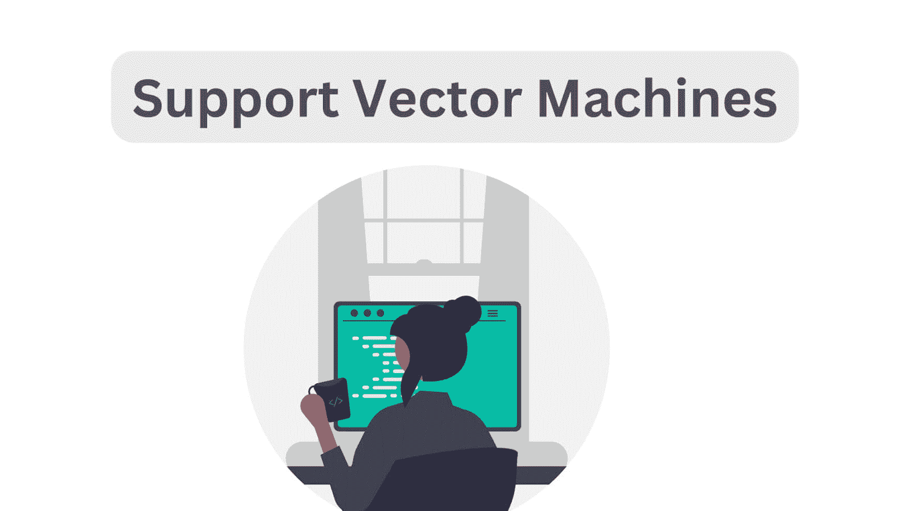

图片由作者提供

支持向量机，通常称为 SVM，是一类简单但强大的机器学习算法，用于分类和回归任务。在本讨论中，我们将重点介绍支持向量机在分类中的应用。

* * *

## 我们的前三个课程推荐

 1\. [谷歌网络安全证书](https://www.kdnuggets.com/google-cybersecurity) - 快速进入网络安全职业生涯。

 2\. [谷歌数据分析专业证书](https://www.kdnuggets.com/google-data-analytics) - 提升你的数据分析技能

 3\. [谷歌 IT 支持专业证书](https://www.kdnuggets.com/google-itsupport) - 支持你的组织 IT 工作

* * *

我们将从分类的基础知识和分隔类别的超平面开始。然后，我们将讨论最大间隔分类器，逐步构建到支持向量机及其在 scikit-learn 中的实现。

# 分类问题与分隔超平面

分类是一个监督学习问题，我们有标记的数据点，机器学习算法的目标是预测新数据点的标签。

为了简化，我们考虑一个二分类问题，其中有两个类别，即类别 A 和类别 B。我们需要找到一个超平面来分隔这两个类别。

从数学上讲，[超平面](https://en.wikipedia.org/wiki/Hyperplane)是一个维度比环境空间少一个的子空间。也就是说，如果环境空间是直线，超平面就是一个点。如果环境空间是二维平面，则超平面是一个线，依此类推。

因此，当我们有一个分隔两个类别的超平面时，属于类别 A 的数据点位于超平面的一侧。而属于类别 B 的数据点则位于另一侧。

因此，在一维空间中，分隔超平面是一个点：

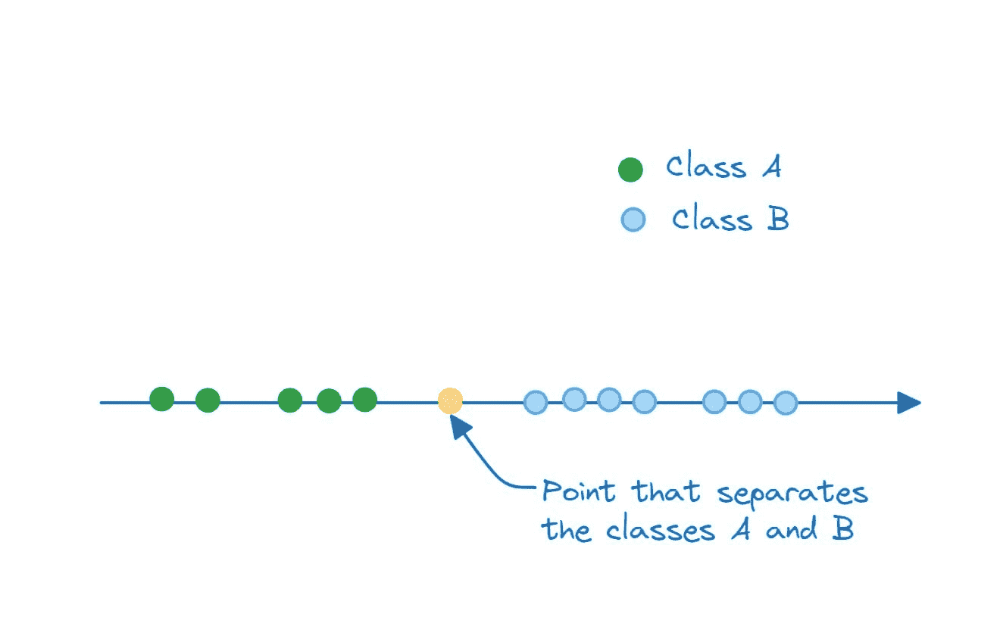

一维中的分隔超平面（一个点）| 图片由作者提供

在二维空间中，分隔类别 A 和类别 B 的超平面是一个线：

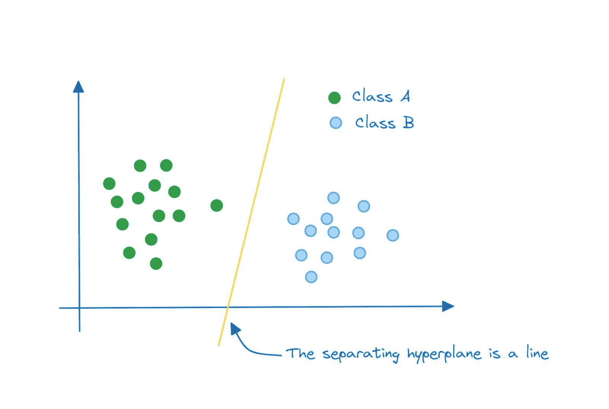

二维中的分隔超平面（一个线）| 图片由作者提供

在三维空间中，分隔超平面是一个平面：

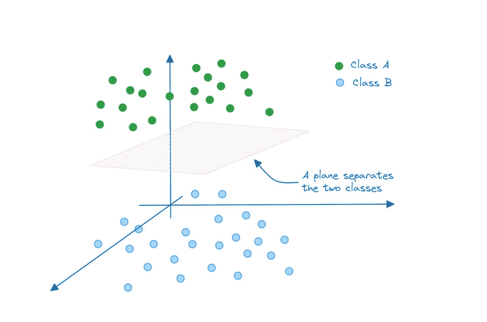

三维中的分隔超平面（一个平面）| 图片由作者提供

类似地，在 N 维空间中，分隔超平面将是一个(N-1)维子空间。

如果你仔细观察，对于二维空间示例，以下每一个都是有效的超平面，可以分隔类别 A 和类别 B：

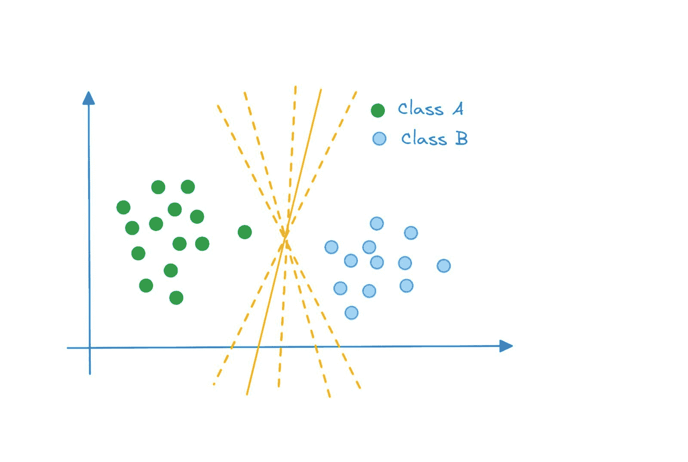

分隔超平面 | 图片作者

那么我们如何决定哪个超平面是最优的？引入**最大边际分类器**。

# 最大边际分类器

最优超平面是那个在*最大化*两个类别之间的边际的同时分隔这两个类别的超平面。这样功能的分类器称为最大边际分类器。

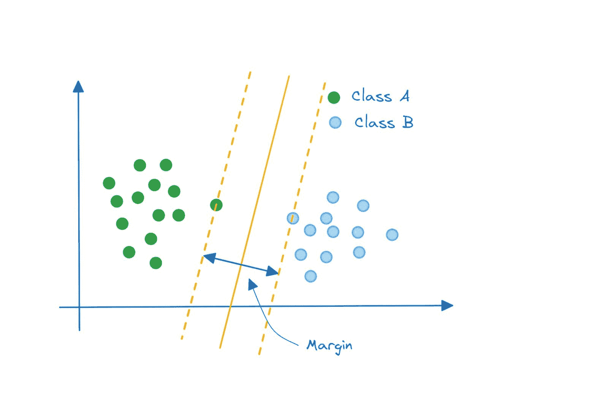

最大边际分类器 | 图片作者

## 硬边际和软边际

我们考虑了一个超级简化的例子，其中类别是完美可分的*并且*最大边际分类器是一个好的选择。

那么，如果你的数据点分布是这样的呢？这些类别仍然可以通过超平面完美分隔，而最大化边际的超平面将会是这样的：

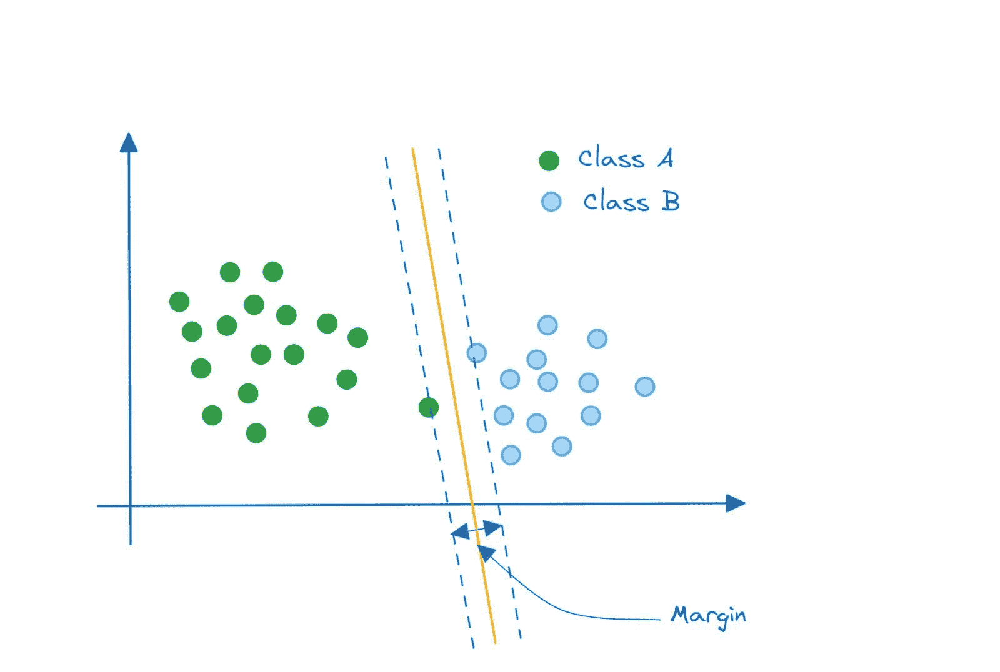

最大边际分类器是否最优？ | 图片作者

**但你看到这个方法的问题了吗？** 嗯，它仍然实现了类别分隔。然而，这是一种高变异性的模型，可能是尝试过于完美地拟合类别 A 的点。

不过注意，边际内没有任何误分类的数据点。这样的分类器被称为*硬边际*分类器。

不妨看看这个分类器。这样的分类器表现会更好吗？这是一个变异性更低的模型，它在对分类 A 和分类 B 的点进行分类时表现得相当好。

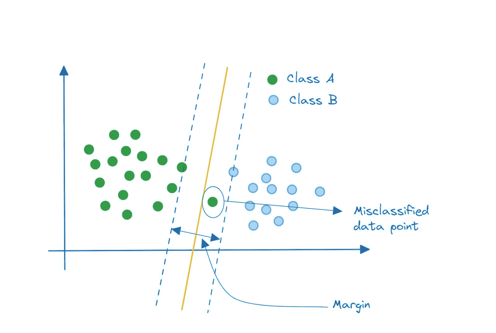

线性支持向量分类器 | 图片作者

注意到我们有一个在边际内被误分类的数据点。允许最小误分类的分类器是一种*软边际*分类器。

## 支持向量分类器

我们的软边际分类器是一个线性支持向量分类器。点可以通过一条直线（或线性方程）分隔开。如果你到目前为止一直在跟随，那么应该清楚*支持向量*是什么，以及*为什么*它们被称为支持向量。

每个数据点都是特征空间中的一个向量。最接近分隔超平面的数据点被称为支持向量，因为它们*支持*或辅助分类。

同样有趣的是，如果你移除一个或一组*非*支持向量的数据点，分隔超平面不会改变。但是，如果你移除一个或多个支持向量，超平面会改变。

在迄今为止的示例中，数据点是线性可分的。因此，我们可以拟合一个具有最小误差的软边际分类器。但如果数据点像这样分布呢？

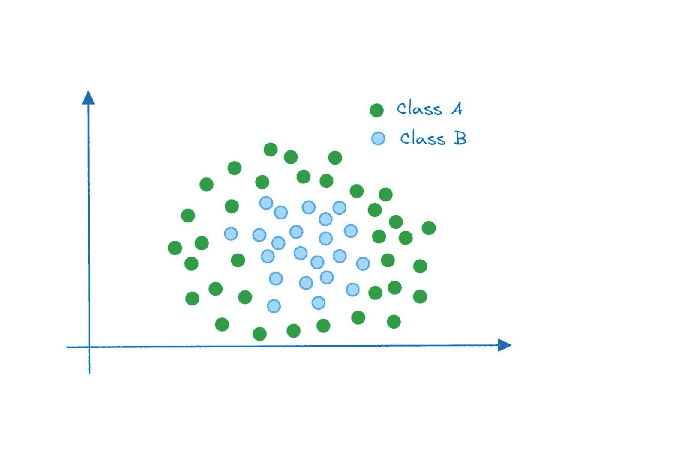

非线性可分的数据 | 图片作者

在这个示例中，数据点*不可*线性可分。即使我们有一个允许误分类的软边际分类器，我们也*无法*找到一条（分隔超平面）能在这两个类别上取得良好表现的直线。

那我们现在该怎么办？

# 支持向量机与核技巧

这是我们将要做的总结：

+   **问题**：数据点在原始特征空间中不可线性分隔。

+   **解决方案**：将点投影到更高维空间，在该空间中它们是线性可分的。

但将点投影到更高维特征空间要求我们*将数据点映射* 从原始特征空间到更高维空间。

这种重新计算带来了不可忽视的开销，特别是当我们要投影到的空间比原始特征空间的维度高得多时。这里是核技巧发挥作用的地方。

从数学上讲，你可以用以下方程来表示支持向量分类器 [1]：

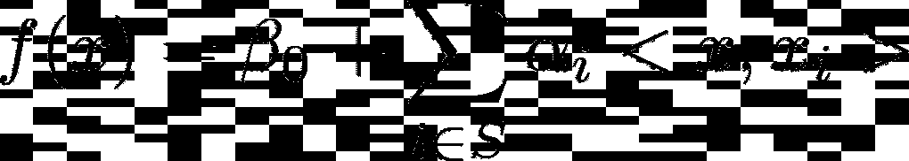

在这里，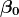 是一个常量， 表示我们对对应于支持点的索引集求和。

 是点  和  之间的内积。两个向量 a 和 b 之间的内积由以下公式给出：

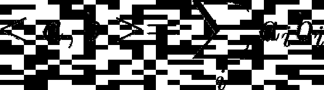

核函数 K(.) 使线性支持向量分类器能够推广到非线性情况。我们用核函数替换内积：

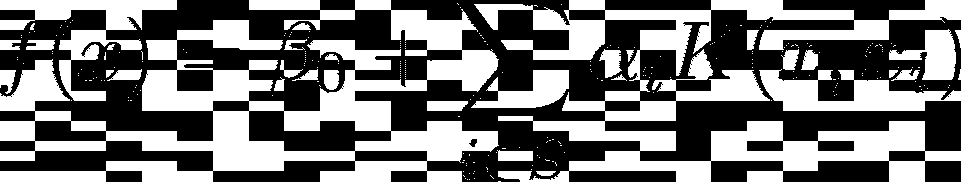

核函数处理非线性问题。它还允许在原始特征空间的数据点上执行计算，而无需在更高维空间中重新计算它们。

对于线性支持向量分类器，核函数只是内积，形式如下：

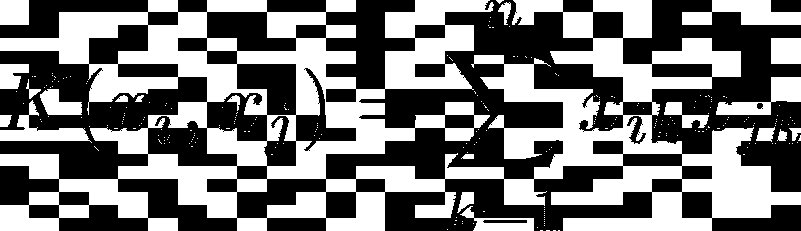

# Scikit-Learn 中的支持向量机

现在我们理解了支持向量机的直觉原理，让我们使用 scikit-learn 库编写一个简单的示例。

-   [svm 模块](https://scikit-learn.org/stable/modules/classes.html#module-sklearn.svm)在 scikit-learn 库中包含了 [Linear SVC](https://scikit-learn.org/stable/modules/generated/sklearn.svm.LinearSVC.html#sklearn.svm.LinearSVC)、[SVC](https://scikit-learn.org/stable/modules/generated/sklearn.svm.SVC.html#sklearn.svm.SVC) 和 [NuSVC](https://scikit-learn.org/stable/modules/generated/sklearn.svm.NuSVC.html#sklearn.svm.NuSVC) 等类的实现。这些类可用于二分类和多分类问题。Scikit-learn 的扩展文档列出了 [支持的核函数](https://scikit-learn.org/stable/modules/svm.html#svm-kernels)。

-   我们将使用 [内置的葡萄酒数据集](https://scikit-learn.org/stable/modules/generated/sklearn.datasets.load_wine.html)。这是一个分类问题，其中葡萄酒的特征用于预测输出标签，该标签是三类中的一个：0、1 或 2。数据集较小，大约有 178 条记录和 13 个特征。

-   在这里，我们将仅关注：

+   -   加载和预处理数据以及

+   将分类器适配到数据集

## -   步骤 1 – 导入必要的库并加载数据集

-   首先，让我们加载 scikit-learn 数据集模块中可用的葡萄酒数据集：

```py
from sklearn.datasets import load_wine

# Load the wine dataset
wine = load_wine()
X = wine.data
y = wine.target
```

## -   步骤 2 – 将数据集拆分为训练集和测试集

-   我们将数据集拆分为训练集和测试集。在这里，我们使用 80:20 的拆分比例，其中 80% 的数据点用于训练集，20% 的数据点用于测试集：

```py
from sklearn.model_selection import train_test_split

# Split the dataset into training and test sets
X_train, X_test, y_train, y_test = train_test_split(X, y, test_size=0.2, random_state=10)
```

## -   步骤 3 – 预处理数据集

-   接下来，我们预处理数据集。我们使用 `StandardScaler` 将数据点转换为均值为零和方差为一的分布：

```py
# Data preprocessing
from sklearn.preprocessing import StandardScaler

scaler = StandardScaler()
X_train_scaled = scaler.fit_transform(X_train)
X_test_scaled = scaler.transform(X_test)
```

-   记得不要在测试数据集上使用 `fit_transform`，因为这会导致数据泄漏的问题。

## -   步骤 4 – 实例化一个 SVM 分类器并将其适配到训练数据上

-   我们将使用 `SVC` 作为示例。我们实例化了 `svm`，一个 SVC 对象，并将其适配到训练数据上：

```py
from sklearn.svm import SVC

# Create an SVM classifier
svm = SVC()

# Fit the SVM classifier to the training data
svm.fit(X_train_scaled, y_train)
```

## -   步骤 5 – 预测测试样本的标签

-   要预测测试数据的类别标签，我们可以在 `svm` 对象上调用 `predict` 方法：

```py
# Predict the labels for the test set
y_pred = svm.predict(X_test_scaled)
```

## -   步骤 6 – 评估模型的准确性

-   总结讨论，我们将只计算准确率。但我们也可以获得更详细的分类报告和混淆矩阵。

```py
from sklearn.metrics import accuracy_score

# Calculate the accuracy of the model
accuracy = accuracy_score(y_test, y_pred)
print(f"{accuracy=:.2f}")
```

```py
Output >>> accuracy=0.97
```

-   以下是完整的代码：

```py
from sklearn.datasets import load_wine
from sklearn.model_selection import train_test_split
from sklearn.preprocessing import StandardScaler
from sklearn.svm import SVC
from sklearn.metrics import accuracy_score

# Load the wine dataset
wine = load_wine()
X = wine.data
y = wine.target

# Split the dataset into training and test sets
X_train, X_test, y_train, y_test = train_test_split(X, y, test_size=0.2, random_state=10)

# Data preprocessing
from sklearn.preprocessing import StandardScaler

scaler = StandardScaler()
X_train_scaled = scaler.fit_transform(X_train)
X_test_scaled = scaler.transform(X_test)

# Create an SVM classifier
svm = SVC()

# Fit the SVM classifier to the training data
svm.fit(X_train_scaled, y_train)

# Predict the labels for the test set
y_pred = svm.predict(X_test_scaled)

# Calculate the accuracy of the model
accuracy = accuracy_score(y_test, y_pred)
print(f"{accuracy=:.2f}")
```

-   我们有一个简单的支持向量分类器。你可以调整超参数以提高支持向量分类器的性能。常调的超参数包括正则化常数 C 和 gamma 值。

# -   结论

-   希望你觉得这份介绍性支持向量机的指南有用。我们涵盖了足够的直觉和概念，以理解支持向量机的工作原理。如果你有兴趣深入了解，可以查看下面的参考资料。继续学习！

# -   参考资料和学习资源

-   [1] 支持向量机章节，[《统计学习简介（ISLR）》](https://www.statlearning.com/)

[关于核机器的章节，[机器学习介绍](https://mitpress.mit.edu/9780262043793/introduction-to-machine-learning/)]

[支持向量机，[scikit-learn 文档](https://scikit-learn.org/stable/modules/svm.html)]

**[Bala Priya C](https://www.linkedin.com/in/bala-priya/)** 是一位来自印度的开发者和技术写作者。她喜欢在数学、编程、数据科学和内容创作的交汇点上工作。她的兴趣和专长领域包括 DevOps、数据科学和自然语言处理。她喜欢阅读、写作、编码和喝咖啡！目前，她正在通过撰写教程、操作指南、观点文章等方式，学习并与开发者社区分享她的知识。

### 更多相关话题

+   [支持向量机：直观的方法](https://www.kdnuggets.com/2022/08/support-vector-machines-intuitive-approach.html)

+   [语义向量搜索如何改变客户支持互动](https://www.kdnuggets.com/how-semantic-vector-search-transforms-customer-support-interactions)

+   [自然语言处理的温和介绍](https://www.kdnuggets.com/2022/06/gentle-introduction-natural-language-processing.html)

+   [Python 向量数据库和向量索引：构建 LLM 应用](https://www.kdnuggets.com/2023/08/python-vector-databases-vector-indexes-architecting-llm-apps.html)

+   [人工智能伦理：导航智能机器的未来](https://www.kdnuggets.com/2023/04/ethics-ai-navigating-future-intelligent-machines.html)

+   [AI for Ukraine 是 AI HOUSE 推出的一个新的教育项目，以支持乌克兰科技社区……](https://www.kdnuggets.com/2022/08/ai-house-ai-ukraine-new-educational-project-support-ukrainian-tech-community.html)
