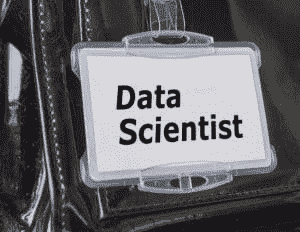

# 如何获得数据科学工作：一个极其具体的指南

> 原文：[`www.kdnuggets.com/2017/03/get-data-science-job-guide.html`](https://www.kdnuggets.com/2017/03/get-data-science-job-guide.html)

评论

#### 1\. 访问[LinkedIn](https://www.linkedin.com/)

+   向数据科学家发送二十个连接请求。

+   给一个连接发消息，告诉他们你在寻找数据科学职位。

+   分享一篇来自[datatau.com](http://www.datatau.com/)的文章，这篇文章教会了你一些东西。

#### 2\. 访问[GlassDoor](https://www.glassdoor.com/index.htm)

+   阅读三个[数据科学家职位描述](https://www.glassdoor.com/Job/data-scientist-jobs-SRCH_KO0,14.htm)。记录你需要建立的技能。

+   申请数据科学家职位，无论你是否具备资格。

#### 3\. 建立技能

+   选择一个技能，并用它来[创建一个小的演示或教程](http://brohrer.github.io/one_step_program_become_data_scientist.html)。不要花费超过十个小时。

+   将你的演示/教程发布到网上。将技能添加到你的 LinkedIn 个人资料中，并在项目部分添加链接。

#### 4\. 面试

+   只回答知道你名字的招聘人员。

+   参加你能参加的每一次面试。记录你需要建立的技能。

#### 5\. 拒绝报价

#### 6\. 回到第一步

最终你会遇到一个点，你会发现自己无法完成第五步。这个职位虽然不完全符合你的要求，但感觉非常合适，你无法放弃。那时你就完成了。

#### 提示

* * *

## 我们的前三个课程推荐

 1\. [谷歌网络安全证书](https://www.kdnuggets.com/google-cybersecurity) - 快速进入网络安全职业的轨道。

 2\. [谷歌数据分析专业证书](https://www.kdnuggets.com/google-data-analytics) - 提升你的数据分析能力

 3\. [谷歌 IT 支持专业证书](https://www.kdnuggets.com/google-itsupport) - 支持你的组织的 IT

* * *

每次公司不向你提供报价时，都会感到受伤。即使你打算拒绝他们，仍然会感觉像是胃部被重击。你会怀疑自己是否足够聪明、年轻、经验丰富或准备充分。这很正常。虽然很糟糕，但要接受这种失望。向你的男朋友倾诉，或者打电话给你的兄弟，或者去跳舞，或者喝一杯高杯苏格兰威士忌。不管你的处理方式如何，都要处理好，同时在脑海中重复“我足够好”。因为你确实足够好。然后回到第一步，再试一次。

这种方法是有效的。它是一个循环，终止条件是成功。或者用约翰·列侬的话来说：“一切都会好起来的。如果现在不好，那就不是结局。”

祝你好运！

你有任何想要添加的求职建议吗？在 LinkedIn 上联系我并发消息。我会汇总并分享出来。如果你希望保持匿名，请务必告知我。

[原文](http://brohrer.github.io/get_data_science_job.html)。经授权转载

**相关：**

+   分析与数据科学专业人员的职业建议 –

+   想要一个数据科学职位？

+   如何获得你的第一份数据科学工作？

### 更多相关话题

+   [停止学习数据科学以寻找目标，并寻找目标来……](https://www.kdnuggets.com/2021/12/stop-learning-data-science-find-purpose.html)

+   [数据科学学习统计的顶级资源](https://www.kdnuggets.com/2021/12/springboard-top-resources-learn-data-science-statistics.html)

+   [建立一个稳固的数据团队](https://www.kdnuggets.com/2021/12/build-solid-data-team.html)

+   [成功数据科学家的 5 个特征](https://www.kdnuggets.com/2021/12/5-characteristics-successful-data-scientist.html)

+   [成为优秀数据科学家所需的 5 项关键技能](https://www.kdnuggets.com/2021/12/5-key-skills-needed-become-great-data-scientist.html)

+   [每个初学者数据科学家都应该掌握的 6 种预测模型](https://www.kdnuggets.com/2021/12/6-predictive-models-every-beginner-data-scientist-master.html)
