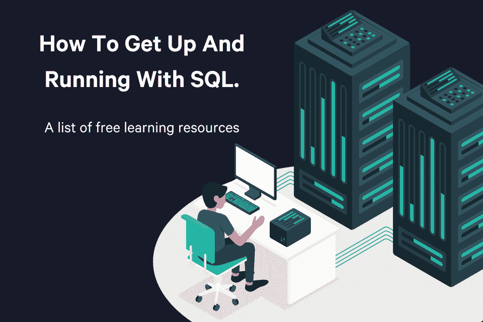

# 如何快速上手 SQL——免费的学习资源列表

> 原文：[`www.kdnuggets.com/2022/10/get-running-sql-list-free-learning-resources.html`](https://www.kdnuggets.com/2022/10/get-running-sql-list-free-learning-resources.html)

Vector by storyset on Freepik

考虑到您点击了这篇文章，我想可以安全地说，您要么刚开始数据学习之旅，要么正在寻找提升 SQL 技能的方法！那么，您来对地方了，我不会让您失望！在本文中，您将简要了解 SQL 的背景，包括它如何以及为何变得流行，以及我发现的一些最佳免费课程/资源，用于开始和继续提升您的 SQL 技能！

* * *

## 我们的前三个课程推荐

 1\. [谷歌网络安全证书](https://www.kdnuggets.com/google-cybersecurity) - 快速进入网络安全职业生涯。

 2\. [谷歌数据分析专业证书](https://www.kdnuggets.com/google-data-analytics) - 提升您的数据分析技能

 3\. [谷歌 IT 支持专业证书](https://www.kdnuggets.com/google-itsupport) - 支持您的组织在 IT 方面

* * *

# 为什么需要学习 SQL？以及最佳的学习方式

自 1970 年代，当两位 IBM 研究人员雷蒙德·博伊斯（Raymond Boyce）和唐纳德·钱伯林（Donald Chamberlin）开发出一种新的编码语言后，数据行业一直严重依赖 SQL 来有效查询和转换数据。随着数据团队将存储和计算转移到云网络服务器上，这一点变得更加明显。

随着这些变化，对于从事数据分析工作的人来说，掌握这种语言变得越来越重要。互联网上有很多关于不同备忘单的噪音，这些备忘单提供了最基本的 SQL 转换。凭借我作为数据分析师和数据科学家的多年经验，我可以告诉您，这些备忘单中的很少一部分能在长期内真正帮助到您。实际上，只有两种方法可以有效地使用 SQL——学习基础知识，然后继续提高技能，或者（更流行的方法）利用其他工具提高生产力，最佳的做法是两者的结合！

# 顶级免费入门课程

## Udemy SQL 课程

[免费的入门课程](https://www.udemy.com/course/introduction-to-databases-and-sql-querying/)

Udemy 是一个在线学习和教学市场，提供超过 204,000 门课程和 5400 万学生。上述链接是一个全面的课程，评分为 4.5，已有超过 450,000 名学生完成了该课程！此外，该课程没有先决条件。

[所有 SQL 课程（付费）](https://www.udemy.com/courses/search/?src=ukw&q=SQL)

## PopSQL

[SQL 如何操作列表](https://popsql.com/learn-sql)

PopSQL 是一个现代化的 SQL 编辑器。它允许你与同事和朋友协作编写正确的 SQL 查询。既然你对这个概念有了坚实的基础，那么他们提供的学习 SQL 的资源也很有用。此外，这个资源将不同的语法分开，这样你只需要使用你想要的程序。我建议你在更好地理解你尝试运行的不同变换后使用它。

## W3Schools.com

[SQL 教程](https://www.w3schools.com/sql/)

W3Schools 是最大的网站开发平台之一。它包含了大量关于多种编程语言的课程。他们的 SQL 教程将教你 MySQL、SQL Server、MS Access、Oracle、Sybase、Informix、Postgres 以及其他一些数据库系统。这个教程的优点是有大量的示例和测验来测试你的知识！此外，他们还提供 SQL 参考，你可以在这里找到各种关键字和函数。这个教程会给你一个证书，证明你已经掌握了 SQL 的基本知识。

## 可汗学院

[SQL 简介：查询和管理数据](https://www.khanacademy.org/computing/computer-programming/sql)

可汗学院是一个 501(c)(3)非营利组织，像上述所有资源一样，它是完全免费的。这是一个初学者课程，你将学习如何使用 SQL 来存储、查询和操作关系型数据库中的数据。这个课程提供了多个视频、引人入胜的挑战和课程结束的测验来测试你的知识。虽然它比一些其他资源需要更多的自学，但对于任何想要学习或练习 SQL 技能的人来说，仍然是一个了不起的资源。

# 现在该怎么办？

现在你已经完成了 SQL 的入门课程，并且对查询结构和不同的变换有了基本了解，你面临一个选择。你应该知道你想达成什么目标以及如何达成它，但可能没有时间通过 Stackoverflow 或 Google 来完善那些特定查询的细节。这时你应该寻找不同的工具来帮助你节省时间，提高效率。以下是我推荐给任何新手或有志 SQL 用户的两个资源。这些资源来自我最近发布的一篇文章，标题为[每个数据分析师都应该拥有的五大书签](https://medium.com/towards-data-science/top-5-bookmarks-every-data-analyst-should-have-547a2c9ad1fe)。

## 代码美化工具

[SQL 格式化工具](https://codebeautify.org/sqlformatter)

互联网上有很多不同的 SQL 格式化工具，但这是我使用并喜欢的。这个工具非常适合你和你的同事，因为你们不再需要深入挖掘复杂的查询来找到试图运行的转换；SQL Formatter 会立即以结构化的方式格式化查询，使你和你的同事都更容易跟随。

从本质上讲，美化工具将把这些内容：

并将其转化为这个！

## Rasgo

[免费 SQL 生成器](https://app.rasgoml.com/sql)

即便是最有经验的 SQL 开发人员也难以记住各种转换所需的所有语法。对此，许多 SQL 用户花费大量时间搜索过去的项目或不同的在线资源，如 Stackoverflow 和论坛，寻找答案。对于在数据驱动的企业中工作的数据从业者来说，节省时间几乎和数据质量一样重要。

我推荐使用这个 SQL 生成器——“SQL 生成器基本上是一个 SQL 查询的模板，允许你自定义列名和表结构，选择你要进行的操作，然后以多种不同的 SQL ‘风格’构造语法。”

我找到了一篇介绍如何使用 [SQL 生成器的博客](https://www.rasgoml.com/post/sql-generator)。另外，最近我发现我的秘密被揭露了；Suraj Gurav 最近写了一篇关于这个 SQL 生成器的评论，标题为 [如何在不输入的情况下编写 SQL 查询](https://medium.com/learning-sql/how-to-write-sql-queries-without-typing-4b634cc67ae0)。

# 结论

SQL 是处理数据时应了解的最重要的编程语言之一，更具体地说，是在旋转数据库中使用。初次接触这门编程语言时，可能会觉得非常难以驾驭。不过，我希望通过以上资源，你可以通过免费的课程获得对语言的良好基础理解，然后利用其他免费的资源进一步提升你的知识和能力！

**[乔什·贝瑞](https://www.linkedin.com/in/joshberry022/)** ([**@Twitter**](https://mobile.twitter.com/itsamejoshabee)) 领导 Rasgo 的面向客户的数据科学团队，并自 2008 年起从事数据和分析工作。乔什在 Comcast 工作了 10 年，期间建立了数据科学团队，并且是内部开发的 Comcast 功能商店的关键负责人之一——这是市场上首批功能商店之一。在离开 Comcast 后，乔什在 DataRobot 关键地领导了面向客户的数据科学建设。在业余时间，乔什会对棒球、F1 赛车、房地产市场预测等有趣话题进行复杂的分析。

### 更多相关主题

+   [掌握大型语言模型的全面资源列表](https://www.kdnuggets.com/a-comprehensive-list-of-resources-to-master-large-language-models)

+   [学习高级 SQL 技巧的前 5 个免费资源](https://www.kdnuggets.com/top-5-free-resources-for-learning-advanced-sql-techniques)

+   [在 Google Colab 上免费运行 Mixtral 8x7b](https://www.kdnuggets.com/running-mixtral-8x7b-on-google-colab-for-free)

+   [最全面的 Kaggle 解决方案和创意列表](https://www.kdnuggets.com/2022/11/comprehensive-list-kaggle-solutions-ideas.html)

+   [SQL 面试准备材料资源](https://www.kdnuggets.com/2023/02/sql-interviews-preparations-material-resources.html)

+   [2023 年最佳 7 款数据建模工具列表](https://www.kdnuggets.com/2023/03/list-7-best-data-modeling-tools-2023.html)
