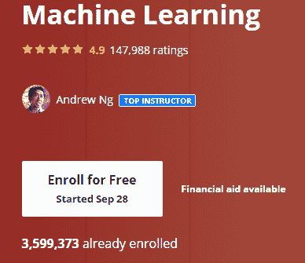
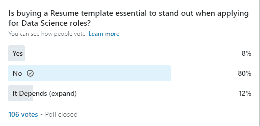

# 获取数据科学职位比以往任何时候都更加困难 - 如何将这一点转变为你的优势

> 原文：[`www.kdnuggets.com/2020/10/getting-data-science-job-harder.html`](https://www.kdnuggets.com/2020/10/getting-data-science-job-harder.html)

评论

**由 [库尔蒂斯·派克斯](https://www.linkedin.com/in/kurtispykes/)，AI 作家**。

* * *

## 我们的前三大课程推荐

 1\. [谷歌网络安全证书](https://www.kdnuggets.com/google-cybersecurity) - 快速进入网络安全职业生涯。

 2\. [谷歌数据分析专业证书](https://www.kdnuggets.com/google-data-analytics) - 提升你的数据分析技能

 3\. [谷歌 IT 支持专业证书](https://www.kdnuggets.com/google-itsupport) - 支持你的组织 IT 部门

* * *

*照片由 [马丁·佩奇](https://unsplash.com/@martinpechy?utm_source=medium&utm_medium=referral) 在 Unsplash 上拍摄。*

在撰写这篇文章时，由于我在上一家公司因为 Covid-19 的影响而遇到困难，我目前正在寻找新的数据科学家职位。

这次，我注意到情况比我上次求职时要困难得多，但与其利用这些挑战来延长我们成为数据科学家的梦想或在最坏的情况下放弃它们，不如我努力更好地理解这些挑战，以便找到一些解决方案，使其对我和你们最有利！

### 奇异的职位要求

这似乎是我与数据科学求职者讨论时的一个共同话题 —

> 现在没有人感到自己有资格了。

许多数据科学职位描述未能传达所广告职位的**实际**要求。

其主要影响之一是，那些根据职位描述优先考虑个人和技术技能的有志数据科学家可能会对履行角色的要求产生误解。另一个问题是，招聘人员会收到许多不符合要求的申请。

根据 [杰雷米·哈里斯](https://medium.com/u/59564831d1eb?source=post_page-----fb796aae1922--------------------------------) 的一篇精彩文章《[*数据科学职位发布的问题*](https://towardsdatascience.com/the-problem-with-data-science-job-postings-8a3542f38724)》，职位描述可能显得难以理解的原因有很多，关键在于你需要区分你所在的职位属于哪个类别：

+   解决问题的方式有很多，因此很难为职位描述缩小范围。

+   新的数据科学团队可能会鼓励人们成为全能型人才，这在职位描述中也有所体现。

+   公司缺乏了解他们所面临的问题以及解决这些问题的人应该具备哪些能力的经验。

+   由招聘人员编写。

**解决方案**

虽然这需要你的一些洞察力，但识别那些看似过于夸张的职位描述潜在原因是重要的，因为某些情况可能对你的数据科学家成长有害，比如成为万事通。

克服这一挑战的一个好方法是承认职位描述只是公司的一份愿望清单，他们希望聘请一个他们认为有能力解决实际问题的人。

就此而言，务必以一种让他人（公司）认为你具备解决他们挑战的能力的方式展示你的能力。此外，如果你满足任何职位描述的至少 50%的要求，那么你可能是合格的，应该尝试申请该职位——如果你完全符合职位描述的 100%，你可能会显得过于资深。

### 数据科学正变得越来越生产化

能够启动一个 Jupyter Notebook 并进行一些可视化，然后建立一个模型在过去曾有效，但在我看来，这已不足以让你引起关注。

Jupyter Notebooks 在进行实验时非常有用，但当你进入现实世界时，有一个阶段我们会超越实验阶段。我认为每个数据科学家都应该知道如何启动一个 Jupyter Notebook，但随着数据科学变得更加生产化，能够编写生产级代码的数据科学家将获得额外的加分，因为这样可以节省成本和时间。

这里有三个原因说明每位数据科学家都应该知道如何编写生产级代码：

+   数据科学家与工程师之间的沟通可能会出现信息丢失。

+   消除了过程中的延迟。

+   一石二鸟，因为一个人能做两个人的工作——这让你更有价值。

**解决方案**

尽管有争议，我相信数据科学家和软件工程师的技能在面对产品的数据科学应用时正在趋同，因此更多的数据科学家应该[学习软件工程最佳实践](https://towardsdatascience.com/data-scientist-should-know-software-engineering-best-practices-f964ec44cada)。

如果你已经知道如何编写生产级代码，你可能会想查看[Schaun Wheeler](https://medium.com/u/2d3762e7f110?source=post_page-----fb796aae1922--------------------------------)的一篇名为[*“生产化数据科学”是什么意思？*](https://towardsdatascience.com/what-does-it-mean-to-productionize-data-science-82e2e78f044c)的文章，它非常出色地总结了数据科学生产化中超越代码层面的系统最佳实践——这是一篇非常有趣的阅读。

> *“‘在生产中’意味着它是从业务到客户的管道的一部分。[...] 在数据科学中，如果某件事在生产中，那么它就处于将信息放在被消耗的位置上的路径上。”*

### 竞争

数据科学是地球上增长最快和最具前景的技术之一，很多人纷纷更新技能，争取成为数据科学家。为了证实这一点，自开设以来，超过 350 万人已报名参加安德鲁·吴的机器学习课程（这是数据科学的重要组成部分）。

这是 21 世纪最吸引人的工作是有原因的。

现在越来越多的人试图进入这一领域，因此工作竞争非常激烈。然而，这不应成为你决定不去寻找工作的理由！

**解决方案**

是的，我们确实需要做更多的事情来脱颖而出。然而，根据我在 LinkedIn 个人资料上进行的最近一次调查，这并不一定意味着拥有最华丽的简历。

*来源：[Kurtis Pykes 的 LinkedIn](https://www.linkedin.com/posts/kurtispykes_datascience-machinelearning-artificialintelligence-activity-6714579336265011200-2Q0l)。*

当然，拥有一个出色的作品集是脱颖而出的好方法，但在提高获得机会的几率方面，似乎没有什么能超越主动联系招聘经理或在你申请的地方担任高级角色的数据科学家。

LinkedIn 使得找到在特定公司工作的人员变得非常容易，它应该成为求职过程的一部分。

### 结论

难以找到数据科学工作不应成为你不去寻找工作的理由。任何工作都会面临许多挑战，找到工作只是资格阶段，以验证雇主是否相信你能应对挑战，以及你是否相信雇主是你希望加入的团队。始终寻求自我提升，不要等到“准备好”才去申请，因为你可能永远不会感到准备好，不要害怕被拒绝或拒绝那些与你的目标不一致的公司。

[原文](https://towardsdatascience.com/getting-a-data-science-job-is-harder-than-ever-fb796aae1922)。经许可转载。

**个人简介：** [Kurtis Pykes](https://www.linkedin.com/in/kurtispykes/) 对利用机器学习和数据科学的力量帮助人们变得更高效和有效充满热情。

**相关：**

+   [我如何在 8 个月内提升我的数据科学技能](https://www.kdnuggets.com/2020/10/level-up-data-science-skills-8-months.html)

+   [不受欢迎的观点 – 数据科学家应更具端到端能力](https://www.kdnuggets.com/2020/09/data-scientists-should-be-more-end-to-end.html)

+   [9 个发展中的数据科学与分析工作趋势](https://www.kdnuggets.com/2020/09/data-science-analytics-job-trends.html)

### 更多相关主题

+   [IMPACT: 数据可观测性峰会将于 11 月 8 日回归…](https://www.kdnuggets.com/2023/10/monte-carlo-impact-the-data-observability-summit-is-back)

+   [使用 DuckDB 和…将你的笔记本电脑变成个人分析引擎](https://www.kdnuggets.com/turn-your-laptop-into-a-personal-analytics-engine-with-duckdb-and-motherduck)

+   [KDnuggets 新闻，9 月 14 日：免费数据科学 Python 课程 •…](https://www.kdnuggets.com/2022/n36.html)

+   [在不断变化的世界中如何成长为数据科学家](https://www.kdnuggets.com/2022/01/grow-data-scientist-everchanging-world.html)

+   [你想知道的所有关于机器学习的知识](https://www.kdnuggets.com/2022/09/everything-youve-ever-wanted-to-know-about-machine-learning.html)

+   [数据分析中的职业趋势：用于职位趋势分析的 NLP](https://www.kdnuggets.com/job-trends-in-data-analytics-nlp-for-job-trend-analysis)
