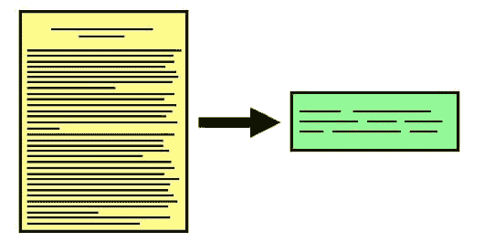

# 开始自动文本摘要

> 原文：[`www.kdnuggets.com/2019/11/getting-started-automated-text-summarization.html`](https://www.kdnuggets.com/2019/11/getting-started-automated-text-summarization.html)



来源：[SFL Scientific](https://sflscientific.com/data-science-blog/2016/11/17/text-summarization-in-natural-language-processing)

* * *

## 我们的三大课程推荐

 1\. [Google 网络安全证书](https://www.kdnuggets.com/google-cybersecurity) - 快速开启网络安全职业生涯。

 2\. [Google 数据分析专业证书](https://www.kdnuggets.com/google-data-analytics) - 提升你的数据分析能力

 3\. [Google IT 支持专业证书](https://www.kdnuggets.com/google-itsupport) - 支持你的组织在 IT 领域

* * *

[自动文本摘要](https://www.kdnuggets.com/2019/01/approaches-text-summarization-overview.html)是指使用某种形式的启发式或统计方法对文档或多个文档进行摘要。此处的摘要是指一个简化的文本，准确捕捉并传达我们想要摘要的文档中最重要和相关的信息。

摘要技术有两种分类：抽取式和生成式。我们将在此重点讨论抽取式方法，它通过识别文本中重要的句子或摘录并逐字复述这些内容作为摘要。不会生成新的文本；仅使用现有文本进行摘要。这与生成式方法不同，生成式方法使用更强大的自然语言处理技术来解释文本并生成新的摘要文本。

这篇文章将演示一个抽取式摘要过程，使用简单的词频方法，在 Python 中实现。在开始之前，请注意我们不会在这篇文章中花费太多精力进行数据预处理、分词、标准化等操作（类似于上次），也不会介绍任何能够轻松有效执行这些任务的库。我希望重点介绍文本摘要的步骤，略过其他重要的概念。我计划在这篇文章后续进行更多的跟进，并在过程中逐步增加我们自然语言处理任务的复杂性。

此外，例如，由于我们在这里进行了一些最小化的分词，你将会体会到何时进行分词，且更有效的处理方法可以作为读者的练习。

让我们明确一下我们要做什么：

+   处理文本输入（如一篇简短的新闻文章）

+   执行最小化的文本预处理

+   创建数据表示

+   使用这种数据表示法执行摘要

有多种文本摘要方法，如上所述，我们将使用一种非常基础的提取方法，这种方法基于给定文章中的词频。

由于我们几乎不依赖库，我们的导入语句很少：

```py
from collections import Counter 
from string import punctuation
from sklearn.feature_extraction.stop_words import ENGLISH_STOP_WORDS as stop_words
```

我们需要`punctuation`和`stop_words`模块来识别这些元素，以便在对单词和句子进行评分时确定它们的相对重要性。对于这个任务，我们不会认为标点符号或停用词“重要”。为什么？与语言建模任务相比，其中这些元素无疑是有用的，或者与文本分类任务相比，这些元素可能会有用，但很明显，包含频繁出现的停用词或重复的标点符号会导致偏向这些标记，对我们没有益处。我们有各种理由希望**不**排除停用词（任意删除它们应当避免），但这似乎不是其中之一。

接下来，我们需要一些文本来测试我们的摘要技术。我手动从 CNN 复制并粘贴了这篇文章，但你可以随意寻找自己的：

```py
# https://www.cnn.com/2019/11/26/politics/judiciary-committee-hearing/index.html

text = """
The House Judiciary Committee has invited President Donald Trump or his counsel to participate in the panel's first impeachment hearing next week as the House moves another step closer to impeaching the President. 
The committee announced that it would hold a hearing December 4 on the "constitutional grounds for presidential impeachment," with a panel of expert witnesses testifying.
House Judiciary Chairman Jerry Nadler sent a letter to Trump on Tuesday notifying him of the hearing and inviting the President or his counsel to participate, including asking questions of the witnesses.
"I write to ask if you or your counsel plan to attend the hearing or make a request to question the witness panel," the New York Democrat wrote.
In the letter, Nadler said the hearing would "serve as an opportunity to discuss the historical and constitutional basis of impeachment, as well as the Framers' intent and understanding of terms like 'high crimes and misdemeanors.' "
"We expect to discuss the constitutional framework through which the House may analyze the evidence gathered in the present inquiry," Nadler added. "We will also discuss whether your alleged actions warrant the House's exercising its authority to adopt articles of impeachment."
The Judiciary Committee hearing is the latest sign that House Democrats are moving forward with impeachment proceedings against the President following the two-month investigation led by the House Intelligence Committee into allegations that Trump pushed Ukraine to investigate his political rivals while a White House meeting and $400 million in security aid were withheld from Kiev.
The hearing announcement comes as the Intelligence Committee plans to release its report summarizing the findings of its investigation to the House Judiciary Committee soon after Congress returns from its Thanksgiving recess next week.
Democratic aides declined to say what additional hearings they will schedule as part of the impeachment proceedings.
The Judiciary Committee is expected to hold multiple hearings related to impeachment, and the panel would debate and approve articles of impeachment before a vote on the House floor.
The aides said the first hearing was a "legal hearing" that would include some history of impeachment, as well as evaluating the seriousness of the allegations and the evidence against the President.
Nadler asked Trump to respond by Sunday on whether the White House wanted to participate in the hearings, as well as who would act as the President's counsel for the proceedings. The letter was copied to White House Counsel Pat Cipollone.
"""
```

我说过我们没有进行分词吗？实际上，我们确实进行了分词，只是做得很差。但现在让我们不再关注这个问题。我们需要两个简单的分词函数：一个用于将句子分词成单词，另一个用于将文档分词成句子：

```py
def tokenizer(s):
    tokens = []
    for word in s.split(' '):
        tokens.append(word.strip().lower())
    return tokens

def sent_tokenizer(s):
    sents = []
    for sent in s.split('.'):
        sents.append(sent.strip())
    return sents
```

我们需要单个单词来确定它们在文档中的相对频率，并分配相应的分数；我们需要单个句子来随后汇总每个单词的分数，以确定句子的“重要性”。

请注意，我们在这里使用“重要性”作为文档中相对词频的同义词；我们将每个单词的出现次数除以文档中出现频率最高的单词的出现次数。这种高频等于真正的*重要性*吗？假设它等于重要性是幼稚的，但这也是引入文本摘要概念的最简单方法。对我们这里的“重要性”假设感兴趣吗？可以尝试像 TF-IDF 或词嵌入这样的东西。

好的，我们开始分词吧：

```py
tokens = tokenizer(text)
sents = sent_tokenizer(text)

print(tokens)
print(sents)
```

```py
['the', 'house', 'judiciary', 'committee', 'has', 'invited', 'president', 'donald', 'trump', 'or', 'his', 'counsel', 'to', 'participate', 'in', 'the', "panel's", 'first', 'impeachment', 'hearing', 'next', 'week', 'as', 'the', 
'house', 'moves', 'another', 'step', 'closer', 'to', 'impeaching', 'the', 'president.', 'the', 'committee', 'announced', 'that', 'it', 'would', 'hold', 'a', 'hearing', 'december', '4', 'on', 'the', '"constitutional', 'grounds', 'for', 

...

'the', 'white', 'house', 'wanted', 'to', 'participate', 'in', 'the', 'hearings,', 'as', 'well', 'as', 'who', 'would', 'act', 'as', 'the', "president's", 'counsel', 'for', 'the', 'proceedings.', 'the', 'letter', 'was', 'copied', 'to',
'white', 'house', 'counsel', 'pat', 'cipollone.']

["The House Judiciary Committee has invited President Donald Trump or his counsel to participate in the panel's first impeachment hearing next week as the House moves another step closer to impeaching the President", 'The committee
announced that it would hold a hearing December 4 on the "constitutional grounds for presidential impeachment," with a panel of expert witnesses testifying', 'House Judiciary Chairman Jerry Nadler sent a letter to Trump on Tuesday 

...

seriousness of the allegations and the evidence against the President', "Nadler asked Trump to respond by Sunday on whether the White House wanted to participate in the hearings, as well as who would act as the President's counsel for the
proceedings", 'The letter was copied to White House Counsel Pat Cipollone', '']

```

如果你在家跟着做，最好不要看得太仔细，否则你会看到我们简单的分词方法哪里失败了。继续...

现在我们需要计算文档中每个单词的出现次数。

```py
def count_words(tokens):
    word_counts = {}
    for token in tokens:
        if token not in stop_words and token not in punctuation:
            if token not in word_counts.keys():
                word_counts[token] = 1
            else:
                word_counts[token] += 1
    return word_counts

word_counts = count_words(tokens)
word_counts
```

```py
{'house': 10,
 'judiciary': 5,
 'committee': 7,
 'invited': 1,
 'president': 3,

 ...

 "president's": 1,
 'proceedings.': 1,
 'copied': 1,
 'pat': 1,
 'cipollone.': 1}

```

我们糟糕的分词再次出现在上面的最终标记中。在下一篇文章中，我会向你展示一些可以替换的分词工具，以帮助解决这个问题。为什么不从一开始就这样做呢？正如我所说，我想专注于文本摘要的步骤。

现在我们有了单词计数，我们可以构建一个单词频率分布：

```py
def word_freq_distribution(word_counts):
    freq_dist = {}
    max_freq = max(word_counts.values())
    for word in word_counts.keys():  
        freq_dist[word] = (word_counts[word]/max_freq)
    return freq_dist

freq_dist = word_freq_distribution(word_counts)
freq_dist
```

```py
{'house': 1.0,
 'judiciary': 0.5,
 'committee': 0.7,
 'invited': 0.1,
 'president': 0.3,

 ...

 "president's": 0.1,
 'proceedings.': 0.1,
 'copied': 0.1,
 'pat': 0.1,
 'cipollone.': 0.1}

```

就这样：我们将每个单词的出现次数除以最常出现单词的频率，以获得我们的分布。

接下来我们要使用我们生成的频率分布来对句子进行评分。这只是简单地将每个单词在句子中的得分相加，并保留这个得分。我们的函数接受一个 `max_len` 参数，用于设置要考虑用于汇总的句子的最大长度。由于我们对句子的评分方式，很容易看出，我们可能会偏向长句子。

```py
def score_sentences(sents, freq_dist, max_len=40):
    sent_scores = {}  
    for sent in sents:
        words = sent.split(' ')
        for word in words:
            if word.lower() in freq_dist.keys():
                if len(words) < max_len:
                    if sent not in sent_scores.keys():
                        sent_scores[sent] = freq_dist[word.lower()]
                    else:
                        sent_scores[sent] += freq_dist[word.lower()]
    return sent_scores

sent_scores = score_sentences(sents, freq_dist)
sent_scores
```

```py
{"The House Judiciary Committee has invited President Donald Trump or his counsel to participate in the panel's first impeachment hearing next week as the House moves another step closer to impeaching the President": 6.899999999999999,
 'The committee announced that it would hold a hearing December 4 on the "constitutional grounds for presidential impeachment," with a panel of expert witnesses testifying': 2.8000000000000007,
 'House Judiciary Chairman Jerry Nadler sent a letter to Trump on Tuesday notifying him of the hearing and inviting the President or his counsel to participate, including asking questions of the witnesses': 5.099999999999999,
 '"I write to ask if you or your counsel plan to attend the hearing or make a request to question the witness panel," the New York Democrat wrote': 2.5000000000000004,
 'In the letter, Nadler said the hearing would "serve as an opportunity to discuss the historical and constitutional basis of impeachment, as well as the Framers\' intent and understanding of terms like \'high crimes and misdemeanors': 3.300000000000001,
 '\' "\n"We expect to discuss the constitutional framework through which the House may analyze the evidence gathered in the present inquiry," Nadler added': 2.7,
 '"We will also discuss whether your alleged actions warrant the House\'s exercising its authority to adopt articles of impeachment': 1.6999999999999997,
 'The hearing announcement comes as the Intelligence Committee plans to release its report summarizing the findings of its investigation to the House Judiciary Committee soon after Congress returns from its Thanksgiving recess next week': 5.399999999999999,
 'Democratic aides declined to say what additional hearings they will schedule as part of the impeachment proceedings': 1.3,
 'The Judiciary Committee is expected to hold multiple hearings related to impeachment, and the panel would debate and approve articles of impeachment before a vote on the House floor': 4.300000000000001,
 'The aides said the first hearing was a "legal hearing" that would include some history of impeachment, as well as evaluating the seriousness of the allegations and the evidence against the President': 2.8000000000000007,
 "Nadler asked Trump to respond by Sunday on whether the White House wanted to participate in the hearings, as well as who would act as the President's counsel for the proceedings": 3.5000000000000004,
 'The letter was copied to White House Counsel Pat Cipollone': 2.2}
```

现在我们已经对句子的相对重要性进行了评分，剩下的就是选择（即“提取性汇总”中的“提取”）前 *k* 个句子来代表文章的总结。这个函数将使用我们上面生成的句子得分以及一个值来确定用于汇总的得分最高的 *k* 个句子。它将返回一个由前句子连接成的字符串总结，以及用于汇总的句子得分。

```py
def summarize(sent_scores, k):
    top_sents = Counter(sent_scores) 
    summary = ''
    scores = []

    top = top_sents.most_common(k)
    for t in top: 
        summary += t[0].strip()+'. '
        scores.append((t[1], t[0]))
    return summary[:-1], scores
```

让我们使用这个函数生成总结。

```py
summary, summary_sent_scores = summarize(sent_scores, 3)
print(summary)
```

```py
The House Judiciary Committee has invited President Donald Trump or his 
counsel to participate in the panel's first impeachment hearing next week as 
the House moves another step closer to impeaching the President. The hearing 
announcement comes as the Intelligence Committee plans to release its report 
summarizing the findings of its investigation to the House Judiciary Committee 
soon after Congress returns from its Thanksgiving recess next week. House 
Judiciary Chairman Jerry Nadler sent a letter to Trump on Tuesday notifying 
him of the hearing and inviting the President or his counsel to participate, 
including asking questions of the witnesses.

```

并且我们来检查一下总结句子的得分，以确保准确性。

```py
for score in summary_sent_scores: print(score[0], '->', score[1], '\n')
```

```py
6.899999999999999 -> The House Judiciary Committee has invited President 
Donald Trump or his counsel to participate in the panel's first impeachment 
hearing next week as the House moves another step closer to impeaching the President 

5.399999999999999 -> The hearing announcement comes as the Intelligence Committee 
plans to release its report summarizing the findings of its investigation to 
the House Judiciary Committee soon after Congress returns from its Thanksgiving 
recess next week 

5.099999999999999 -> House Judiciary Chairman Jerry Nadler sent a letter to 
Trump on Tuesday notifying him of the hearing and inviting the President or 
his counsel to participate, including asking questions of the witnesses 
```

在快速浏览下，这个总结看起来很合理，考虑到文章的内容。可以在其他文本上尝试这个简单的方法以获取更多证据。

下一篇总结文章将在几个关键方面建立在这个简单的方法之上，即：

+   合适的分词方法

+   对我们基线方法的改进，使用 TF-IDF 权重而不是简单的词频

+   使用实际数据集进行汇总

+   我们结果的评估

下次见。

[**Matthew Mayo**](https://www.linkedin.com/in/mattmayo13/) ([**@mattmayo13**](https://twitter.com/mattmayo13)) 是一名数据科学家及 KDnuggets 的主编，KDnuggets 是开创性的在线数据科学和机器学习资源。他的兴趣领域包括自然语言处理、算法设计与优化、无监督学习、神经网络以及机器学习的自动化方法。Matthew 拥有计算机科学硕士学位和数据挖掘研究生文凭。他可以通过 editor1 at kdnuggets[dot]com 联系到。

### 更多相关主题

+   [文本总结方法概述](https://www.kdnuggets.com/2019/01/approaches-text-summarization-overview.html)

+   [文本总结开发：带有 GPT-3.5 的 Python 教程](https://www.kdnuggets.com/2023/04/text-summarization-development-python-tutorial-gpt35.html)

+   [使用 GPT-3 的总结](https://www.kdnuggets.com/2022/04/packt-summarization-gpt3.html)

+   [利用链式密度提示解锁 GPT-4 总结功能](https://www.kdnuggets.com/unlocking-gpt-4-summarization-with-chain-of-density-prompting)

+   [使用 BERT 的提取性总结](https://www.kdnuggets.com/extractive-summarization-with-llm-using-bert)

+   [如何使用 pivot_table 函数进行高级数据汇总…](https://www.kdnuggets.com/how-to-use-the-pivot_table-function-for-advanced-data-summarization-in-pandas)
