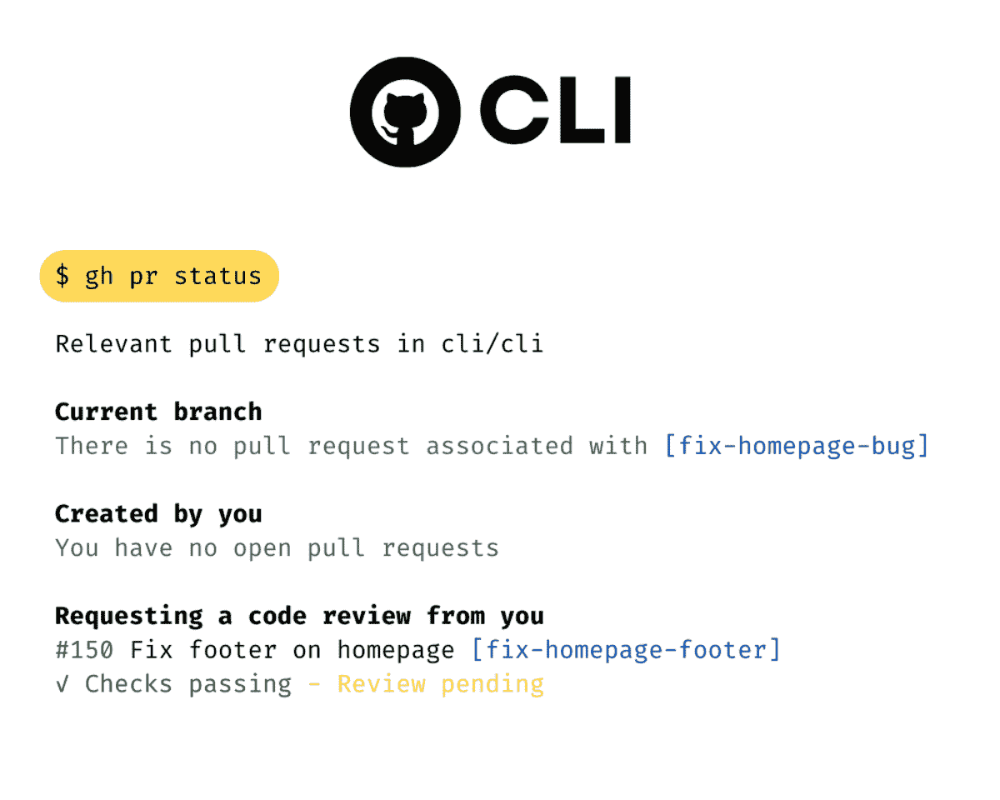
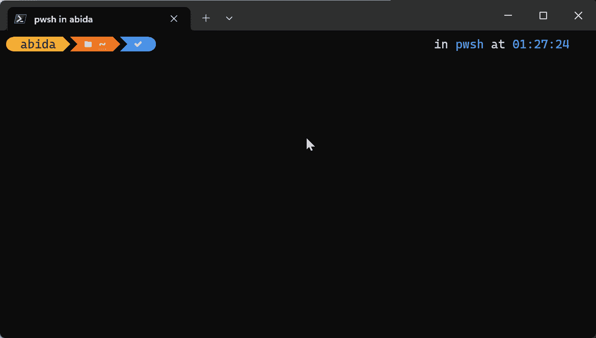

# GitHub CLI 入门

> 原文：[`www.kdnuggets.com/2023/03/getting-started-github-cli.html`](https://www.kdnuggets.com/2023/03/getting-started-github-cli.html)



作者提供的图像

[GitHub CLI](https://cli.github.com/) 将所有 GitHub 功能带入你的命令行界面。你可以通过输入几个关键词来创建新的远程仓库、查看和修改它。此外，它还允许你启动代码空间、管理 gists 并运行 GitHub Actions。

* * *

## 我们的前三个课程推荐

 1\. [Google 网络安全证书](https://www.kdnuggets.com/google-cybersecurity) - 快速进入网络安全职业生涯。

 2\. [Google 数据分析专业证书](https://www.kdnuggets.com/google-data-analytics) - 提升你的数据分析技能

 3\. [Google IT 支持专业证书](https://www.kdnuggets.com/google-itsupport) - 支持你的组织 IT

* * *

**主要特点：**

+   快速认证。

+   在网页浏览器上查看仓库、拉取请求、提交和文件。

+   创建、查看和管理 [codespaces](https://github.com/features/codespaces)。

+   创建、发布和管理 GitHub 仓库。

+   创建、查看、发布和管理 GitHub gits。

+   检查问题的状态、创建新问题以及在终端中查看问题。

+   使用命令行创建拉取请求、审查它并合并。

+   查看 [GitHub Actions](https://docs.github.com/en/actions) 工作流列表，并管理工作流和运行。

+   查看你的 GitHub 个人资料的全局状态。

# 快速设置

## 安装

首先，我们需要安装 CLI 工具，它适用于所有操作系统。

**macOS**

GitHub CLI 可以通过 Homebrew CLI 工具轻松安装。它也可以在 [MacPorts](https://www.macports.org/)、[Conda](https://docs.conda.io/en/latest/)、[Spack](https://spack.io/) 和可下载的二进制文件上找到。

```py
$ brew install gh
```

或

```py
$ brew upgrade gh
```

**Windows**

GitHub CLI 可以通过 Winget CLI 工具轻松安装。它也可以在 [scoop](https://scoop.sh/)、[Chocolatey](https://chocolatey.org/)、[Conda](https://github.com/cli/cli#conda) 和可下载的 MSI 上找到。

```py
$ winget install --id GitHub.cli
```

或

```py
$ winget upgrade --id GitHub.cli
```

**Linux**

GitHub CLI 可以通过 apt 在 Ubuntu 中安装，也可以从 [Releases · cli/cli](https://github.com/cli/cli/releases) 进行二进制安装。

```py
$ sudo apt update
$ sudo apt install gh
```

## 认证

安装后，你需要与 GitHub 主机进行认证。

启动浏览器进行认证，使用：

```py
$ gh auth login
```

完成后，认证令牌将被内部存储。

你还可以通过从文件中读取令牌来对 github.com 进行身份验证。

```py
$ gh auth login --with-token < mytoken.txt
```

注意：首次启动代码空间时，你可能需要额外的认证。这非常简单，就像浏览器认证一样。

# GitHub CLI 命令

认证成功后，你可以尝试写一个简单的命令来检查状态：

```py
$ gh status
```

上述命令将显示分配的 Issues、分配的 Pull Requests、审查请求、提及和仓库活动。

或者输入：

```py
gh repo list [user-name]
```

查看公共和私有仓库的列表。



作者提供的 Gif

GitHub CLI 正在不断发展，现在你可以访问 GitHub 生态系统中提供的所有内容。

这是使用 GitHub CLI 可以做的事情的列表：

1.  使用别名创建 gh 命令的快捷方式。

1.  使用单个命令浏览几乎所有的 GitHub 网站内容。

1.  创建、查看、交互和管理 codespaces、gits、repositories 和 GitHub actions。

1.  添加和管理 gh 扩展。

1.  审查、编辑和合并 Pull requests 和 Issues。

1.  设置秘密、ssh-key 和 gpg-key。

1.  体验交互式搜索。

1.  以及配置。

通过阅读 [手册](https://cli.github.com/manual/gh_codespace)了解所有 GitHub 命令和示例。

# 结论

如果你是新手并希望了解有关 Git 和 GitHub 的所有内容，请阅读 [Github 和 Git](https://www.datacamp.com/tutorial/github-and-git-tutorial-for-beginners) 初学者教程。你将学习 Git 的工作原理、基本命令，以及如何在数据科学项目中使用它。此外，你将了解 GitHub 协作平台，以及如何通过几个步骤创建你的第一个 GitHub 仓库。

GitHub CLI 适合专业人士和初学者。它通过提供 GitHub 功能的命令使你的生活更轻松。你还可以使用命令自动化设置，并为重复的命令创建别名。

使用 GitHub CLI，你可以在不离开 IDE 的情况下构建、测试、部署和协作，使其成为一个超级工具。

**[Abid Ali Awan](https://www.polywork.com/kingabzpro)** ([@1abidaliawan](https://twitter.com/1abidaliawan)) 是一位认证的数据科学专业人士，喜欢构建机器学习模型。目前，他专注于内容创作，并撰写有关机器学习和数据科学技术的技术博客。Abid 拥有技术管理硕士学位和电信工程学士学位。他的愿景是利用图神经网络为面临心理健康问题的学生开发 AI 产品。

### 更多相关主题

+   [GitHub CLI 数据科学备忘单](https://www.kdnuggets.com/2023/03/github-cli-data-science-cheat-sheet.html)

+   [ChatGPT CLI：将您的命令行界面转变为 ChatGPT](https://www.kdnuggets.com/2023/07/chatgpt-cli-transform-commandline-interface-chatgpt.html)

+   [开始使用 SQL 备忘单](https://www.kdnuggets.com/2022/08/getting-started-sql-cheatsheet.html)

+   [开始使用 spaCy 进行 NLP](https://www.kdnuggets.com/2022/11/getting-started-spacy-nlp.html)

+   [开始使用 PyCaret](https://www.kdnuggets.com/2022/11/getting-started-pycaret.html)

+   [开始使用 PyTorch Lightning](https://www.kdnuggets.com/2022/12/getting-started-pytorch-lightning.html)
