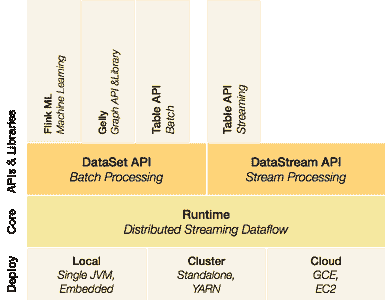

# 使用 Python 和 Apache Flink 入门

> 原文：[`www.kdnuggets.com/2015/11/getting-started-python-apache-flink.html`](https://www.kdnuggets.com/2015/11/getting-started-python-apache-flink.html)

**由[Will McGinnis](http://willmcginnis.com/about/)**。

在我关于 Apache 中大数据/机器学习项目广度的[上一篇文章](http://willmcginnis.com/2015/11/04/apache-machine-learning-data-analysis-projects/)之后，我决定尝试一些更大的项目。这篇文章作为一个简要指南，帮助你开始使用全新的 python API 来进入 Apache Flink。Flink 在高层次上与 Spark 非常相似，但其底层是一个真正的流处理平台（与 Spark 的小而快速的批处理流式处理方法相对）。这催生了许多有趣的用例，在这些用例中，大量的数据需要快速且复杂地处理。

基本思想是一个代码流平台，上面有两个处理 API 和一组库。



**图 1** Flink 架构。

在 Flink 的 1.0 版本中，将提供一个 python API，类似于 Spark。虽然在 1.0 之前的版本中已有，但存在已知的错误，使其使用变得困难或不可能。因此，首先，我们需要构建 master 分支（除非你正在阅读的是 v1.0 版本的内容，如果是这种情况，只需按照[Flink 的](https://flink.apache.org/)说明进行构建）。

`git clone https://github.com/apache/flink`

`cd flink mvn clean install -DskipTests`

此时，最新版本的 Flink 构建将会在 flink 目录下的 build-target 中创建符号链接。你可以用以下命令启动 Flink。

`./build-target/bin/start-cluster.sh ./build-target/bin/start-webclient.sh`

这将启动一个简单的用户界面，地址是 localhost:8080，以及一个作业管理器和一个任务管理器。现在我们可以运行一个简单的脚本，为你的项目创建一个新的目录，并在其中创建一个 python 文件：

`cd .. mkdir flink-examples cd flink-examples touch wordcount.py`

然后将 Flink 文档中的示例稍微修改后添加到 wordcount.py 中：

```py
from flink.plan.Environment import get_environment
from flink.plan.Constants import INT, STRING, WriteMode
from flink.functions.GroupReduceFunction \
import GroupReduceFunction

class Adder(GroupReduceFunction):
    def reduce(self, iterator, collector):
        count, word = iterator.next()
        count += sum([x[0] for x in iterator])
        collector.collect((count, word))

if __name__ == "__main__":
    output_file = 'file:///.../flink-examples/out.txt'
    print('logging results to: %s' % (output_file, ))

    env = get_environment()
    data = env.from_elements("Who's there? I think \
         I hear them. Stand, ho! Who's there?")

    data \
        .flat_map(lambda x, c: [(1, word) for word in \
         x.lower().split()], (INT, STRING)) \
        .group_by(1) \
        .reduce_group(Adder(), (INT, STRING), combinable=True) \
        .map(lambda y: 'Count: %s Word: %s' % (y[0], y[1]), STRING) \
        .write_text(output_file, write_mode=WriteMode.OVERWRITE)

    env.execute(local=True)
```

并用以下命令运行它：

`cd .. ./flink/build-target/bin/pyflink3.sh ~./flink-examples/word_count.py`

在 out.txt 中你现在应该能看到：

`Count: 1 Word: hear Count: 1 Word: ho! Count: 2 Word: i Count: 1 Word: stand, Count: 1 Word: them. Count: 2 Word: there? Count: 1 Word: think Count: 2 Word: who's`

就这样，完全是一个最小的示例，用于在 Apache Flink 中使用 python。代码在这里：[`github.com/wdm0006/flink-python-examples`](https://github.com/wdm0006/flink-python-examples)，我会在这个仓库中以及这里添加更多的高级示例。

**简介: [Will McGinnis](http://willmcginnis.com/about/ )**, @WillMcGinnis，拥有奥本大学机械工程学位，但现在主要从事软件开发。他是 Predikto 的首位员工，目前帮助构建该公司在重工业领域的预测性维护顶级平台。在工作之余，他通常会从事与 Python、Flask、scikit-learn 或骑行相关的工作。

[原文](http://willmcginnis.com/2015/11/08/getting-started-with-python-and-apache-flink/ ).

**相关内容**

+   Apache Flink 及流处理的案例

+   快速大数据: Apache Flink 与 Apache Spark 在流数据处理中的对比

+   采访: Stefan Groschupf，Datameer 谈分析中的准确性与简洁性的平衡

* * *

## 我们的三大课程推荐

 1\. [谷歌网络安全证书](https://www.kdnuggets.com/google-cybersecurity) - 快速进入网络安全职业生涯。

 2\. [谷歌数据分析专业证书](https://www.kdnuggets.com/google-data-analytics) - 提升你的数据分析技能

 3\. [谷歌 IT 支持专业证书](https://www.kdnuggets.com/google-itsupport) - 支持你的组织的 IT 需求

* * *

### 更多相关主题

+   [快速入门 PyTest: 轻松编写和运行 Python 测试](https://www.kdnuggets.com/getting-started-with-pytest-effortlessly-write-and-run-tests-in-python)

+   [快速入门 Python 生成器](https://www.kdnuggets.com/2023/02/getting-started-python-generators.html)

+   [5 个步骤快速入门 Python 数据结构](https://www.kdnuggets.com/5-steps-getting-started-python-data-structures)

+   [快速入门 Python 数据科学](https://www.kdnuggets.com/getting-started-with-python-for-data-science)

+   [快速入门 Claude 3 Opus，它刚刚击败了 GPT-4 和 Gemini](https://www.kdnuggets.com/getting-started-with-claude-3-opus-that-just-destroyed-gpt-4-and-gemini)

+   [快速入门自动文本摘要](https://www.kdnuggets.com/2019/11/getting-started-automated-text-summarization.html)
