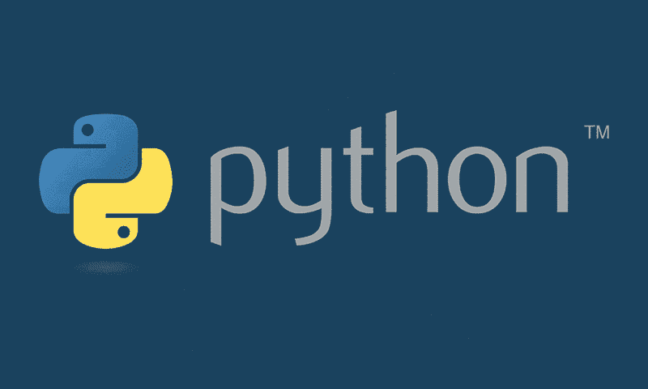

# 开始使用 Python 进行数据分析

> 原文：[`www.kdnuggets.com/2017/07/getting-started-python-data-analysis.html`](https://www.kdnuggets.com/2017/07/getting-started-python-data-analysis.html)

一位朋友最近问了这个问题，我认为如果在这里发布可能会对其他人有帮助。这是为那些对 Python 完全陌生的人准备的，旨在提供从零到一的最简单路径。

1.  下载适用于你的操作系统的 Python 3.X 版本的 Anaconda 发行版，点击[这里](https://www.continuum.io/downloads)。选择这个预打包的发行版可以避免很多安装相关的问题。它附带了大多数重要的数据分析包。

1.  一旦安装完成，测试以确保默认的 Python 解释器是你刚刚安装的那个。这很重要，因为你的系统可能已经安装了一个 Python 版本，但它不包含 Anaconda 包中的所有好东西，因此你需要确保新安装的版本是默认的。在 Mac/Linux 上，这可能意味着在终端中输入 `which python`。或者你可以直接运行 Python 解释器，确保版本与你下载的一致。如果一切顺利，安装时应该已经完成。如果没有，你需要在这里停止并修复它。

1.  在你的 shell 中输入 `jupyter notebook` 命令。这应该会打开一个浏览器窗口。如果没有，打开浏览器并导航到 `http://localhost:8888`。在那里，创建一个新的 Python 笔记本。

1.  前往 [www.kaggle.com](https://www.kaggle.com/) 的 *kernels* 部分，并筛选 [Python kernels](https://www.kaggle.com/kernels?language=Python)。这些大多是其他人在 Kaggle 网站上免费提供的数据集上进行分析或构建模型的 jupyter 笔记本。寻找标题中包含 EDA（探索性数据分析）的笔记本，而不是那些构建预测模型的笔记本。找一个感兴趣的，开始在你的笔记本中重建它。

> 注意：你会发现当你尝试重建这些分析时会遇到导入错误。这可能是因为他们安装了不包含在 Anaconda 发行版中的包。你最终需要学习如何与 conda 包管理器交互，这将是你将来需要面对的众多问题之一。通常只需使用 `conda install <package_name>`，但你需要找到正确的包名称，有时还需要指定其他详细信息。有时你还需要使用 `pip install <other_package_name>`，但这些都将在后面学习。

### 高级库总结

这是你将频繁互动的重要库的快速总结。

1.  NumPy：具有很多科学计算的核心功能。在底层调用的是 C 编译代码，因此比用 Python 编写的相同函数要快得多。不是最用户友好的。

1.  SciPy：类似于 NumPy，但提供了更多从分布中抽样、计算检验统计量等的手段。

1.  MatPlotLib：主要的绘图框架。一个必要的恶习。

1.  Seaborn：在 MatPlotLib 后导入，它会默认使你的图表更美观。虽然也有自己的功能，但我发现最酷的功能运行得太慢。

1.  Pandas：主要是对 NumPy/SciPy 的一个简单封装，使其更易于使用。非常适合与称为 DataFrame 的数据表交互。还提供了绘图功能的封装，以便快速绘图，同时避免了 MPL 的复杂性。我主要使用 Pandas 来处理数据。

1.  Scikit-learn：拥有许多监督和无监督机器学习算法。还提供许多用于模型选择的指标和一个很好的预处理库，用于执行如主成分分析或编码分类变量等任务。

### 快速提示

1.  在 jupyter 笔记本中，在运行单元格前在任何对象前加上问号，它将打开该对象的文档。当你忘记了你尝试调用的函数需要你传递哪些参数时，这非常有用。例如，`?my_dataframe.apply` 将解释 `pandas.DataFrame` 对象的 `apply` 方法，这里用 `my_dataframe` 代表。

1.  你可能总是需要参考你使用的任何库的文档，所以最好在浏览器中保持文档打开。因为可选参数和细节太多了。

1.  在不可避免的故障排除任务中，stackoverflow 可能有答案。

1.  接受你将会做一些你暂时无法完全理解的事情，否则你可能会被那些不重要的细节所困扰。有一天你可能需要了解虚拟环境，这其实并不难，但有许多这样的绕道会给刚入门的人带来不必要的痛苦。

1.  阅读其他人的代码。这是学习规范和最佳实践的最佳方式。这就是 Kaggle 内核真正有帮助的地方。GitHub 还支持在浏览器中显示 jupyter 笔记本，因此网络上有大量的示例。

[原文](https://medium.com/@zjost85/getting-started-with-python-for-data-analysis-64d6f6c256b2)。已获得许可转载。

**简介：** Zak Jost 是亚马逊网络服务公司在西雅图地区的研究科学家。

**相关：**

+   相关性介绍

+   掌握 Python 数据准备的 7 个步骤

+   数据科学基础：从数据中可以挖掘出哪些模式？

### 更多相关话题

+   [每位数据科学家都应该知道的三个 R 库（即使你使用 Python）](https://www.kdnuggets.com/2021/12/three-r-libraries-every-data-scientist-know-even-python.html)

+   [使用管道编写清晰的 Python 代码](https://www.kdnuggets.com/2021/12/write-clean-python-code-pipes.html)

+   [是什么让 Python 成为初创企业理想的编程语言](https://www.kdnuggets.com/2021/12/makes-python-ideal-programming-language-startups.html)

+   [停止学习数据科学以寻找目的，并通过寻找目的来…](https://www.kdnuggets.com/2021/12/stop-learning-data-science-find-purpose.html)

+   [成为优秀数据科学家所需的 5 项关键技能](https://www.kdnuggets.com/2021/12/5-key-skills-needed-become-great-data-scientist.html)

+   [每个初学者数据科学家应掌握的 6 种预测模型](https://www.kdnuggets.com/2021/12/6-predictive-models-every-beginner-data-scientist-master.html)
