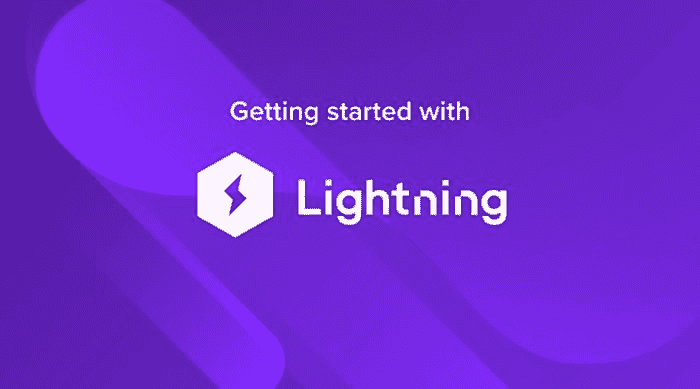
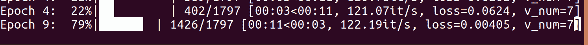
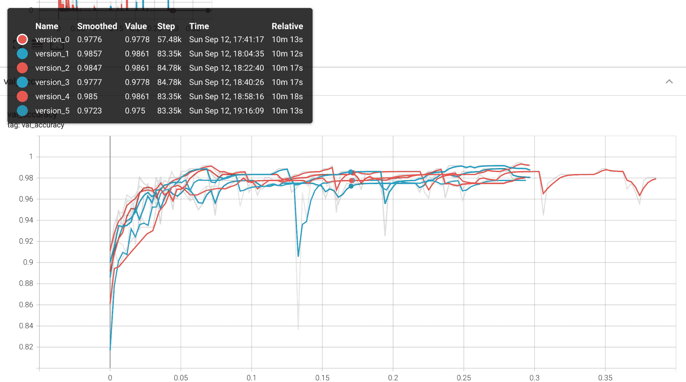
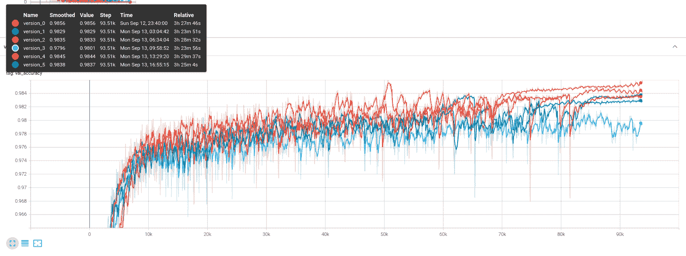

# PyTorch Lightning 入门

> 原文：[`www.kdnuggets.com/2021/10/getting-started-pytorch-lightning.html`](https://www.kdnuggets.com/2021/10/getting-started-pytorch-lightning.html)

评论



### **PyTorch Lightning 入门：高性能研究的高级库**

像 TensorFlow 和 PyTorch 这样的库处理了大多数构建深度学习模型时的复杂性，这些模型既能快速训练又能快速推断。可以预测的是，这使得机器学习工程师大部分时间都花在了抽象的下一层级上，进行超参数搜索、验证性能，以及对模型和实验进行版本管理，以跟踪所有内容。

深度学习远不止将一些层拼接在一起。

如果说 PyTorch 和 TensorFlow（现在还有 JAX）是深度学习的蛋糕，那么更高层次的库就是糖霜。多年来，TensorFlow 在高层次的 Keras API 上有了它的“糖霜”，该 API 自 2019 年 TF 2.0 发布后成为 TensorFlow 的官方部分。同样，PyTorch 用户受益于高层次的 fastai 库，该库在效率和迁移学习方面表现非常出色。这使得 fastai 成为 Kaggle 竞赛平台上成功数据科学家的最爱。最近，另一个简化的 PyTorch 封装库在恰如其名的 [PyTorch Lightning](https://github.com/PyTorchLightning/pytorch-lightning) 中迅速获得关注。

PyTorch Lightning 实际上从 2019 年起就存在，至少在某种程度上。它起初是 William Falcon 在纽约大学攻读博士期间进行的一个副项目。到 2020 年（我们指的是从 3 月开始的 2020 年），PyTorch Lightning 不再只是个人项目，因为 Falcon [宣布了风险投资](https://medium.com/pytorch/pytorch-lightning-0-7-1-release-and-venture-funding-dd12b2e75fb3)。与此同时，开源（在 Apache 2.0 许可证下）代码库从 Falcon 的个人 GitHub 账户迁移到了其专用的个人资料。截止目前，PyTorch Lightning 已增长到超过 15,000 个星标和近 2,000 个分叉，几乎与 [fastai](https://github.com/fastai/fastai)（有超过 21,000 个星标）一样受欢迎，并且明显比 PyTorch 内部的高层次库 [Ignite](https://github.com/pytorch/ignite)（约有 4,000 个星标）更受欢迎！

fastai 旨在促进首个 fastai 课程，[ 实用深度学习编程课程](https://course.fast.ai/)，而 PyTorch Lightning 的目的是简化生产研究。Fastai 专注于迁移学习和效率，其易用性使其成为 Kaggle 数据科学竞赛平台上受欢迎的高级库，有超过[ 4,500 个笔记本](https://www.kaggle.com/search?q=fastai) 参考该库。相比之下，关于 PyTorch Ignite 的只有[ 100 多个](https://www.kaggle.com/search?q=ignite) 笔记本，而 PyTorch Lightning 有[ 约 500 个](https://www.kaggle.com/search?q=PyTorch+Lightning)。PyTorch Lightning 是一个相对较新的库，但它也针对不同的用户群体。PyTorch Lightning 简化了开发新模型的工程方面，如日志记录、验证和钩子，目标是机器学习研究人员。

研究就是回答和验证问题，在本教程中，我们将看看 PyTorch Lightning 如何帮助我们简化这个过程。我们将设置一个简单的模拟研究问题，是否使用“高级”激活函数（如所谓的[ swish 函数](https://en.wikipedia.org/wiki/Swish_function)）相较于更标准的修正线性单元（[ReLU](https://en.wikipedia.org/wiki/Rectifier_(neural_networks))）具有任何优势。我们将使用来自 SciKit-Learn 的极其小的数字数据集来设置实验。从数字开始应该使这个项目对在高效笔记本上运行代码的人更易于访问，但鼓励读者使用更真实的图像数据集，如 CIFAR10，以获取额外积分。

作为一个专为生产研究设计的库，PyTorch Lightning 也简化了硬件支持和分布式训练，我们将在最后展示如何轻松将训练转移到 GPU。

### ****开始使用：安装 PyTorch Lightning****

现在许多 Python 项目都可以轻松通过 pip 安装 PyTorch Lightning，我们建议使用你喜欢的虚拟环境管理器来管理安装和依赖项，以免混乱你的基本 Python 安装。我们将提供三个示例，第一个是使用 `virtualenv` 和 pip，我们假设你使用的是 Linux 或 Mac 的 Unix 风格命令行，或者你足够聪明，可以使用类似 Git Bash 或 Anaconda Prompt 的工具适配 Windows。导航到本教程的项目文件夹后：

```py
virtualenv ptl_env --python=python3
source ptl_env/bin/activate
pip install pytorch-lightning
pip install torchvision
pip install scikit-learn
```

你也可以使用[ Anaconda](https://www.anaconda.com/)来管理你的虚拟环境：

```py
conda create -n ptl_env
conda activate ptl_env
conda install -n ptl_env pytorch-lighnting -c conda-forge
conda install -n ptl_env torchvision 
conda install -n ptl_env scikit-learn
```

或者结合这两者，创建一个新的 Anaconda 环境，然后使用 pip 安装软件包。对于更一般的使用，使用 pip 和 Anaconda 一起有一些[ 警告](https://www.anaconda.com/blog/using-pip-in-a-conda-environment)，但对于本教程来说应该没问题：

```py
conda create -n ptl_env
conda activate ptl_env
conda install -n ptl_env pip
pip install pytorch-lightning
pip install torchvision
pip install scikit-learn
```

### 使用 PyTorch Lightning

PyTorch Lightning 采用的设计策略围绕着 LightningModule 类。这个类继承自`pytorch.nn.Module`类，提供了一个方便的入口点，并尝试尽可能将训练和验证过程的许多内容组织在一个地方。

这种策略的一个关键特性是，典型的训练和验证循环的内容被定义在模型本身中，可以通过一个类似于 keras、fastai 甚至 SciKit-Learn 的`fit` API 访问。与其他示例中`fit`是通过模型本身访问不同，在 PyTorch Lightning 中，`fit`是通过 Trainer 对象访问的。但我们还是提前了，首先让我们通过导入我们需要的一切来为我们的实验做准备。

```py
import os
import numpy as np

import torch
import torch.nn as nn
import torch.nn.functional as F
from torchvision import transforms
from torch.utils.data import DataLoader, random_split
from torchvision.datasets import MNIST

# for rapid prototyping with a small dataset
import sklearn
import sklearn.metrics
import sklearn.datasets
# for building intuition with a few tens of thousands of samples
from torchvision.datasets import MNIST

import pytorch_lightning as pl
from pytorch_lightning.metrics import functional as FM
```

然后我们可以继续定义我们的模型：

```py
class MyClassifier(pl.LightningModule):

    def __init__(self, dim=28, activation=nn.ReLU()):

        super(MyClassifier, self).__init__()

        self.image_dim = dim
        self.hid_dim = 128
        self.num_classes = 10
        self.act = activation

        self.feature_extractor = nn.Sequential(\
                nn.Conv2d(1, 4, 3, padding=1), \
                self.act, \
                nn.Conv2d(4, 4, 3, padding=1), \
                self.act, \
                nn.Conv2d(4, 1, 3, padding=1), \
                self.act, \
                nn.Flatten())

        self.head = nn.Sequential(\
                nn.Linear(self.image_dim**2, self.hid_dim), \
                self.act, \
                nn.Linear(self.hid_dim, self.hid_dim), \
                self.act, \
                nn.Linear(self.hid_dim, self.num_classes))

    def forward(self, x):

        x = self.feature_extractor(x)
        output = self.head(x)

        return output

    def training_step(self, batch, batch_index):

        x, y = batch

        output = self.forward(x)

        loss = F.nll_loss(F.log_softmax(output, dim = -1), y)

        y_pred = output.argmax(-1).cpu().numpy()
        y_tgt = y.cpu().numpy()
        accuracy = sklearn.metrics.accuracy_score(y_tgt, y_pred)
        self.log("train loss", loss)
        self.log("train accuracy", accuracy)
        return loss

    def validation_step(self, batch, batch_idx):

        x, y = batch

        output = self.forward(x)

        loss = F.cross_entropy(output, y)

        pred = output.argmax(-1)

        return output, pred, y

    def validation_epoch_end(self, validation_step_outputs):

        losses = 0
        outputs = None
        preds = None
        tgts = None
        for output, pred, tgt in validation_step_outputs:
        preds = torch.cat([preds, pred]) if preds is not None else pred
        outputs = torch.cat([outputs, output], dim = 0) \
        if outputs is not None else output
        tgts = torch.cat([tgts, tgt]) if tgts is not None else tgt

        loss = F.nll_loss(F.log_softmax(outputs, dim = -1), tgts)

        y_preds = preds.cpu().numpy()
        y_tgts = tgts.cpu().numpy()

        fm_accuracy = FM.accuracy(outputs, tgts)

        # pytorch lightning prints a deprecation warning for FM.accuracy,
        # so we'll include sklearn.metrics.accuracy_score as an alternative
        accuracy = sklearn.metrics.accuracy_score(y_tgts, y_preds)

        self.log("val_accuracy", accuracy)
        self.log("val_loss", loss)

    def configure_optimizers(self):
        return torch.optim.Adam(self.parameters(), lr=3e-4)
```

值得注意的是，训练功能被委托给`training_step`函数中的模块本身。大多数有一定 PyTorch 实践经验的机器学习从业者会对重载`forward`函数的做法非常熟悉，而 LightningModule 对象还有许多更多的方法可以重载，以实现对内置的相对无痛的日志记录和评估功能的精细控制。

定义我们的`MyClassifier`模型类的代码可能看起来相当冗长，但这种策略在实际开始训练时大大简化了流程，我们稍后将看到。`LightningModule`类中包含了许多其他的回调和函数，所有这些都可以被重载以实现更精细的控制。这些回调的完整列表可以在[PyTorch Lightning 文档](https://pytorch-lightning.readthedocs.io/en/latest/extensions/callbacks.html#hooks)中找到。

在本教程中，我们还将定义一个`torch.utils.data.Dataset`对象来包装来自 SciKit-Learn 的数字数据集。这应该使得在切换到像 MNIST 或 CIFAR10 这样更大、更具信息量的数据集之前，能够快速地让一切正常运行。

```py
class SKDigitsDataset(torch.utils.data.Dataset):

    def __init__(self, mode="train"):
        super(SKDigitsDataset, self).__init__()
        x, y = sklearn.datasets.load_digits(return_X_y = True)

        num_samples = int(x.shape[0] * 0.8)
        np.random.seed(42)
        np.random.shuffle(x)
        np.random.seed(42)
        np.random.shuffle(y)

        if mode == "train":
        self.x = x[:num_samples]
        self.y = y[:num_samples]
        elif mode == "val":
        self.x = x[num_samples:]
        self.y = y[num_samples:]
        else:
        self.x = x
        self.y = y

        self.transform = lambda my_dict: \
        (torch.tensor(my_dict["x"]).float(), \
        torch.tensor(my_dict["y"]).long())

    def __len__(self):
        return self.x.shape[0]

    def __getitem__(self, index):

        got_x = self.x[index].reshape(-1, 8, 8)
        got_y = self.y[index]

        sample = {"x": got_x, "y": got_y}

        sample = self.transform(sample)

        return sample
```

既然所有的准备工作都完成了，实际启动训练运行变得非常简单。我们只需要创建一个数据集，并将其输入到`DataLoader`中，实例化我们的模型，创建一个 PyTorch Lightning `Trainer`对象，然后调用 trainer 的 fit 方法。以下是一个简化版本：

```py
dataset = SKDigitsDataset()
dataloader = DataLoader(dataset)
model = MyClassifier(dim=8)
trainer = pl.Trainer()
trainer.fit(model, dataloader)
```

但当然，我们会希望在整个训练过程中持续记录验证指标，利用我们在模型中重载的`validation_step`和`validation_epoch_end`方法。以下是我用来启动训练运行的实际代码，使用`if __name__ == "__main__":`模式，这为将 Python 文件作为模块运行提供了一个简单的入口点。

```py
if __name__ == "__main__":
    # if using digits from sklearn

    train_dataset = SKDigitsDataset(mode = "train")
    val_dataset = SKDigitsDataset(mode = "val")

    dim = 8
    validation_interval = 1.0

    train_dataloader = DataLoader(train_dataset)
    val_dataloader = DataLoader(val_dataset)

    model = MyClassifier(dim=dim, activation=nn.ReLU())
    trainer = pl.Trainer(max_epochs = 100, \
    val_check_interval = validation_interval)

    trainer.fit(model, train_dataloader, val_dataloader)

    print("Training finished, all ok")
```

当你运行上面的代码时，你应该会在终端中看到一个进度条，看起来像下面的那个。



在允许训练运行一段时间后，查看你的工作目录，你会发现一个名为**lightning_logs**的新文件夹。这是 PyTorch Lightning 记录你的训练会话的地方，你可以快速启动 Tensorboard 会话以查看情况。在用下面的命令启动 tensorboard 后，使用浏览器导航到 localhost:6006（默认）以打开仪表板。

```py
tensorboard --logdir=lightning_logs
```

如果训练过程经历了几次停顿和重启，你会注意到左侧边栏显示了训练运行列表，包括 version_0、version_1、version_2 等等。PyTorch Lightning 以这种方式自动版本化你的训练运行，因此比较不同的实验条件或随机种子应该很简单。

例如，如果我们想运行一个小实验，比较使用 Swish 和 ReLU 激活函数的效果，我们可以使用下面的代码。

```py
if __name__ == "__main__":

    if(1):
        # if using digits from sklearn

        train_dataset = SKDigitsDataset(mode = "train")
        val_dataset = SKDigitsDataset(mode = "val")

        dim = 8
        validation_interval = 1.0

    else:
        # if using MNIST
        train_dataset = MNIST(os.getcwd(), download=True, \
                train=True, transform=transforms.ToTensor())
        val_dataset = MNIST(os.getcwd(), download=True, \
                train=False, transform=transforms.ToTensor())

        dim = 28
        validation_interval = 0.1

    train_dataloader = DataLoader(train_dataset)
    val_dataloader = DataLoader(val_dataset)
class Swish(nn.Module):

    def __init__(self):
        super(Swish, self).__init__()

    def forward(self, x):
        return x * torch.sigmoid(x)

for replicate in range(3):
    for activation in [Swish(), nn.ReLU()]:

        model = MyClassifier(dim=dim, activation=activation)

        trainer = pl.Trainer(max_epochs = 100, \
        val_check_interval = validation_interval)
        trainer.fit(model, train_dataloader, val_dataloader)

        print(f" round {replicate} finished.")
```

在运行我们的小实验后，我们会发现结果在 Tensorboard 中被很好地记录，供我们查看。



你可能会注意到我们有选项在更大的 MNIST 数据集上运行训练。MNIST 数据集有 60,000 个 28x28 像素的训练样本，比提供不到 2,000 个 8x8 图像的缩小版 sklearn digits 数据集更接近一个实际的真实世界数据集。然而，你可能不希望在使用性能不足的笔记本 CPU 上运行 6 次重复训练，因此我们需要首先将所有内容转移到 GPU 上。

如果你已经习惯了从头构建标准 PyTorch 实验和训练管道，你可能知道一个被遗忘的张量在 CPU 设备上滞留带来的沮丧，以及它们生成的令人头疼的错误。通常这是一个简单的修复，但仍然令人沮丧。

### **使用 GPU 进行训练**

如果你正在使用具有可用 GPU 的机器，你可以轻松地利用 GPU 进行训练。为了在 GPU 上启动训练而不是 CPU，我们需要修改一些代码：

```py
trainer = pl.Trainer(max_epochs = 100, \
                val_check_interval = validation_interval, \ 
                gpus=[0])
```

没错，通过修改定义 trainer 对象的单行代码，我们可以在 GPU 上运行训练。无需担心被遗忘的张量，且保留了我们在原始模型中构建的所有日志记录和验证的便利性。



### ****下一步****

使用 PyTorch Lightning 的一个显著特点是它似乎随着进展变得越来越容易。定义我们的`MyClassifer`模型比从`torch.nn.Module`子类化的类似复杂度模型要复杂一点，但一旦我们通过`LightningModule`模型处理了训练、验证和日志记录，之后的每一步都比通常情况更简单。

PyTorch Lightning 也让硬件管理变得轻松，我们在切换到 GPU 训练 MNIST 时见证了这一点。PyTorch Lightning 也方便在如 Google 的 Tensor Processing Units 和多个 GPU 上进行训练，它与 [Grid](https://www.grid.ai/) 平台并行开发，用于通过 PyTorch Lightning 扩展实验，以及 [Lightning Bolts](https://www.pytorchlightning.ai/bolts) 模块化的深度学习示例工具箱，由 PyTorch Lightning 社区驱动。

这涵盖了我们对 PyTorch Lightning 的“Hello, World”介绍，但我们只是浅尝辄止，Lightning 旨在为你的深度学习工作流提供更全面的功能。

**在我们下一个 PyTorch Lightning 教程中，我们将深入探讨两个互补的 PyTorch Lightning 库：Lightning Flash 和 TorchMetrics。** TorchMetrics 提供了模块化的方法来定义和跟踪批次和设备上的有用指标，而 Lightning Flash 提供了一整套功能，便于更高效的迁移学习和数据处理，以及一系列最新的深度学习问题解决方案。

**接下来，我们进入下一个 PyTorch Lightning 教程：**

[PyTorch Lightning 教程 #2：使用 TorchMetrics 和 Lightning Flash](https://www.exxactcorp.com/blog/Deep-Learning/advanced-pytorch-lightning-using-torchmetrics-and-lightning-flash)

**简介：[Kevin Vu](https://www.kdnuggets.com/author/kevin-vu)** 负责管理 Exxact Corp 博客，并与许多才华横溢的作者合作，他们撰写有关深度学习不同方面的内容。

[原文](https://www.exxactcorp.com/blog/Deep-Learning/getting-started-with-pytorch-lightning). 经许可转载。

**相关：**

+   PyTorch Lightning 介绍

+   如何将 PyTorch Lightning 模型部署到生产环境

+   PyTorch 多 GPU 评估库及其他新 PyTorch Lightning 发布内容

* * *

## 我们的前三个课程推荐

 1\. [Google 网络安全证书](https://www.kdnuggets.com/google-cybersecurity) - 快速进入网络安全职业生涯。

 2\. [Google 数据分析专业证书](https://www.kdnuggets.com/google-data-analytics) - 提升你的数据分析技能

 3\. [Google IT 支持专业证书](https://www.kdnuggets.com/google-itsupport) - 支持你的组织的 IT

* * *

### 更多相关话题

+   [PyTorch Lightning 入门](https://www.kdnuggets.com/2022/12/getting-started-pytorch-lightning.html)

+   [深度学习库简介：PyTorch 和 Lightning AI](https://www.kdnuggets.com/introduction-to-deep-learning-libraries-pytorch-and-lightning-ai)

+   [5 步骤开始使用 PyTorch](https://www.kdnuggets.com/5-steps-getting-started-pytorch)

+   [免费使用 Lightning AI Studio](https://www.kdnuggets.com/using-lightning-ai-studio-for-free)

+   [SQL 入门备忘单](https://www.kdnuggets.com/2022/08/getting-started-sql-cheatsheet.html)

+   [PyCaret 入门指南](https://www.kdnuggets.com/2022/11/getting-started-pycaret.html)
