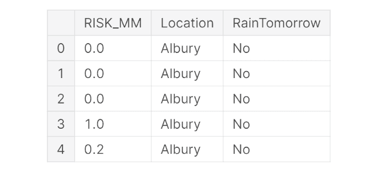

# PyTorch 入门

> 原文：[`www.kdnuggets.com/2020/10/getting-started-pytorch.html`](https://www.kdnuggets.com/2020/10/getting-started-pytorch.html)

comments 

照片由 [Ihor Malytskyi](https://unsplash.com/@ihor_malytskyi?utm_source=medium&utm_medium=referral) 提供，拍摄于 [Unsplash](https://unsplash.com/?utm_source=medium&utm_medium=referral)。

### 介绍

PyTorch 现如今是增长最快的 Python 深度学习框架之一。这个库最初主要由研究人员使用来创建新模型，但由于最近的进展，它也引起了许多公司的关注。对这个框架的兴趣有以下原因：

+   GPU 优化的张量计算（类似矩阵的数据结构），使用与 Numpy 类似的接口以促进采纳。

+   使用 [自动微分](https://pytorch.org/tutorials/beginner/blitz/autograd_tutorial.html#sphx-glr-beginner-blitz-autograd-tutorial-py) 进行神经网络训练（跟踪张量上的所有操作并自动计算梯度）。

+   动态计算图（使用 PyTorch 时，不必像在 Tensorflow 中那样首先定义整个计算图来运行模型）。

PyTorch 可以在任何操作系统上自由安装，按照 [文档说明](https://pytorch.org/get-started/locally/) 即可。这个库的主要组成部分有：

+   ***Autograd*** 模块：用于记录对张量执行的操作，并向后执行这些操作以计算梯度（这个属性对加速神经网络操作非常有用，并允许 PyTorch 遵循 [命令式编程](https://en.wikipedia.org/wiki/Imperative_programming) 范式）。

+   ***Optim*** 模块：用于轻松导入和应用各种优化算法，例如 Adam、随机梯度下降等，以进行神经网络训练。

+   ***nn*** 模块：提供了一组函数，可以帮助我们快速逐层设计任何类型的神经网络。

### 演示

在本文中，我将带你通过一个实用的例子开始使用 PyTorch。本文中使用的所有代码（还有更多！）都可以在我的 [GitHub](https://github.com/pierpaolo28/Kaggle-Challenges/blob/master/rain-prediction.ipynb) 和 [Kaggle](https://www.kaggle.com/pierpaolo28/rain-prediction) 账户中找到。我们将使用 [Kaggle Rain in Australia](https://www.kaggle.com/jsphyg/weather-dataset-rattle-package) 数据集来预测明天是否会下雨。

### 导入库

首先，我们需要导入所有必要的库。

### 数据预处理

对于这个例子，我们将重点使用***RISK_MM***和***Location***指示符作为我们的模型特征（图 1）。将数据分为训练集和测试集后，我们可以将 Numpy 数组转换为 PyTorch 张量，并创建训练和测试数据加载器，以便将数据输入到神经网络中。



图 1：减少的数据框

### 建模

在这一点上，使用 PyTorch 的***nn***模块，我们可以设计我们的人工神经网络（ANN）。在 PyTorch 中，神经网络可以定义为由两个主要函数组成的类：***__inti__()*** 和 ***forward()***。

在***__inti__()***函数中，我们可以设置我们的网络层，而在***forward()***函数中，我们决定如何将网络的不同元素堆叠在一起。通过这种方式，可以相对轻松地进行调试和实验，只需在***forward()***函数中添加打印语句即可随时检查网络的任何部分。

此外，PyTorch 还提供了一个[Sequential Interface](https://pytorch.org/docs/stable/nn.html#sequential)，可以用来以类似于使用 Keras Tensorflow API 的方式构建模型。

在这个简单的网络中，我们输入了 50 个特征，因为我们之前使用 Pandas 的**get_dummies()**功能将输入的分类变量转换为了虚拟变量/指示变量。因此，我们的网络将由 50 个输入神经元、一个包含 20 个神经元的隐藏层和一个单神经元的输出层组成。隐藏层的大小可以根据需要进行调整，也可以很容易地添加更多的隐藏层，但这可能会导致过拟合风险，因为数据量有限。将连续层堆叠在一起时，我们只需确保一层的输出特征数量等于下一层的输入特征数量。

实例化模型后，我们还可以打印出网络架构。

```py
ANN(
  (fc1): Linear(in_features=50, out_features=20, bias=True)
  (fc2): Linear(in_features=20, out_features=1, bias=True)
)
```

### ANN 训练

我们现在终于准备好训练我们的模型。在下面的代码片段中，我们首先定义 Binary Cross Entropy 作为我们的损失函数，并将 Adam 作为优化器来调整模型参数。最后，我们创建一个包含 7 次迭代的训练循环，并存储一些关键指标参数，如每次迭代的总体损失和模型准确性。

```py
Epoch: 0, Loss: 294.88, Accuracy: 0.13% 
Epoch: 1, Loss: 123.58, Accuracy: 6.31% 
Epoch: 2, Loss: 62.27, Accuracy: 28.72% 
Epoch: 3, Loss: 35.33, Accuracy: 49.40% 
Epoch: 4, Loss: 22.99, Accuracy: 64.99% 
Epoch: 5, Loss: 16.80, Accuracy: 71.59% 
Epoch: 6, Loss: 13.16, Accuracy: 74.13%
```

如图 2 所示，我们的模型成功地实现了良好的准确性，而没有过度拟合原始数据（训练损失和准确性都接近饱和）。这还可以通过实施训练/验证拆分来进一步验证，以训练我们的模型并调整其参数（如在这个[GitHub](https://github.com/pierpaolo28/Kaggle-Challenges/blob/master/rain-prediction.ipynb)笔记本中演示的那样）。


图 2：训练报告

### 评估

最后，我们可以创建第二个循环来测试我们的模型对一些全新数据的表现（为了确保我们的模型不再训练，只能用于推理，请注意***model.eval()***语句）。

```py
Test Accuracy: 74.66 %
```

从打印输出中可以看到，我们的模型测试准确率与最终训练准确率非常接近（74.66%对 74.13%）。

### 结论

如果你有兴趣了解更多关于 PyTorch 的潜力，[PyTorch Lighting](https://pytorch-lightning.readthedocs.io/en/latest/)和[Livlossplot](https://github.com/stared/livelossplot)是两个很好的工具，可以帮助你开发、调试和评估你的 PyTorch 模型。

*希望你喜欢这篇文章，谢谢阅读！*

### 联系方式

如果你想跟进我的最新文章和项目，*请[在 Medium 上关注我](https://medium.com/@pierpaoloippolito28?source=post_page---------------------------)*，并订阅我的*[邮件列表](http://eepurl.com/gwO-Dr?source=post_page---------------------------)*。以下是我的一些联系方式：

+   [Linkedin](https://uk.linkedin.com/in/pier-paolo-ippolito-202917146?source=post_page---------------------------)

+   [个人博客](https://pierpaolo28.github.io/blog/?source=post_page---------------------------)

+   [个人网站](https://pierpaolo28.github.io/?source=post_page---------------------------)

+   [Medium 个人资料](https://towardsdatascience.com/@pierpaoloippolito28?source=post_page---------------------------)

+   [GitHub](https://github.com/pierpaolo28?source=post_page---------------------------)

+   [Kaggle](https://www.kaggle.com/pierpaolo28?source=post_page---------------------------)

**简介: [Pier Paolo Ippolito](https://www.linkedin.com/in/pierpaolo28/)** 是一名数据科学家，拥有南安普顿大学人工智能硕士学位。他对 AI 进展和机器学习应用（如金融和医学）有浓厚兴趣。可以在[Linkedin](https://www.linkedin.com/in/pierpaolo28/)上与他联系。

[原文](https://towardsdatascience.com/getting-started-with-pytorch-9bae16926744)。经许可转载。

**相关内容:**

+   数据科学家用的最完整 PyTorch 指南

+   PyTorch LSTM：文本生成教程

+   PyTorch 深度学习：免费电子书

* * *

## 我们的前三名课程推荐

 1\. [Google 网络安全证书](https://www.kdnuggets.com/google-cybersecurity) - 快速进入网络安全职业。

 2\. [Google 数据分析专业证书](https://www.kdnuggets.com/google-data-analytics) - 提升你的数据分析技能

 3\. [谷歌 IT 支持专业证书](https://www.kdnuggets.com/google-itsupport) - 支持你的组织进行 IT 工作

* * *

### 更多相关内容

+   [开始使用 PyTorch Lightning](https://www.kdnuggets.com/2022/12/getting-started-pytorch-lightning.html)

+   [用 5 步开始使用 PyTorch](https://www.kdnuggets.com/5-steps-getting-started-pytorch)

+   [开始使用自动文本摘要](https://www.kdnuggets.com/2019/11/getting-started-automated-text-summarization.html)

+   [开始清理数据](https://www.kdnuggets.com/2022/01/getting-started-cleaning-data.html)

+   [SQL 速查表入门指南](https://www.kdnuggets.com/2022/08/getting-started-sql-cheatsheet.html)

+   [使用 spaCy 进行 NLP 的入门指南](https://www.kdnuggets.com/2022/11/getting-started-spacy-nlp.html)
