# 开始使用 R 编程

> 原文：[`www.kdnuggets.com/2020/02/getting-started-r-programming.html`](https://www.kdnuggets.com/2020/02/getting-started-r-programming.html)

评论 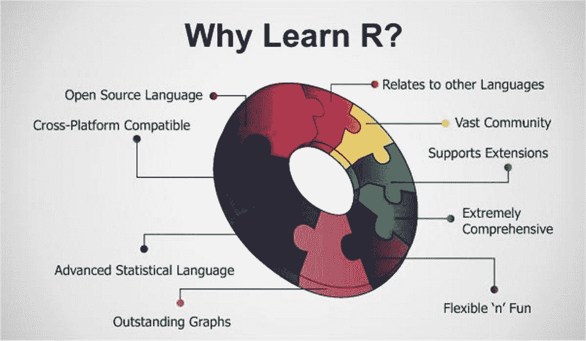

(来源：[`hackernoon.com/5-free-r-programming-courses-for-data-scientists-and-ml-programmers-5732cb9e10`](https://hackernoon.com/5-free-r-programming-courses-for-data-scientists-and-ml-programmers-5732cb9e10))

### 介绍

* * *

## 我们的三大课程推荐

 1\. [谷歌网络安全证书](https://www.kdnuggets.com/google-cybersecurity) - 快速进入网络安全职业轨道。

 2\. [谷歌数据分析专业证书](https://www.kdnuggets.com/google-data-analytics) - 提升你的数据分析能力

 3\. [谷歌 IT 支持专业证书](https://www.kdnuggets.com/google-itsupport) - 支持组织的 IT 工作

* * *

R 是一种专注于统计和图形分析的编程语言。因此，它通常用于统计推断、数据分析和机器学习。R 目前是数据科学职位市场上需求最高的编程语言之一（见图 1）。

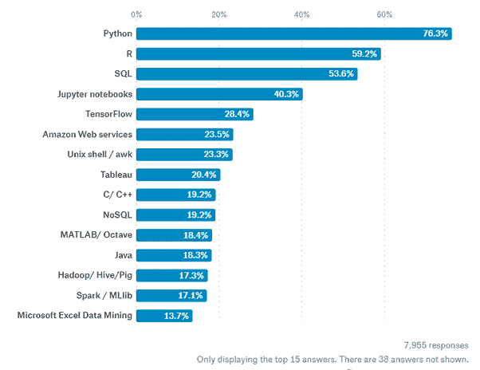

图 1：2019 年数据科学中最受欢迎的编程语言 [1]

R 可以从 [r-project.org](http://www.r-project.org/) 安装，而 R 最常用的集成开发环境 (IDE) 无疑是 [RStudio](http://www.rstudio.com/ide/)。

有两种主要类型的包（库）可以用来为 R 添加功能：基础包和分发包。基础包随 R 的安装一起提供，而分发包可以通过 [CRAN](https://cran.r-project.org/web/packages/available_packages_by_date.html) 免费下载。

安装 R 后，我们可以开始进行一些数据分析！

### 演示

在这个示例中，我将引导你完成一个 [移动价格分类数据集](https://www.kaggle.com/iabhishekofficial/mobile-price-classification#train.csv) 的端到端分析，以预测手机的价格范围。我用于演示的代码在我的 [GitHub](https://github.com/pierpaolo28/R-Programming/blob/master/Smartphone%20Prices/workflow.r) 和 [Kaggle](https://www.kaggle.com/pierpaolo28/mobile-price-classification?scriptVersionId=20002929) 账户中均可获得。

### 导入库

首先，我们需要导入所有必要的库。

包可以通过 ***install.packages()*** 命令在 R 中安装，然后使用 ***library()*** 命令加载。在这种情况下，我决定首先安装 PACMAN（包管理工具），然后使用它来安装和加载所有其他包。PACMAN 使加载库更容易，因为它可以在一行代码中安装和加载所有必要的库。

导入的包用于添加以下功能：

+   **dplyr: **数据处理和分析。

+   **ggplot2: **数据可视化。

+   **rio: **数据导入和导出。

+   **gridExtra: **使图形对象可以自由排列在页面上。

+   **scales: **用于在图中缩放数据。

+   **ggcorrplot: **用于使用 ggplot2 可视化相关矩阵。

+   **caret: **用于训练和绘制分类和回归模型。

+   **e1071: **包含执行机器学习算法的函数，例如支持向量机、朴素贝叶斯等。

### 数据预处理

现在我们可以加载数据集，显示其前 5 列（见图 2），并打印每个特征的主要特征的摘要（见图 3）。在 R 中，我们可以使用 ***<-*** 运算符创建新对象。

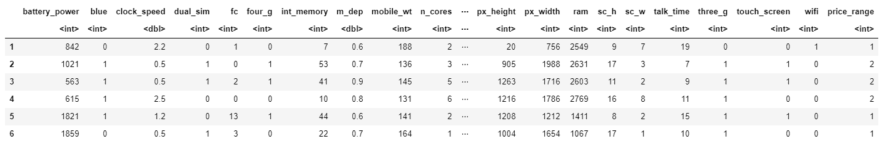

图 2：数据集头部

摘要函数为我们提供了数据集中每个特征的简要统计描述。根据考虑的特征的性质，将提供不同的统计信息：

+   **数值特征：**均值、中位数、众数、范围和四分位数。

+   **因子特征：**频率。

+   **因子和数值特征的混合：**缺失值数量。

+   **字符特征：**类别长度。

因子是一种数据对象类型，用于在 R 中将数据（例如整数或字符串）分类和存储为级别。例如，它们可以用于对特征进行独热编码或创建条形图（稍后会看到）。因此，当处理具有少量唯一值的列时，它们特别有用。

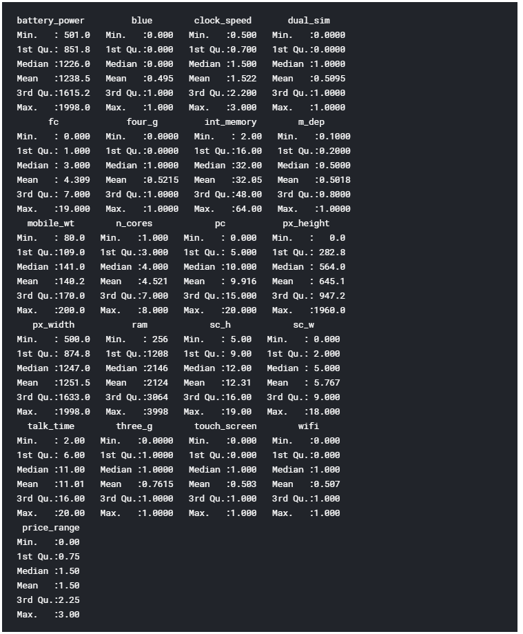

图 3：数据集摘要

最后，我们现在可以使用下面的代码检查数据集中是否包含任何非数字（NaNs）值。

从图 4 中可以看到，没有发现缺失数字。

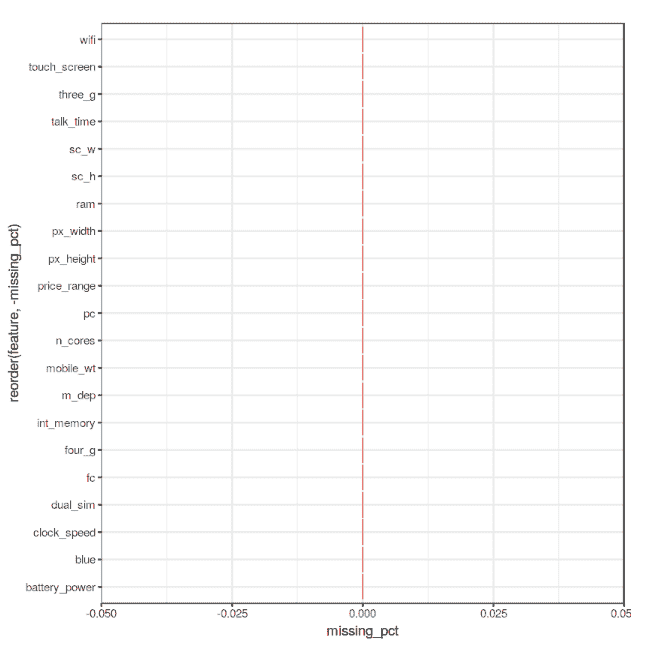

图 4：每个特征的 NaNs 百分比

### 数据可视化

我们现在可以通过绘制数据集的相关矩阵（见图 5）来开始数据可视化。

图 5：相关矩阵

接下来，我们可以开始使用条形图和箱线图分析各个特征。然而，在创建这些图之前，我们需要首先将考虑的特征从数值型转换为因子（这允许我们对数据进行分箱，然后绘制分箱后的数据）。

我们现在可以通过将三个条形图存储在不同的变量中（p1、p2、p3），然后将它们添加到 ***grid.arrange()*** 中以创建子图。在这种情况下，我决定检查蓝牙、双卡双待和 4G 特性。从图 6 可以看出，数据集中考虑的大多数手机不支持蓝牙，支持双卡双待且支持 4G。

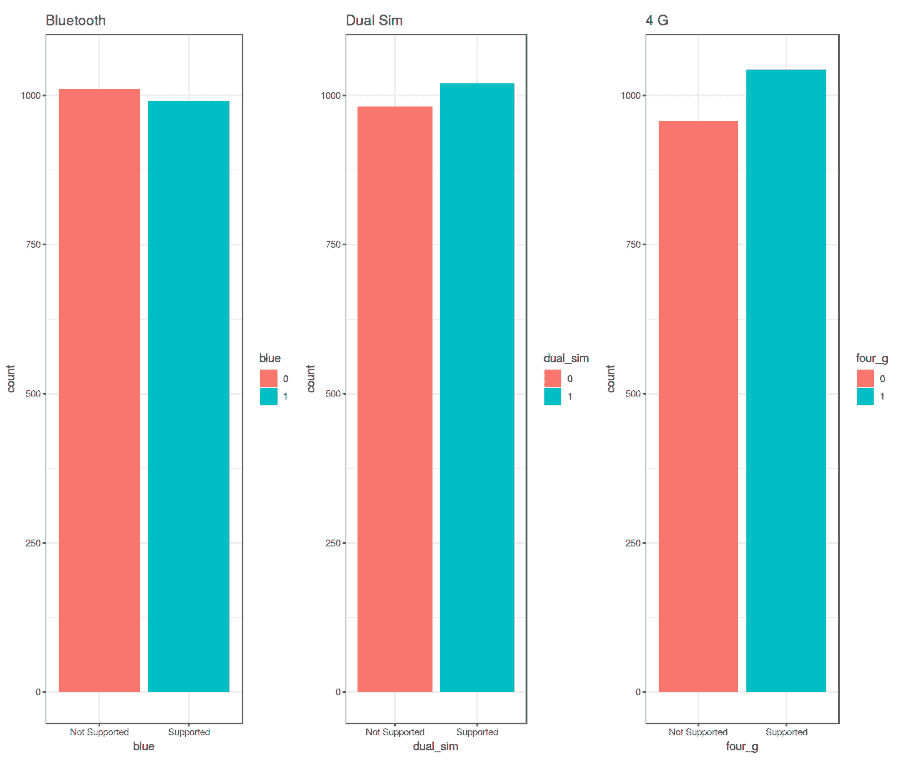

图 6: 条形图分析

这些图是使用 R 的 ***ggplot2*** 库创建的。调用 ***ggplot()*** 函数时，我们创建了一个坐标系统，在其上可以添加层 [2]。

我们传递给 ***ggplot()*** 函数的第一个参数是我们将要使用的数据集，第二个参数是美学函数，我们在其中定义要绘制的变量。然后我们可以添加其他附加参数，如定义所需的几何函数（例如条形图、散点图、箱线图、直方图等）、添加图形主题、轴限、标签等。

进一步深入分析，我们现在可以使用 ***prop.table()*** 函数计算不同案例之间差异的精确百分比。根据结果输出（图 7），50.5% 的手机设备不支持蓝牙，50.9% 为双卡双待，52.1% 支持 4G。

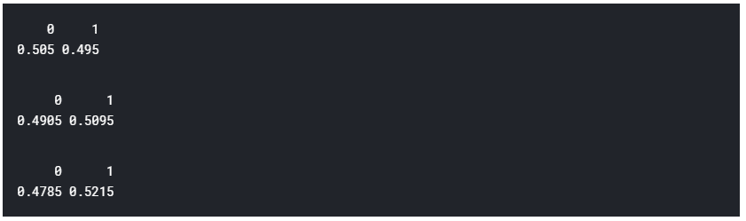

图 7: 类别分布百分比

我们现在可以使用之前相同的技术创建 3 个不同的箱线图。在这种情况下，我决定检查电池电量、手机重量和 RAM（随机存取存储器）如何影响手机价格。在这个数据集中，我们没有实际的手机价格，而是一个价格范围，指示价格的高低（从 0 到 3 的四个不同级别）。

结果总结在图 8。电池电量和 RAM 的增加通常会导致价格上涨。而且，更昂贵的手机整体上似乎更轻便。在 RAM 与价格区间的图中，整体分布中有一些有趣的异常值。

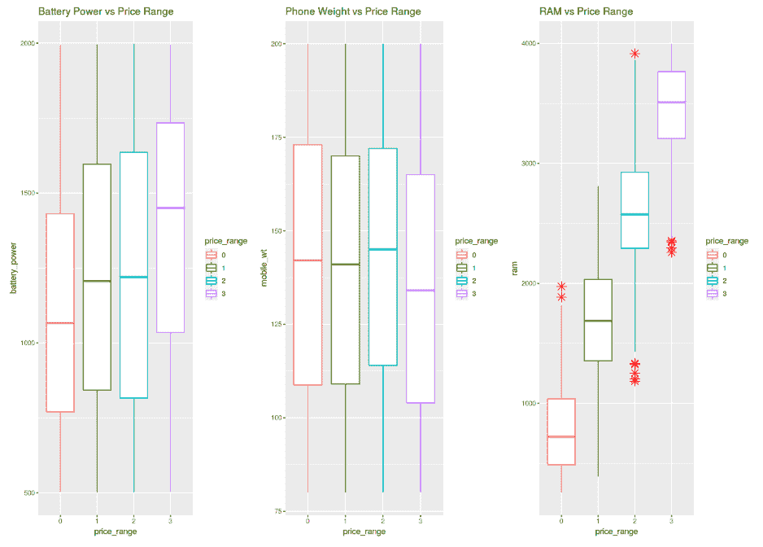

图 8: 箱线图分析

最后，我们将检查前置和主摄像头的摄像质量（以百万像素为单位）的分布（图 9）。有趣的是，前置摄像头的分布似乎遵循指数衰减分布，而主摄像头大致遵循均匀分布。如果你对概率分布感兴趣，可以在 [这里](https://towardsdatascience.com/probability-distributions-in-data-science-cce6e64873a7) 找到更多信息。

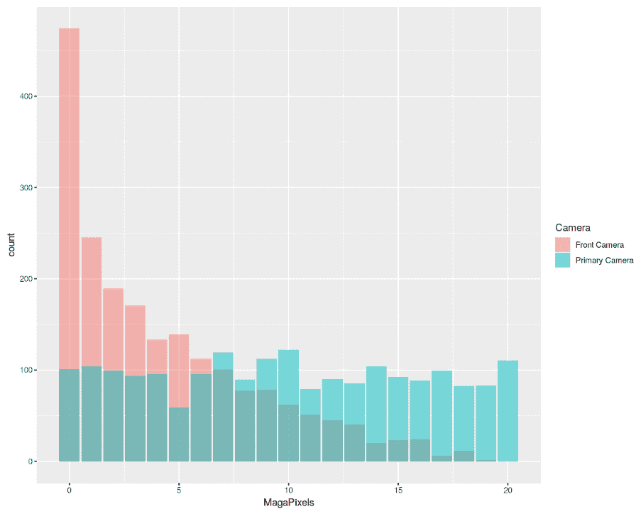

图 9: 直方图分析

### 机器学习

为了进行机器学习分析，我们首先需要将因子变量转换为数字形式，然后将数据集分为训练集和测试集（75:25 比例）。最后，我们将训练集和测试集分为特征和标签（***price_range***）。

现在是训练我们的机器学习模型的时候了。在这个例子中，我决定使用[支持向量机（SVM）](https://towardsdatascience.com/svm-feature-selection-and-kernels-840781cc1a6c)作为我们的多类别分类器。使用 R 的***summary()***函数，我们可以检查训练模型的参数（图 10）。

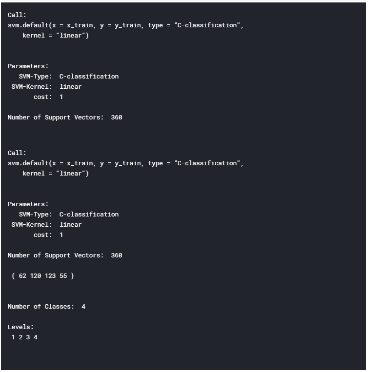

图 10：机器学习模型总结

最后，我们现在可以通过对测试集进行一些预测来测试我们的模型。使用 R 的***confusionMatrix()***函数，我们可以获得模型准确性的完整报告（图 11）。在这种情况下，记录了 96.6% 的准确率。

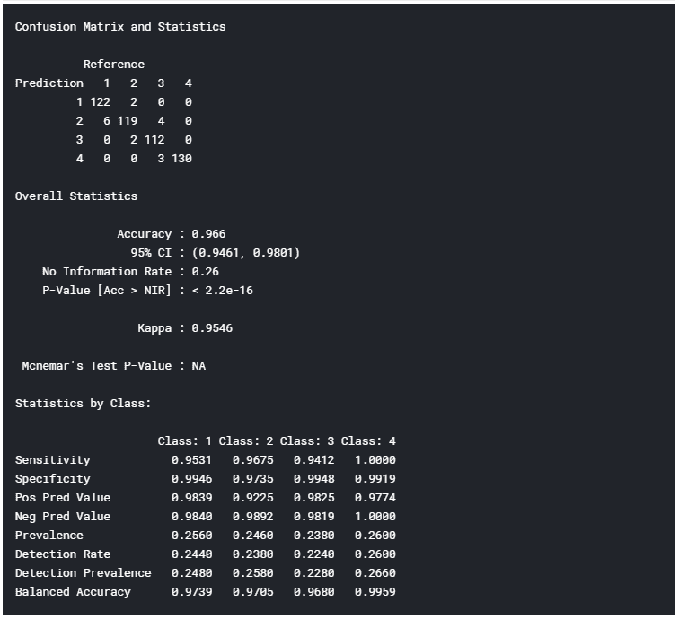

图 11：模型准确性报告

*希望你喜欢这篇文章，谢谢阅读！*

### 联系方式

如果你想及时了解我的最新文章和项目，请[在 Medium 上关注我](https://medium.com/@pierpaoloippolito28?source=post_page---------------------------)并订阅我的[邮件列表](http://eepurl.com/gwO-Dr?source=post_page---------------------------)。以下是我的一些联系方式：

+   [Linkedin](https://uk.linkedin.com/in/pier-paolo-ippolito-202917146?source=post_page---------------------------)

+   [个人博客](https://pierpaolo28.github.io/blog/?source=post_page---------------------------)

+   [个人网站](https://pierpaolo28.github.io/?source=post_page---------------------------)

+   [Medium 个人资料](https://towardsdatascience.com/@pierpaoloippolito28?source=post_page---------------------------)

+   [GitHub](https://github.com/pierpaolo28?source=post_page---------------------------)

+   [Kaggle](https://www.kaggle.com/pierpaolo28?source=post_page---------------------------)

### 参考书目

[1] 哪些语言对数据科学家在 2019 年很重要？Quora。访问网址：[`www.quora.com/Which-languages-are-important-for-Data-Scientists-in-2019`](https://www.quora.com/Which-languages-are-important-for-Data-Scientists-in-2019)

[2] 数据科学中的 R，Garrett Grolemund 和 Hadley Wickham。访问网址：[`www.bioinform.io/site/wp-content/uploads/2018/09/RDataScience.pdf`](https://www.bioinform.io/site/wp-content/uploads/2018/09/RDataScience.pdf)

**简介：[Pier Paolo Ippolito](https://www.linkedin.com/in/pierpaolo28/)** 是一名数据科学家，拥有南安普顿大学的人工智能硕士学位。他对 AI 进展和机器学习应用（如金融和医学）有浓厚的兴趣。通过[Linkedin](https://www.linkedin.com/in/pierpaolo28/)与他联系。

[原文](https://towardsdatascience.com/getting-started-with-r-programming-2f15e9256c9)。经许可转载。

**相关：**

+   R 中音频文件处理基础

+   如何在 Python（和 R）中可视化数据

+   云端运行上的无服务器机器学习与 R

### 相关主题

+   [开始使用自动化文本摘要](https://www.kdnuggets.com/2019/11/getting-started-automated-text-summarization.html)

+   [开始清理数据](https://www.kdnuggets.com/2022/01/getting-started-cleaning-data.html)

+   [开始使用 SQL 备忘单](https://www.kdnuggets.com/2022/08/getting-started-sql-cheatsheet.html)

+   [开始使用 spaCy 进行 NLP](https://www.kdnuggets.com/2022/11/getting-started-spacy-nlp.html)

+   [开始使用 PyCaret](https://www.kdnuggets.com/2022/11/getting-started-pycaret.html)

+   [开始使用 PyTorch Lightning](https://www.kdnuggets.com/2022/12/getting-started-pytorch-lightning.html)
