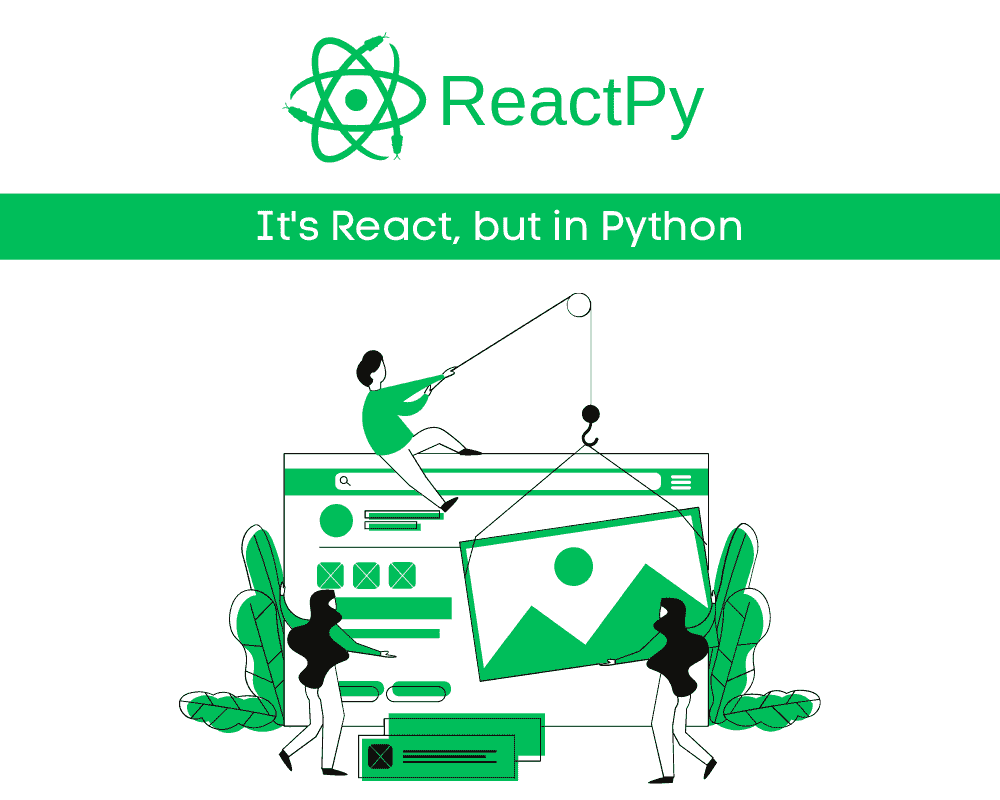
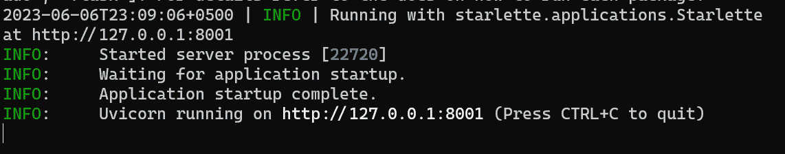
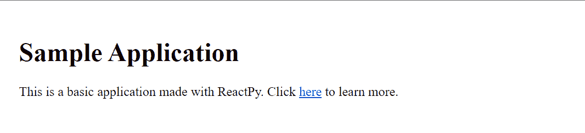
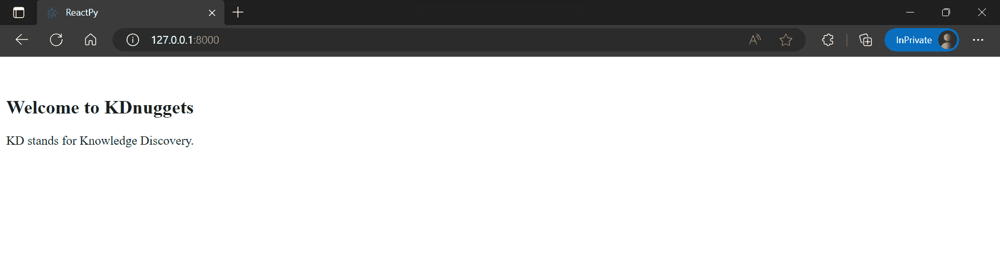
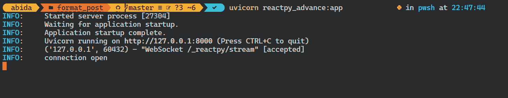
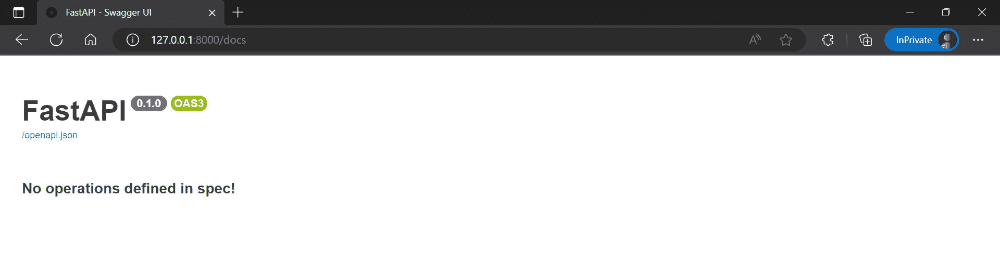
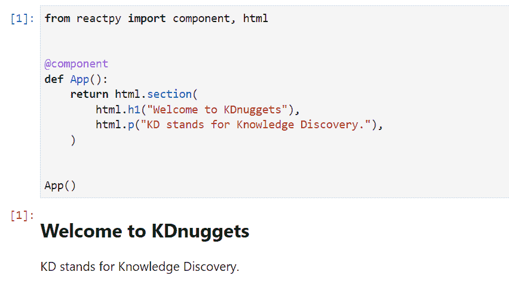
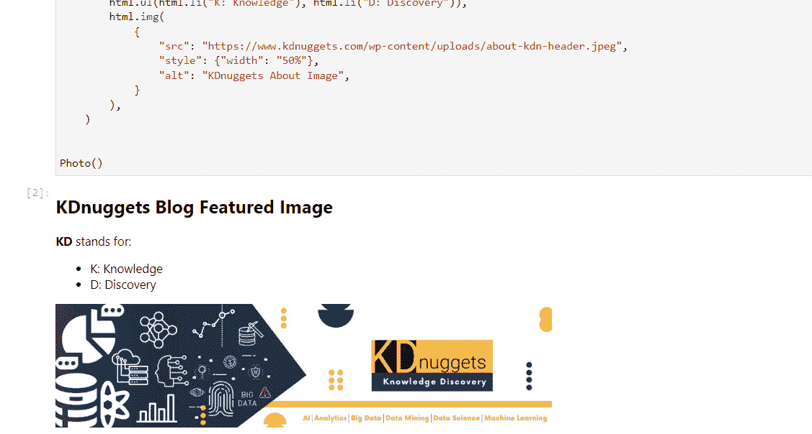
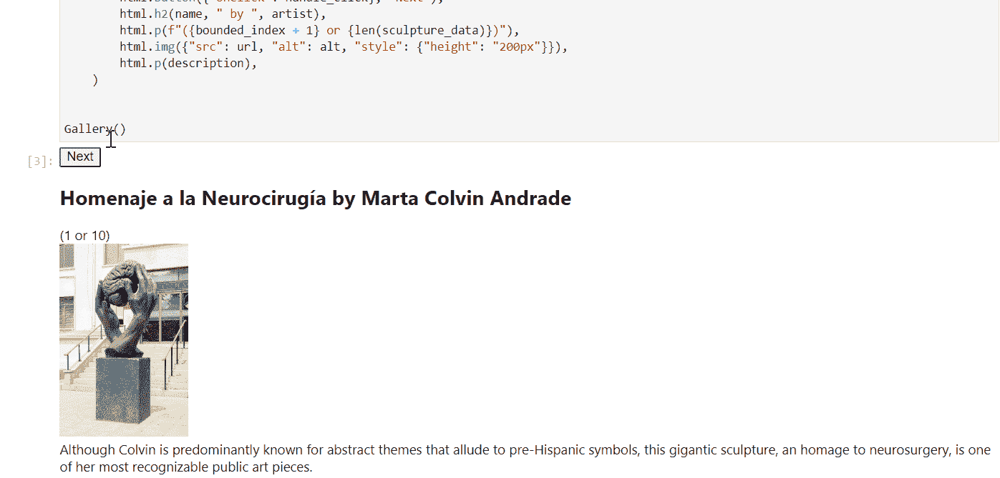

# 开始使用 ReactPy

> 原文：[`www.kdnuggets.com/2023/06/getting-started-reactpy.html`](https://www.kdnuggets.com/2023/06/getting-started-reactpy.html)



图片来自作者

随着 ReactJS 在网页开发中的受欢迎程度不断上升，对 Python 中类似框架的需求也在增加，以便构建生产就绪的机器学习、AI 和数据科学应用程序。这就是 ReactPy 的作用，它为初学者、数据科学家和工程师提供了在 Python 中创建类似 ReactJS 的应用程序的能力。ReactPy 为用户提供了一个简单的声明式视图框架，可以有效地扩展应用程序以应对复杂的用例。

* * *

## 我们的前三大课程推荐

 1\. [谷歌网络安全证书](https://www.kdnuggets.com/google-cybersecurity) - 快速进入网络安全职业的快车道。

 2\. [谷歌数据分析专业证书](https://www.kdnuggets.com/google-data-analytics) - 提升你的数据分析技能

 3\. [谷歌 IT 支持专业证书](https://www.kdnuggets.com/google-itsupport) - 支持你的组织 IT

* * *

在这篇博客文章中，我们将深入了解 ReactPy，学习如何构建一个简单的应用程序，并在网页浏览器和 Jupyter Notebook 中运行它。具体来说，我们将涵盖：

+   在各种后端 API 下，通过网页浏览器运行 ReactPy。

+   使用 Jupyter 小部件在 Jupyter Notebook 中运行 ReactPy。

# ReactPy 是什么？

[**ReactPy**](https://github.com/reactive-python/reactpy)是一个用于构建用户界面的 Python 库，无需使用 JavaScript。ReactPy 的界面是通过[组件](https://reactpy.dev/docs/guides/creating-interfaces/your-first-components/index.html#your-first-components)构建的，提供了类似于 ReactJS 的体验。

ReactPy 旨在简化，具有较平缓的学习曲线和最小的 API 界面。这使得它对没有网页开发经验的人也很友好，同时它也可以扩展以支持复杂的应用程序。

# 设置

使用 pip 安装 ReactPy 非常简单：

```py
pip install reactpy
```

安装后，尝试使用下面的脚本运行一个示例应用程序。

```py
python -c "import reactpy; reactpy.run(reactpy.sample.SampleApp)"
```

我们使用`starlette`后端的应用程序正在本地地址上运行。只需复制并粘贴到网页浏览器中。



正如我们所观察到的，ReactPy 运行得非常完美。



你也可以安装你选择的后端。在我们的例子中，我们将使用[fastapi](https://fastapi.tiangolo.com/)后端安装 ReactPy。

```py
pip install "reactpy[fastapi]"
```

这里是与 ReactPy 一起使用的最受欢迎的 Python 后端列表：

+   `fastapi`: [`fastapi.tiangolo.com`](https://fastapi.tiangolo.com/)

+   `flask`: [`palletsprojects.com/p/flask/`](https://palletsprojects.com/p/flask/)

+   `sanic`: [`sanicframework.org`](https://sanicframework.org/)

+   `starlette`: [`www.starlette.io/`](https://www.starlette.io/)

+   `tornado`: [`www.tornadoweb.org/en/stable/`](https://www.tornadoweb.org/en/stable/)

# 在 Web 浏览器中运行 ReactPy

我们现在将尝试构建一个简单的应用，包含标题 1 和一个段落，并在默认后端（`starlette`）上运行它。

+   当你创建一个新的组件函数时，尝试在函数上方添加魔术函数`@componnet`。

+   在那之后，创建一个包含不同 HTML 元素的网页骨架，例如：

    +   `html.h1`用于标题 1。

    +   `html.b`用于粗体。

    +   `html.ul`和`html.li`用于项目符号。

    +   `html.img`用于图像。

```py
from reactpy import component, html, run

@component
def App():
    return html.section(
        html.h1("Welcome to KDnuggets"),
        html.p("KD stands for Knowledge Discovery."),
    )

run(App)
```

将上述代码保存到`reactpy_simple.py`文件中，并在终端中运行以下命令。

```py
python reactpy_simple.py
```


我们的简单 Web 应用程序运行顺利。



让我们尝试添加更多 HTML 组件，如图像和列表，并使用`fastapi`后端运行应用程序。为此：

1.  导入`FastAPI`类和`configure`来自`reactpy.backend.fastapi`

1.  创建一个名为`Photo()`的组件函数，并添加所有 HTML 元素。

1.  使用`FastAPI`对象创建一个应用对象，并用 ReactPy 组件配置它。

```py
from fastapi import FastAPI
from reactpy import component, html
from reactpy.backend.fastapi import configure

@component
def Photo():
    return html.section(
        html.h1("KDnuggets Blog Featured Image"),
        html.p(html.b("KD"), " stands for:"),
        html.ul(html.li("K: Knowledge"), html.li("D: Discovery")),
        html.img(
            {
                "src": "https://www.kdnuggets.com/wp-content/uploads/about-kdn-header.jpeg",
                "style": {"width": "50%"},
                "alt": "KDnuggets About Image",
            }
        ),
    )

app = FastAPI()
configure(app, Photo)
```

将文件保存为`reactpy_advance.py`，并像运行任何 FastAPI 应用程序一样使用 unicorn 运行该应用程序。

```py
uvicorn reactpy_advance:app
```



正如我们所观察到的，我们的应用程序运行了额外的 HTML 元素。


为了确认它正在以 FastAPI 作为后端运行，我们将链接中添加`/docs`。



# 在 Jupyter Notebook 中运行 ReactPy

在 Jupyter Notebook 中运行和测试 ReactPy 需要安装一个名为`reactpy_jupyter`的 Jupyter 小部件。

```py
%pip install reactpy_jupyter
```

在运行任何东西之前，先运行以下命令以激活小部件。

```py
import reactpy_jupyter
```

**或者**使用`%config`魔术函数将`reactpy_jupyter`注册为配置文件中的永久 IPython 扩展。

```py
%config InteractiveShellApp.extensions = ['reactpy_jupyter']
```

我们现在将在 Jupyter Notebook 中运行 ReactPy 组件。我们将直接运行组件函数，而不是使用`run()`。

```py
from reactpy import component, html

@component
def App():
    return html.section(
        html.h1("Welcome to KDnuggets"),
        html.p("KD stands for Knowledge Discovery."),
    )

App()
```

类似于之前的示例，我们将通过运行`Photo()`函数来运行一个高级示例。



```py
from reactpy import component, html

@component
def Photo():
    return html.section(
        html.h1("KDnuggets Blog Featured Image"),
        html.p(html.b("KD"), " stands for:"),
        html.ul(html.li("K: Knowledge"), html.li("D: Discovery")),
        html.img(
            {
                "src": "https://www.kdnuggets.com/wp-content/uploads/about-kdn-header.jpeg",
                "style": {"width": "50%"},
                "alt": "KDnuggets About Image",
            }
        ),
    )

Photo()
```



我们还可以创建一个使用按钮和输入的互动应用程序，如下所示。你可以阅读 ReactPy [文档](https://reactpy.dev/docs/guides/adding-interactivity/index.html)来创建用户界面、互动、状态管理、API 钩子和逃生通道。



[Binder 上的 ReactPy 动图](https://mybinder.org/v2/gh/reactive-python/reactpy-jupyter/main?urlpath=lab/tree/notebooks/introduction.ipynb)

# 结论

总结来说，这篇博客文章介绍了 ReactPy，展示了如何创建简单的 ReactPy 应用程序。通过在网页浏览器中运行 ReactPy，使用不同的 API 后端，以及在 Jupyter Notebooks 中使用 Jupyter 小部件，我们见证了 ReactPy 在允许开发人员为网页和笔记本环境构建应用程序方面的灵活性。

ReactPy 显示了作为一个 Python 库的潜力，能够创建具有广泛受众的响应式用户界面。随着持续的发展，ReactPy 可能成为机器学习和 AI Python 应用程序中对基于 JavaScript 的 React 的一个引人注目的替代方案。

+   [在 Binder 上尝试 ReactPy](https://mybinder.org/v2/gh/reactive-python/reactpy-jupyter/main?urlpath=lab/tree/notebooks/introduction.ipynb)

+   [ReactPy 文档](https://reactpy.dev/)

+   [GitHub 仓库](https://github.com/reactive-python/reactpy)

**[Abid Ali Awan](https://www.polywork.com/kingabzpro)** ([@1abidaliawan](https://twitter.com/1abidaliawan)) 是一名认证的数据科学专业人员，热衷于构建机器学习模型。目前，他专注于内容创作，并撰写有关机器学习和数据科学技术的技术博客。Abid 拥有技术管理硕士学位和电信工程学士学位。他的愿景是使用图神经网络构建一个 AI 产品，帮助那些正在与心理健康问题作斗争的学生。

### 更多相关内容

+   [自动化文本摘要入门](https://www.kdnuggets.com/2019/11/getting-started-automated-text-summarization.html)

+   [数据清理入门](https://www.kdnuggets.com/2022/01/getting-started-cleaning-data.html)

+   [SQL 速查表入门](https://www.kdnuggets.com/2022/08/getting-started-sql-cheatsheet.html)

+   [spaCy 自然语言处理入门](https://www.kdnuggets.com/2022/11/getting-started-spacy-nlp.html)

+   [PyCaret 入门](https://www.kdnuggets.com/2022/11/getting-started-pycaret.html)

+   [PyTorch Lightning 入门](https://www.kdnuggets.com/2022/12/getting-started-pytorch-lightning.html)
