# TensorFlow 2 入门

> 原文：[`www.kdnuggets.com/2020/07/getting-started-tensorflow2.html`](https://www.kdnuggets.com/2020/07/getting-started-tensorflow2.html)

评论

但等等……什么是 TensorFlow？

TensorFlow 是 Google 的一个深度学习框架，于 2019 年发布了第二版。它是全球最著名的深度学习框架之一，广泛应用于工业专家和研究人员。

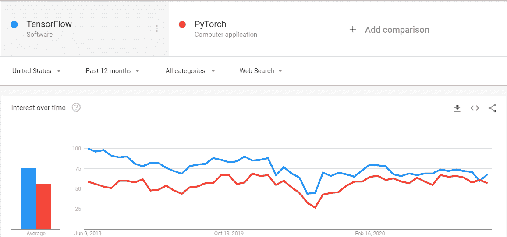

TensorFlow v1 使用起来很困难，因为它不够 Pythonic，但 v2 发布后与 Keras 完全同步，现在使用起来简单易学，理解起来也很直观。

记住，这不是一篇关于深度学习的文章，所以我希望你对深度学习的术语和基本概念有一定了解。

我们将通过一个非常著名的数据集——IRIS 数据集，来探索深度学习的世界。

让我们直接跳入代码，了解发生了什么。

### 导入并理解数据集

```py
from sklearn.datasets import load_iris
iris = load_iris()

```

现在这个*iris*是一个字典。我们可以使用以下方法查看它的键

```py
>>> iris.keys()
dict_keys([‘data’, ‘target’, ‘frame’, ‘target_names’, ‘DESCR’, ‘feature_names’, ‘filename’]) 

```

所以我们的数据在*data*键中，*target*在*target*键中，等等。如果你想查看这个数据集的详细信息，你可以使用*iris['DESCR']*。

现在我们需要导入其他重要的库，这将帮助我们创建神经网络。

```py
from sklearn.model_selection import train_test_split #to split data

import numpy as np
import pandas as pd
import matplotlib.pyplot as plt

import tensorflow as tf
from tensorflow.keras.layers import Dense
from tensorflow.keras.models import Sequential

```

这里我们从*tensorflow*导入了两个主要的东西，分别是*Dense*和*Sequential*。Dense 是从*tensorflow.keras.layers*导入的，它是一种密集连接的层。密集连接层意味着前一层的所有节点都连接到当前层的所有节点。

*Sequential* 是 Keras 提供的一个 API，通常称为 Sequential API，我们将用它来构建我们的神经网络。

为了更好地理解数据，我们可以将其转换为数据框。让我们来做吧。

```py
X = pd.DataFrame(data = iris.data, columns = iris.feature_names)
print(X.head())

```

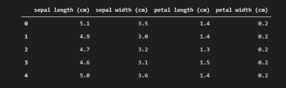

*X.head()*

请注意，这里我们设置了*columns = iris.feature_names*，其中*feature_names*是包含所有 4 个特征名称的键。

同样对于目标，

```py
y = pd.DataFrame(data=iris.target, columns = [‘irisType’])
y.head()

```

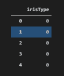

*y.head()*

要探索目标集中的类别数量，我们可以使用

```py
y.irisType.value_counts()

```

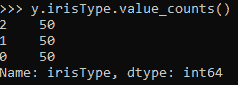

在这里我们可以看到有 3 个类别，每个类别的标签是 0、1 和 2。要查看标签名称，我们可以使用

```py
iris.target_names #it is a key of dictionary iris

```

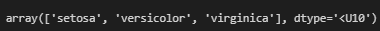

这些是我们需要预测的类别名称。

### 机器学习的数据预处理

现在，机器学习的第一步是数据预处理。数据预处理的主要步骤包括

+   填补缺失值

+   将数据分割为训练集和验证集

+   数据归一化

+   将分类数据转换为独热向量

### 缺失值

要检查是否有缺失值，我们可以使用*pandas.DataFrame.info()*方法进行检查。

```py
X.info()

```

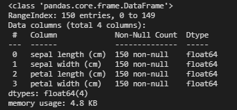

在这里我们可以看到没有缺失值（幸运的是），并且我们所有的特征都是*float64*类型。

### 拆分为训练集和测试集

要将数据拆分为训练集和测试集，我们可以使用先前导入的 *train_test_split* 来实现。

```py
X_train, X_test, y_train, y_test = train_test_split(X,y, test_size=0.1)

```

其中 *test_size* 是一个参数，告诉我们我们希望测试数据占整个数据的 10%。

### 数据归一化

通常，当数据具有较高的方差时，我们会对其进行归一化处理。为了检查方差，我们可以使用 *var()* 函数从 *panadas.DataFrame* 来检查所有列的方差。

```py
X_train.var(), X_test.var()

```

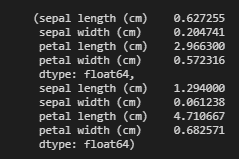

在这里我们可以看到，*X_train* 和 *X_test* 的方差都非常低，因此无需对数据进行归一化处理。

### 类别数据转换为独热编码向量

由于我们知道我们的输出数据已经是通过 *iris.target_names* 检查过的 3 个类别中的一个，好的地方是，当我们加载目标时，它们已经是 0、1、2 格式，其中 0=第一个类别，1=第二个类别，以此类推。

这种表示法的问题是我们的模型可能会优先考虑较高的数字，这可能会导致结果偏差。因此，为了应对这一点，我们将使用独热编码表示。你可以在 [这里](https://towardsdatascience.com/tagged/one-hot-encoder) 了解更多关于独热编码向量的信息。我们可以使用 Keras 内置的 *to_categorical* 或使用 *OneHotEncoder* 从 *sklearn*。我们将使用 *to_categorical*。

```py

y_train = tf.keras.utils.to_categorical(y_train)
y_test = tf.keras.utils.to_categorical(y_test)

```

我们将只查看前 5 行，以检查它是否正确转换。

```py
y_train[:5,:]

```

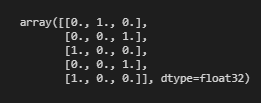

是的，我们已经将其转换为独热编码表示。

### 最后一件事

我们还可以做的一件事是将数据转换回 *numpy* 数组，以便我们可以使用一些额外的函数，这些函数将帮助我们在模型中。为此我们可以使用

```py
X_train = X_train.values

X_test = X_test.values

```

让我们看看第一个训练样本的结果。

```py
X_train[0]

```

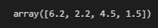

在这里，我们可以看到第一个训练样本的 4 个特征的值，其形状为 (4,)

当我们对目标标签使用 *to_categorical* 时，它们已经是数组格式。

### 机器学习模型

现在我们终于准备好创建我们的模型并进行训练了。我们将从一个简单的模型开始，然后转向复杂的模型结构，在此过程中我们将介绍 Keras 中的不同技巧和技术。

让我们编写基本模型的代码

```py
model1 = Sequential() #Sequential Object

```

首先，我们必须创建一个顺序对象。现在，要创建一个模型，我们所要做的就是根据我们的选择添加不同类型的层。我们将创建一个包含 10 个全连接层的模型，以便观察过拟合，并通过不同的正则化技术来减少它。

```py
model1.add( Dense( 64, activation = 'relu', input_shape= X_train[0].shape))
model1.add( Dense (128, activation = 'relu')
model1.add( Dense (128, activation = 'relu')
model1.add( Dense (128, activation = 'relu')
model1.add( Dense (128, activation = 'relu')
model1.add( Dense (64, activation = 'relu')
model1.add( Dense (64, activation = 'relu')
model1.add( Dense (64, activation = 'relu')
model1.add( Dense (64, activation = 'relu')
model1.add( Dense (3, activation = 'softmax')

```

请注意，在我们的第一层中，我们使用了一个额外的参数 *input_shape*。这个参数指定了第一层的维度。在这种情况下，我们不关心训练样本的数量。我们只关心特征的数量。因此，我们将任何训练样本的形状传递给 *input_shape*，在我们的例子中，它是 *(4,)*。

请注意，我们在输出层使用了*softmax*激活函数，因为这是一个多分类问题。如果是二分类问题，我们会使用*sigmoid*激活函数。

我们可以传入任何我们想要的激活函数，如*sigmoid*、*linear*或*tanh*，但实验表明*relu*在这些模型中表现最佳。

现在，当我们定义了模型的形状后，下一步是指定它的*损失*、*优化器*和*度量标准*。我们使用 Keras 中的*compile*方法来指定这些。

```py
model1.compile(optimizer='adam', loss= 'categorical_crossentropy', metrics = ['acc'])

```

在这里，我们可以使用任何*优化器*，如随机梯度下降、RMSProp 等，但我们将使用 Adam。

我们在这里使用*categorical_crossentropy*，因为我们有一个多分类问题，如果我们有一个二分类问题，我们会使用*binary_crossentropy*。

度量标准对评估模型非常重要。根据不同的度量标准，我们可以评估模型的表现。对于分类问题，最重要的度量标准是准确率，它表示我们的预测有多准确。

我们模型的最后一步是*fit*它在训练数据和训练标签上。让我们开始编码吧。

```py
history = model1.fit(X_train, y_train, batch_size = 40, epochs=800, validation_split = 0.1

```

*fit*返回一个包含我们训练所有历史记录的回调，我们可以用来执行各种有用的任务，如绘图等。

History 回调有一个名为*history*的属性，我们可以通过*history.history*访问，它是一个包含所有损失和度量标准历史的字典，也就是说，在我们的案例中，它包含了*loss*、*acc*、*val_loss* 和*val_acc*的历史，我们可以像*history.history.loss*或*history.history['val_acc']*这样访问每一个。

我们将训练周期指定为 800，批量大小为 40，验证拆分为 0.1，这意味着我们现在有 10%的验证数据，用于分析我们的训练。使用 800 个周期会导致数据过拟合，这意味着它在训练数据上表现很好，但在测试数据上表现不好。

在模型训练时，我们可以看到训练集和验证集上的损失和准确率。

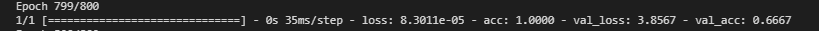

在这里，我们可以看到我们的训练准确率是 100%，验证准确率是 67%，这对于这样一个模型来说相当不错。让我们绘制一下。

```py
plt.plot(history.history['acc'])

plt.plot(history.history['val_acc'])

plt.xlabel('Epochs')

plt.ylabel('Acc')

plt.legend(['Training', 'Validation'], loc='upper right')

```

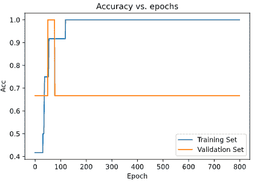

我们可以清楚地看到训练集的准确率远高于验证集的准确率。

类似地，我们可以绘制损失图。

```py
plt.plot(history.history['loss'])

plt.plot(history.history['val_loss'])

plt.xlabel('Epochs')

plt.ylabel('Loss')

plt.legend(['Training', 'Validation'], loc='upper left')

```

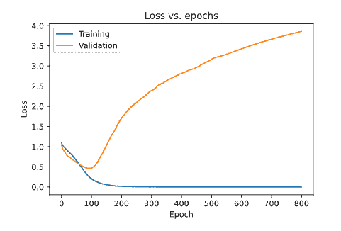

在这里，我们可以清楚地看到我们的验证损失远高于训练损失，这表明我们对数据进行了过拟合。

要检查模型性能，我们可以使用*model.evaluate*来检查模型的性能。我们需要在 evaluate 方法中传入数据和标签。

```py
model1.evaluate(X_test, y_test)

```

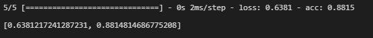

在这里，我们可以看到我们的模型提供了 88%的准确率，这对于一个过拟合的模型来说相当不错。

### 正则化

让我们通过在模型中添加正则化来改进它。正则化将减少模型的过拟合，并改善我们的模型。

我们将在模型中添加 L2 正则化。了解更多关于 L2 正则化的内容，请查看 [这里](https://towardsdatascience.com/concept-of-regularization-28f593cf9f8c#:~:text=The%20idea%20behind%20L1%20regularization,absolute%20value%20of%20the%20coefficients.)。要在模型中添加 L2 正则化，我们需要指定要添加正则化的层，并提供一个额外的参数，即*kernel_regularizer*，并传递*tf.keras.regularizers.l2()*。

我们还将在模型中实现一些 dropout，这将帮助我们更好地减少过拟合，从而提高模型的表现。要了解有关 dropout 的理论和动机，请参考 [this](https://medium.com/towards-artificial-intelligence/an-introduction-to-dropout-for-regularizing-deep-neural-networks-4e0826c10395) 文章。

让我们重新制作模型。

```py
model2 = Sequential()
model2.add(Dense(64, activation = 'relu', input_shape= X_train[0].shape))
model2.add( Dense(128, activation = 'relu', kernel_regularizer=tf.keras.regularizers.l2(0.001)
))
model2.add( Dense (128, activation = 'relu',kernel_regularizer=tf.keras.regularizers.l2(0.001)
))
model2.add(tf.keras.layers.Dropout(0.5)
model2.add( Dense (128, activation = 'relu', kernel_regularizer=tf.keras.regularizers.l2(0.001)
))
model2.add(Dense(128, activation = 'relu', kernel_regularizer = tf.keras.regularizers.l2(0.001)

))
model2.add( Dense (64, activation = 'relu', kernel_regularizer=tf.keras.regularizers.l2(0.001)
))
model2.add( Dense (64, activation = 'relu', kernel_regularizer=tf.keras.regularizers.l2(0.001)
))
model2.add(tf.keras.layers.Dropout(0.5)
model2.add( Dense (64, activation = 'relu', kernel_regularizer=tf.keras.regularizers.l2(0.001)
))
model2.add( Dense (64, activation = 'relu', kernel_regularizer=tf.keras.regularizers.l2(0.001)
))
model2.add( Dense (3, activation = 'softmax', kernel_regularizer=tf.keras.regularizers.l2(0.001)
))

```

如果你仔细观察，我们所有的层和参数都相同，只是我们添加了 2 个 dropout 层和每个全连接层中的正则化。

我们将保持其他所有内容（损失、优化器、周期等）不变。

```py
model2.compile(optimizer='adam', loss='categorical_crossentropy', metrics=['acc'])
history2 = model2.fit(X_train, y_train, epochs=800, validation_split=0.1, batch_size=40)

```

现在让我们评估模型。

```py
model2.evaluate(X_test, y_test)

```

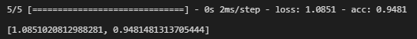

你猜怎么着？我们仅通过添加正则化和 dropout，将准确率从 88%提高到了 94%。如果再加入批量归一化，效果会更好。

让我们绘制它。

### 准确性

```py
plt.plot(history2.history['acc'])

plt.plot(history2.history['val_acc'])

plt.title('Accuracy vs. epochs')

plt.ylabel('Acc')

plt.xlabel('Epoch')

plt.legend(['Training', 'Validation'], loc='lower right')

plt.show()

```

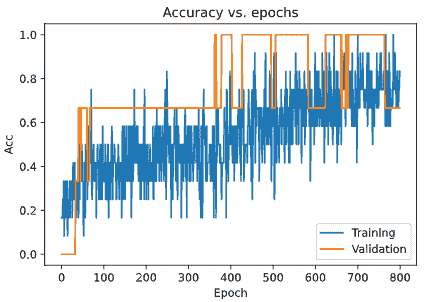

```py
plt.plot(history2.history['loss'])

plt.plot(history2.history['val_loss'])

plt.title('Loss vs. epochs')

plt.ylabel('Loss')

plt.xlabel('Epoch')

plt.legend(['Training', 'Validation'], loc='upper right')

plt.show()

```

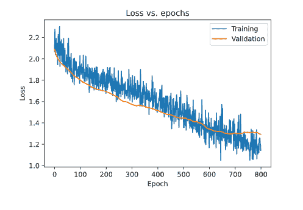

### 见解

我们可以看到，我们成功地从模型中过滤掉了过拟合，模型提升了近 6%，对于如此小的数据集这是一个很好的改进。

**相关：**

+   [TensorFlow 2.0 教程：优化训练时间性能](https://www.kdnuggets.com/2020/03/tensorflow-optimizing-training-time-performance.html)

+   [TensorFlow 2.0：动态、可读且高度扩展](https://www.kdnuggets.com/2019/08/tensorflow-20.html)

+   [通过正则化避免过拟合](https://www.kdnuggets.com/2018/02/avoid-overfitting-regularization.html)

* * *

## 我们的前三名课程推荐

 1\. [Google 网络安全证书](https://www.kdnuggets.com/google-cybersecurity) - 快速进入网络安全职业的轨道。

 2\. [Google 数据分析专业证书](https://www.kdnuggets.com/google-data-analytics) - 提升你的数据分析技能

 3\. [Google IT 支持专业证书](https://www.kdnuggets.com/google-itsupport) - 支持你的组织在 IT 方面

* * *

### 更多相关主题

+   [成为优秀数据科学家所需的 5 项关键技能](https://www.kdnuggets.com/2021/12/5-key-skills-needed-become-great-data-scientist.html)

+   [每个初学者数据科学家应掌握的 6 个预测模型](https://www.kdnuggets.com/2021/12/6-predictive-models-every-beginner-data-scientist-master.html)

+   [2021 年最佳 ETL 工具](https://www.kdnuggets.com/2021/12/mozart-best-etl-tools-2021.html)

+   [停止学习数据科学以寻找目标，并寻找目标去…](https://www.kdnuggets.com/2021/12/stop-learning-data-science-find-purpose.html)

+   [一个 90 亿美元的人工智能失败，分析中](https://www.kdnuggets.com/2021/12/9b-ai-failure-examined.html)

+   [构建一个可靠的数据团队](https://www.kdnuggets.com/2021/12/build-solid-data-team.html)
