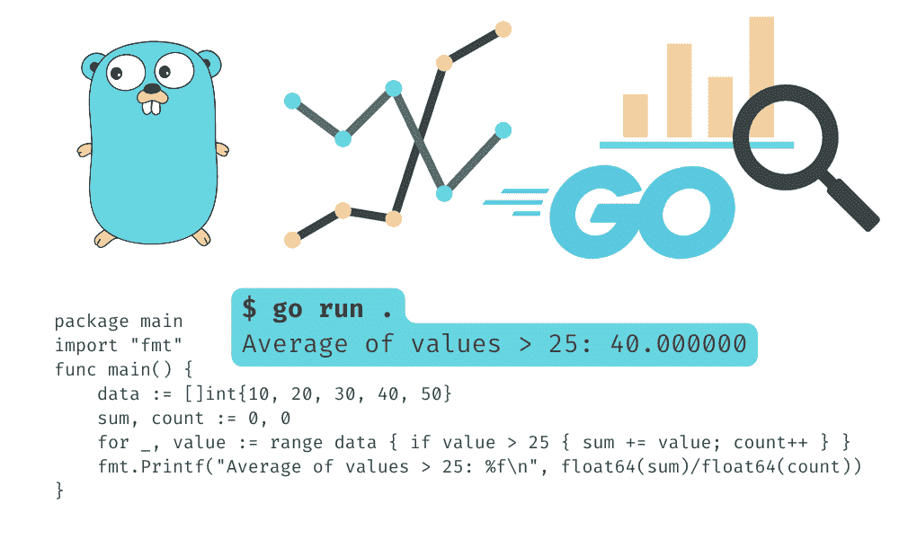
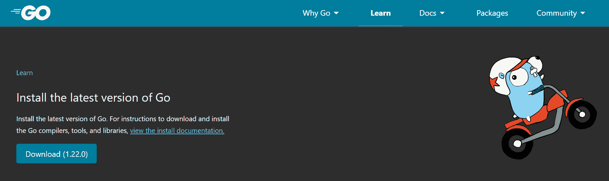
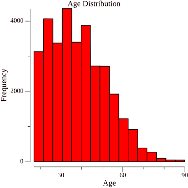

# 使用 Go 编程进行数据科学入门

> 原文：[`www.kdnuggets.com/getting-started-with-go-programing-for-data-science`](https://www.kdnuggets.com/getting-started-with-go-programing-for-data-science)



图片由作者提供

Go 编程语言在开发者中因其作为通用语言而迅速流行。它速度快、简单且强大，非常适合构建 Web 应用程序、移动应用程序和系统编程。最近，Go 开始逐渐进入机器学习和数据分析领域，使其成为数据科学项目的一个引人注目的选择。

如果你希望学习一种新语言，以便更高效地进行数据分析和可视化任务，那么 Go 可能是你的完美选择。在本教程中，你将学习 Go 的基础知识，包括设置 Go 环境、执行数据分析和可视化，以及构建一个简单的 KNN 分类器。

# 设置

通过访问 [go.dev](https://go.dev/learn/) 下载并安装最新版本的 Go。就是这么简单。



要检查是否成功安装，请运行以下命令：

```py
$ go version
go version go1.22.0 windows/amd64
```

接下来，我们将创建一个项目文件夹，并将目录更改为该文件夹。

```py
$ mkdir go-example
$ cd go-example
```

初始化 Go 模块。此命令会创建一个 `go.mod file` 来跟踪你代码的依赖项。

```py
$ go mod init example/kdnuggets
go: creating new go.mod: module example/kdnuggets
```

启动 IDE 或代码编辑器。在我们的案例中，我们使用的是 VSCode。

```py
code .
```

在主函数中写一个简单的打印命令。

```py
package main

import "fmt"

func main() {
    // Print to the console
    fmt.Println("Welcome to KDnuggets")
}
```

在终端中运行 go run 命令。

```py
$ go run .
Welcome to KDnuggets
```

它与 Python 非常相似，但相比 Python 提供了更多功能。尤其是在包管理方面非常有效。

# 使用 Go 进行简单的数据分析

在这个数据分析示例中，我们将从 Kaggle 下载并加载[成人人口收入](https://www.kaggle.com/datasets/uciml/adult-census-income/data)数据集。

首先，导入我们将用于分析的所有 Go 包。然后，使用 `os` 命令加载 CSV 文件。使用 `gota` 数据框包将原始数据转换为数据框。最后，我们将打印前两行。

```py
package main

import (
    "fmt"
    "os"
    "github.com/go-gota/gota/dataframe"
    "github.com/go-gota/gota/series"
)

func main() {

    f, err := os.Open("adult.csv")
    if err != nil {
        fmt.Println(err)
        return
    }
    defer f.Close()

    df := dataframe.ReadCSV(f)

    fmt.Println(df.Subset([]int{0, 1}))

} 
```

在运行代码之前，我们需要安装上面代码中使用的所有包。为此，我们将运行：

```py
$ go mod tidy

go: finding module for package github.com/go-gota/gota/series
go: finding module for package github.com/go-gota/gota/dataframe
go: downloading github.com/go-gota/gota v0.12.0
go: found github.com/go-gota/gota/dataframe in github.com/go-gota/gota v0.12.0
go: found github.com/go-gota/gota/series in github.com/go-gota/gota v0.12.0
go: downloading golang.org/x/net v0.0.0-20210423184538-5f58ad60dda6
go: downloading gonum.org/v1/gonum v0.9.1
go: downloading golang.org/x/exp v0.0.0-20191002040644-a1355ae1e2c3
go: downloading gonum.org/v1/netlib v0.0.0-20190313105609-8cb42192e0e0
```

安装所有包后，通过提供文件名来运行代码。

`gota` 数据框的可读性不如 `pandas` 数据框，但它允许在几秒钟内读取大量数据集。

```py
$ go run simple-analysis.go

[2x15] DataFrame

    age   workclass fnlwgt education education.num marital.status ...
 0: 90    ?         77053  HS-grad   9             Widowed        ...
 1: 82    Private   132870 HS-grad   9             Widowed        ...
    <int><string><int><string><int><string>...

Not Showing: occupation <string>, relationship <string>, race <string>, sex <string>,
capital.gain <int>, capital.loss <int>, hours.per.week <int>, native.country <string>,
income</string></int></int></int></string></string></string></string></string></int></string></int></string></int> 
```

现在，我们将编写完整的代码来过滤、计算均值和生成总结。代码与 pandas 十分相似，但你需要阅读 [文档](https://github.com/go-gota/gota) 来理解每个函数如何相互作用。

```py
package main

import (
	"fmt"
	"github.com/go-gota/gota/dataframe"
	"github.com/go-gota/gota/series"
	"os"
)

func main() {
	// Loading the CSV file
	f, err := os.Open("adult.csv")
	if err != nil {
		fmt.Println(err)
		return
	}
	defer f.Close()

	df := dataframe.ReadCSV(f)

	// Filter the data: individuals with education level "HS-grad"
	hsGrad := df.Filter(dataframe.F{Colname: "education", Comparator: series.Eq, Comparando: "HS-grad"})
	fmt.Println("\nFiltered DataFrame (HS-grad):")
	fmt.Println(hsGrad)

	// calculating the average age of individuals in the dataset
	avgAge := df.Col("age").Mean()
	fmt.Printf("\nAverage age: %.2f\n", avgAge)

	// Describing the data
	fmt.Println("\nGenerate descriptive statistics:")
	description := df.Describe()
	fmt.Println(description)

} 
```

我们展示了过滤后的数据集、平均年龄以及数值列的总结。

```py
Filtered DataFrame (HS-grad):
[10501x15] DataFrame

    age   workclass        fnlwgt education education.num marital.status     ...
 0: 90    ?                77053  HS-grad   9             Widowed            ...
 1: 82    Private          132870 HS-grad   9             Widowed            ...
 2: 34    Private          216864 HS-grad   9             Divorced           ...
 3: 68    Federal-gov      422013 HS-grad   9             Divorced           ...
 4: 61    Private          29059  HS-grad   9             Divorced           ...
 5: 61    ?                135285 HS-grad   9             Married-civ-spouse ...
 6: 60    Self-emp-not-inc 205246 HS-grad   9             Never-married      ...
 7: 53    Private          149650 HS-grad   9             Never-married      ...
 8: 71    ?                100820 HS-grad   9             Married-civ-spouse ...
 9: 71    Private          110380 HS-grad   9             Married-civ-spouse ...
    ...   ...              ...    ...       ...           ...                ...
    <int><string><int><string><int><string>...

Not Showing: occupation <string>, relationship <string>, race <string>, sex <string>,
capital.gain <int>, capital.loss <int>, hours.per.week <int>, native.country <string>,
income <string>Average age: 38.58

Generate descriptive statistics:
[8x16] DataFrame

    column   age       workclass   fnlwgt         education    education.num ...
 0: mean     38.581647 -           189778.366512  -            10.080679     ...
 1: median   37.000000 -           178356.000000  -            10.000000     ...
 2: stddev   13.640433 -           105549.977697  -            2.572720      ...
 3: min      17.000000 ?           12285.000000   10th         1.000000      ...
 4: 25%      28.000000 -           117827.000000  -            9.000000      ...
 5: 50%      37.000000 -           178356.000000  -            10.000000     ...
 6: 75%      48.000000 -           237051.000000  -            12.000000     ...
 7: max      90.000000 Without-pay 1484705.000000 Some-college 16.000000     ...
    <string><float><string><float><string><float>...

Not Showing: marital.status <string>, occupation <string>, relationship <string>,
race <string>, sex <string>, capital.gain <float>, capital.loss <float>,
hours.per.week <float>, native.country <string>, income</string></float></float></float></string></string></string></string></string></float></string></float></string></float></string></string></string></int></int></int></string></string></string></string></string></int></string></int></string></int> 
```

# 使用 Go 进行简单的数据可视化

Python 与 Jupyter Notebook 的兼容性较好，因此可视化图形和图表非常容易。你也可以在 Jupyter Notebook 中设置 Go，但效果不会像 Python 那样顺畅。

在这个示例中，我们正在

1.  加载数据集

1.  转换为数据框

1.  提取 `age` 列

1.  创建绘图对象

1.  向标题和 x 轴、y 轴标签添加文本

1.  绘制 `age` 列的直方图

1.  更改填充颜色

1.  将绘图保存为本地目录中的 PNG 文件

```py
package main

import (
    "fmt"
    "image/color"
    "log"
    "os"
    "gonum.org/v1/plot"
    "gonum.org/v1/plot/plotter"
    "gonum.org/v1/plot/vg"
    "github.com/go-gota/gota/dataframe"
)

func main() {
    // Sample data: replace this CSV string with the path to your actual data file or another data source.
    f, err := os.Open("adult.csv")
    if err != nil {
        fmt.Println(err)
        return
    }
    defer f.Close()

    // Read the data into a DataFrame.
    df := dataframe.ReadCSV(f)

    // Extract the 'age' column and convert it to a slice of float64s for plotting.
    ages := df.Col("age").Float()

    // Create a new plot.
    p:= plot.New()

    p.Title.Text = "Age Distribution"
    p.X.Label.Text = "Age"
    p.Y.Label.Text = "Frequency"

    // Create a histogram of the 'age' column.
    h, err := plotter.NewHist(plotter.Values(ages), 16) // 16 bins.
    if err != nil {
        log.Fatal(err)
    }
    h.FillColor = color.RGBA{R: 255, A: 255}

    p.Add(h)

    // Save the plot to a PNG file.
    if err := p.Save(4*vg.Inch, 4*vg.Inch, "age_distribution.png"); err != nil {
        log.Fatal(err)
    }

    fmt.Println("Histogram saved as age_distribution.png")
}
```

再次，在运行代码之前，我们需要安装代码依赖项。

```py
$ go mod tidy 
```

运行代码后，我们将生成图像文件，你可以通过进入你的项目文件夹查看它。

```py
$ go run simple-viz.go
Histogram saved as age_distribution.png
```



# 使用 Go 进行简单的模型训练

在训练机器学习模型时，我们将从 Kaggle 下载并加载[Iris Species](https://www.kaggle.com/datasets/uciml/iris)数据集。

我们将使用 `golearn` 包，类似于 scikit-learn，进行以下操作：

1.  加载 CSV 数据集

1.  构建 KNN 分类模型

1.  将数据集拆分为训练集和测试集

1.  拟合模型

1.  预测测试数据集的值并展示它们

1.  计算并打印混淆矩阵、准确率、召回率、精确度和 F1 分数

```py
package main

import (
    "fmt"

    "github.com/sjwhitworth/golearn/base"
    "github.com/sjwhitworth/golearn/evaluation"
    "github.com/sjwhitworth/golearn/knn"
)

func main() {
    // Load in a dataset, with headers. Header attributes will be stored.
    rawData, err := base.ParseCSVToInstances("iris.csv", true)
    if err != nil {
        panic(err)
    }

    //Initialises a new KNN classifier
    cls := knn.NewKnnClassifier("euclidean", "linear", 2)

    //Do a training-test split
    trainData, testData := base.InstancesTrainTestSplit(rawData, 0.50)
    cls.Fit(trainData)

    //Calculates the Euclidean distance and returns the most popular label
    predictions, err := cls.Predict(testData)
    if err != nil {
        panic(err)
    }
    fmt.Println(predictions)

    // Prints precision/recall metrics
    confusionMat, err := evaluation.GetConfusionMatrix(testData, predictions)
    if err != nil {
        panic(fmt.Sprintf("Unable to get confusion matrix: %s", err.Error()))
    }
    fmt.Println(evaluation.GetSummary(confusionMat))
}
```

在运行代码之前，确保你已经安装了 G++ 编译器，可以通过运行以下命令来检查：

```py
gcc -v
```

如果未安装，请参考指南[在 Visual Studio Code 中开始使用 C++ 和 MinGW-w64](https://code.visualstudio.com/docs/cpp/config-mingw)。

通过在终端运行 tidy 命令来安装代码依赖项。

```py
$ go mod tidy 
```

运行代码将给出预测结果、混淆矩阵和模型评估。

```py
$ go run simple-ml.go 

Instances with 68 row(s) 1 attribute(s)
Attributes:
*       CategoricalAttribute("Species", [Iris-setosa Iris-versicolor Iris-virginica])

Data:
        Iris-setosa
        Iris-setosa
        Iris-versicolor
        Iris-virginica
        Iris-virginica
        Iris-setosa
        Iris-virginica
        Iris-setosa
        Iris-setosa
        Iris-setosa
        Iris-virginica
        Iris-virginica
        Iris-setosa
        Iris-setosa
        Iris-versicolor
        Iris-versicolor
        Iris-setosa
        Iris-versicolor
        Iris-virginica
        Iris-setosa
        Iris-setosa
        Iris-virginica
        Iris-virginica
        Iris-virginica
        Iris-virginica
        Iris-versicolor
        Iris-virginica
        Iris-virginica
        Iris-virginica
        Iris-versicolor
        ...
38 row(s) undisplayed
Reference Class True Positives  False Positives True Negatives  Precision       Recall  F1 Score
--------------- --------------  --------------- --------------  ---------       ------  --------
Iris-setosa     24              0               44              1.0000          1.0000  1.0000
Iris-versicolor 22              0               43              1.0000          0.8800  0.9362
Iris-virginica  19              3               46              0.8636          1.0000  0.9268
Overall accuracy: 0.9559
```

如果你在运行代码时遇到问题，可以查看我在 GitHub 上的代码：[kingabzpro/go-example-kdn](https://github.com/kingabzpro/go-example-kdn/tree/main)。

# 结论

Go 语言中的数据科学包维护不善，也没有一个庞大的开发者社区在为数据科学家构建工具。然而，Go 语言的主要优点是速度快和易于使用。使用 Go 语言还有许多其他好处，这可能会说服人们将工作流程切换到 Go。

在本初学者教程中，我们学习了如何将数据集加载为数据框，进行数据分析和可视化，以及训练机器学习模型。

[](https://www.polywork.com/kingabzpro)****[Abid Ali Awan](https://www.polywork.com/kingabzpro)**** ([@1abidaliawan](https://www.linkedin.com/in/1abidaliawan)) 是一位认证的数据科学专家，喜欢构建机器学习模型。目前，他专注于内容创作和撰写有关机器学习和数据科学技术的技术博客。Abid 拥有技术管理硕士学位和电信工程学士学位。他的愿景是使用图神经网络为那些与心理疾病作斗争的学生开发 AI 产品。

* * *

## 我们的前三个课程推荐

 1\. [Google 网络安全证书](https://www.kdnuggets.com/google-cybersecurity) - 快速进入网络安全职业道路

 2\. [Google 数据分析专业证书](https://www.kdnuggets.com/google-data-analytics) - 提升你的数据分析技能

 3\. [Google IT 支持专业证书](https://www.kdnuggets.com/google-itsupport) - 支持你的组织进行 IT 工作

* * *

### 更多相关主题

+   [开始使用 Python 进行数据科学](https://www.kdnuggets.com/getting-started-with-python-for-data-science)

+   [开始数据清洗](https://www.kdnuggets.com/2022/01/getting-started-cleaning-data.html)

+   [5 步骤开始使用 Python 数据结构](https://www.kdnuggets.com/5-steps-getting-started-python-data-structures)

+   [开始使用自动文本摘要](https://www.kdnuggets.com/2019/11/getting-started-automated-text-summarization.html)

+   [开始使用 SQL 备忘单](https://www.kdnuggets.com/2022/08/getting-started-sql-cheatsheet.html)

+   [开始使用 spaCy 进行自然语言处理](https://www.kdnuggets.com/2022/11/getting-started-spacy-nlp.html)
