# GitHub 是你所需的最佳 AutoML 解决方案

> 原文：[`www.kdnuggets.com/2020/08/github-best-automl-ever-need.html`](https://www.kdnuggets.com/2020/08/github-best-automl-ever-need.html)

评论

**作者：[Moez Ali](https://www.linkedin.com/in/profile-moez/)，PyCaret 创始人及作者**

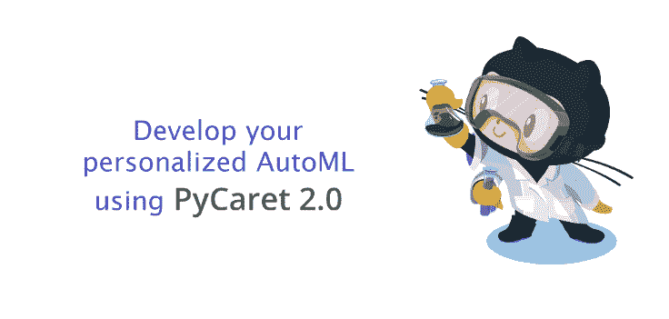

PyCaret — 一个开源、低代码的 Python 机器学习库！

你可能会好奇 GitHub 什么时候开始涉足自动化机器学习业务的。其实，GitHub 并没有直接涉足，但你可以利用它来测试你的个性化 AutoML 软件。在本教程中，我们将展示如何构建和容器化自己的自动化机器学习软件，并使用 Docker 容器在 GitHub 上进行测试。

我们将使用 PyCaret 2.0，这是一款开源的低代码 Python 机器学习库，来开发一个简单的 AutoML 解决方案，并通过 GitHub Actions 将其部署为 Docker 容器。如果你之前没有听说过 PyCaret，你可以在[这里](https://towardsdatascience.com/announcing-pycaret-2-0-39c11014540e)阅读 PyCaret 2.0 的官方公告，或查看详细的发布说明[这里](https://github.com/pycaret/pycaret/releases/tag/2.0)。

### ???? 本教程的学习目标

+   了解什么是自动化机器学习以及如何使用 PyCaret 2.0 构建一个简单的 AutoML 软件。

+   了解什么是容器，以及如何将你的 AutoML 解决方案部署为 Docker 容器。

+   什么是 GitHub Actions，如何使用它们来测试你的 AutoML。

### 什么是自动化机器学习？

自动化机器学习（AutoML）是一个自动化耗时、反复迭代的机器学习任务的过程。它允许数据科学家和分析师高效地构建机器学习模型，同时保持模型质量。任何 AutoML 软件的最终目标是根据某些性能标准来确定最佳模型。

传统的机器学习模型开发过程资源密集，要求显著的领域知识，并且需要大量时间来生成和比较几十个模型。通过自动化机器学习，你可以大大加快开发生产就绪 ML 模型的时间，过程轻松高效。

目前有许多 AutoML 软件，既有付费的也有开源的。几乎所有这些软件都使用相同的转换集合和基本算法。因此，在这些软件下训练的模型的质量和性能大致相同。

付费的 AutoML 软件作为服务非常昂贵，如果你没有大量用例的话，经济上不可行。托管的机器学习服务平台相对便宜，但通常难以使用，并且需要对特定平台有了解。

在众多开源 AutoML 库中，PyCaret 相对较新，具有独特的低代码机器学习方法。PyCaret 的设计和功能简单、对人友好且直观。在短时间内，PyCaret 已被全球超过 100,000 名数据科学家采用，我们正在成为一个不断发展的开发者社区。

### PyCaret 是如何工作的？

PyCaret 是一个用于监督和无监督机器学习的工作流自动化工具。它被组织为六个模块，每个模块都有一组可用于执行特定操作的功能。每个功能接受一个输入并返回一个输出，在大多数情况下是一个训练好的机器学习模型。第二版发布时提供的模块包括：

+   [分类](https://www.pycaret.org/classification)

+   [回归分析](https://www.pycaret.org/regression)

+   [聚类分析](https://www.pycaret.org/clustering)

+   [异常检测](https://www.pycaret.org/anomaly-detection)

+   [自然语言处理](https://www.pycaret.org/nlp)

+   [关联规则挖掘](https://www.pycaret.org/association-rules)

PyCaret 的所有模块支持数据准备（包括 25+ 种重要的数据预处理技术，提供大量未训练的模型和自定义模型支持，自动超参数调整，模型分析与解释，自动模型选择，实验记录和便捷的云部署选项）。

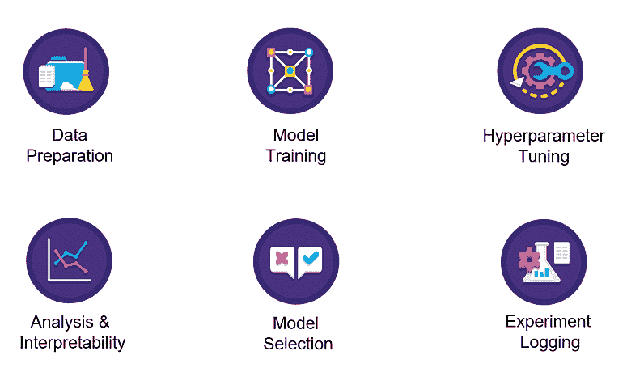

[`www.pycaret.org/guide`](https://www.pycaret.org/guide)

要了解更多关于 PyCaret 的信息，[点击这里](https://towardsdatascience.com/announcing-pycaret-2-0-39c11014540e) 阅读我们的官方发布公告。

如果你想在 Python 中入门，[点击这里](https://github.com/pycaret/pycaret/tree/master/examples) 查看一个示例笔记本的画廊以便开始。

### ???? 在我们开始之前

在开始构建 AutoML 软件之前，让我们理解以下术语。此时你只需对本教程中使用的工具/术语有一些基本的理论知识。如果你希望深入了解，可以在本教程的末尾找到链接以供稍后探索。

**容器**

**容器** 提供一个可移植且一致的环境，可以在不同环境中快速部署，以最大化 **机器学习** 应用的准确性、性能和效率。环境包含运行时语言（例如 Python）、所有库和应用程序的依赖项。

**Docker**

Docker 是一家提供软件（也称为 Docker）的公司，允许用户构建、运行和管理容器。虽然 Docker 的容器是最常见的，但还有其他不太知名的 *替代品*，如 [LXD](https://linuxcontainers.org/lxd/introduction/) 和 [LXC](https://linuxcontainers.org/)，也提供容器解决方案。

**GitHub**

[GitHub](https://www.github.com/) 是一个基于云的服务，用于托管、管理和控制代码。假设你在一个大型团队中工作，其中有多人（有时达到几百人）在对相同的代码库进行更改。PyCaret 本身就是一个开源项目的例子，数百名社区开发者不断为源代码做贡献。如果你以前没有使用过 GitHub，你可以 [注册](https://github.com/join) 免费账户。

**GitHub Actions**

GitHub Actions 帮助你在存储代码和协作处理拉取请求及问题的同一个地方自动化你的软件开发工作流。你可以编写单独的任务，称为动作，并将它们组合起来创建自定义工作流。工作流是你可以在仓库中设置的自定义自动化过程，用于构建、测试、打包、发布或部署任何 GitHub 上的代码项目。

### ???? 让我们开始吧

### 目标

训练并选择最佳表现的回归模型，该模型基于数据集中的其他变量（即年龄、性别、体质指数、子女、吸烟者和地区）预测患者费用。

### ???? **第 1 步 — 开发 app.py**

这是 AutoML 的主要文件，也是 Dockerfile 的入口点（见下文第 2 步）。如果你以前使用过 PyCaret，那么这段代码对你来说应该是不言自明的。

前五行是关于从环境中导入库和变量的。接下来的三行用于读取数据为 *pandas* 数据框。第 12 行到第 15 行是根据环境变量导入相关模块，第 17 行及之后的部分涉及 PyCaret 的功能，用于初始化环境、比较基础模型并将最佳表现的模型保存到你的设备上。最后一行将实验日志下载为 csv 文件。

### ???? 第 2 步— 创建 Dockerfile

Dockerfile 只是一个包含几行指令的文件，这些指令保存在你的项目文件夹中，文件名为“Dockerfile”（区分大小写，无扩展名）。

另一种理解 Docker 文件的方法是，它就像是你在自己厨房里发明的食谱。当你与他人分享这样的食谱，并且他们按照食谱中的确切指示进行操作时，他们将能够重现相同质量的菜肴。同样，你可以与他人分享你的 Docker 文件，他们可以基于该 Docker 文件创建镜像并运行容器。

这个项目的 Docker 文件很简单，仅包含 6 行。见下文：

Dockerfile 中的第一行导入了 python:3.7-slim 镜像。接下来的四行创建了一个应用程序文件夹，更新了 **libgomp1** 库，并从 **requirements.txt** 文件中安装所有要求，这里只需要 pycaret。最后两行定义了应用程序的入口点；这意味着当容器启动时，它将执行我们在第 1 步中看到的 **app.py** 文件。

### ???? 第 3 步 — 创建 action.yml

Docker actions 需要一个元数据文件。元数据文件名必须是`action.yml`或`action.yaml`。元数据文件中的数据定义了你的动作的输入、输出和主要入口点。动作文件使用 YAML 语法。

环境变量 dataset、target 和 usecase 分别在第 6、9 和 14 行声明。查看 app.py 的第 4-6 行，以了解我们如何在 app.py 文件中使用这些环境变量。

### ???? 第 4 步 — 在 GitHub 上发布动作

此时你的项目文件夹应如下所示：

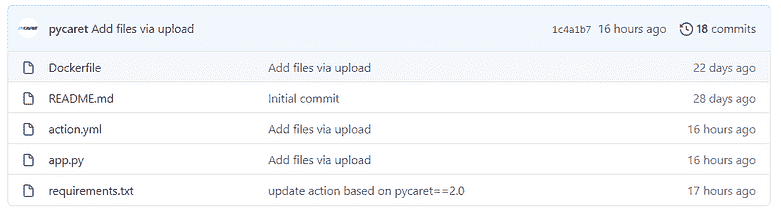

[`github.com/pycaret/pycaret-git-actions`](https://github.com/pycaret/pycaret-git-actions)

点击**‘Releases’**：

GitHub Action — 点击 Releases

草拟一个新版本：

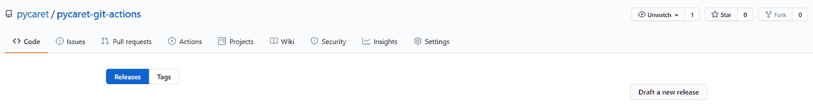

GitHub Action — 草拟一个新版本

填写详细信息（标签、版本标题和描述），然后点击**‘Publish release’**：

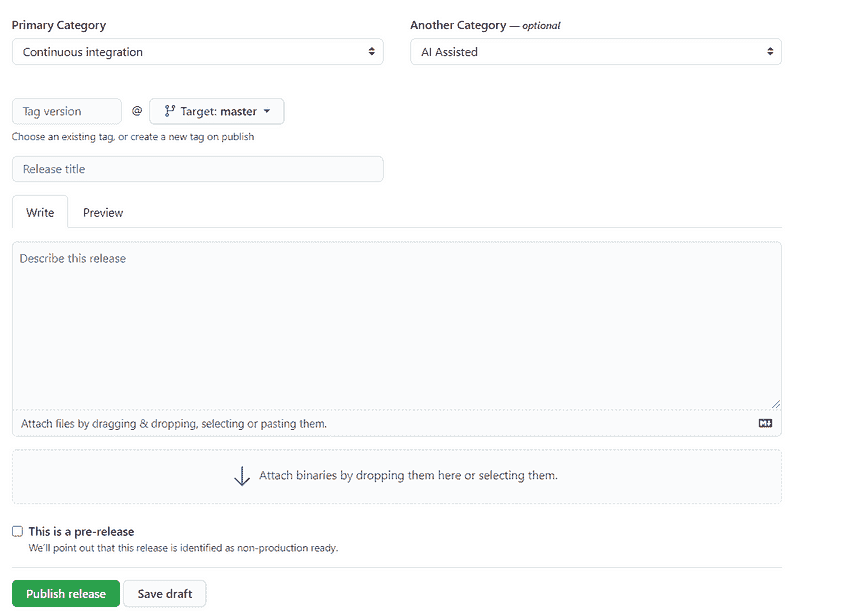

GitHub Action — 发布版本

发布后，点击版本，然后点击**‘Marketplace’**：

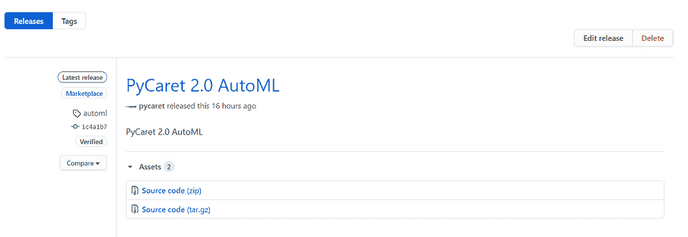

GitHub Action — 市场

点击**‘Use latest version’**：

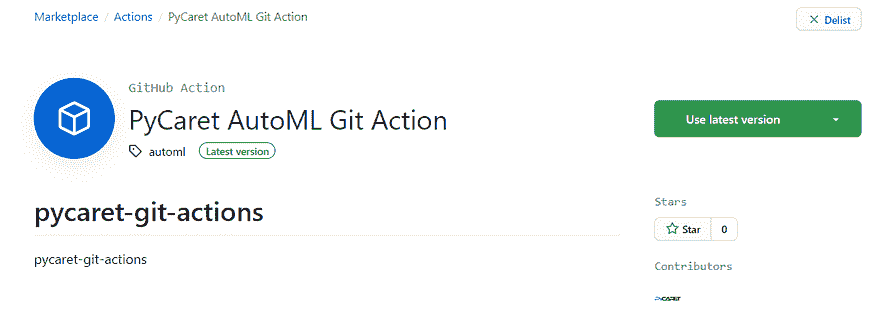

GitHub Action — 使用最新版本

保存这些信息，这些是你软件的安装细节。这是你在任何公共 GitHub 仓库上安装此软件所需的信息：

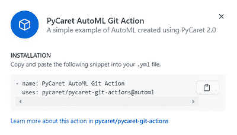

GitHub Action — 安装

### ???? 第 5 步 — 在 GitHub 仓库中安装软件

为了安装和测试我们刚创建的软件，我们创建了一个新的仓库[**pycaret-automl-test**](https://github.com/pycaret/pycaret-automl-test)，并上传了一些分类和回归的样本数据集。

要安装我们在上一步骤发布的软件，请点击‘**Actions**’：

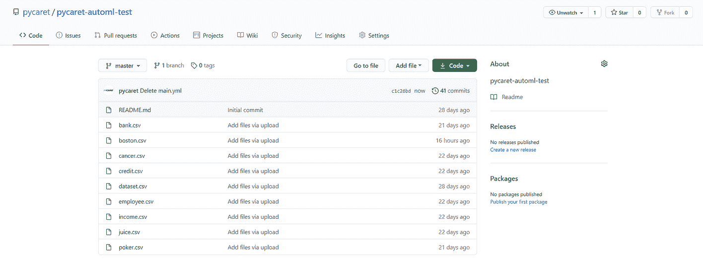

[`github.com/pycaret/pycaret-automl-test/tree/master`](https://github.com/pycaret/pycaret-automl-test/tree/master) 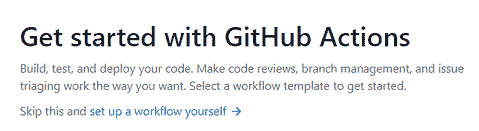

开始使用 GitHub Actions

点击‘**set up a workflow yourself**’，将此脚本复制到编辑器中，然后点击**‘Start commit’**。

这是一个供 GitHub 执行的指令文件。第一个动作从第 9 行开始。第 9 行到 15 行是安装和执行我们之前开发的软件的操作。第 11 行是我们引用软件名称的地方（参见上述第 4 步的最后部分）。第 13 行到 15 行是定义环境变量的操作，如数据集的名称（csv 文件必须上传到仓库）、目标变量的名称和用例类型。从第 16 行开始是另一个来自 [this repository](https://github.com/actions/upload-artifact) 的操作，用于上传三个文件 model.pkl、实验日志（csv 文件）和系统日志（.log 文件）。

一旦开始提交，请点击 **‘actions’**：

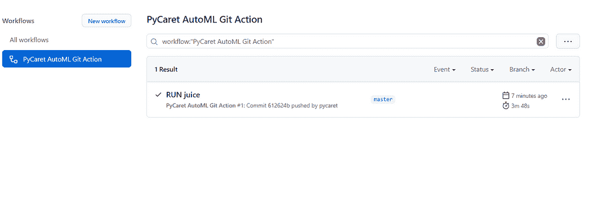

GitHub Action — 工作流

这是您可以在构建时监控日志的地方，一旦工作流完成，您也可以从此位置收集您的文件。

GitHub Action — 工作流构建日志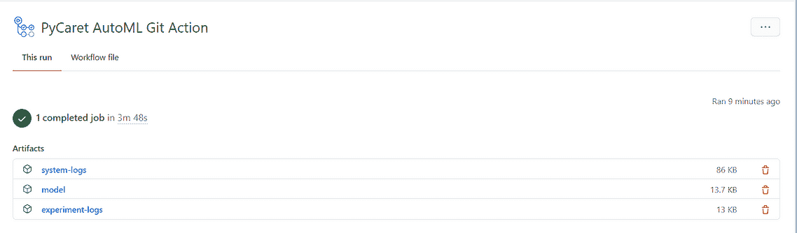

GitHub Action — 运行详情

您可以下载文件并在您的设备上解压。

### **文件：model**

这是一个包含最终模型及整个转换管道的 .pkl 文件。您可以使用此文件通过 predict_model 函数在新数据集上生成预测。要了解更多信息，请 [点击这里](https://www.pycaret.org/predict-model)。

### 文件：experiment-logs

这是一个 .csv 文件，其中包含您模型所需的所有详细信息。它包含在 app.py 脚本中训练的所有模型、它们的性能指标、超参数和其他重要的元数据。

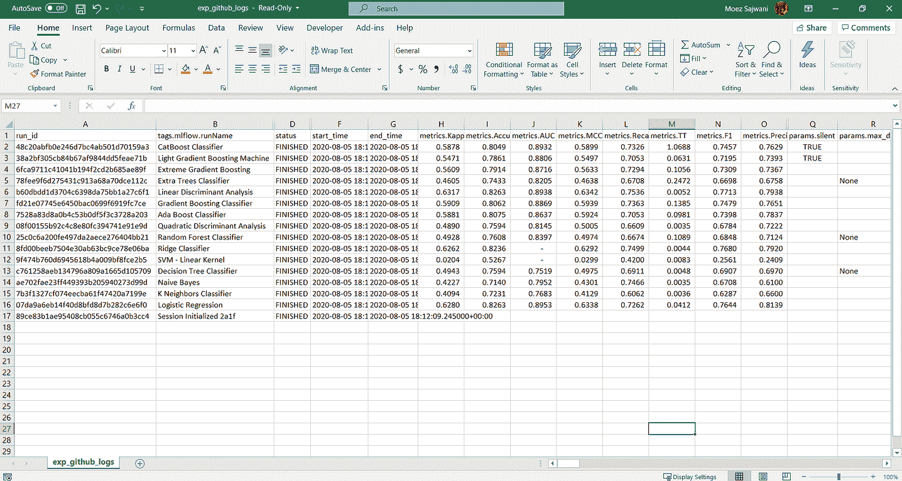

实验日志文件

### 文件：system-logs

这是 PyCaret 生成的系统日志文件。它可用于审计过程。它包含重要的元数据，并且对故障排除软件错误非常有用。

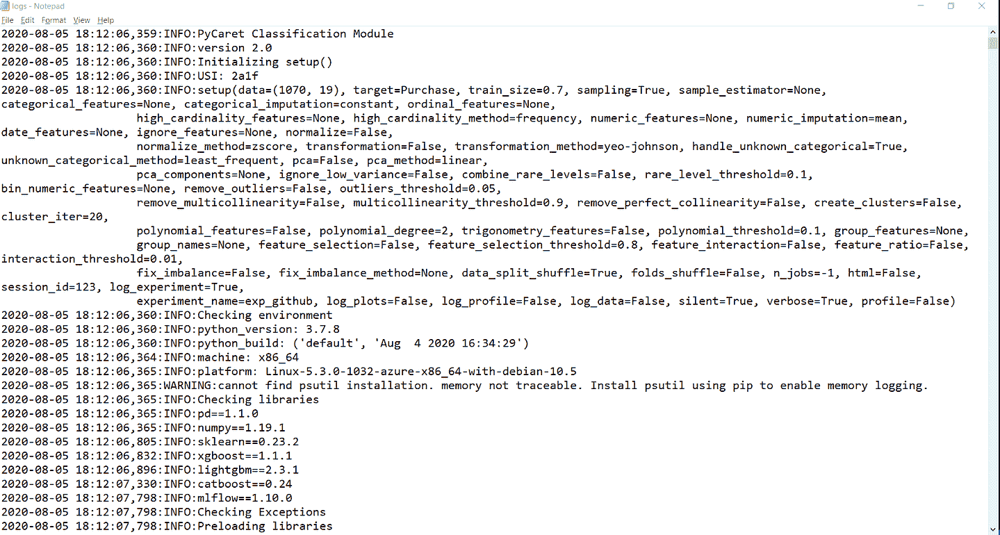

由 PyCaret 生成的系统日志文件

### **披露**

GitHub Actions 使您能够直接在您的 GitHub 仓库中创建自定义软件开发生命周期工作流。每个帐户都包含用于 Actions 的计算和存储配额，具体取决于您的帐户计划，可以在 [Actions 文档](https://docs.github.com/en/github/automating-your-workflow-with-github-actions/about-github-actions#about-github-actions) 中找到。

操作及任何 Action 服务的元素不得违反协议、[可接受使用政策](https://docs.github.com/en/github/site-policy/github-acceptable-use-policies) 或 GitHub Actions [服务限制](https://docs.github.com/en/github/automating-your-workflow-with-github-actions/about-github-actions#usage-limits)。此外，不应将 Actions 用于：

+   加密货币挖矿；

+   无服务器计算；

+   使用我们的服务器干扰或获取、或尝试获取任何服务、设备、数据、账户或网络（除了由[GitHub 漏洞赏金计划](https://bounty.github.com/)授权的）

+   提供单独或集成的应用程序或服务，提供 Actions 或任何 Actions 元素用于商业目的；或，

+   任何与关联的存储库中的软件项目的生产、测试、部署或发布无关的活动。

为了防止这些限制的违反和对 GitHub Actions 的滥用，GitHub 可能会监控你对 GitHub Actions 的使用。滥用 GitHub Actions 可能会导致作业终止，或限制你使用 GitHub Actions 的能力。

### **本教程中使用的存储库：**

[**pycaret/pycaret-git-actions**](https://github.com/pycaret/pycaret-git-actions)

[**pycaret/pycaret-automl-test**](https://github.com/pycaret/pycaret-automl-test)

使用这个轻量级的 Python 工作流自动化库，你可以实现无限的可能。如果你觉得有用，请不要忘记在我们的 GitHub 仓库上给我们 ⭐️。

要了解更多关于 PyCaret 的信息，请关注我们的[LinkedIn](https://www.linkedin.com/company/pycaret/)和[YouTube](https://www.youtube.com/channel/UCxA1YTYJ9BEeo50lxyI_B3g)。

如果你想了解更多关于 PyCaret 2.0 的信息，请阅读这个[公告](https://towardsdatascience.com/announcing-pycaret-2-0-39c11014540e)。如果你之前使用过 PyCaret，你可能会对当前版本的[发布说明](https://github.com/pycaret/pycaret/releases/tag/2.0)感兴趣。

### 你也许会对以下内容感兴趣：

[使用 PyCaret 2.0 在 Power BI 中构建自己的 AutoML](https://towardsdatascience.com/build-your-own-automl-in-power-bi-using-pycaret-8291b64181d)

[使用 Docker 在 Azure 上部署机器学习管道](https://towardsdatascience.com/deploy-machine-learning-pipeline-on-cloud-using-docker-container-bec64458dc01)

[在 Google Kubernetes Engine 上部署机器学习管道](https://towardsdatascience.com/deploy-machine-learning-model-on-google-kubernetes-engine-94daac85108b)

[在 AWS Fargate 上部署机器学习管道](https://towardsdatascience.com/deploy-machine-learning-pipeline-on-aws-fargate-eb6e1c50507)

[构建和部署你的第一个机器学习 Web 应用](https://towardsdatascience.com/build-and-deploy-your-first-machine-learning-web-app-e020db344a99)

[使用 AWS Fargate 无服务器部署 PyCaret 和 Streamlit 应用](https://towardsdatascience.com/deploy-pycaret-and-streamlit-app-using-aws-fargate-serverless-infrastructure-8b7d7c0584c2)

[使用 PyCaret 和 Streamlit 构建和部署机器学习 Web 应用](https://towardsdatascience.com/build-and-deploy-machine-learning-web-app-using-pycaret-and-streamlit-28883a569104)

[在 GKE 上部署使用 Streamlit 和 PyCaret 构建的机器学习应用](https://towardsdatascience.com/deploy-machine-learning-app-built-using-streamlit-and-pycaret-on-google-kubernetes-engine-fd7e393d99cb)

### 重要链接

[博客](https://medium.com/@moez_62905)

[PyCaret 2.0 版本说明](https://github.com/pycaret/pycaret/releases/tag/2.0)

[用户指南 / 文档](https://www.pycaret.org/guide)

[Github](https://www.github.com/pycaret/pycaret)

[Stackoverflow](https://stackoverflow.com/questions/tagged/pycaret)

[安装 PyCaret](https://www.pycaret.org/install)

[笔记本教程](https://www.pycaret.org/tutorial)

[在 PyCaret 中贡献](https://www.pycaret.org/contribute)

### 想要了解特定模块？

点击下面的链接查看文档和工作示例。

[分类](https://www.pycaret.org/classification)

[回归](https://www.pycaret.org/regression)

[聚类](https://www.pycaret.org/clustering)

[异常检测](https://www.pycaret.org/anomaly-detection)

[自然语言处理](https://www.pycaret.org/nlp)

[关联规则挖掘](https://www.pycaret.org/association-rules)

**简介: [Moez Ali](https://www.linkedin.com/in/profile-moez/)** 是一位数据科学家，同时也是 PyCaret 的创始人和作者。

[原文](https://towardsdatascience.com/github-is-the-best-automl-you-will-ever-need-5331f671f105)。已获许可转载。

**相关:**

+   宣布 PyCaret 2.0

+   你不知道的 5 件关于 PyCaret 的事

+   将机器学习管道部署到使用 Docker 容器的云端

* * *

## 我们的前三大课程推荐

 1\. [谷歌网络安全证书](https://www.kdnuggets.com/google-cybersecurity) - 快速进入网络安全职业生涯。

 2\. [谷歌数据分析专业证书](https://www.kdnuggets.com/google-data-analytics) - 提升你的数据分析能力

 3\. [谷歌 IT 支持专业证书](https://www.kdnuggets.com/google-itsupport) - 支持你的组织 IT

* * *

### 更多相关话题

+   [关于机器学习你想知道的一切](https://www.kdnuggets.com/2022/09/everything-youve-ever-wanted-to-know-about-machine-learning.html)

+   [KDnuggets 新闻，9 月 14 日：免费数据科学 Python 课程 •…](https://www.kdnuggets.com/2022/n36.html)

+   [2023 年你应该考虑的顶级 AutoML 框架](https://www.kdnuggets.com/2023/05/best-automl-frameworks-2023.html)

+   [如何在不断变化的世界中成长为数据科学家](https://www.kdnuggets.com/2022/01/grow-data-scientist-everchanging-world.html)

+   [IMPACT: 数据可观察性峰会将于 11 月 8 日重磅回归…](https://www.kdnuggets.com/2023/10/monte-carlo-impact-the-data-observability-summit-is-back)

+   [无需脑力的 AutoML 与 AutoXGB](https://www.kdnuggets.com/2022/02/no-brainer-automl-autoxgb.html)
