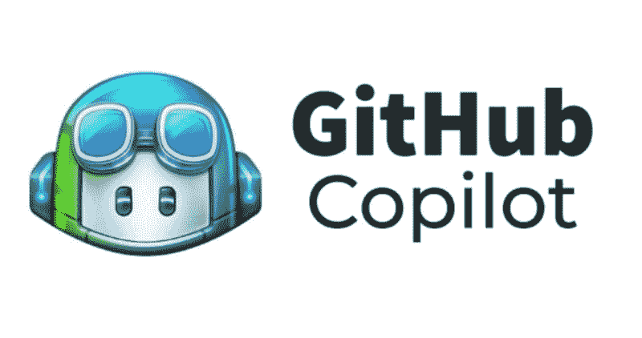
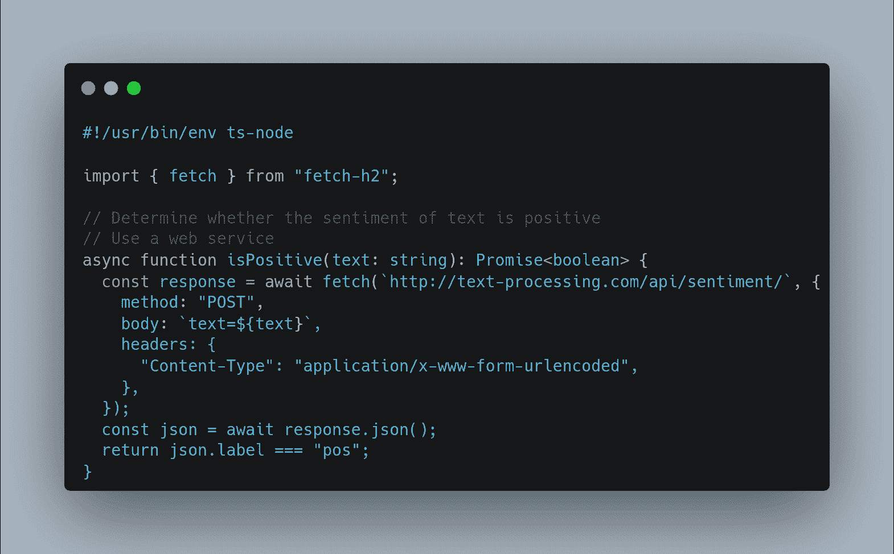
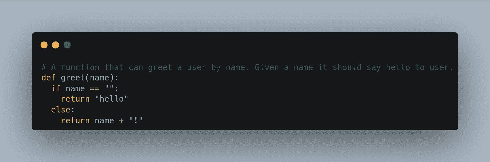
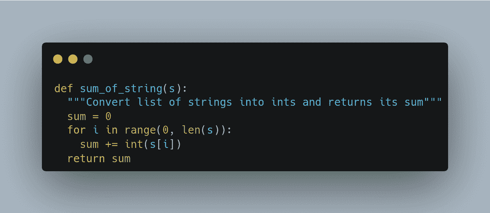

# GitHub Copilot 开源替代品

> 原文：[`www.kdnuggets.com/2021/07/github-copilot-open-source-alternatives-code-generation.html`](https://www.kdnuggets.com/2021/07/github-copilot-open-source-alternatives-code-generation.html)

去年，GitHub 公开发布了**[Copilot](https://www.kdnuggets.com/2021/07/github-copilot-ai-pair-programmer.html)**，这是其“AI 编程助手”的预览版，一种代码补全工具，旨在为您的 IDE 提供代码行或函数建议。它在编程界及其他领域确实引起了轰动，您可能至少听说过一些关于它的事宜。

但 Copilot 不仅仅是简单的自动补全，它比其他代码助手更具上下文意识。由 OpenAI 的 Codex AI 系统驱动，Copilot 使用文档字符串、函数名称、注释和前面的代码来最佳地生成和建议它认为最合适的代码。Copilot 旨在随着时间的推移不断改进，从开发者的使用中“学习”。

> GitHub Copilot 通过训练数十亿行公开代码，将您所需的知识触手可及，为您节省时间并帮助您保持专注。

目前可用于 Visual Studio Code 和由 VS Code 后台支持的平台——如 GitHub 的 Codespaces——Copilot “理解” 多种语言，技术预览版特别适用于 Python、JavaScript、TypeScript、Ruby 和 Go。您可以接受默认代码建议，浏览其他提议，修改您接受的代码，或者在代码的特定点完全忽略 Copilot 的建议。

目前，Copilot 仅通过 [批准的请求](https://copilot.github.com/) 提供。但不要担心；现有各种规格的开源替代品，您可以立即尝试。

让我们来看看 4 个您可以在编程中使用的 GitHub Copilot 替代的代码生成和建议工具。虽然我对这些工具的调查是由发现 Second Mate（见下文）引发的，但我按 GitHub 星标数量的降序列出了这些选项，因为这似乎是最合适的排序方式。

# Captain Stack

我们将从 [Captain Stack](https://github.com/hieunc229/copilot-clone) 开始，这是一种代码*建议*工具，与代码生成不同。

> 这个功能有点类似于 [Github Copilot](https://copilot.github.com/) 的代码建议。但它不是使用 AI，而是将您的搜索查询发送到 Google，然后检索 StackOverflow 的回答并为您自动补全。

Captain Stack 仅适用于 VSCode，使其成为一个特别的 Copilot 类似工具，并作为 VSCode 插件安装。

使用 Captain Stack 来自动化您的 Stack Overflow 代码复制！:)

# GPT-Code-Clippy (GPT-CC)

[GPT-Code-Clippy](https://github.com/ncoop57/gpt-code-clippy) 是一个使用 GPT-3 模型进行生成的代码生成工具。

> GPT-Code-Clippy（GPT-CC）是 [GitHub Copilot](https://copilot.github.com/) 的开源版本，基于 [GPT-3](https://arxiv.org/abs/2005.14165) 的语言模型，称为 [GPT-Codex](https://arxiv.org/abs/2107.03374)，它在 GitHub 上的公开代码上进行了微调。

GPT-CC 的 VSCode 扩展可以在 [这里](https://github.com/ncoop57/code-clippy-vscode) 获取。有些好奇的是，从这个扩展的代码库中，有以下提及坐落于前述的 Captain Stack 之上的参考：

> 这个扩展还完全建立在另一个名为 [Captain Stack](https://github.com/hieunc229/copilot-clone) 的 Github Copilot 克隆之上，因为它不是通过深度学习合成答案，而是从 StackOverflow 帖子中提取答案。

# 二副

[Second Mate](https://github.com/samrawal/emacs-secondmate) 是一个用于 Emacs 的代码生成工具，利用了 GPT 模型。

> 一个开源的，迷你模仿 [GitHub Copilot](https://copilot.github.com/) 的工具，使用 [EleutherAI GPT-Neo-2.7B](https://huggingface.co/EleutherAI/gpt-neo-2.7B)（通过 Huggingface Model Hub）用于 Emacs。
> 
> 这是一个较小的模型，因此可能不会像 Copilot 那样有效，但仍然可以玩玩看！

二副的设置包括运行 Flask 应用程序作为后台，并配置 Emacs 插件以指向该后台服务器的 URL 来提交请求。

# Clara-Copilot VSCode

最后，[Clara-Copilot](https://github.com/badboysm890/clara-copilot) 是一个文档稀少的 VSCode Copilot 替代品，没有明确解释它使用什么机制来实现其目标。

> 这是一个用来替代 Github Copilot 的 vscode 插件，直到你获得对 Github Copilot 的访问权限。

（编辑：眼尖的读者 FIREHAWK 指出 Clara-Copilot 使用了 [Code Grepper](https://www.codegrepper.com/)，使其成为代码搜索和推荐解决方案，而非代码生成）。

然而，它确实提供了如何使用该扩展的示例，并自豪地宣称它“[支援大约 ~ 50 种编程语言 (*sic*) LOL !]”，并且“[瞬间提供代码片段]”。请自行斟酌 :)

希望这个小型的替代品集合能为你提供一些帮助，直到 Copilot 向大众发布。你可能会发现其中一个足够有用，适合你长期使用。感谢这些工具的各位作者。

**[Matthew Mayo](https://www.linkedin.com/in/mattmayo13/)** ([**@mattmayo13**](https://twitter.com/mattmayo13)) 是数据科学家及 KDnuggets 主编，KDnuggets 是重要的在线数据科学和机器学习资源。他的兴趣包括自然语言处理、算法设计与优化、无监督学习、神经网络以及机器学习的自动化方法。Matthew 拥有计算机科学硕士学位和数据挖掘研究生文凭。可以通过 editor1 at kdnuggets[dot]com 联系他。

* * *

## 我们的 3 大课程推荐

 1\. [Google 网络安全证书](https://www.kdnuggets.com/google-cybersecurity) - 快速进入网络安全职业生涯

 2\. [Google 数据分析专业证书](https://www.kdnuggets.com/google-data-analytics) - 提升你的数据分析技能

 3\. [Google IT 支持专业证书](https://www.kdnuggets.com/google-itsupport) - 支持你的组织 IT 部门

* * *

### 更多相关内容

+   [优化数据分析：在 Databricks 中集成 GitHub Copilot](https://www.kdnuggets.com/optimizing-data-analytics-integrating-github-copilot-in-databricks)

+   [数据科学项目的 GitHub 5 大替代工具](https://www.kdnuggets.com/the-top-5-alternatives-to-github-for-data-science-projects)

+   [封闭源与开源图像标注](https://www.kdnuggets.com/closed-source-vs-open-source-image-annotation)

+   [GPT-4 的 5 大免费替代工具](https://www.kdnuggets.com/top-5-free-alternatives-to-gpt4)

+   [5 个 Airflow 替代方案用于数据编排](https://www.kdnuggets.com/5-airflow-alternatives-for-data-orchestration)

+   [数据科学领域 VSCode 的 7 大替代工具](https://www.kdnuggets.com/top-7-alternatives-to-vscode-for-data-science)
