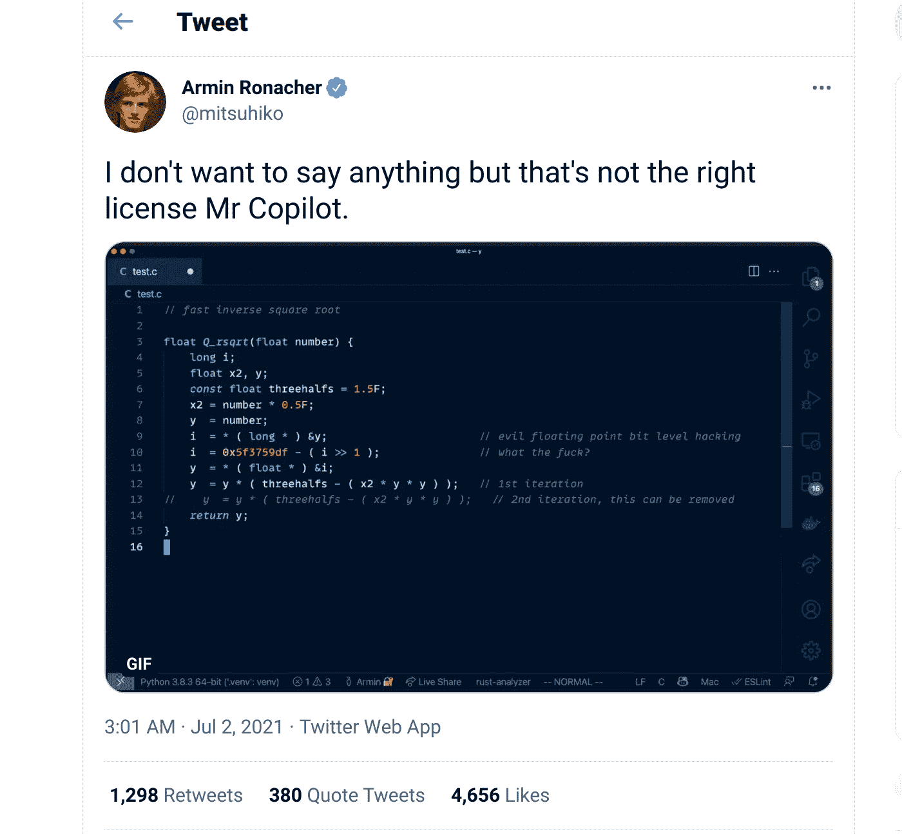
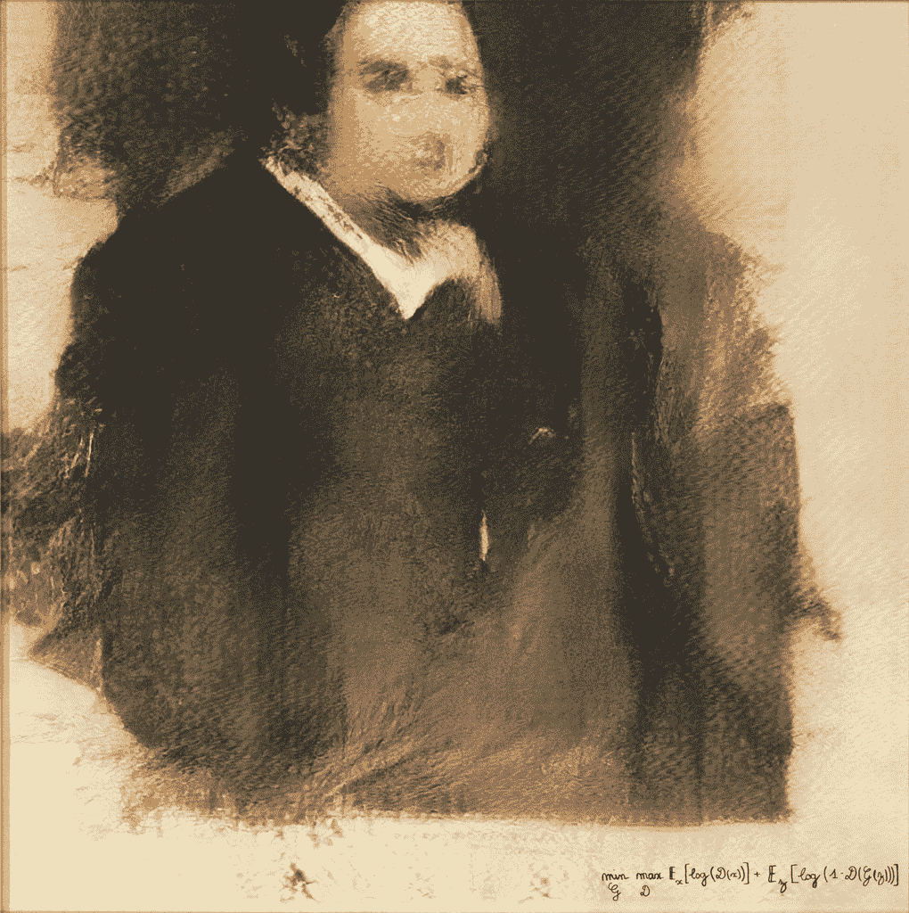

# GitHub Copilot 和 AI 语言模型在编程自动化中的崛起

> 原文：[`www.kdnuggets.com/2021/09/github-copilot-rise-ai-language-models-programming-automation.html`](https://www.kdnuggets.com/2021/09/github-copilot-rise-ai-language-models-programming-automation.html)

评论

### 我应该使用 Github Copilot 吗？

如果你是软件工程师，或者在你的朋友圈里有软件工程师，那么你可能已经在某种程度上了解过[Copilot](https://copilot.github.com/)。Copilot 是 GitHub 新推出的深度学习代码补全工具。

对于程序员来说，自动补全工具并不新鲜，而 Copilot 甚至不是第一个使用深度学习的工具，也不是第一个使用 GPT 转换器的工具。毕竟，[TabNine](https://www.tabnine.com/) 源自 OpenAI 校友[ Jacob Jackson](https://jacobjackson.com/about/) 的一个夏季项目，并且使用了[GPT-2](https://www.exxactcorp.com/blog/Deep-Learning/examining-the-transformer-architecture-part-1-the-openai-gpt-2-controversy)通用转换器。

微软（拥有 GitHub）自 1996 年以来就将自己的[ IntelliSense](https://en.wikipedia.org/wiki/IntelliSense#Visual_Studio) 代码补全工具打包到编程产品中，并且自动补全和文本纠正自 1950 年代以来一直是一个活跃的研究领域。

如果你想了解更多关于 Copilot 如何与之前的自动补全工具（包括 TabNine）不同，以及为什么这个特定工具引发了如此多的争议，请继续阅读。

### 版权争议

*展示 GitHub Copilot 渴望背诵 Quake III 中的*[*fast inverse square root*](https://en.wikipedia.org/wiki/Fast_inverse_square_root#Overview_of_the_code)*函数的*[*Armin Ronacher*](https://twitter.com/mitsuhiko/status/1410886329924194309)*的截图。*

自推出以来，Copilot 引发了关于该产品及其潜在版权问题的激烈讨论。这在很大程度上是由于模型的训练方式。GitHub Copilot 基于 OpenAI 的 Codex，这是 GPT-3 的一个变体，经过针对代码的微调。[GPT-3](https://www.exxactcorp.com/blog/Deep-Learning/what-can-you-do-with-the-openai-gpt-3-language-model)是 OpenAI 的 1750 亿参数的通用转换器（Codex 显然基于 GPT-3 的 120 亿参数版本），当然，任何大型转换器都需要一个巨大的训练数据集才能有效。GitHub 正是寻找这种数据集的地方，而 Copilot 的训练数据集[包含了 GitHub 上托管的所有公开代码](https://nitter.hu/NoraDotCodes/status/1412741339771461635)。

这是围绕该项目争议的主要来源，超出了关于[自动化软件工程](https://aveuiller.github.io/is_copilot_a_threat.html)以及像 Copilot 这样的工具对编程未来影响的讨论。关于模型及其限制的更多技术信息可以在[Arxiv 上的论文](https://arxiv.org/abs/2107.03374)中找到。

*“贝拉米勋爵的肖像。”* Collective Obvious 使用开源代码生成了这件作品，后来在拍卖会上以超过 40 万美元的价格售出，这让使用了他们代码的 Robbie Barrat 十分不满。

一些程序员对他们的代码被用于可能成为付费产品的情况感到不满，尤其是在没有他们明确许可的情况下。几位评论者在[黑客新闻](https://news.ycombinator.com/item?id=27724042)上讨论了离开该平台的可能性。

在某种程度上，对 Copilot 的反应让人想起了[GAN 生成的“画作”](https://medium.datadriveninvestor.com/432-000-painting-by-ai-sold-at-christies-my-thoughts-4a33cd94f782?gi=2589317f7968)，这幅画作在拍卖会上售出了近五十万美元。这[艺术品基于开源贡献](https://github.com/robbiebarrat/art-dcgan)创建，作者有多个，但我们知道的情况是没有人因该作品在拍卖会上的显著成功而获得任何报酬。

生成艺术作品所用的[代码](https://github.com/robbiebarrat/art-dcgan)及可能的预训练模型权重，都是由模型作者 Robbie Barrat 以 BSD 许可证公开提供的。Robbie Barrat 的工作基于之前的开源项目，后来修改了许可证以禁止对预训练权重的商业使用。当程序员被排除在他们工作的盈利用途之外时感到沮丧是可以理解的，但围绕 Copilot 的版权争议远不止于此。

> ***“github Copilot 依其自身的承认，已经在大量 GPL 代码上进行了训练，因此我不明白它如何不是一种将开源代码洗白为商业作品的方式。”*** - 推特用户 *[*eevee*](https://twitter.com/eevee/status/1410037309848752128)*。
> 
> *GitHub Copilot 显然能够复制大量 copyleft 代码，这被许多开源社区人士视为违反 GPL 等许可证条款。*

Copilot 的训练数据包括所有公共代码，包括诸如[ MIT 许可证](https://mit-license.org/) 这样的宽松开源许可证。然而，它也包括诸如[ Affero 通用公共许可证](https://www.gnu.org/licenses/agpl-3.0.en.html) (AGPL) 这样的 copyleft 许可证，该许可证允许使用和修改，但要求修改后的作品必须在相同许可证下提供。在一些解释中，[ GitHub Copilot 生成的代码](https://www.theverge.com/2021/7/7/22561180/github-copilot-legal-copyright-fair-use-public-code) 可能被视为原始训练数据的衍生作品，更有问题的是，Copilot 有时可能[ 逐字重现训练数据集中的代码](https://docs.github.com/en/github/copilot/research-recitation#footnote3)。这使得 Copilot 的情况比例如 Google 图书扫描先例更加复杂，后者通常被引用为版权数据抓取合理使用的基石。

关于潜在法律问题的讨论仍在继续，目前两方没有达成共识，[ 两方](https://archive.is/gBPLC)的讨论仍在进行，[ 双方](https://juliareda.eu/2021/07/github-copilot-is-not-infringing-your-copyright/)可能很快就会成为法院裁决的问题。

即使我们假设 Copilot 在法律上完全没有问题，使用该产品仍可能存在其他风险。如果 Copilot 的训练被视为合理使用，而其输出不被视为衍生或侵犯版权/开源协议的作品，它仍可能产生容易符合剽窃标准的输出，例如在博士生为其论文研究编写代码的情况下。目前，谨慎使用 Copilot 可能是一个好主意，但还有另一个原因使 Copilot 成为热门话题：**Copilot 能为常见编程任务提供令人惊讶的好解决方案，并且在数量和质量上都比以前的自动补全工具更强大。**

### **GitHub 的 Copilot 有多好？**

*GitHub Copilot 打破了 Leetcode 面试题！[来源](https://www.youtube.com/watch?v=FHwnrYm0mNc)*

即使你不是程序员，你也可能经历过手机上的自动补全，它会在你开始输入时自动建议下一个单词，可能还会建议稍长的补全，比如完成当前句子。

对于大多数编程自动补全工具，建议的数量和复杂性大致类似于你在手机键盘上找到的内容，但并非所有代码补全工具都使用现代（即深度学习）机器学习。

例如，vim 中的默认自动补全功能会根据用户之前输入的单词提供一个建议补全的列表。较新的代码补全工具，如[TabNine](https://www.tabnine.com/)或[Kite](https://www.kite.com/)，则更为复杂，可以建议完成整行或两行的剩余部分。Kite 网站建议，这足以使程序员在键击次数上提高近两倍，但 GitHub Copilot 则更进一步，虽然其步伐非常长。

Copilot 具有与其基础的标准语言 GPT-3 类似的补全能力，使用该代码补全工具的体验与 GPT-3 实验者在使用模型时采用的“[提示编程](https://generative.ink/posts/methods-of-prompt-programming/)”风格类似。Copilot 可以解释文档字符串的内容并编写匹配的函数，或者在给定函数和适当命名的测试函数开头时生成单元测试。**这比程序员的键击次数节省了超过 50%。**

如果将其推向极致，当 Copilot 工作完美时，它将软件工程师的工作变成了更像是不断的代码审查，而不是编写代码。

一些拥有早期技术预览版本的程序员博客作者通过挑战模型解决面试级编程问题来测试 Copilot。Copilot 在[如何有效](https://medium.com/@giacaglia/can-github-copilot-crack-a-facebook-coding-interview-eea172994e06)解决这些挑战方面相当令人印象深刻，但还不够好，无法在未经仔细审查的情况下直接使用其输出。

一些在线软件工程师已经对“AI 配对程序员”（如 GitHub 所称）进行了测试。我们将探讨[Arxiv 论文](https://arxiv.org/abs/2107.03374)中指出的一些 Codex 表现不足的场景，并尝试在技术预览阶段的程序员实验中找到相关例子。

### HumanEval 数据集

OpenAI Codex 是一个大约 12 亿参数的 GPT-3，经过针对代码的微调，其中 Codex-S 是 Codex 本身的最先进变体。为了评估该模型的性能，OpenAI 建立了他们所称的 HumanEval 数据集：一个包含 164 个手写编程挑战及相应单元测试的集合，这些挑战类似于你可能在[CodeSignal](https://codesignal.com/)、Codeforces 或[HackerRank](https://www.hackerrank.com/)等编码练习网站上找到的。

在 HumanEval 中，问题规范包含在函数文档字符串中，所有问题都为 Python 编程语言编写。

尽管没有代码特定的 GPT-3 在 HumanEval 数据集中无法解决任何问题（至少在第一次尝试时），但经过微调的 Codex 和 Codex-S 分别能够解决 28.8%和 37.7%的问题。通过从前 100 个问题尝试中挑选，Codex-S 进一步解决了 77.5%的问题。

一种解读方式是，如果程序员使用 Codex，他们可以期望在查看前 100 个建议时找到有效的解决方案（大致相当于技术面试中遇到的复杂程度），或者甚至可以盲目地将尝试的解决方案抛向有效的单元测试集，直到它们通过。这并不是说不能找到更好的解决方案，如果程序员愿意修改 Codex 的建议，可能会在前几个建议中找到。

他们还使用了一种更复杂的估计器来解决每个问题，通过生成大约 200 个样本并计算样本通过单元测试的无偏估计器，他们报告为“pass@k”，其中 k 为 100，即正在估计的样本数量。这种方法的方差低于直接报告 pass@k。

### 最佳 Codex 模型仍然不如计算机科学学生

Codex 的作者指出，由于在 GitHub 上的数亿行代码中进行了超过 150GB 的训练，该模型接受了比人类程序员在其职业生涯中能够阅读的代码量多得多的训练。然而，最好的 Codex 模型（具有 120 亿参数的 Codex-S）仍然表现不如一个新手计算机科学学生或一个花费几个下午练习面试风格编码挑战的人。

尤其是，当在问题规格中将多个操作链在一起时，Codex 的性能会迅速下降。

实际上，Codex 解决多个操作链在一起的问题的能力每增加一个问题规格中的额外指令都会降低 2 倍或更差。为了量化这一效果，OpenAI 的作者构建了一组可以顺序操作的字符串处理评估集（例如，将字符改为小写，将每隔一个字符替换为某个字符等）。对于单个字符串处理，Codex 通过了近 25%的问题，而对于两个字符串处理链在一起的情况则降至不到 10%，三个处理降至 5%，以此类推。

一位早期的 Copilot 评论员[Giuliano Giacaglia](https://medium.com/@giacaglia/can-github-copilot-crack-a-facebook-coding-interview-eea172994e06)在 Medium 上观察到了多步问题解决的急剧下降。Giuliano 报告称，给 Copilot 一个问题描述是反转输入字符串中每个单词的字母，但 Copilot 却建议了一个反转句子中单词顺序的函数，而不是句子中字母的顺序（“World Hello”而不是“olleH dlroW”）。不过，Copilot 确实设法编写了一个对其自身实现失败的测试。

尽管没有坚持 Giuliano 和 OpenAI 用于测试 Copilot 的多步骤字符串操作范式，[ Kumar Shubham](https://towardsdatascience.com/testing-the-github-copilot-technical-preview-330d1b0d5418) 发现 Copilot 成功解决了一个多步骤问题描述，该问题涉及调用系统程序截图、对图像进行光学字符识别，最后从文本中提取电子邮件地址。然而，这也提出了一个问题，即 Copilot 可能会编写依赖于不可用、过时或不受信任的外部依赖项的代码。这一点在 OpenAI 讨论风险的论文部分中提到了模型的偏见、生成安全漏洞的能力以及潜在的经济和能源成本。

其他 YouTuber 对 Copilot 的评论，例如[ DevOps Directive](https://www.youtube.com/watch?v=FHwnrYm0mNc)和[ Benjamin Carlson](https://www.youtube.com/watch?v=zlbM1As849c)，在用来自[ leetcode.com](https://leetcode.com/)的面试风格问题挑战 Copilot 时，发现了令人印象深刻的结果，包括一些看起来比简单的字符串操作序列复杂得多的情况。Copilot 能生成的代码复杂性和 Copilot 能理解的题目复杂性之间的差异非常显著。

也许训练数据集中面试实践问题风格的代码流行导致 Copilot 过度拟合这些类型的问题，或者也许将几个模块化功能步骤串联起来要比生成一大块与模型之前见过的非常相似的复杂代码更困难。对于工程师及其人类经理来说，描述不清和解读不准确的规格已经是一个常见的投诉来源，因此发现 AI 编码助手在解析复杂问题规格方面未能表现出色，也许并不那么令人惊讶。

### Copilot 替代品

在撰写本文时，Copilot 仍然仅限于幸运地注册了[ 技术预览](https://github.com/features/copilot/signup)的程序员，但不用担心：其他许多代码补全助手（无论是否使用深度学习）都可以尝试，现在正是思考自动化增加对软件工程可能意味着什么的好时机。

之前我们提到过 [TabNine](https://www.tabnine.com/)，这是一种部分基于 OpenAI 的 GPT-2 变换器的代码补全工具。最初由 Jacob Jackson 构建，现在由 [codota](https://web.archive.org/web/20200609042219/https://blog.codota.com/tabnine-part-of-codota/) 拥有，TabNine 在 OpenAI 作者使用的 pass@100 基准中解决了 7.6% 的问题。这相当令人印象深刻，因为 TabNine 设计为更具操作性的代码补全解决方案，而 Codex 则显然受到 GPT-3 模型从问题描述中生成代码的潜力的启发。TabNine 自 2018 年起存在，并提供免费和付费版本。

[Kite](https://www.kite.com/) 是另一种与 TabNine 相似的代码补全工具，提供免费的（桌面版）和付费的（服务器版），它们在使用的模型大小上相差 25 倍。根据 Kite 的使用统计，程序员选择使用建议的补全，通常能将输入次数减少一半，而 Kite 自称其用户的自我报告生产力提升了 18%。根据他们网站上的动画演示，Kite 确实建议比 TabNine 和 Copilot 更短的补全。这与 TabNine 的区别在于，TabNine 大多数情况下建议的补全只略长一些，但与 Copilot 的不同之处在于：**Copilot 可以建议扩展的代码块，并将体验从选择最佳补全转变为对多个建议的解决方案进行代码审查。**

### **Copilot** 是来取代你的工作还是只是你的代码？

GitHub Copilot 让一些软件工程师开玩笑说，他们多年来建立的自动化终于回到他们身上，很快我们所有人都会失业。实际上，这种情况在很多年内都不太可能发生，因为编程不仅仅是编写代码。

此外，即使准确解释客户或经理在软件规格中的需求，也常常被认为更多的是一种艺术而非科学。

另一方面，Copilot 和其他自然语言代码补全工具（相信我们，更多工具即将到来）确实可能对软件工程师的工作方式产生重大影响。工程师可能会花更多时间审查代码和检查测试，无论这些代码是由 AI 模型还是其他工程师编写的。我们可能还会看到编程艺术的另一层面，即“提示编程”成为机器学习编程助手的常态。

正如赛博朋克作者 [威廉·吉布森](https://en.wikipedia.org/wiki/William_Gibson) 多年前所说：“未来已经到来——只不过不均匀分布。”

Copilot 也引发了关于版权、自由版权和各种开源许可证以及构建良好技术的哲学的讨论，这是一个需要尽早进行的讨论。此外，大多数当代知识产权解释要求作品必须有人工作者才能获得版权。随着更多代码由机器学习模型而非人类编写，这些作品在创作时是否会合法地进入公共领域？

谁知道呢？也许开源社区最终会胜出，因为 Copilot 的伟大后继者成为了坚定的开源倡导者，并坚持只在免费和开源软件上工作。

**简介： [Kevin Vu](https://www.kdnuggets.com/author/kevin-vu)** 负责管理 Exxact Corp 博客，并与许多才华横溢的作者合作，他们撰写关于深度学习的不同方面。

[原文](https://www.exxactcorp.com/blog/Deep-Learning/github-copilot-ai-pair-programmer)。经许可转载。

**相关：**

+   GitHub Copilot 开源替代方案

+   作为数据科学家的可重用 Python 代码管理

+   GitHub Copilot：你的 AI 编程伙伴——到底有什么值得关注的？

* * *

## 我们的前 3 个课程推荐

 1\. [Google 网络安全证书](https://www.kdnuggets.com/google-cybersecurity) - 快速进入网络安全职业生涯。

 2\. [Google 数据分析专业证书](https://www.kdnuggets.com/google-data-analytics) - 提升你的数据分析水平

 3\. [Google IT 支持专业证书](https://www.kdnuggets.com/google-itsupport) - 支持你的组织 IT

* * *

### 更多相关主题

+   [GitHub Copilot 开源替代方案](https://www.kdnuggets.com/2021/07/github-copilot-open-source-alternatives-code-generation.html)

+   [优化数据分析：在 Databricks 中集成 GitHub Copilot](https://www.kdnuggets.com/optimizing-data-analytics-integrating-github-copilot-in-databricks)

+   [LSTM 再次崛起：扩展 LSTM 模型挑战 Transformer…](https://www.kdnuggets.com/lstms-rise-again-extended-lstm-models-challenge-the-transformer-superiority)

+   [免费 Python 自动化课程](https://www.kdnuggets.com/2022/07/free-automate-python-course.html)

+   [3 个有用的 Python 自动化脚本](https://www.kdnuggets.com/2022/11/3-useful-python-automation-scripts.html)

+   [数据科学工作流程中的自动化](https://www.kdnuggets.com/2023/03/automation-data-science-workflows.html)
