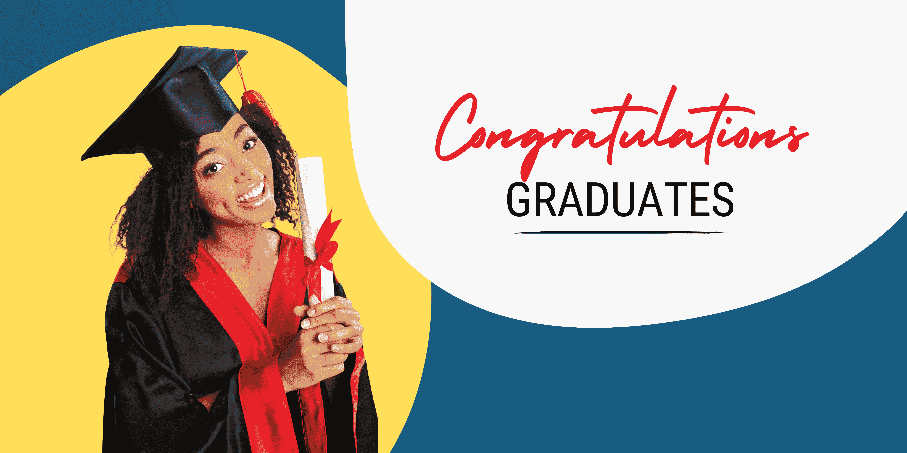

# 从家里上大学，使用这些在线学位

> 原文：[`www.kdnuggets.com/go-to-university-from-home-with-these-online-degrees`](https://www.kdnuggets.com/go-to-university-from-home-with-these-online-degrees)

作者提供的图片

我小时候从未想过会有一天人们可以在家里获得学位。我听说过[开放大学](https://www.open.ac.uk/)和其他类似平台，但现在我看到它变得越来越普及。

* * *

## 我们的三大课程推荐

 1\. [谷歌网络安全证书](https://www.kdnuggets.com/google-cybersecurity) - 快速进入网络安全职业生涯。

 2\. [谷歌数据分析专业证书](https://www.kdnuggets.com/google-data-analytics) - 提升你的数据分析技能

 3\. [谷歌 IT 支持专业证书](https://www.kdnuggets.com/google-itsupport) - 支持你的组织的 IT

* * *

在现如今，获得教育学学位是困难的。人们必须做出很多牺牲。无论是财务问题还是找人照看他们的亲人，比如孩子。在线学位是一个了不起的替代方案，你可以在自己舒适的家中继续学习。

所以对于那些因为无法做出这些牺牲而犹豫不决进入科技行业的人——我在这里帮助你们！

## 计算机科学学士学位

链接: [计算机科学学士学位](https://imp.i384100.net/0ZVdZN)

伦敦大学和金史密斯大学提供的计算机科学学士学位课程完全是在线学习，你可以在全球任何地方进行实践学习。这是一个经过认证的学士学位，提供灵活的学习计划，以匹配你的承诺。该学士学位包括 23 门课程，每周需要 14-28 小时，这总共需要 36 - 72 个月。

在这个学位中，你将：

+   完善你的编程语言选择，例如 Python、C++、C#、Java Script。

+   在一个以项目为基础的实践学习环境中建立你的知识和技能，你将有机会开发自己的软件

+   选择一个符合你职业需求的专业方向，从机器学习和人工智能、数据科学、网页和移动开发、用户体验等

+   专注于 7 个前沿主题中的 1 个：机器学习和人工智能、数据科学、网页和移动开发、物理计算和物联网、游戏开发、虚拟现实或用户体验。

+   创建一个实际研究和应用的作品集，用于展示你的专业知识并向雇主和投资者传达你的价值

## 数据科学与人工智能学士学位

链接: [数据科学与人工智能学士学位](https://imp.i384100.net/Kj7Z0e)

印度理工学院古瓦哈提分校提供的**数据科学与人工智能学士学位**课程是一个认可的荣誉学士学位，并且完全在线，这让你可以从任何地方进行实践学习，包括在线课堂和考试，以及可选的校园浸入体验。如果每周投入 18-20 小时，该学位可以在 4 到 8 年内完成。

8 年听起来有点可怕，对吧？然而，这个在线学位在每年结束时提供灵活的退出选项，以一种与您的职业抱负相符的方式塑造您的教育。你可以在第一年结束时获得**数据科学与人工智能基础证书**，在第二年结束时获得**数据科学与人工智能文凭**，在完成第三年的所有课程后获得**学士学位**，或在第四年结束时获得**荣誉学位**。

在这个学位中，你将：

+   为不断发展的技术领域做好准备。

+   通过顶点项目、实习和职业提升证书专注于基于应用的学习。

+   学习如何通过顶点项目解决实际问题。

+   接触超过 50 种编程语言、工具、库和代码库。

+   在行业领导者的监督下，开发机器学习系统，并将其与大规模人工智能模型集成。

## 总结

本文旨在为那些因局限性或害怕重返大学而对数据科学职业犹豫不决的人提供希望。

追逐梦想永远不会太晚！

****[尼莎·阿雅](https://www.linkedin.com/in/nisha-arya-ahmed/)****是一名数据科学家、自由技术作家，以及 KDnuggets 的编辑和社区经理。她特别关注提供数据科学职业建议或教程以及围绕数据科学的理论知识。尼莎涉及广泛的话题，并希望探索人工智能如何有助于人类寿命的延续。作为一名热衷学习者，尼莎寻求拓宽自己的技术知识和写作技能，同时帮助他人。

### 更多相关话题

+   [数据科学学位与课程：价值判决](https://www.kdnuggets.com/data-science-degrees-vs-courses-the-value-verdict)

+   [避免时间序列预测中的这些错误](https://www.kdnuggets.com/2021/12/avoid-mistakes-time-series-forecasting.html)

+   [从这些 GitHub 代码库学习数据科学](https://www.kdnuggets.com/2022/12/learn-data-science-github-repositories.html)

+   [从这些 GitHub 代码库学习数据工程](https://www.kdnuggets.com/2023/02/learn-data-engineering-github-repositories.html)

+   [利用这些课程构建类似 ChatGPT 的聊天机器人](https://www.kdnuggets.com/2023/05/build-chatgptlike-chatbot-courses.html)

+   [通过这 3 个热门证书提升你的技术职业](https://www.kdnuggets.com/advance-your-tech-career-with-these-3-popular-certificates)
