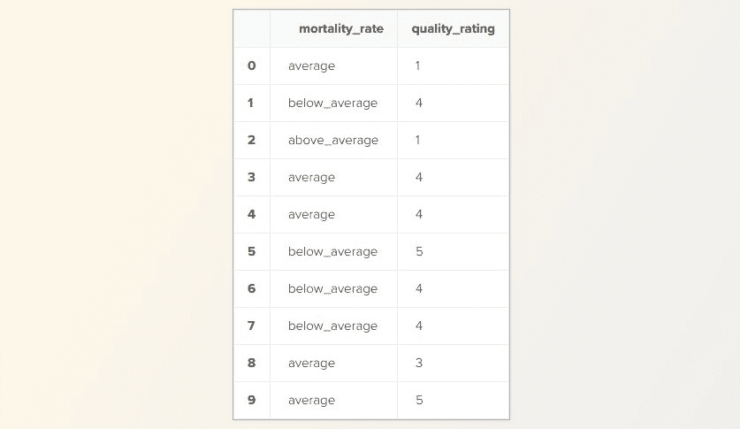
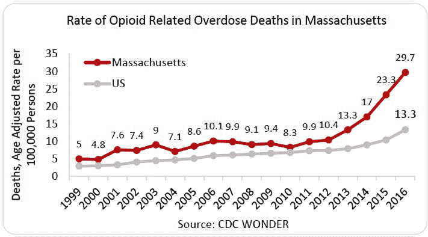
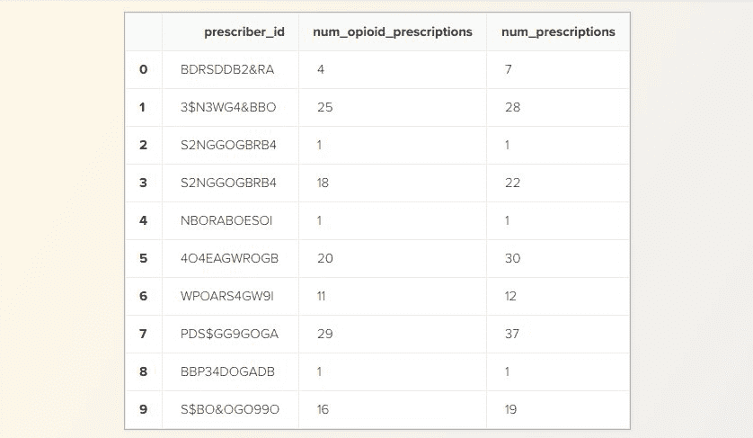
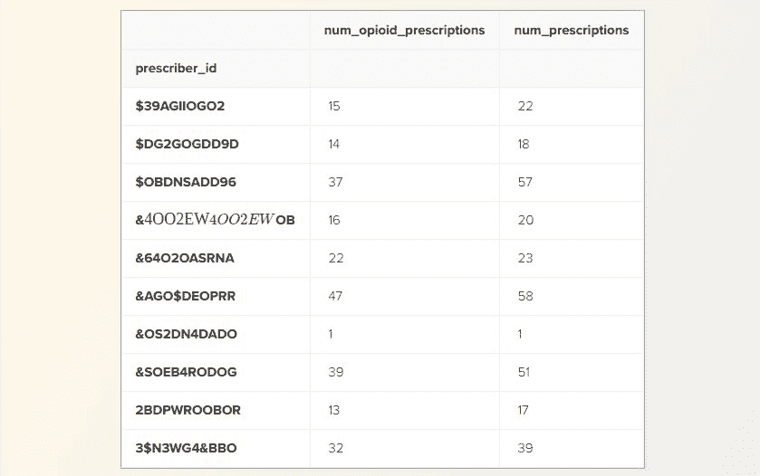
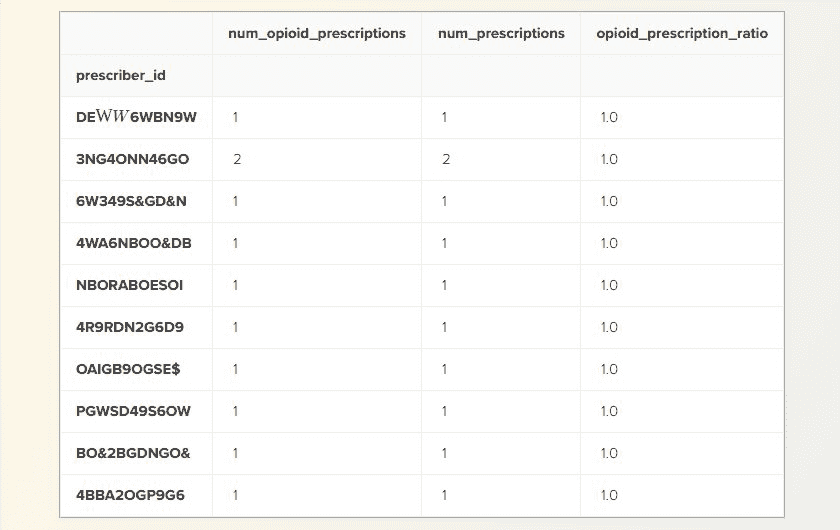
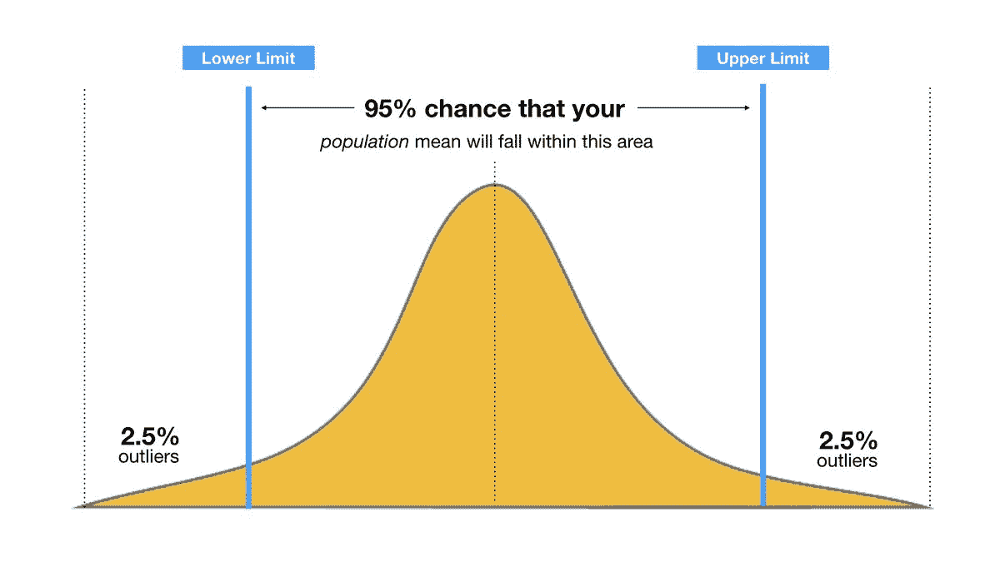
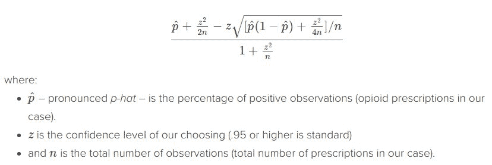
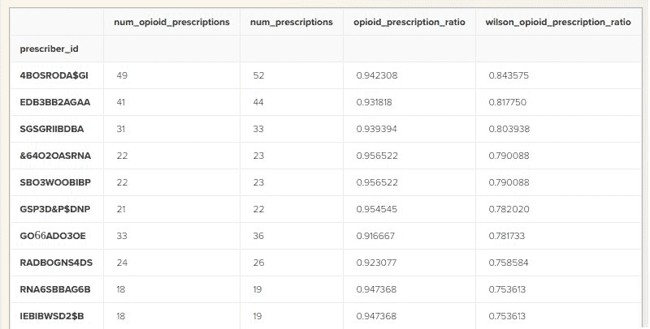

# 从优秀到卓越的数据科学，第一部分：相关性和置信度

> 原文：[`www.kdnuggets.com/2019/02/good-great-data-science-correlations-confidence.html`](https://www.kdnuggets.com/2019/02/good-great-data-science-correlations-confidence.html)

 评论

**由 [Brian Joseph](https://www.linkedin.com/in/brian-joseph-429028118/) 数据科学家**


* * *

## 我们的三大课程推荐

 1\. [谷歌网络安全证书](https://www.kdnuggets.com/google-cybersecurity) - 快速进入网络安全职业轨道。

 2\. [谷歌数据分析专业证书](https://www.kdnuggets.com/google-data-analytics) - 提升你的数据分析能力

 3\. [谷歌 IT 支持专业证书](https://www.kdnuggets.com/google-itsupport) - 支持你组织的 IT 工作

* * *

### 引言

作为数据科学家，你将花费大量时间用数据回答问题。我目前在医疗行业担任数据科学家，为医院和医疗相关组织提供指标并建立模型。在我的实践中，我的大部分时间用于两件事：

+   将定性商业问题转化为可以通过数据生成的严格解决方案

+   以编程方式实施这些解决方案

我将带你了解两个我实际在工作中被问到的问题：

1.  我的医院是否应该更多地关注改善其死亡率？

1.  哪些药剂师发放了过多的阿片类药物？

它们共同的特点是做这些事情有对的方法和错的方法。此外，很容易以错误的方式回答这些问题而不被注意。正如你将看到的，伟大的答案与普通答案之间的差异在于拥有一点数学背景。

**Jupyter notebook 和本文的数据** [**在 GitHub 上**](https://github.com/LearnDataSci/article-resources/tree/master/From%20Good%20to%20Great%20Data%20Science%2C%20Part%201%20Correlations%20and%20Confidence)

### 问题陈述 1

医疗保险和医疗补助服务中心（CMS）负责根据质量和绩效指标对医院进行评级。

他们提供各种指标来估计医院绩效，还有一个总体指标称为`quality_rating`。另一个不太重要的评级是`mortality_rate`。

假设你被委派调查医院的`quality_rating`与`mortality_rate`之间的关系，以回答我上面提到的第一个问题。医院的死亡率对其总体`quality_rating`有多大影响？假设你的数据如下：

+   `quality_rating`：一个范围为（1, 2, 3, 4, 5）的数值

+   `mortality_rate`：以下值之一：

    +   *高于平均水平*

    +   *平均水平*

    +   *低于平均水平*

假设你有如下数据：

```py
ratings_df = pd.read_csv('hospital_ratings.csv').drop(columns='Unnamed: 0')

print('Number of Hospitals: {}'.format(len(ratings_df.index)))

ratings_df.head(10)

```

```py
Number of Hospitals: 100

```



如你所见，每一行代表一个医院。每个医院都有一个死亡率和一个质量评分。前提是*比较*`mortality_rate`和`quality_rating`，所以一个关键的统计工具应该跃然于你的脑海中。**相关性**。

这是将我们的*定性*问题转化为*定量*术语的第一步。我鼓励你此时尝试解决这个问题——或者至少制定一个完整的计划来回答这个问题：

***这两个指标之间的相关性是什么？***

你找到了答案吗？我们一起走一遍。

****编码死亡率****

这个问题可能还剩两个步骤。首先，我们应该注意到我们的`mortality_rate`列包含顺序数据。我们只能对数值数据进行相关性分析，所以我们需要对这点进行处理。

让我们以某种方式编码数据，以保留其顺序关系。换句话说，我们希望将***低于平均水平***的`mortality_rate`的编码在数值上优于***高于平均水平***的`mortality_rate`的编码（注意，医院的**较低**死亡率更好）。

你是如何处理数据编码的？选项无穷无尽：

比如：

```py
'below average' --> 5
'average' --> 3 
'above average' --> 1

```

或者：

```py
'below average' --> 3 
'average' --> 2 
'above average' --> 1

```

或者：

```py
'below average' --> 1 
'average' --> 0 
'above average' --> -1

```

如果你决定对数据进行编码，你选择了哪个选项？哪个是正确的？正确的答案是*没有* — 或者*全部*吧……

我稍后会解释原因。但现在，我们继续映射到最后一个选项：映射到集合：(-1, 0, 1)。

```py
MORTALITY_MAP = {
    'below_average': 1,
    'average': 0,
    'above_average': -1
}

ratings_df['mortality_rate'] = ratings_df['mortality_rate'].map(MORTALITY_MAP) # apply the map
ratings_df.head()

```


这个问题的最后一步是（看似）最简单的。现在我们只需要相关性分析我们的两列数据，对吧？

```py
ratings_df.corr()

```


不完全正确。我们对数据做出了一个巨大的假设。我们假设我们的数据是*更*高于顺序的。 

****非参数相关性****

作为数据科学家，你应该对[parametric](https://en.wikipedia.org/wiki/Parametric_statistics)和[non-parametric](https://en.wikipedia.org/wiki/Nonparametric_statistics)统计学的概念很熟悉。大多数统计相关性将默认使用称为`pearson`的参数相关性方法。在我们的例子中，我们需要使用一种称为`spearman`的非参数相关性。

这种非参数方法假设我们的数据仅仅是顺序的。换句话说，无论我们做什么映射，只要映射后的顺序保持不变，斯皮尔曼相关性将返回相同的结果。

如果我们指定需要使用斯皮尔曼相关性方法，那么我们会发现结果有显著变化：

```py
ratings_df.corr(method='spearman')

```


我们刚刚将相关性降低了约**10%**。这是一个巨大的差异！

如果你使用皮尔逊相关系数而不是斯皮尔曼相关系数来报告这个相关性，你可能会严重误导客户或同事。

这表明**强大的统计背景对数据科学角色至关重要**。这样一个看似简单的问题实际上有一个关键的数学步骤，这个步骤常常被忽视。

### 问题陈述 2

你拥有过去 5 年在马萨诸塞州的数百万条药品记录，该州以阿片类药物滥用问题而闻名。因此，如果你能识别出那些开处方过多阿片类药物的药剂师，那将非常有用。



来源：[国家毒品滥用研究所](https://www.drugabuse.gov/drugs-abuse/opioids/opioid-summaries-by-state/massachusetts-opioid-summary)

你的任务是：

***生成一份开处方过多阿片类药物的药剂师名单。***

看起来相当简单。假设你有以下数据集：

```py
prescribers_df = pd.read_csv('prescriptions.csv').drop(columns='Unnamed: 0')
prescribers_df.head(10)

```



每一行代表一天的处方

我们有以下几个列：

+   `prescriber_id`：一个标识药剂师的随机代码

+   `num_opioid_prescriptions`：某一天开出的阿片类药物处方数量

+   `num_prescriptions`：某一天开出的*总*处方数量

### **开处方医生分组**

我们应该首先注意到的是，`prescriber_id`不包含唯一值，因为药剂师可能在多个日子里开过药。由于这个指标是按药剂师级别计算的——而不是按日计算的——我们应该使用 pandas 的`groupby`来修正这个问题。

```py
prescribers_df = prescribers_df.groupby('prescriber_id').agg('sum')
prescribers_df.head(10)

```



好得多。现在的任务是根据药剂师开出的阿片类药物数量对他们进行排名。但药剂师开处方的数量不同。这表明我们现在应该考虑每个药剂师的阿片类药物处方比例。让我们就这样做。

### **阿片类药物处方比例**

```py
prescribers_df['opioid_prescription_ratio'] = (prescribers_df['num_opioid_prescriptions'] / 
                                               prescribers_df['num_prescriptions'])

```

Pandas 使得这一切变得非常简单。那么我们完成了，对吗？只需根据`opioid_ratio`对开处方医生进行排序，并完成这项任务？

```py
prescribers_df.sort_values('opioid_prescription_ratio', ascending=False).head(10)

```



不完全正确。这些数据应该引起你的警觉。

将一位药剂师因为在他们所有处方中开出 1 份阿片类药物就被排名为滥用者，这真的有意义吗？尝试用文字准确描述一下这个情况的问题所在。为什么我们不想将这些药剂师报告为最严重的违规者？希望你得出的答案类似于：

***因为我们没有足够的信息来评判他们。***

想象一下你坐在药店里看着一位药剂师（我们称他为“比尔”）进行工作。假设你想要报告比尔，因为他开处方的阿片类药物过多。

一位顾客走进来，Bill 给他们开了*氢可酮*（一种常见的鸦片药物）。立即报告 Bill 是没有意义的。你会希望等更多地观察 Bill 的行为后再做判断，因为你还不确定你的发现。

**置信度**是这里的关键词，我们很快就会发现。

### **建立置信度**

那么我们如何解决这个问题呢？

从统计学角度来看，开处方鸦片药物或不开处方可以视作一个[Bernouli 参数](https://en.wikipedia.org/wiki/Bernoulli_distribution)（这是一个值为二元的术语——要么为真，要么为假）。考虑到 Bernouli 参数的观察次数，我们想要预测这个参数的真实值。

所谓的“真实值”是指如果我们有足够的观察数据，开药医生的`opioid_prescription_ratio`将会收敛到的实际值。以 Bill 为例，“真实值”将等同于 Bill 的`opioid_prescription_ratio`，如果我们能观察和记录他的行为很长时间——比如一年。

如果你上过统计学或[优秀的数据科学课程](https://www.learndatasci.com/best-data-science-online-courses-2018/)，你可能对置信区间的概念有所了解。如果没有，简单来说，置信区间只是对你相信未知值存在于其中的范围的数学置信度度量。



来源： [当你可以拥有置信区间时，谁需要伴舞者？](https://medium.com/design-ibm/who-needs-backup-dancers-when-you-can-have-confidence-intervals-485f9464c06f)

例如，我可以有 95%的把握明天的温度将在 40 华氏度和 70 华氏度之间。

在 1927 年，数学家 Edwin Wilson 将置信区间的概念应用于 Bernoulli 参数。这意味着，基于我们对药剂师的数据，我们可以猜测其`opioid_prescription_ratio`的*真实*值！

这是公式：

Wilson 置信区间下界：



公式看起来很吓人，但如果花时间去理解它，其实很直观。解释这个公式为什么有效的数学原理本身值得一个完整的讨论，因此不在此范围之内。我们将专注于应用它。

```py
def wilson_ci_lower_bound(num_pos, n, confidence=.95):
    if n == 0:
        return 0

    z = stats.norm.ppf(1 - (1 - confidence) / 2) # Establish a z-score corresponding to a confidence level

    p_hat = num_pos / n

    # Rewrite formula in python
    numerator = p_hat + (z**2 / (2*n)) - (z * math.sqrt((p_hat * (1 - p_hat) + (z**2 / (4*n))) / n))
    denominator = 1 + ((z**2) / n)

    return  numerator / denominator

```

让我们以 95%的置信度将此公式应用于我们的数据框，创建一个新列。

```py
prescribers_df['wilson_opioid_prescription_ratio'] = prescribers_df \
    .apply(lambda row: wilson_ci_lower_bound(row['num_opioid_prescriptions'], row['num_prescriptions']), axis=1)

prescribers_df.sort_values('wilson_opioid_prescription_ratio', ascending=False).head(10)

```



太棒了！现在这些是我们想要报告的结果。

虽然有许多开具 1/1 或 2/2 鸦片药物处方的医生，但他们现在出现在我们的排名底部——这很直观。虽然我们排名最高的开药医生的`opioid_prescription_ratio`低于一些其他开药医生，但排名现在考虑了数学置信度的概念。

这两种方法——使用置信区间或不使用置信区间——在*技术上*都是可以接受的。然而，很容易看出，具有数学背景的方法产生了更有价值的结果。

### 总结……

数据科学工作的一大部分是将开放且可解释的问题转化为定量、严格的术语。

正如这两个例子所展示的，有时这并不是一件容易的事，许多数据科学家在这方面往往表现不佳。很容易陷入在非参数情境中使用参数相关性的陷阱。很容易天真地对伯努利试验列表进行排序，而不考虑每次试验的观测数量。事实上，这种情况在实践中比你想象的更常见。

区分优秀数据科学家和伟大数据科学家的一部分因素是具备数学背景和直觉，以识别并应对这样的情况。通常，数据科学中区分解决方案和优秀解决方案的关键在于在正确的背景下运用正确的数学工具。

**个人简介：[布赖恩·约瑟夫](https://www.linkedin.com/in/brian-joseph-429028118/)** 在东北大学学习数学，研究方向集中于组合数学和线性代数。目前在大波士顿地区的一家初创公司担任数据科学家，对数学、数据科学、形式验证和算法设计充满热情。

[原文](https://www.learndatasci.com/tutorials/good-great-data-science-correlations-and-confidence/)。经授权转载。

**相关内容：**

+   数据科学统计学入门

+   掌握基础机器学习的 7 个步骤 — 2019 版

+   探索 Python 基础

### 更多相关主题

+   [处理置信区间](https://www.kdnuggets.com/2023/04/working-confidence-intervals.html)

+   [模型信心的探索：你能信任一个黑箱吗？](https://www.kdnuggets.com/the-quest-for-model-confidence-can-you-trust-a-black-box)

+   [机器学习不像你的大脑第七部分：神经元……](https://www.kdnuggets.com/2022/08/machine-learning-like-brain-part-seven-neurons-good.html)

+   [数据质量维度：用伟大期望确保数据质量](https://www.kdnuggets.com/2023/03/data-quality-dimensions-assuring-data-quality-great-expectations.html)

+   [数据质量：好、坏与丑](https://www.kdnuggets.com/2022/01/data-quality-good-bad-ugly.html)

+   [良好的数据科学项目文档的 5 条规则](https://www.kdnuggets.com/2022/12/5-rules-good-data-science-project-documentation.html)
