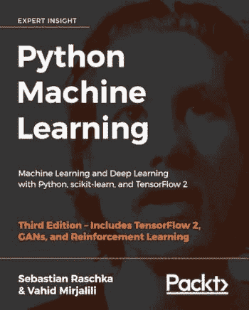

# 谷歌研究主任对学习数据科学的建议

> 原文：[`www.kdnuggets.com/2021/07/google-advice-learning-data-science.html`](https://www.kdnuggets.com/2021/07/google-advice-learning_data_science.html)

评论

*照片来源：[Mitchell Luo](https://unsplash.com/@mitchel3uo) 在 [Unsplash](https://unsplash.com/)。*

> * * *
> 
> ## 我们的前三大课程推荐
> ## 
>  1\. [谷歌网络安全证书](https://www.kdnuggets.com/google-cybersecurity) - 快速进入网络安全职业轨道。
> 
>  2\. [谷歌数据分析专业证书](https://www.kdnuggets.com/google-data-analytics) - 提升你的数据分析技能
> 
>  3\. [谷歌 IT 支持专业证书](https://www.kdnuggets.com/google-itsupport) - 支持你的组织的 IT 工作
> 
> * * *
> 
> “*在 2021 年，数字市场领域的专业人士必须熟悉数据——就这样。他们必须知道如何操作数据，理解数据的收集方式，分析和解释数据。决策的未来基于数据科学*。” — Wendy Moe, 马里兰大学市场营销教授

数据科学技能在以前与统计无关的工作中变得越来越重要，包括市场营销和商业。将数据科学技能加入到你的 portfolio 中，将使你在今年的市场竞争中占据优势。

如果你有兴趣将数据科学加入到你的职业 portfolio 中，你无疑可能会考虑这些问题：

1.  ***学习数据科学基础需要多长时间？***

1.  ***学习数据科学有哪些资源？***

本文讨论了**[Peter Norvig](https://en.wikipedia.org/wiki/Peter_Norvig)**对考虑数据科学的个人的一些一般建议。

## Peter Norvig（谷歌研究主任）的背景

选择上述标题的动机基于**Peter Norvig**关于成为编程专家所需时间的观点。如果你还没读过这篇文章：*“[10 年内自学编程](http://norvig.com/21-days.html)”*，我鼓励你去阅读。

关键在于，你不需要 10 年时间来学习数据科学的基础，但匆忙学习数据科学肯定没有帮助。成为数据科学家需要时间、精力、耐心和承诺。

Peter Norvig 的建议是，学习需要时间、耐心和承诺。要警惕那些声称你可以在 4 周内学习数据科学的文章、书籍或网站。

*图片来源：Benjamin O. Tayo。*

如果你有兴趣学习数据科学的基础知识，请做好投入适当时间和精力的准备。这样，你不仅能掌握表面概念，还能深入理解数据科学的核心概念。

我花了 2 年时间通过自学掌握数据科学的基础知识，并且我每天都继续挑战自己学习新知识。掌握数据科学基础需要多长时间取决于你的背景。一般来说，拥有数学、统计学、计算机科学、工程学或经济学等分析学科的扎实背景会有所帮助。

## 彼得·诺维格的《自学编程十年记》的 3 个经验

**1) 掌握数据科学的基础需要时间、努力、精力、耐心和承诺。**

数据科学是一个多学科领域，需要扎实的高级数学、统计学、编程以及其他与数据分析、数据可视化、模型构建、机器学习等相关的技能背景。我花了 2 年时间专注于学习数据科学的基础知识，这得益于我扎实的数学、物理和编程背景。以下是一些帮助我掌握数据科学基础的资源。

(i) [数据科学专业证书](https://www.edx.org/professional-certificate/harvardx-data-science)（HarvardX，通过 edX）

包括以下课程，均使用 R 语言授课（你可以免费旁听课程或购买认证证书）：

+   *数据科学：R 基础*

+   *数据科学：可视化*

+   *数据科学：概率*

+   *数据科学：推理与建模*

+   *数据科学：生产力工具*

+   *数据科学：数据整理*

+   *数据科学：线性回归*

+   *数据科学：机器学习*

+   *数据科学：结课项目*

(ii) [分析：基本工具和方法](https://www.edx.org/micromasters/analytics-essential-tools-methods)（Georgia TechX，通过 edX）

包括以下课程，均使用 R、Python 和 SQL 授课（你可以免费旁听或购买认证证书）：

+   *分析建模导论*

+   *数据分析计算导论*

+   *商业数据分析*

(iii) [应用数据科学与 Python 专业化](https://www.coursera.org/specializations/data-science-python)（密歇根大学，通过 Coursera）

包括以下课程，均使用 Python 授课（你可以免费旁听大部分课程，有些课程需要购买认证证书）：

+   *Python 中的数据科学导论*

+   *Python 中的应用绘图、图表与数据表示*

+   *Python 中的应用机器学习*

+   *Python 中的应用文本挖掘*

+   *Python 中的应用社会网络分析*

(iv) 数据科学教科书

从教科书中学习可以提供比在线课程更精细和深入的知识。这本书提供了数据科学和机器学习的很好的入门介绍，并且包含代码：“[Python 机器学习](https://github.com/rasbt/python-machine-learning-book-3rd-edition)”由 Sebastian Raschka 编写。

作者以非常易于理解的方式解释了机器学习中的基本概念。此外，书中包含了代码，你可以使用提供的代码进行实践并构建自己的模型。我个人发现这本书在我作为数据科学家的旅程中非常有用。我推荐这本书给任何数据科学爱好者。你只需要具备基础的线性代数和编程技能，就能理解这本书。

还有许多其他优秀的数据科学教科书，例如 Wes McKinney 的“[Python 数据分析](https://sushilapalwe.files.wordpress.com/2018/04/python-for-data-analytics-book.pdf)”、Kuhn & Johnson 的“[应用预测建模](https://vuquangnguyen2016.files.wordpress.com/2018/03/applied-predictive-modeling-max-kuhn-kjell-johnson_1518.pdf)”和 Ian H. Witten、Eibe Frank & Mark A. Hall 的“[数据挖掘：实用的机器学习工具与技术](https://www.wi.hs-wismar.de/~cleve/vorl/projects/dm/ss13/HierarClustern/Literatur/WittenFrank-DM-3rd.pdf)”。

(v) 与其他数据科学爱好者建立网络

根据我的个人经验，通过与其他数据科学爱好者组队进行每周的讨论，我学到了很多关于数据科学和机器学习的知识。与其他数据科学爱好者建立网络，在 GitHub 上分享你的代码，在 LinkedIn 上展示你的技能。这将帮助你在短时间内学习大量的新概念和工具。你还会接触到新的工作方法、新的算法和技术。

**2) 理解数据科学的理论基础与实践数据科学技能同样重要。**

数据科学高度依赖数学，需要掌握以下知识：

(i) 统计学与概率论

(ii) 多变量微积分

(iii) 线性代数

(iv) 优化与运筹学

了解你需要关注的数学主题，请参考这里：[机器学习的基本数学技能](https://medium.com/towards-artificial-intelligence/4-math-skills-for-machine-learning-12bfbc959c92)。

尽管像 Python 的 sci-kit learn 和 R 的 Caret 包包含了多个用于数据科学和构建机器学习模型的工具，但理解每种方法的理论基础是极其重要的。

**3) 避免将机器学习模型作为黑箱工具使用。**

扎实的数据科学背景将使数据科学家能够构建可靠的预测模型。例如，在构建模型之前，你可以问自己：

(i) 预测变量是什么？

(ii) 目标变量是什么？我的目标变量是离散的还是连续的？

(iii) 我应该使用分类还是回归分析？

(iv) 我如何处理数据集中的缺失值？

(v) 在将变量标准化到相同的尺度时，我应该使用归一化还是标准化？

(vi) 我是否应该使用主成分分析？

(vii) 我如何调整模型中的超参数？

(viii) 我如何评估我的模型以检测数据集中的偏差？

(ix) 我是否应该使用集成方法，即使用不同的模型进行训练，然后进行集成平均，例如，使用分类器如 SVM、KNN、逻辑回归，然后对 3 个模型进行平均？

(x) 我如何选择最终模型？

一个好的和坏的机器学习模型之间的差异取决于一个人是否能够理解模型的所有细节，包括对不同超参数的知识以及如何调整这些参数以获得最佳性能的模型。将任何机器学习模型作为黑箱使用而不完全理解模型的复杂性，会导致一个虚假的模型。

总之，数据科学是目前最热门的领域之一。数字革命创造了大量的数据。公司、行业、组织和政府每天都在生产大量的数据。对高技能数据科学家的需求只会不断增长。这是投资时间掌握数据科学基础的正确时机。在此过程中，要警惕那些告诉你可以在 4 周或一个月内学习数据科学的文章、书籍或网站。不要急于求成。花时间掌握数据科学的基础知识。

[原文](https://pub.towardsai.net/googles-director-of-research-has-an-advice-for-beginners-in-data-science-af50e12bb65a)。转载经许可。

**相关:**

+   [跟踪你的数据科学进展的检查清单](https://www.kdnuggets.com/2021/05/checklist-data-science-progress.html)

+   [作为数据科学初学者你应该避免的 10 个错误](https://www.kdnuggets.com/2021/06/10-mistakes-avoid-data-science-beginner.html)

+   [不要在 24 小时内学习机器学习](https://www.kdnuggets.com/2018/04/dont-learn-machine-learning-24-hours.html)

### 更多相关话题

+   [停止学习数据科学以寻找目标，并通过寻找目标来……](https://www.kdnuggets.com/2021/12/stop-learning-data-science-find-purpose.html)

+   [学习数据科学统计的顶级资源](https://www.kdnuggets.com/2021/12/springboard-top-resources-learn-data-science-statistics.html)

+   [建立一个稳固的数据团队](https://www.kdnuggets.com/2021/12/build-solid-data-team.html)

+   [成功数据科学家的 5 个特征](https://www.kdnuggets.com/2021/12/5-characteristics-successful-data-scientist.html)

+   [每个数据科学家都应该了解的三个 R 库（即使你使用 Python）](https://www.kdnuggets.com/2021/12/three-r-libraries-every-data-scientist-know-even-python.html)

+   [使用管道编写干净的 Python 代码](https://www.kdnuggets.com/2021/12/write-clean-python-code-pipes.html)
