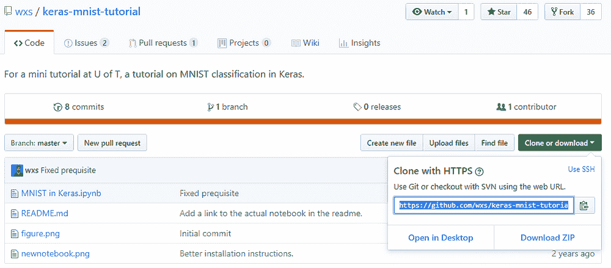
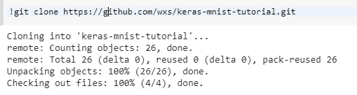
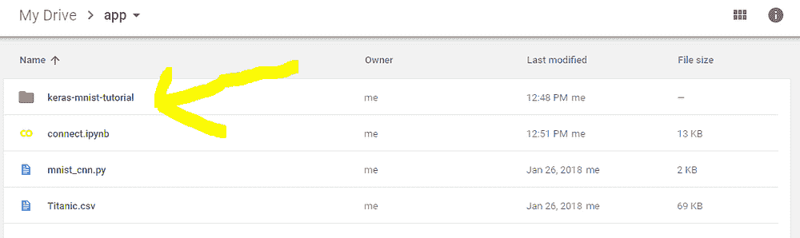
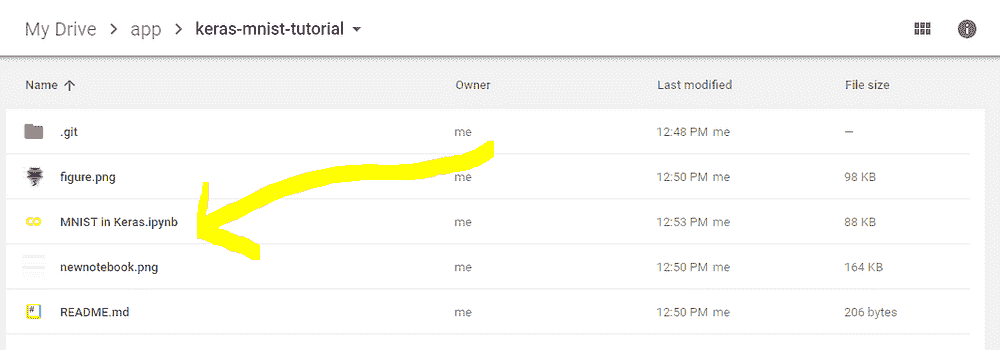
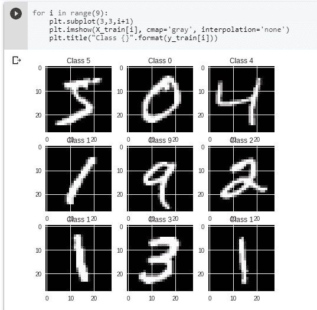
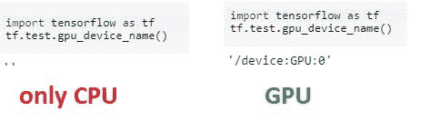
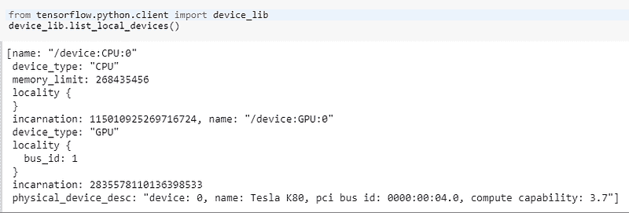
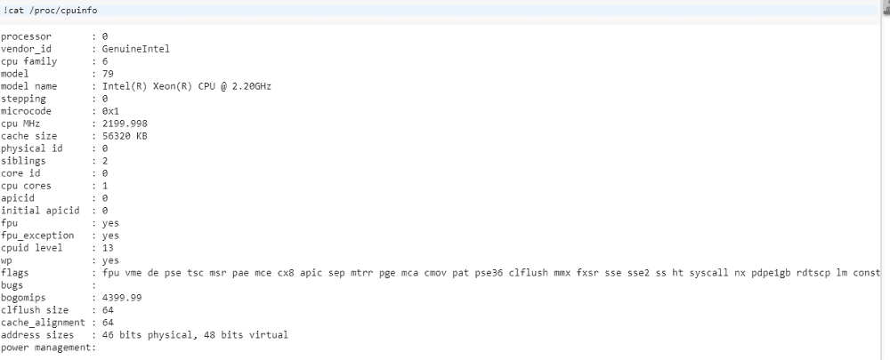

# 使用 Google Colab、TensorFlow、Keras 和 PyTorch 进行深度学习开发

> 原文：[`www.kdnuggets.com/2018/02/google-colab-free-gpu-tutorial-tensorflow-keras-pytorch.html/2`](https://www.kdnuggets.com/2018/02/google-colab-free-gpu-tutorial-tensorflow-keras-pytorch.html/2)

评论

### 将 Github 仓库克隆到 Google Colab

使用 Git 克隆 Github 仓库很简单。

**第 1 步：找到 Github 仓库并获取 “Git” 链接**

找到任何 Github 仓库使用。例如：[`github.com/wxs/keras-mnist-tutorial`](https://github.com/wxs/keras-mnist-tutorial)

克隆或下载 > 复制链接！



**2\. Git 克隆**

只需运行：

```py
!git clone https://github.com/wxs/keras-mnist-tutorial.git
```



**3\. 在 Google Drive 中打开文件夹**

文件夹与 Github 仓库当然是一样的 :)



**4\. 打开笔记本**

右键点击 > 用 Colaboratory 打开



**5\. 运行**

现在你可以在 Google Colab 中运行 Github 仓库。



### 一些有用的提示

**1\. 如何安装库？**

**Keras**

```py
!pip install -q keras
import keras
```

**PyTorch**

```py
!pip install -q http://download.pytorch.org/whl/cu75/torch-0.2.0.post3-cp27-cp27mu-manylinux1_x86_64.whl torchvision
import torch
```

**MxNet**

```py
!apt install libnvrtc8.0
!pip install mxnet-cu80
import mxnet as mx
```

**OpenCV**

```py
!apt-get -qq install -y libsm6 libxext6 && pip install -q -U opencv-python
import cv2
```

**XGBoost**

```py
!pip install -q xgboost==0.4a30
import xgboost
```

**GraphViz**

```py
!apt-get -qq install -y graphviz && pip install -q pydot
import pydot
```

**7zip Reader**

```py
!apt-get -qq install -y libarchive-dev && pip install -q -U libarchive
import libarchive
```

**其他库**

```py
!pip install or !apt-get install to install other libraries.

```

**2\. GPU 是否正常工作？**

若要查看你是否正在使用 Colab 中的 GPU，你可以运行以下代码进行交叉检查：

```py
import tensorflow as tf
tf.test.gpu_device_name()
```



**3\. 我正在使用哪个 GPU？**

```py
from tensorflow.python.client import device_lib
device_lib.list_local_devices()
```

目前，**Colab 仅提供 Tesla K80**。



**4\. 那 RAM 呢？**

```py
!cat /proc/meminfo
```


**5\. 那 CPU 呢？**

```py
!cat /proc/cpuinfo
```



**6\. 更改工作目录**

通常当你运行这段代码时：

```py
!ls
```

你可能会看到 **datalab 和 drive** 文件夹。

因此你必须在定义每个文件名之前添加 **drive/app**。

为了摆脱这个问题，你可以简单地更改工作目录。（在本教程中，我更改为 **app 文件夹**）使用以下简单代码：

```py
import os
os.chdir("drive/app")
```

运行上述代码后，如果你再次运行

```py
!ls
```

你会看到 **app 文件夹内容**，不再需要每次都添加 **drive/app**。

**7\. “`No backend with GPU available`” 错误解决方案**

如果你遇到这个错误：

```py
Failed to assign a backend
No backend with GPU available. Would you like to use a runtime with no accelerator?
```

稍后再试。现在很多人正在使用 GPU，当所有 GPU 都在使用时会出现此消息。

[参考资料](https://www.kaggle.com/getting-started/47096#post271139)

**8\. 如何清除所有单元的输出**

通过 **工具 >> 命令面板 >> 清除所有输出** 操作

**9\. “apt-key output should not be parsed (stdout is not a terminal)” 警告**

如果你遇到这个警告：

```py
Warning: apt-key output should not be parsed (stdout is not a terminal)
```

这意味着身份验证已经完成。你只需要挂载 Google Drive：

```py
!mkdir -p drive
!google-drive-ocamlfuse drive
```

**10\. 如何在 Google Colab 中使用 Tensorboard？**

我推荐这个仓库：

[`github.com/mixuala/colab_utils`](https://github.com/mixuala/colab_utils)

### 结论

我认为**Colab**将为全球的深度学习和 AI 研究带来新的气息。

如果你觉得这篇文章有帮助，给它一些掌声???? 并分享给其他人，这对我们很重要！也欢迎在下面留下评论。

你可以在[LinkedIn](https://www.linkedin.com/in/fuatbeser/)找到我。

**个人简介: [Fuat Beşer](https://www.linkedin.com/in/fuatbeser/)** 是一名深度学习研究员，也是 Deep Learning Turkey 的创始人，这是土耳其最大的 AI 社区。

[原文](https://medium.com/deep-learning-turkey/google-colab-free-gpu-tutorial-e113627b9f5d)。转载已获许可。

**相关:**

+   3 个必备的 Google Colaboratory 小贴士

+   Fast.ai 第 1 课在 Google Colab 上（免费 GPU）

+   构建神经网络的简单入门指南

* * *

## 我们的 3 个课程推荐

 1\. [Google 网络安全证书](https://www.kdnuggets.com/google-cybersecurity) - 快速进入网络安全职业。

 2\. [Google 数据分析专业证书](https://www.kdnuggets.com/google-data-analytics) - 提升你的数据分析技能

 3\. [Google IT 支持专业证书](https://www.kdnuggets.com/google-itsupport) - 支持你的组织的 IT 需求

* * *

### 更多相关主题

+   [停止学习数据科学，寻找目的，并以此为…](https://www.kdnuggets.com/2021/12/stop-learning-data-science-find-purpose.html)

+   [学习数据科学统计的顶级资源](https://www.kdnuggets.com/2021/12/springboard-top-resources-learn-data-science-statistics.html)

+   [一个 90 亿美元的 AI 失败案例分析](https://www.kdnuggets.com/2021/12/9b-ai-failure-examined.html)

+   [成功数据科学家的 5 个特征](https://www.kdnuggets.com/2021/12/5-characteristics-successful-data-scientist.html)

+   [是什么让 Python 成为初创公司的理想编程语言](https://www.kdnuggets.com/2021/12/makes-python-ideal-programming-language-startups.html)

+   [每个数据科学家都应该了解的三个 R 语言库（即使你使用 Python）](https://www.kdnuggets.com/2021/12/three-r-libraries-every-data-scientist-know-even-python.html)
