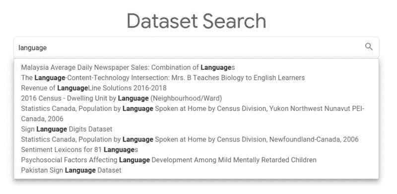
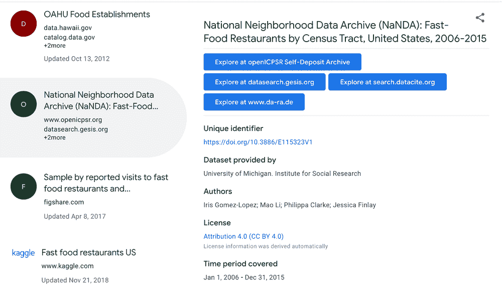

# 谷歌数据集搜索提供访问 2500 万个数据集

> 原文：[`www.kdnuggets.com/2020/01/google-dataset-search.html`](https://www.kdnuggets.com/2020/01/google-dataset-search.html)

评论

谷歌的 [数据集搜索](https://datasetsearch.research.google.com/) 于 2018 年 9 月首次推出，现在已经正式发布。

谷歌数据集搜索[提供访问 2500 万个数据集](https://www.blog.google/products/search/discovering-millions-datasets-web/)，从整个网络索引数据集，并提供一个单一的地点来定位这些数据的链接。

* * *

## 我们的前三大课程推荐

 1\. [谷歌网络安全证书](https://www.kdnuggets.com/google-cybersecurity) - 快速进入网络安全职业生涯。

 2\. [谷歌数据分析专业证书](https://www.kdnuggets.com/google-data-analytics) - 提升你的数据分析技能

 3\. [谷歌 IT 支持专业证书](https://www.kdnuggets.com/google-itsupport) - 支持你的组织进行 IT 管理

* * *

自数据集搜索测试版首次推出以来发生了什么变化？

> 基于我们从早期使用数据集搜索的用户那里学到的经验，我们添加了新功能。现在，您可以根据所需的数据集类型（例如表格、图像、文本）或数据集是否可以从提供者那里免费获取来过滤结果。如果数据集涉及地理区域，您可以查看地图。此外，该产品现在也可以在移动设备上使用，并且我们显著改进了数据集描述的质量。然而，有一件事没有改变：任何发布数据的人都可以通过在自己网页上使用开放标准（schema.org）来[描述他们的数据集属性](https://developers.google.com/search/docs/data-types/dataset)，使他们的数据集在数据集搜索中可被发现。

你可以找到哪些数据集？

> 数据集搜索还为我们提供了网络上数据的快照。以下是一些亮点。数据集涵盖的最大主题是地球科学、生物学和农业。世界上大多数政府都发布了他们的数据，并用 schema.org 对其进行描述。美国在可用开放政府数据集的数量上领先，超过 200 万个。最受欢迎的数据格式是什么？表格——你可以在数据集搜索中找到超过 600 万个表格。

如果你对机器学习和数据科学项目所需的数据充满渴望，一定要亲自查看[谷歌的数据集搜索](https://datasetsearch.research.google.com/)。

**相关**：

+   谷歌的新解释性 AI 服务

+   谷歌、优步和脸书的开源数据科学与人工智能项目

+   神经网络能否发展注意力？谷歌认为可以

### 更多相关内容

+   [构建视觉搜索引擎 - 第二部分：搜索引擎](https://www.kdnuggets.com/2022/02/building-visual-search-engine-part-2.html)

+   [使用网格搜索和随机搜索进行超参数调整 - Python 实践](https://www.kdnuggets.com/2022/10/hyperparameter-tuning-grid-search-random-search-python.html)

+   [通过 Uplimit 的机器学习课程提升你的搜索引擎技能！](https://www.kdnuggets.com/2023/10/uplimit-elevate-your-search-engine-skills-search-with-ml-course)

+   [300 万个工作岗位是否真的会被 AI 替代或曝光？](https://www.kdnuggets.com/2023/07/300-million-jobs-really-exposed-lost-ai-replacement.html)

+   [你应该用什么替代谷歌的 8 款人工智能搜索引擎](https://www.kdnuggets.com/top-8-ai-search-engine-that-you-should-replace-with-google)

+   [ODSC East 2022 上 15 场你可以免费观看的热门 MLOps 演讲](https://www.kdnuggets.com/2022/04/odsc-15-trending-mlops-talks-access-free-odsc-east-2022.html)
