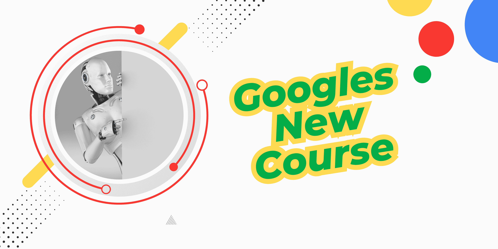

# 谷歌刚刚推出了一门新课程：AI 基础

> 原文：[`www.kdnuggets.com/google-have-just-dropped-a-new-course-ai-essentials`](https://www.kdnuggets.com/google-have-just-dropped-a-new-course-ai-essentials)

作者提供的图片

随着时间的推移，越来越多的人发现了将 AI 应用到日常生活中的新方法。有些人已经走在了前面，通过 AI 提高了生产力。有些人仍在尝试学习如何使用它。

* * *

## 我们的前三大课程推荐

 1\. [谷歌网络安全证书](https://www.kdnuggets.com/google-cybersecurity) - 快速进入网络安全职业轨道。

 2\. [谷歌数据分析专业证书](https://www.kdnuggets.com/google-data-analytics) - 提升你的数据分析技能

 3\. [谷歌 IT 支持专业证书](https://www.kdnuggets.com/google-itsupport) - 支持你所在组织的 IT

* * *

谷歌提供的这门新课程适合那些需要指导以充分利用 AI 的人。

## 谷歌：AI 基础

链接：[谷歌 AI 基础课程](http://imp.i384100.net/5grma9)

这门课程无需任何 AI 方面的先前经验，适合那些寻找快速灵活课程以迅速入门 AI 及其在工作流程中应用的初学者。

这门课程需要 9 小时完成。你可以在一个周末完成，也可以分 2 周完成 - 完全由你决定！

本课程包含 5 个模块：

+   AI 介绍

+   利用 AI 工具最大化生产力

+   探索提示工程的艺术

+   负责任地使用 AI

+   跟上 AI 的步伐

在这 5 个模块中，你将学习如何：

+   使用生成式 AI 工具来帮助开发创意和内容，做出更明智的决策，加速日常工作任务

+   编写清晰具体的提示以获得所需的输出 - 你将应用提示技巧来帮助总结、创建标语等

+   负责任地使用 AI，通过识别 AI 的潜在偏见并避免伤害

+   制定策略以在新兴的 AI 领域保持最新

但你的学习不必止步于此。如果你想将 AI 纳入工作流程，这里有一些我们推荐的其他课程：

+   链接：[生成式 AI 介绍](http://imp.i384100.net/1rxoea)

+   链接：[生成式 AI：提示工程基础](http://imp.i384100.net/angYRb)

+   链接：[人人皆可用的 AI](http://imp.i384100.net/AWZk0x)

## 总结

了解 AI 的世界并不意味着你必须回到大学学习或学习编程。你可以通过这些短期课程学习如何利用 AI，无论你的经验或行业如何。

****[Nisha Arya](https://www.linkedin.com/in/nisha-arya-ahmed/)**** 是一位数据科学家、自由技术作家，以及 KDnuggets 的编辑和社区经理。她特别关注提供数据科学职业建议或教程，并探讨数据科学的理论知识。Nisha 涵盖了广泛的主题，并希望探索人工智能如何促进人类寿命的不同方式。作为一个热衷学习者，Nisha 希望拓宽她的技术知识和写作技能，同时帮助指导他人。

### 更多相关内容

+   [刚刚上线的新技术课程](https://www.kdnuggets.com/new-tech-courses-that-have-just-landed)

+   [Meta 的新数据分析师职业认证已发布！](https://www.kdnuggets.com/metas-new-data-analyst-professional-certification-has-dropped)

+   [KDnuggets 新闻 3 月 30 日：最受欢迎的编程入门……](https://www.kdnuggets.com/2022/n13.html)

+   [我参加了 Google 数据分析认证课程，目前已有 2,148,697 人报名……](https://www.kdnuggets.com/i-took-the-google-data-analytics-certification-where-2148697-have-already-enrolled)

+   [ChatGPT 是否有潜力成为新的国际象棋超级大师？](https://www.kdnuggets.com/does-chatgpt-have-the-potential-to-become-a-new-chess-super-grandmaster)

+   [了解如何在您的设备上仅需几个步骤运行 Alpaca-LoRA](https://www.kdnuggets.com/2023/05/learn-run-alpacalora-device-steps.html)
