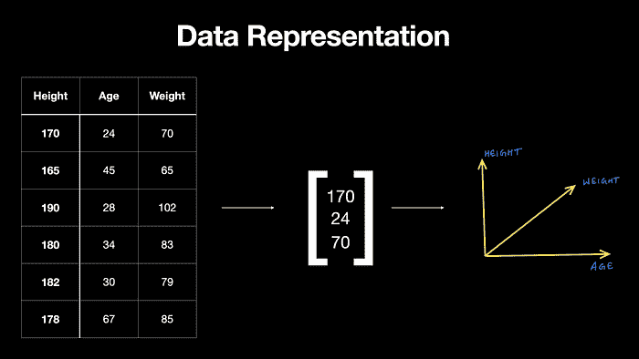
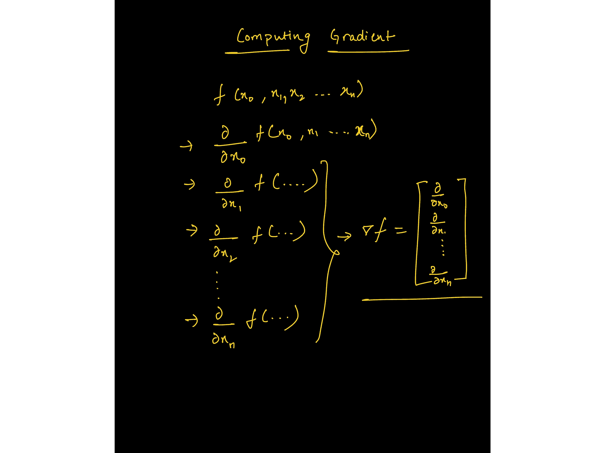
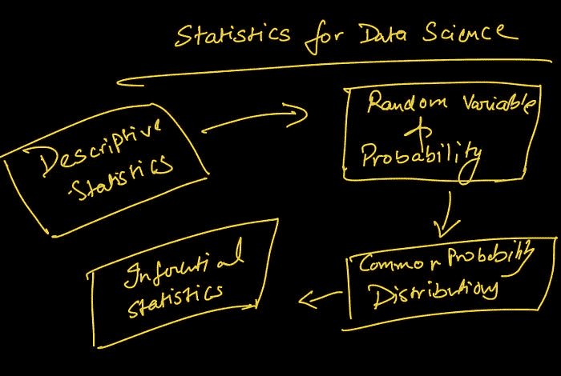
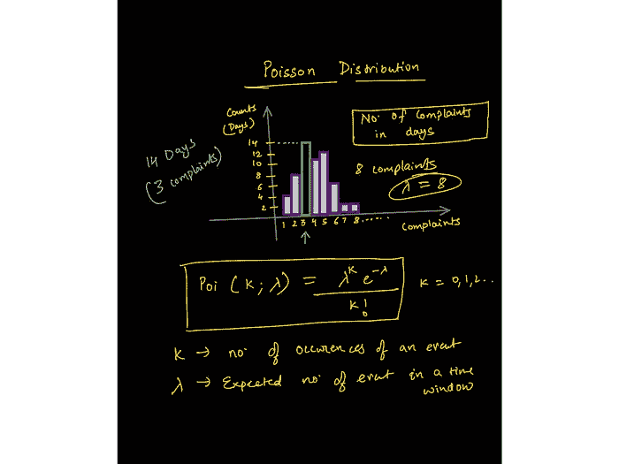

# 谷歌建议你在参加他们的机器学习或数据科学课程之前做的事

> 原文：[`www.kdnuggets.com/2021/10/google-recommends-before-machine-learning-data-science-course.html`](https://www.kdnuggets.com/2021/10/google-recommends-before-machine-learning-data-science-course.html)

图片由作者提供

无论是 Andrew Ng 在 YouTube 上的机器学习/深度学习课程，还是任何数据科学训练营，你都需要一定程度的数学和统计知识，不仅是为了理解，还为了在数据专业领域建立一个持久而稳固的职业生涯。

这是针对所有自学者和数据科学及机器学习初学者的简短而精准的指南。

在我所有的培训项目、LinkedIn 课程、YouTube 视频或新闻通讯中，一个常见的问题是，当他们开始学习数据科学/机器学习后，在某个点，他们会感到在数学、统计学甚至编程方面迷失。

我一直推荐学习或刷新一些支撑机器学习的数学概念，因为这有助于你建立直觉，保持在学习过程中的好奇心。

为了支持这一说法，**以下是谷歌建议在参加其机器学习速成课程之前的前置要求和预备工作：**

[**机器学习速成课程的前置要求和预备工作**](https://developers.google.com/machine-learning/crash-course/prereqs-and-prework)

我建议你先阅读这篇文章，然后逐个查阅所有链接，并将这篇博客作为参考。

在阅读了谷歌文章中提到的所有概念和技能的完整列表后，我还查阅了几本书（如 Ian Goodfellow 的《深度学习》，Francois Chollet 的《Python 深度学习》等），并尝试将其精华提炼为建立数据分析师/科学家/机器学习工程师职业生涯的三个基础支柱。

以下是三个支柱以及建立这些支柱所需的一系列概念。

# 数据科学和机器学习初学者的编程指南

编程是向机器提供预定义的规则以处理输入数据，然后得到结果。

另一方面，机器学习是将结果和数据提供给机器，以找到最佳近似数据和结果之间关系的规则。

编程提供了一个基础平台，利用这个平台你可以自动化、验证和解决任何规模的问题。

下一个问题是你应该学习哪种语言？

由于大多数课程、库和书籍都是为了支持 Python 基础设施而编写的，我建议学习 Python，Google 的指南也是这样推荐的。使用哪种语言是个人选择，很大程度上取决于你要解决的问题类型。

大多数初学者更喜欢 Python，因为它是开发端到端项目的最佳方式，并且有一个非常庞大的开发者社区可以提供帮助。你遇到的 ~90% 的问题（尤其是在初期阶段）都已经为你解决并记录了下来。

# 1\. 机器学习所需的基础 Python 编程

大多数数据职位基于编程，除了少数如商业智能、市场分析、产品分析师等职位。

我将重点关注需要至少一种编程语言专业知识的技术数据职位。我个人更喜欢 Python，因为它的多功能性和学习的便利性——无疑是开发端到端项目的好选择。

**数据科学/机器学习中必须掌握的主题/库的一瞥：**

+   **常见的数据结构**（数据类型、列表、字典、集合、元组）、编写函数、逻辑、控制流、搜索和排序算法、面向对象编程以及使用外部库。

+   **编写 Python 脚本进行数据提取**、格式化，并将数据存储到文件或数据库中。

+   **使用 NumPy 处理多维数组**，包括索引、切片、转置、广播和伪随机数生成。

+   使用像 NumPy 这样的科学计算库执行向量化操作。

+   **使用 Pandas 操作数据**——系列、数据框、数据框中的索引、比较运算符、合并数据框、映射和应用函数。

+   **使用 pandas 处理数据**——检查空值、填充空值、数据分组、描述数据、进行探索性分析等。

+   **使用 Matplotlib 进行数据可视化**——API 层次结构、向图表添加样式、颜色和标记、各种图表的知识及其使用场景、折线图、条形图、散点图、直方图、箱线图以及用于更高级绘图的 seaborn。

# 2\. 基础数学

有[实际原因说明数学对希望从事 ML、数据科学或深度学习工程师职业的人至关重要](https://towardsdatascience.com/practical-reasons-to-learn-mathematics-for-data-science-1f6caec161ea)。

## 2.1 使用线性代数表示数据

课程中的一张图片：[`www.wiplane.com/p/foundations-for-data-science-ml`](https://www.wiplane.com/p/foundations-for-data-science-ml)

机器学习（ML）本质上是数据驱动的；数据是机器学习的核心。我们可以将数据视为**向量**——一个遵循算术规则的对象。这使我们能够理解线性代数规则如何作用于数据数组。

## 2.2 微积分在训练机器学习模型中的应用

课程中的图片：[`www.wiplane.com/p/foundations-for-data-science-ml`](https://www.wiplane.com/p/foundations-for-data-science-ml)

如果你认为模型训练是“自动进行”的，那你就错了。微积分是推动大多数机器学习和深度学习算法学习的关键。

最常用的优化算法之一——**梯度下降**——是偏导数的应用。

模型是对某些信念和假设的数学表示。它被认为是学习（近似）数据生成过程（线性、多项式等），并基于学习到的过程做出预测。

**重要主题包括：**

+   **基础代数——**变量、系数、方程、函数——线性、指数、对数等。

+   **线性代数——**标量、向量、张量、范数（L1 & L2）、点积、矩阵类型、线性变换、矩阵表示的线性方程、使用向量和矩阵求解线性回归问题。

+   **微积分——**导数和极限、导数规则、链式法则（用于反向传播算法）、偏导数（用于计算梯度）、函数的凸性、局部/全局极小值、回归模型的数学原理、从头开始训练模型的应用数学。

# 3\. 数据科学中的基本统计学

现在每个组织都在努力成为数据驱动型的。为了实现这一目标，分析师和科学家需要以不同的方式利用数据来推动决策制定。

## 数据描述——从数据到洞察

数据总是以原始和不整洁的形式出现。初步探索会告诉你缺少什么、数据如何分布以及清理数据以达到最终目标的最佳方法。

为了回答定义的问题，描述性统计学使你能够将数据中的每个观测值转化为有意义的洞察。

# 量化不确定性

此外，量化不确定性的能力是任何数据公司高度重视的最有价值的技能。了解任何实验/决策的成功机会对所有企业来说都至关重要。

**以下是构成统计学基础的几个主要要素：**

泊松分布讲座中的图片——[`www.wiplane.com/p/foundations-for-data-science-ml`](https://www.wiplane.com/p/foundations-for-data-science-ml)

+   位置估计——均值、中位数及其其他变体

+   变异性的估计

+   相关性和协方差

+   随机变量——离散和连续

+   数据分布——PMF、PDF、CDF

+   条件概率——贝叶斯统计

+   常用的统计分布 — 高斯分布、二项分布、泊松分布、指数分布。

+   重要的定理 — 大数法则和中心极限定理。

来自泊松分布讲座的图片 — [`www.wiplane.com/p/foundations-for-data-science-ml`](https://www.wiplane.com/p/foundations-for-data-science-ml)

> 每位初学者级别的数据科学爱好者在深入任何核心数据科学或核心机器学习课程之前，都应该专注于这三个支柱。

# 学习资源

[我的学习路线图](https://towardsdatascience.com/data-science-learning-roadmap-for-2021-84f2ba09a44f) 也告诉了你要学习的内容，并且提供了许多资源、课程和可以注册的项目。

但在我制定的推荐资源和路线图中存在一些不一致之处。

## 数据科学或机器学习课程的问题

1.  我列出的每一个数据科学课程都要求学生对编程、数学或统计有一定的理解。例如， [安德鲁·恩的最著名机器学习课程](https://www.youtube.com/watch?v=PPLop4L2eGk&list=PLLssT5z_DsK-h9vYZkQkYNWcItqhlRJLN) 也在很大程度上依赖于对向量代数和微积分的理解。

1.  大多数涵盖数据科学数学和统计的课程只是一个概念清单，没有解释这些概念如何应用以及如何编程到机器中。

1.  有很多出色的资源可以深入学习数学，但我们大多数人并不适合这些，而且学数据科学并不需要成为金牌得主。

> **底线：** 目前缺乏一个资源，能够涵盖足够的应用数学、统计学或编程知识，以便开始数据科学或机器学习。

## **Wiplane Academy — wiplane.com**

+   数据分析师

+   数据科学家

+   或机器学习从业者/工程师

在这里，我向你展示了 [**数据科学或机器学习的基础**](https://www.wiplane.com/p/foundations-for-data-science-ml)** — **[**学习数据科学和机器学习的第一步**](https://www.wiplane.com/p/foundations-for-data-science-ml)

[`www.wiplane.com/p/foundations-for-data-science-ml`](https://www.wiplane.com/p/foundations-for-data-science-ml)

一个全面而紧凑且实惠的课程，不仅涵盖**所有必需的基础知识、前提条件和预备工作**，而且还解释了每个概念如何**在计算上和编程上（Python）使用**。

而且不仅如此，我会根据你的反馈每个月更新课程内容。了解更多 [这里](https://www.wiplane.com/p/foundations-for-data-science-ml)。

**[Harshit Tyagi](https://www.linkedin.com/in/tyagiharshit/)** 是一位具有网页技术和数据科学（即全栈数据科学）综合经验的工程师。他曾辅导超过 1000 名 AI/Web/数据科学的有志之士，并正在设计数据科学和机器学习工程的学习路径。此前，Harshit 与耶鲁大学、麻省理工学院和 UCLA 的研究科学家一起开发数据处理算法。

[原文](https://dswharshit.medium.com/what-google-recommends-you-do-before-taking-their-ml-or-data-science-course-f9e680dffe3c)。经许可转载。

### 更多相关话题

+   [在参加任何免费的数据科学课程之前请阅读这些](https://www.kdnuggets.com/read-this-before-you-take-any-free-data-science-course)

+   [在进入 Transformers 之前你应该知道的概念](https://www.kdnuggets.com/2023/01/concepts-know-getting-transformer.html)

+   [KDnuggets™ 新闻 22:n03, 1 月 19: 深入探讨 13 个数据…](https://www.kdnuggets.com/2022/n03.html)

+   [在转行数据科学之前请阅读这些](https://www.kdnuggets.com/read-this-before-making-a-career-switch-to-data-science)

+   [选择下一个数据科学职位前需要注意的 5 件事](https://www.kdnuggets.com/2022/01/5-things-keep-mind-selecting-next-job.html)

+   [为什么越来越多的开发者在他们的机器学习项目中使用 Python？](https://www.kdnuggets.com/2022/01/developers-python-machine-learning-projects.html)
