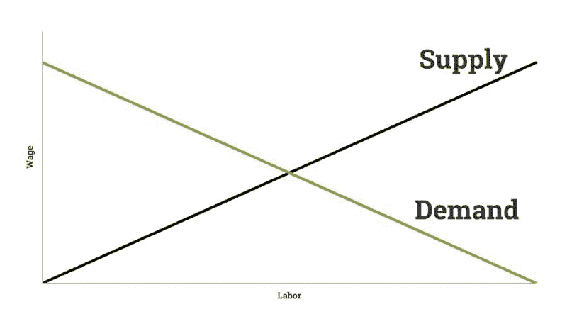
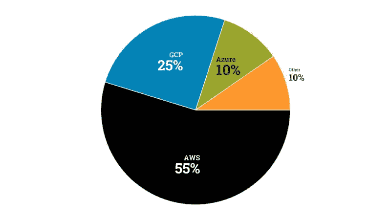

# 为什么你应该获得 Google 的新机器学习证书

> 原文：[`www.kdnuggets.com/2020/07/googles-new-machine-learning-certificate.html`](https://www.kdnuggets.com/2020/07/googles-new-machine-learning-certificate.html)

评论

**作者 [Frederik Bussler](https://www.linkedin.com/in/frederikbussler/)，Apteo 增长营销部**

图片来源：[Jessica Ruscello](https://unsplash.com/@jruscello?utm_source=medium&utm_medium=referral) 在 [Unsplash](https://unsplash.com/?utm_source=medium&utm_medium=referral)

* * *

## 我们的前三大课程推荐

 1\. [Google 网络安全证书](https://www.kdnuggets.com/google-cybersecurity) - 快速进入网络安全职业生涯。

 2\. [Google 数据分析专业证书](https://www.kdnuggets.com/google-data-analytics) - 提升你的数据分析技能

 3\. [Google IT 支持专业证书](https://www.kdnuggets.com/google-itsupport) - 支持你的组织在 IT 领域

* * *

Google 刚刚推出了一个新的[ML 工程师证书](https://cloud.google.com/certification/machine-learning-engineer)。在你决定参加之前，请注意，这个证书旨在面向那些希望展示自己在分布式模型训练和生产扩展等主题上的专业能力的从业人员。

没有实际工作经验的学生最好先做一些实际操作项目。

### 从哪里开始

获得这个证书并不容易。实际上，查看[考试指南](https://cloud.google.com/certification/guides/machine-learning-engineer)你会发现，需要在六个领域具备非常深入的知识，包括权限问题、数据集来源和数据可行性等高度专业化的主题。

这就是为什么 Google 建议你有 3 年以上的 GCloud 产品经验。如果你*确实*符合这个条件，那么这个证书极其宝贵，原因很简单。现在还没有人拥有它。

以提醒你最基本的经济学教训：供应增加，需求减少。

作者。

从直觉上讲，如果有 1,000 个职位空缺和 600 个持证的 ML 工程师，他们比拥有 6,000 或 60,000 个证书持有者的情况更容易找到工作和获得高薪。

由于测试版注册刚刚开放，目前还没有人获得这个证书。然而，作为 AI 和云计算领域的领导者以及全球最大科技公司之一的 Google，过不了多久你就会看到这些新认证在各处出现。

实际上，著名的 AI 研究员 Andrew Ng 在他的 Coursera 课程中拥有多达 [400 万](https://www.coursera.org/learn/machine-learning) 的学习者。同时，全球只有 [17,100](https://app.apteo.co/workspaces/2300510291097552329) 名机器学习工程师。

尽管从这些课程中学习是很好的，并且获得认证在某些情况下可能会提供适度的提升，但它们的价值远不如几年前那样高。

因此，如果你想进入机器学习工程领域，最好不要犹豫 Google 的新机会。如果你想找一个更一般的 [数据科学职位](https://www.apteo.co/post/100-companies-hiring-data-scientists-right-now)，请查看这个指南：

[**非常规数据科学职位指南**](https://towardsdatascience.com/the-uncommon-data-science-job-guide-3e215ba552bf)

数据科学竞争非常激烈。这里是如何通过“蓝海”战略获胜的方法。

### 替代方案

统计数据来源于 [ScaleGrid](https://scalegrid.io/blog/2019-open-source-database-report-top-databases-public-cloud-vs-on-premise-polyglot-persistence/)。可视化由作者提供。

请注意，Google Cloud *并不是* 最受欢迎的云平台——这一奖项归属于 AWS，AWS 还拥有自己的 [机器学习认证](https://aws.amazon.com/certification/certified-machine-learning-specialty/)。

从职业角度来看，初看 AWS 似乎是更好的选择。然而，如果我们去 LinkedIn 搜索“AWS 认证机器学习”（包括引号），我们会得到近 2,000 个结果。这些只是那些 (1) 拥有 LinkedIn 账户且 (2) 愿意将其确切名称添加到个人资料中的认证人士。

记住，如前所述，机器学习工程职位的数量非常有限，因此为了具有竞争力，你需要找到一个较少被探索的利基市场。

目前没有持证者，获得 Google 专业机器学习工程师证书是一个“蓝海”战略：这是一个没有竞争的广阔空间。获得 Coursera 证书则是另一端的“红海”战略：水中有数百万只其他鲨鱼。AWS 证书则介于两者之间。

### 超越证书

归根结底，重要的是要记住，证书并不是一切。事实上，它们甚至不应该是你申请的核心——它们应该是基于实践技能和经验的强大个人资料的补充。

[**跳过证书，改做这个**](https://hackernoon.com/dear-aspiring-data-scientists-skip-the-certificates-do-this-instead-ubu3u8x)

创建有洞察力的分析，分享你的工作，获得关注。

一个简单的提升个人资料的过程是选择一个你感兴趣的主题，分析相关数据，创建有洞察力的视觉效果和评论，并与网络分享。

数据科学可以对几乎所有行业产生实际的好处——无论你对 [客户流失分析](https://www.apteo.co/use-cases/churn)、 [推动电子商务销售](https://www.apteo.co/use-cases/ecommerce) 还是 [人员分析](https://www.apteo.co/use-cases/hr) 感兴趣，选择一个适合你的主题并传播你的知识。

错误的做法是仅仅在社交媒体上分享证书。

### 结论

证书不是唯一的衡量标准，但新的 Google 专业机器学习工程师证书是专业人士寻求职业发展的一个很好的选择。

**简介：[Frederik Bussler](https://www.linkedin.com/in/frederikbussler/)** 致力于让数据科学变得普及。他在 Apteo 担任增长营销，并为 Forbes、Hacker Noon、Blockgeeks、Thrive Global、KDnuggets、Digital Asset Live、The Tokenizer、Blocklike、Altcoin Magazine、Decentral.news、Forkast.news、Irish Tech News 等媒体撰稿。

原文。经许可转载。

**相关：**

+   10 门顶尖的免费机器学习课程

+   免费的数据科学和机器学习数学课程

+   TensorFlow 开发者峰会 2020：TensorFlow 和 Google Colab 用户的 10 个最佳技巧

### 更多相关话题

+   [你应该获得认证的 5 个理由](https://www.kdnuggets.com/2023/05/sas-5-reasons-get-certified.html)

+   [数据科学家如何赢得首席财务官的青睐（以及为什么你应该这样做）](https://www.kdnuggets.com/2021/12/data-scientists-get-ear-cfos-want.html)

+   [你应该避免从事数据科学职业的 5 个理由](https://www.kdnuggets.com/2022/04/top-5-reasons-avoid-data-science-career.html)

+   [在 Kaggle 上竞争的 4 个最佳技巧以及你为什么应该立即开始](https://www.kdnuggets.com/2022/05/packt-top-4-tricks-competing-kaggle-start.html)

+   [为什么不应该过度使用 Python 列表解析](https://www.kdnuggets.com/why-you-should-not-overuse-list-comprehensions-in-python)

+   [你应该使用线性回归模型而不是…的 3 个理由](https://www.kdnuggets.com/2021/08/3-reasons-linear-regression-instead-neural-networks.html)
