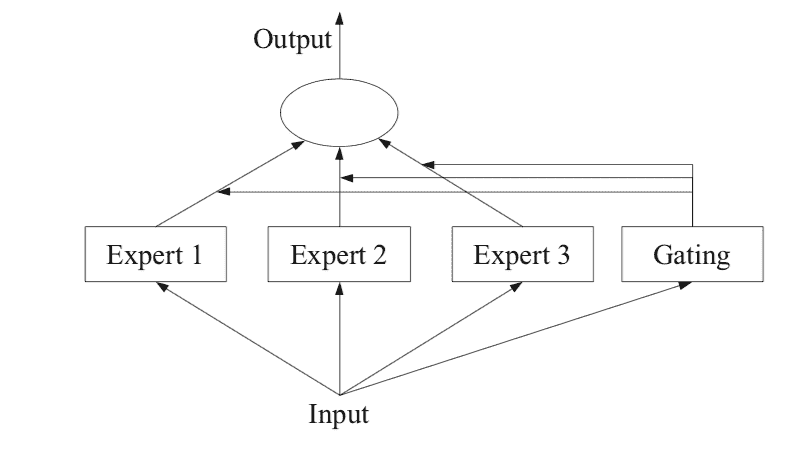
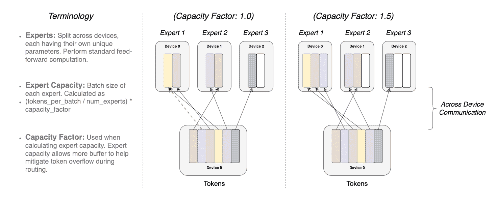
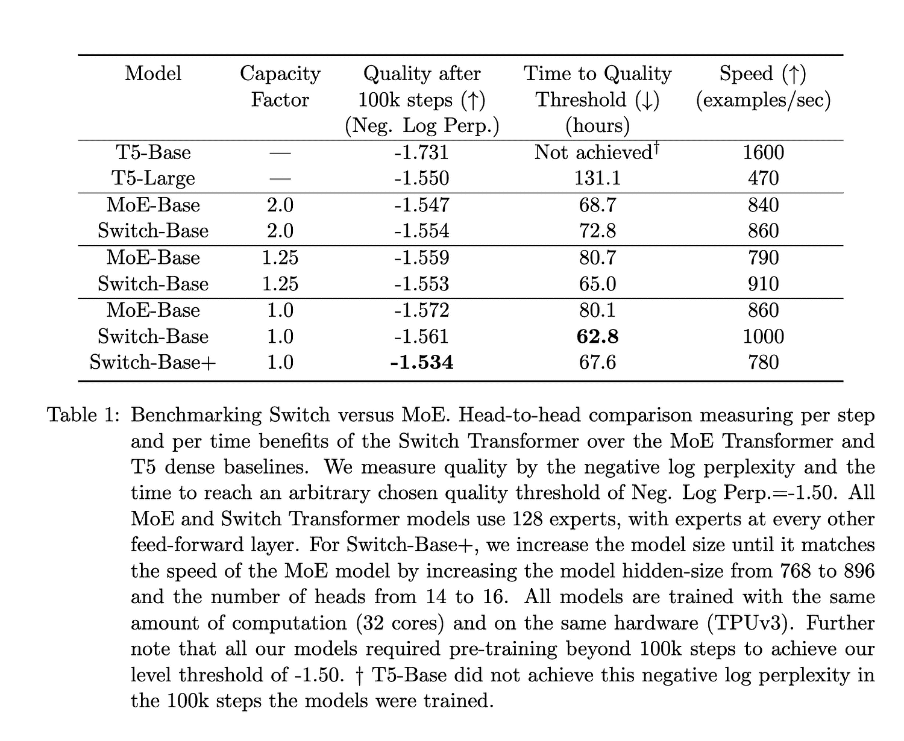

# GPT-4：8 个模型合而为一；秘密曝光

> 原文：[`www.kdnuggets.com/2023/08/gpt4-8-models-one-secret.html`](https://www.kdnuggets.com/2023/08/gpt4-8-models-one-secret.html)

GPT-4 模型迄今为止是最具突破性的模型，向公众开放，无论是免费还是通过其商业门户（用于公开测试）。它在激发许多企业家的新项目想法和应用场景方面效果显著，但关于参数数量和模型的保密性使所有对第一个 1 万亿参数模型或 100 万亿参数模型的猜测者感到沮丧！

# 秘密已经泄露

好吧，秘密已经泄露（某种程度上）。6 月 20 日，[George Hotz](https://twitter.com/swyx/status/1671272883379908608)，自驾车初创公司 Comma.ai 的创始人，泄露了 GPT-4 并不是一个单一的整体密集模型（像 GPT-3 和 GPT-3.5 那样），而是由 8 个 2200 亿参数模型组成的混合体。

当天稍晚些时候，[Soumith Chintala](https://twitter.com/soumithchintala/status/1671267150101721090)，Meta 的 PyTorch 联合创始人，重申了这一泄密信息。

就在前一天，[Mikhail Parakhin](https://twitter.com/MParakhin/status/1670666605427298304)，微软必应 AI 负责人，也对此有所暗示。

# GPT-4：非单一实体

所有这些推文意味着什么？GPT-4 并不是一个单一的大型模型，而是由 8 个小型模型组成的联合体/集成体，这些小模型共享专长。每个模型据说有 2200 亿个参数。

这种方法被称为专家混合模型范式（详见下方链接）。这是一种著名的方法，也被称为模型的多头怪物。它让我想起了印度神话中的拉瓦那。

请谨慎对待这些信息，因为这不是官方消息，但在人工智能领域的许多高级成员已对此有所言谈或暗示。微软尚未确认这些内容。

# 什么是专家混合范式？

既然我们谈到了专家混合，那么让我们稍微深入了解一下这是什么。专家混合是一种专门为神经网络开发的集成学习技术。它与传统机器学习建模中的一般集成技术有所不同（这种形式是广义形式）。所以你可以认为在 LLM 中的专家混合是一种特殊的集成方法。

简而言之，在这种方法中，一个任务被分解成子任务，然后利用每个子任务的专家来解决模型。这是一种将任务分解并征服的方法，同时创建决策树。也可以将其视为对每个单独任务的专家模型的元学习。

可以为每个子任务或问题类型训练一个更小、更好的模型。元模型学习使用哪个模型更适合预测特定任务。元学习者/模型充当交通警察。子任务可能会有重叠，也可能没有，这意味着可以将输出组合在一起以得到最终结果。

***关于从 MOE 到 Pooling 的概念描述，所有荣誉归于 Jason Brownlee 的精彩博客（***[***https://machinelearningmastery.com/mixture-of-experts/***](https://machinelearningmastery.com/mixture-of-experts/)***）。如果你喜欢下面的内容，请订阅 Jason 的博客并购买一两本书以支持他的精彩工作！***

**专家模型**，简称 MoE 或 ME，是一种集成学习技术，实施了在预测建模问题的子任务上训练专家的理念。

> *在神经网络社区，几位研究人员已研究了分解方法论。[…] Mixture–of–Experts (ME) 方法将输入空间分解，使得每个专家检查空间的不同部分。[…] 门控网络负责组合不同的专家。*

— 第 73 页，[使用集成方法的模式分类](https://amzn.to/2zxc0F7)，2010 年。

该方法有四个要素，它们是：

+   将任务分解为子任务。

+   为每个子任务开发一个专家。

+   使用门控模型来决定使用哪个专家。

+   汇总预测和门控模型输出以进行预测。

下图摘自 2012 年书籍《[集成方法](https://amzn.to/2XZzrjG)》第 94 页，提供了该方法的架构元素的有用概述。

## GPT4 中的 8 个小模型如何工作？

### “专家模型”的秘密揭晓了，让我们了解一下为什么 GPT4 如此出色！

ithinkbot.com

具有专家成员和门控网络的专家模型示例

来源：集成方法

# 子任务

第一步是将预测建模问题划分为子任务。这通常涉及使用领域知识。例如，可以将图像分解为背景、前景、对象、颜色、线条等独立元素。

> *… ME 采用分而治之的策略，将复杂任务分解为几个更简单、更小的子任务，个体学习者（称为专家）被训练以处理不同的子任务。*

— 第 94 页，[集成方法](https://amzn.to/2XZzrjG)，2012 年。

对于那些任务分解不明显的问题，可以使用更简单和更通用的方法。例如，可以设想一种方法，通过列的组来划分输入特征空间，或根据距离度量、异常值、标准分布等将特征空间中的示例分开，等等。

> *…在 ME 中，一个关键问题是如何找到任务的自然划分，然后从子解决方案中得出总体解决方案。*

— 第 94 页， [集成方法](https://amzn.to/2XZzrjG)，2012 年。

# 专家模型

接下来，为每个子任务设计一个专家。

专家混合方法最初是在人工神经网络领域中开发和探索的，因此传统上，专家本身是神经网络模型，用于在回归情况下预测数值，或在分类情况下预测类别标签。

> *应该清楚，我们可以为专家“插入”任何模型。例如，我们可以使用神经网络来表示门控函数和专家。结果被称为混合密度网络。*

— 第 344 页， [机器学习：概率视角](https://amzn.to/2YrVLmp)，2012 年。

专家们接收相同的输入模式（行）并做出预测。

# 门控模型

一个模型用于解释每个专家所做的预测，并帮助决定在给定输入时信任哪个专家。这被称为门控模型，或门控网络，因为它通常是一个神经网络模型。

门控网络以提供给专家模型的输入模式为输入，并输出每个专家在对输入进行预测时应有的贡献。

> *…由门控网络确定的权重是基于给定输入动态分配的，因为 MoE 有效地学习了每个集成成员学习的特征空间的部分*

— 第 16 页， [集成机器学习](https://amzn.to/2C7syo5)，2012 年。

门控网络是该方法的关键，有效地，模型学会选择给定输入的子任务类型，并进而选择信任哪个专家以做出强有力的预测。

> *混合专家也可以被视为一个分类器选择算法，其中单个分类器被训练成为特征空间某部分的专家。*

— 第 16 页， [集成机器学习](https://amzn.to/2C7syo5)，2012 年。

当使用神经网络模型时，门控网络和专家一起训练，以便门控网络学习何时信任每个专家进行预测。这种训练过程传统上使用 [期望最大化](https://machinelearningmastery.com/expectation-maximization-em-algorithm/) (EM) 实现。门控网络可能具有一个 softmax 输出，为每个专家提供类似概率的置信度分数。

> *一般来说，训练过程试图实现两个目标：对于给定的专家，找到最优的门控函数；对于给定的门控函数，在门控函数指定的分布上训练专家。*

— 第 95 页， [集成方法](https://amzn.to/2XZzrjG)，2012 年。

# 池化方法

最后，专家模型的混合必须进行预测，这通过池化或聚合机制来实现。这可能是选择输出最大或由门控网络提供的信心最大的专家。

另外，可以做出一个加权和预测，明确结合每个专家做出的预测和由门控网络估计的信心。你可以想象其他方法来有效利用预测和门控网络输出。

> *池化/组合系统可能会选择权重最高的单个分类器，或计算每个类别的分类器输出的加权和，并选择接收最高加权和的类别。*

— 第 16 页，[集成机器学习](https://amzn.to/2C7syo5)，2012。

# 切换路由

我们还应简要讨论切换路由方法与 MoE 论文的不同之处。我提到这一点是因为微软似乎使用了切换路由而不是专家模型来节省计算复杂度，但我乐于接受纠正。当有多个专家模型时，它们可能对路由函数（什么时候使用哪个模型）有非平凡的梯度。这一决策边界由切换层控制。

切换层的好处有三方面。

1.  如果令牌仅路由到一个专家模型，则路由计算减少。

1.  批处理大小（专家容量）可以至少减半，因为单个令牌只去一个模型。

1.  路由实现被简化，通信也减少了。

同一令牌重叠到多个专家模型中被称为容量因子。以下是不同专家容量因子的路由工作原理的概念图

示意图展示了令牌路由的动态。每个专家处理一个固定的批处理大小

由容量因子调制的令牌。每个令牌被路由到专家

每个专家都有固定的批处理大小，但具有最高路由概率的专家可能会溢出。

（总令牌数/专家数）×容量因子。如果令牌分布不均，

如果打补丁，则某些专家会溢出（用虚线红线表示），导致

在这些令牌没有被该层处理的情况下。较大的容量因子缓解了

这种溢出问题得到了缓解，但也增加了计算和通信成本。

（由填充的白色/空白插槽描绘）。 （来源 [`arxiv.org/pdf/2101.03961.pdf`](https://arxiv.org/pdf/2101.03961.pdf)）

与 MoE 相比，MoE 和切换论文的发现表明

1.  切换变换器在速度-质量基础上优于精心调优的密集模型和 MoE 变换器。

1.  切换变换器比 MoE 具有更小的计算足迹。

1.  切换变换器在较低的容量因子（1–1.25）下表现更好。

# 总结思考

有两个警告：首先，这些都是听说的，其次，我对这些概念的理解相当薄弱，因此我建议读者对此持有极大的怀疑态度。

但微软通过隐藏这个架构实现了什么呢？他们制造了轰动效应和悬念。这可能帮助他们更好地塑造叙事。他们将创新留给自己，避免了其他人更早赶上他们。整个想法可能是微软惯有的策略：在投资 100 亿美元到一家公司时阻碍竞争。

GPT-4 的表现很出色，但这不是一个创新或突破性的设计。这是对工程师和研究人员开发的方法的极其聪明的实施，结合了企业/资本家的部署。OpenAI 既没有否认也没有同意这些说法（[`thealgorithmicbridge.substack.com/p/gpt-4s-secret-has-been-revealed`](https://thealgorithmicbridge.substack.com/p/gpt-4s-secret-has-been-revealed)），这让我认为 GPT-4 的架构更有可能就是现实（这很好！）。只是没那么酷！我们都想知道并学习。

[Alberto Romero](https://medium.com/u/7ba6be8a3022?source=post_page-----e3d16fd1eee0--------------------------------)为将这一消息公之于众并通过联系 OpenAI 进一步调查做出了巨大贡献（根据最新消息，OpenAI 没有回应。我在 LinkedIn 上看到他的文章，但同样也发布在 Medium 上）。

**[Mandar Karhade 博士，医学博士](https://www.linkedin.com/in/mandarkarhade/)** 高级分析与数据战略总监 @Avalere Health。Mandar 是一位经验丰富的医学科学家，拥有超过 10 年的前沿 AI 技术在生命科学和医疗保健行业中的应用经验。Mandar 还参与了 AFDO/RAPS，帮助规范 AI 在医疗保健中的应用。

[原文](https://medium.com/towards-artificial-intelligence/gpt-4-8-models-in-one-the-secret-is-out-e3d16fd1eee0)。经许可转载。

### 更多相关话题

+   [HuggingGPT：解决复杂 AI 任务的秘密武器](https://www.kdnuggets.com/2023/05/hugginggpt-secret-weapon-solve-complex-ai-tasks.html)

+   [LLMOps 入门：无缝互动背后的秘密武器](https://www.kdnuggets.com/getting-started-with-llmops-the-secret-sauce-behind-seamless-interactions)

+   [那些不那么性感的 SQL 概念，让你脱颖而出](https://www.kdnuggets.com/2022/02/not-so-sexy-sql-concepts-stand-out.html)

+   [规划你获得 SAS 认证的旅程](https://www.kdnuggets.com/2022/11/sas-map-journey-towards-sas-certification.html)

+   [不要错过！在 2023 年结束前报名免费课程](https://www.kdnuggets.com/dont-miss-out-enroll-in-free-courses-before-2023-ends)

+   [3 个新的 Prompt Engineering 资源](https://www.kdnuggets.com/3-new-prompt-engineering-resources)
