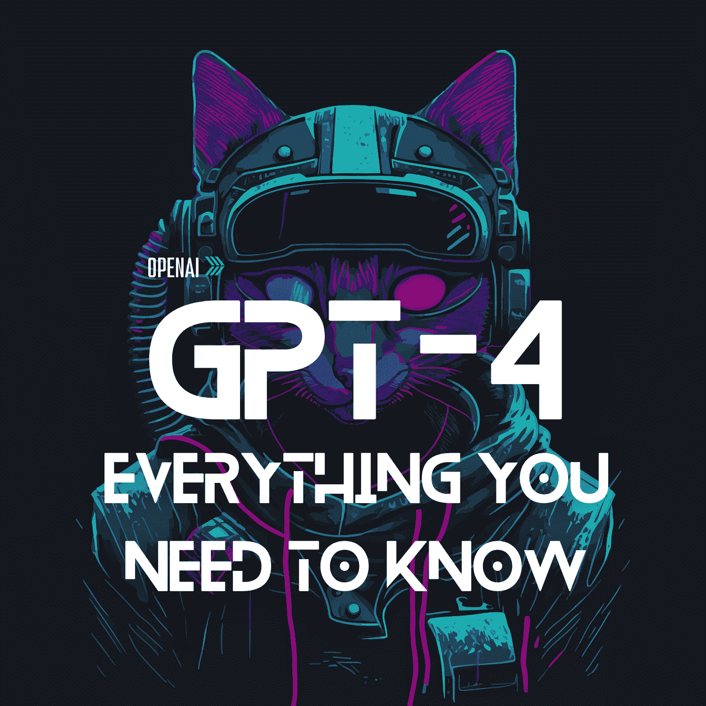

# GPT-4：你需要知道的一切

> 原文：[`www.kdnuggets.com/2023/03/gpt4-everything-need-know.html`](https://www.kdnuggets.com/2023/03/gpt4-everything-need-know.html)

编辑提供的图片

# 什么是 GPT？

GPT 代表生成预训练变换器。它是一个神经网络机器学习模型，通过使用互联网数据来训练以生成任何类型的文本。这种复杂的神经网络用于训练大型语言模型（LLMs）以模拟人类交流。

该模型按照顺序跟踪单词，使其能够学习语言的上下文和含义。GPT 模型专注于纯文本，使其能够利用人工智能分析用户的问题并有效生成文本。

它凭借其对话能力、上下文信息等方面震撼了人工智能界。该模型能够处理诸如文本摘要、代码生成等任务，并在几秒钟内提供有价值的见解。

# 关于 GPT-3 的一点信息

GPT-3 是一个自回归语言模型，通过预测下一个令牌进行训练。该模型需要一个初始提示文本，并可以继续生成文本，利用该初始提示。

人类反馈强化学习（RLHF）用于帮助模型实现与用户的对话。GPT-3 是一个 1750 亿参数的语言模型，具有以下使用场景：

+   文本摘要

+   内容创建

+   代码生成

+   生成漫画和诗歌

+   应用程序创建

如果你想了解更多关于 ChatGPT-3 的信息，请阅读：ChatGPT：你需要知道的一切

# ChatGPT-4 能做什么？

当微软德国首席技术官**Andreas Braun**宣布 GPT-4 计划在三月第三周发布时，产生了很多猜测。Andreas Braun 博士在 AI in Focus: Digital Kickoff 中表示：

*“我们将在下周介绍 GPT-4，到时我们将拥有多模态模型，提供完全不同的可能性——例如视频”*

此时，OpenAI 自己没有明确宣布，直到[昨天](https://openai.com/product/gpt-4)（2023 年 3 月 14 日）。那么我们应该期待 GPT-4 带来什么？GPT-4 是 OpenAI 的新技术，提供了最先进的系统，生成更安全、更有用的回应。

OpenAI 的总裁兼联合创始人**Greg Brockman**在 GPT-4 开发者直播中表示，自公司成立以来，OpenAI 一直在构建 GPT-4，过去 2 年专注于完善这项新技术。他们不得不重建整个训练堆栈，并训练模型以了解它的能力。

ChatGPT-4 是多模态的，这意味着它可以使用各种数据类型，如图像、文本、语音和数值数据，以及多种智能处理算法来生成准确的高性能输出。它不再局限于语言模型。

## 陈述 ChatGPT-4 的角色

如果你还没机会使用 ChatGPT-4，可以在左侧找到“系统”部分。这个部分是你告诉助手你想让它做什么的地方，包括具体的要求和指示。这是供助手使用的指令指南，以确保它能提供你所期望的内容。

例如：

+   “你是 ChatGPT，一个大型语言模型。请仔细遵循用户的指示”

+   “你是一个 AI 编程助手。请仔细遵循用户的要求。详细描述你所采取的每一步。将代码输出到一个代码块中”

让我们从你可以用现有内容做什么开始。

## 现有内容

我将首先介绍 ChatGPT-4 在使用现有内容/文章/文本时的能力。

### 用具体细节总结背景

Greg Brockman 展示了如何通过复制和粘贴一篇文章并要求 ChatGPT 将文章总结为一个每个词都以“G”开头的句子来使用 ChatGPT-3.5。ChatGPT-3.5 自然未能完成任务。然而，GPT-4 成功输出了用户要求的内容。

然而，助手说了“AI”这个词，Greg Brockman 回应说“AI 不算！这算作弊！”。助手愉快地回应了一个以“G”开头替换“AI”的词。

GPT-4 可以具体输出用户所需的内容，通过给助手提供要求来完成。

### 结合创意

你还可以使用 GPT-4 灵活地结合不同的文章。通过复制和粘贴你的文章，你可以向 ChatGPT-4 助手提出问题，比如：找出这两篇文章之间的一个共同主题。

如果 ChatGPT-4 助手的输出不完全符合你的期望或不够有洞察力，你可以提供反馈，这样它会改进回应。

## 使用 GPT-4 进行生成和构建

你还可以使用 GPT-4 来构建东西！你需要提供一个提示，稍微详细一点，这样助手才能提供你所需要的内容。例如，“写一个 Discord 机器人”。

根据你在系统部分分配给 ChatGPT-4 的角色，例如，如果你希望助手生成一些代码，它将被指定为 AI 编程助手。配合提示，这将有效帮助助手输出你所请求的内容。

你可以测试助手生成的代码块，看看它是否有效。如果遇到错误，你可以简单地将错误信息发送给助手，助手会提供正确的代码块。你可以继续这样做并指导助手，直到你的代码成功运行。

## 数学计算

能够解决复杂的计算问题，如税务和高难度计算问题可能是一个挑战。现在你可以使用 ChatGPT-4 来帮助你完成这些数学计算。例如，如果你有一个需要计算的税务问题，你需要将 ChatGPT-4 系统指定为 TaxGPT，以便它知道自己的角色。

通过提供关于你问题的背景，助理将能够进行数学计算。有趣的事实是，模型并没有连接到计算器——这很令人印象深刻，对吧？

## 可视化

图像功能目前尚未公开提供——但正在开发中！你可以输入图像并向助理提问关于图像的问题。目前，这确实需要一些时间来输出，但 OpenAI 正在优化模型以加快速度。

### 手写

你可以拍摄一段手写的文字，ChatGPT 可以读取这些手写文字并将其转换为文本。有些人甚至开玩笑说它可以识别医生的笔迹——我们过去和现在都曾为此而苦恼。

## 使用 2021 年 9 月后的内容

正如我们已经知道的，ChatGPT 在 2021 年 9 月之后没有任何知识。然而，你可以向 ChatGPT 提供文章或信息作为提示，以便它了解你想问助理的问题。助理将使用这些信息作为学习资源，为你提供准确的输出。

# 使用 Evals 向 OpenAI 提供反馈

如果你希望为 ChatGPT 提供反馈和意见，你可以使用 Evals。Evals 是一个用于评估 OpenAI 模型的框架，并且是一个开源基准注册库。

Evals 允许你创建和运行评估：

+   那些使用数据集生成提示的，

+   测量 OpenAI 模型提供的完成质量

+   用于比较不同数据集和模型之间的性能。

这将有助于评估和检查模型的能力，以及 OpenAI 如何改进它并将其提升到更高水平。

# 总结一下

自 ChatGPT-3.5 发布以来，我们见证了 ChatGPT-4 的许多变化和进展。看到人们计划利用 ChatGPT-4 创造什么真是令人兴奋。如果你已经有机会试用它，请在评论中告诉我们你迄今为止学到了什么。

**[Nisha Arya](https://www.linkedin.com/in/nisha-arya-ahmed/)** 是一位数据科学家、自由技术写作者以及 KDnuggets 的社区经理。她特别关注提供数据科学职业建议或教程及数据科学相关的理论知识。她还希望探索人工智能如何有助于人类寿命的延续。作为一个积极的学习者，她寻求拓宽技术知识和写作技能，同时帮助指导他人。

* * *

## 我们的前三大课程推荐

 1\. [谷歌网络安全证书](https://www.kdnuggets.com/google-cybersecurity) - 快速进入网络安全职业生涯。

 2\. [谷歌数据分析专业证书](https://www.kdnuggets.com/google-data-analytics) - 提升你的数据分析技能

 3\. [谷歌 IT 支持专业证书](https://www.kdnuggets.com/google-itsupport) - 支持你的组织在 IT 方面

* * *

### 更多相关话题

+   [KDnuggets 新闻，4 月 13 日：数据科学家应该了解的 Python 库…](https://www.kdnuggets.com/2022/n15.html)

+   [朴素贝叶斯算法：你需要知道的一切](https://www.kdnuggets.com/2020/06/naive-bayes-algorithm-everything.html)

+   [你需要知道的关于张量的一切](https://www.kdnuggets.com/2022/05/everything-need-know-tensors.html)

+   [你需要知道的关于数据湖仓的一切](https://www.kdnuggets.com/2022/09/everything-need-know-data-lakehouses.html)

+   [你需要知道的关于 MLOps 的一切：KDnuggets 技术简报](https://www.kdnuggets.com/tech-brief-everything-you-need-to-know-about-mlops)

+   [ChatGPT：你需要知道的一切](https://www.kdnuggets.com/2023/01/chatgpt-everything-need-know.html)
