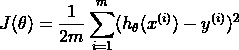
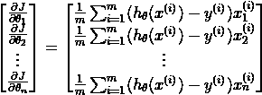
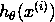
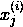
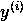
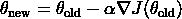
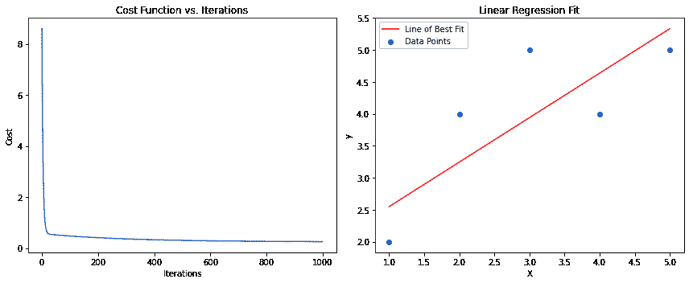
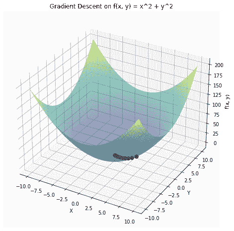
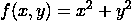

# 梯度下降：山地行者的数学优化指南

> 原文：[`www.kdnuggets.com/gradient-descent-the-mountain-trekker-guide-to-optimization-with-mathematics`](https://www.kdnuggets.com/gradient-descent-the-mountain-trekker-guide-to-optimization-with-mathematics)

山地行者类比：

想象你是一个山地行者，站在广阔山脉的某个坡道上。你的目标是到达山谷的最低点，但有一个难题：你被蒙上了眼睛。在无法看到整个地形的情况下，你会如何找到通往山谷底部的道路？

* * *

## 我们的前三个课程推荐

 1\. [谷歌网络安全证书](https://www.kdnuggets.com/google-cybersecurity) - 快速进入网络安全职业生涯。

 2\. [谷歌数据分析专业证书](https://www.kdnuggets.com/google-data-analytics) - 提升你的数据分析技能

 3\. [谷歌 IT 支持专业证书](https://www.kdnuggets.com/google-itsupport) - 支持你所在组织的 IT 需求

* * *

本能地，你可能会用脚感觉周围的地面，判断哪边是下坡。然后你会朝着那个方向迈出一步，即最陡的下降。重复这个过程，你会逐渐接近山谷的最低点。

# 翻译类比到梯度下降

在机器学习的领域中，这位行者的旅程类似于梯度下降算法。以下是具体方法：

**1) 地形：** 山区地形代表了我们的成本（或损失）函数，

J(θ)。这个函数测量了我们模型的预测与实际数据之间的误差或差异。数学上，它可以表示为：



其中

m 是数据点的数量，hθ(x) 是我们模型的预测，以及

y 是实际值。

**2) 行者的位置：** 你在山上的当前位置对应于模型参数θ的当前值。随着你移动，这些值会改变，从而改变模型的预测。

**3) 感知地面：** 就像你用脚感知最陡的下降一样，在梯度下降中，我们计算梯度，

∇J(θ)。这个梯度告诉我们成本函数最陡的上升方向。为了最小化成本，我们沿着相反方向移动。梯度由以下公式给出：



其中：

m 是训练示例的数量。

是第 i 个训练示例的预测值。

训练示例。

是第 i 个训练示例的第 j 个特征值。

是第 i 个训练示例的实际输出。

训练示例。

**4) 步骤**：你采取的步长类似于梯度下降中的学习率，用?表示。大的步长可能帮助你更快地下降，但风险是可能超越谷底。较小的步长则更为谨慎，但可能需要更长时间才能达到最小值。更新规则是：



**5) 达到底部：** 迭代过程将持续到你到达一个点，在任何方向上都感受不到显著的下降。在梯度下降中，这意味着成本函数的变化变得微不足道，表明算法已经（希望）找到了最小值。

## 总结

梯度下降是一个有条理的迭代过程，就像我们带着眼罩的旅行者试图找到谷底的最低点一样。通过将直觉与数学严格性结合，我们可以更好地理解机器学习模型如何学习、调整其参数并改进预测。

# 批量梯度下降

批量梯度下降使用整个数据集来计算梯度。该方法提供了稳定的收敛性和一致的误差梯度，但对于大数据集而言可能计算开销较大且速度较慢。

# 随机梯度下降（SGD）

SGD 使用单个随机选择的数据点来估计梯度。尽管它可以更快并且能够逃离局部最小值，但由于其固有的随机性，它的收敛模式更为不稳定，可能导致成本函数的波动。

# 小批量梯度下降

小批量梯度下降在上述两种方法之间取得平衡。它使用数据集的一个子集（或“迷你批量”）来计算梯度。该方法通过利用矩阵运算的计算优势加快了收敛速度，并在批量梯度下降的稳定性和 SGD 的速度之间提供了折衷。

# 挑战与解决方案

## 局部最小值

梯度下降有时会收敛到局部最小值，而这不是整个函数的最佳解。这在复杂的景观中，尤其是有多个谷底的情况，尤其成问题。为了解决这个问题，加入动量帮助算法穿越谷底而不被困住。此外，像 Adam 这样的高级优化算法结合了动量和自适应学习率的优点，以确保更稳健地收敛到全局最小值。

## 消失梯度与爆炸梯度

在深度神经网络中，随着梯度的反向传播，它们可能会逐渐减小到接近零（消失）或指数增长（爆炸）。消失的梯度会减慢训练，使网络难以学习，而爆炸的梯度可能导致模型发散。为了解决这些问题，梯度裁剪设置一个阈值，以防止梯度变得过大。另一方面，像 He 初始化或 Xavier 初始化这样的规范化初始化技术，确保权重在开始时设置为最佳值，从而降低这些挑战的风险。

# 梯度下降算法示例代码

```py
import numpy as np

def gradient_descent(X, y, learning_rate=0.01, num_iterations=1000):
    m, n = X.shape
    theta = np.zeros(n)  # Initialize weights/parameters
    cost_history = []  # To store values of the cost function over iterations

    for _ in range(num_iterations):
        predictions = X.dot(theta)
        errors = predictions - y
        gradient = (1/m) * X.T.dot(errors)
        theta -= learning_rate * gradient

        # Compute and store the cost for current iteration
        cost = (1/(2*m)) * np.sum(errors**2)
        cost_history.append(cost)

    return theta, cost_history

# Example usage:
# Assuming X is your feature matrix with m samples and n features
# and y is your target vector with m samples.
# Note: You should add a bias term (column of ones) to X if you want a bias term in your model.

# Sample data
X = np.array([[1, 1], [1, 2], [1, 3], [1, 4], [1, 5]])
y = np.array([2, 4, 5, 4, 5])

theta, cost_history = gradient_descent(X, y)

print("Optimal parameters:", theta)
print("Cost history:", cost_history)
```

这段代码提供了一个用于线性回归的基本梯度下降算法。函数 gradient_descent 接收特征矩阵 X、目标向量 y、学习率和迭代次数。它返回优化后的参数（theta）以及迭代过程中成本函数的历史记录。



左侧子图显示了成本函数在迭代过程中下降的情况。

右侧子图显示了数据点和通过梯度下降法获得的最佳拟合线。



一个函数的三维图  并用红色标记了梯度下降路径。梯度下降从一个随机点开始，移动到函数的最小值处。

# 应用

## 股票价格预测

财务分析师使用梯度下降法结合线性回归等算法，根据历史数据预测未来的股票价格。通过最小化预测值和实际股票价格之间的误差，他们可以改进模型，以做出更准确的预测。

## 图像识别

深度学习模型，尤其是卷积神经网络（CNN），利用梯度下降法在大规模图像数据集上优化权重。例如，像 Facebook 这样的平台使用这些模型自动标记照片中的个人，通过识别面部特征来实现。对这些模型的优化确保了准确和高效的面部识别。

## 情感分析

公司使用梯度下降法训练模型，分析客户反馈、评论或社交媒体提及，以确定公众对其产品或服务的情感。通过最小化预测情感和实际情感之间的差异，这些模型可以准确地将反馈分类为积极、消极或中立，从而帮助企业评估客户满意度，并相应地调整其策略。

**[阿伦](https://www.linkedin.com/in/arunchandramouli/)** 是一位经验丰富的高级数据科学家，拥有超过 8 年的经验，擅长利用数据的力量推动具有影响力的商业解决方案。他精通运用高级分析、预测建模和机器学习，将复杂数据转化为可操作的见解和战略叙事。阿伦持有著名机构颁发的机器学习和人工智能的 PGP 学位，其专业知识涵盖了广泛的技术和战略领域，使他在任何数据驱动的项目中都成为宝贵的资产。

### 更多相关内容

+   [你应该了解的 5 个梯度下降和成本函数的概念](https://www.kdnuggets.com/2020/05/5-concepts-gradient-descent-cost-function.html)

+   [回到基础知识，第二部分：梯度下降](https://www.kdnuggets.com/2023/03/back-basics-part-dos-gradient-descent.html)

+   [9 月 26-30 日：SIAM 数据科学数学会议（混合形式）](https://www.kdnuggets.com/2022/08/siam-conference-mathematics-data-science-hybrid.html)

+   [深入了解 DeepMind 在利用深度学习推动数学发展的新努力](https://www.kdnuggets.com/2021/12/inside-deepmind-new-efforts-deep-learning-advance-mathematics.html)

+   [机器学习中的数学：免费电子书](https://www.kdnuggets.com/2020/04/mathematics-machine-learning-book.html)

+   [梯度消失问题：原因、后果及解决方案](https://www.kdnuggets.com/2022/02/vanishing-gradient-problem.html)
